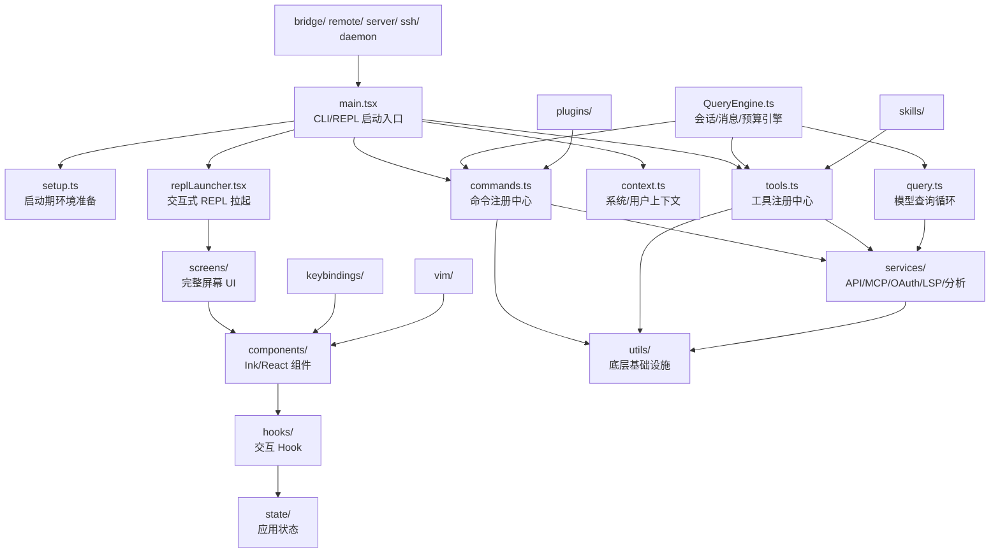

# srcarchitecture

## 1. 文档目的

这份文档用于把 `src/` 的源码结构画成一张可检索的 Markdown 架构说明，并对其中每一个目录与文件给出职责摘要，方便后续排查、阅读和模块定位。

> 说明：由于 `src/` 规模较大，文中的“全量索引”采用“源码入口 + 路径命名 + 模块分层职责”的方式归纳说明；关键入口和顶层模块做了更精确的手工补充。

## 2. 规模统计

- 根目录：`src/`
- 文件总数：`2799`
- 目录总数：`909`
- 顶层目录数：`42`
- 顶层文件数：`18`

## 3. 高层架构图



## 4. 核心入口说明

- `commands.ts`：集中注册所有内建命令，并按功能开关、插件与技能动态拼装最终命令集合。
- `context.ts`：构建系统上下文与用户上下文，把 git 状态、日期、CLAUDE.md 和记忆内容注入会话前置提示。
- `cost-tracker.ts`：累计模型调用的 token、成本与耗时统计，用于会话级成本观测。
- `costHook.ts`：把成本统计接入主流程与 Hook 链路，便于在交互过程中展示消耗信息。
- `dialogLaunchers.tsx`：统一封装各类对话框、恢复器和向导的拉起入口。
- `history.ts`：维护命令或会话历史记录的读写能力。
- `ink.ts`：对 Ink 渲染层做统一封装，并补上主题 Provider 与常用导出。
- `interactiveHelpers.tsx`：提供交互式渲染、退出控制和启动辅助函数。
- `main.tsx`：CLI 主入口，负责启动初始化、命令/工具装配、配置加载和 REPL 拉起。
- `projectOnboardingState.ts`：记录项目级 onboarding/首次使用状态。
- `query.ts`：执行模型查询主循环，串联上下文注入、消息流、工具调用与压缩策略。
- `QueryEngine.ts`：对话引擎核心，维护多轮消息、预算、权限和工具执行的生命周期。
- `replLauncher.tsx`：负责启动交互式 REPL 界面并挂载主屏幕。
- `setup.ts`：完成会话初始化、环境预检查、worktree/tmux 准备与启动期副作用。
- `Task.ts`：定义任务系统的基础类型、状态模型和通用创建逻辑。
- `tasks.ts`：聚合所有任务实现，并提供按类型查询的任务注册入口。
- `Tool.ts`：定义工具抽象、权限上下文、执行上下文和工具匹配能力。
- `tools.ts`：集中注册全部可用工具，并根据环境与功能开关筛选最终工具集。

## 5. 顶层目录总览

| 路径 | 递归文件数 | 作用 |
| --- | ---: | --- |
| `assistant/` | 5 | 助手模式相关模块，负责会话发现、入口守卫、选择器和历史读取。 |
| `bootstrap/` | 12 | 启动期共享状态与轻量级依赖目录，供主入口尽早读取。 |
| `bridge/` | 34 | 桥接/远程控制通道实现，处理会话创建、消息同步、权限回调和传输细节。 |
| `buddy/` | 6 | Buddy 伴随角色相关逻辑，包含提示词、精灵素材、通知与类型。 |
| `cli/` | 127 | CLI 辅助层，承载结构化 IO、后台命令、处理器和传输实现。 |
| `commands/` | 226 | 内建 slash 命令与 CLI 子命令实现目录。 |
| `components/` | 593 | 基于 Ink/React 的终端 UI 组件库，是界面层的主要承载目录。 |
| `constants/` | 30 | 共享常量、提示模板、系统文案和限制定义。 |
| `context/` | 10 | 跨组件上下文容器，封装通知、遮罩、统计和语音等全局上下文。 |
| `coordinator/` | 2 | 协调者模式相关逻辑，用于多代理/主从协作场景。 |
| `daemon/` | 2 | 守护进程入口与后台 worker 注册能力。 |
| `entrypoints/` | 19 | 可执行入口与 SDK/CLI 暴露类型定义。 |
| `environment-runner/` | 1 | 环境执行包装器入口。 |
| `hooks/` | 147 | 自定义 Hook 集合，负责 UI、状态、输入、插件、远程与会话联动。 |
| `ink/` | 104 | Ink 渲染引擎的本地封装与扩展实现。 |
| `jobs/` | 1 | 后台分类或异步作业目录。 |
| `keybindings/` | 16 | 快捷键解析、校验、加载与显示逻辑。 |
| `memdir/` | 9 | 记忆目录与记忆文件扫描/筛选能力。 |
| `migrations/` | 12 | 历史配置与模型设置迁移脚本目录。 |
| `moreright/` | 1 | 终端“更多右侧空间”体验相关 Hook。 |
| `native-ts/` | 3 | 原生 TypeScript 绑定与第三方原生模块桥接目录。 |
| `outputStyles/` | 1 | 输出样式装载逻辑。 |
| `plugins/` | 2 | 内建插件入口与打包插件注册目录。 |
| `proactive/` | 1 | 主动式能力或自动触发工作流入口。 |
| `query/` | 5 | 查询主循环的配置、依赖和状态迁移子模块。 |
| `remote/` | 4 | 远程会话与远程权限桥接能力。 |
| `schemas/` | 2 | Schema 定义与导出目录。 |
| `screens/` | 51 | 完整屏幕级 UI，承载 REPL、Doctor、恢复流程等主界面。 |
| `self-hosted-runner/` | 1 | 自托管运行器入口。 |
| `server/` | 11 | 本地服务器、直连会话和服务端管理实现。 |
| `services/` | 235 | 服务层目录，封装 API、MCP、OAuth、LSP、分析、同步等子系统。 |
| `skills/` | 27 | 技能发现、加载、构建与内建技能注册目录。 |
| `src/` | 39 | 内嵌共享源码镜像目录，给不同子模块复用上游类型、工具、常量或提示资源。 |
| `ssh/` | 2 | SSH 会话创建与管理能力。 |
| `state/` | 8 | 应用状态模型、store、选择器与状态变更监听。 |
| `tasks/` | 14 | 任务实现目录，覆盖本地任务、远程任务、工作流任务与监控任务。 |
| `tools/` | 285 | 工具实现目录，包含工具主体、schema、prompt、共享逻辑与测试辅助。 |
| `types/` | 32 | 共享类型、声明文件与自动生成类型目录。 |
| `upstreamproxy/` | 2 | 上游代理/转发能力实现。 |
| `utils/` | 693 | 最大型的通用基础设施目录，承载会话、权限、插件、模型、shell、遥测等底层能力。 |
| `vim/` | 5 | Vim 输入模式的动作、操作符和文本对象实现。 |
| `voice/` | 1 | 语音模式可用性判断与入口控制。 |

## 6. 顶层结构树（展开到三级）

```text
src/
├─ assistant/ (5 files)
│  ├─ AssistantSessionChooser.ts
│  ├─ gate.ts
│  ├─ index.ts
│  ├─ sessionDiscovery.ts
│  └─ sessionHistory.ts
├─ bootstrap/ (12 files)
│  ├─ src/ (11 files)
│  │  ├─ entrypoints/ (1 files)
│  │  ├─ tools/ (1 files)
│  │  ├─ types/ (2 files)
│  │  └─ utils/ (7 files)
│  └─ state.ts
├─ bridge/ (34 files)
│  ├─ src/ (1 files)
│  │  └─ entrypoints/ (1 files)
│  ├─ bridgeApi.ts
│  ├─ bridgeConfig.ts
│  ├─ bridgeDebug.ts
│  ├─ bridgeEnabled.ts
│  ├─ bridgeMain.ts
│  ├─ bridgeMessaging.ts
│  ├─ bridgePermissionCallbacks.ts
│  ├─ bridgePointer.ts
│  ├─ bridgeStatusUtil.ts
│  ├─ bridgeUI.ts
│  ├─ capacityWake.ts
│  ├─ codeSessionApi.ts
│  ├─ createSession.ts
│  ├─ debugUtils.ts
│  ├─ envLessBridgeConfig.ts
│  ├─ flushGate.ts
│  ├─ inboundAttachments.ts
│  ├─ inboundMessages.ts
│  ├─ initReplBridge.ts
│  ├─ jwtUtils.ts
│  ├─ peerSessions.ts
│  ├─ pollConfig.ts
│  ├─ pollConfigDefaults.ts
│  ├─ remoteBridgeCore.ts
│  ├─ replBridge.ts
│  ├─ replBridgeHandle.ts
│  ├─ replBridgeTransport.ts
│  ├─ sessionIdCompat.ts
│  ├─ sessionRunner.ts
│  ├─ trustedDevice.ts
│  ├─ types.ts
│  ├─ webhookSanitizer.ts
│  └─ workSecret.ts
├─ buddy/ (6 files)
│  ├─ companion.ts
│  ├─ CompanionSprite.tsx
│  ├─ prompt.ts
│  ├─ sprites.ts
│  ├─ types.ts
│  └─ useBuddyNotification.tsx
├─ cli/ (127 files)
│  ├─ handlers/ (8 files)
│  │  ├─ agents.ts
│  │  ├─ ant.ts
│  │  ├─ auth.ts
│  │  ├─ autoMode.ts
│  │  ├─ mcp.tsx
│  │  ├─ plugins.ts
│  │  ├─ templateJobs.ts
│  │  └─ util.tsx
│  ├─ src/ (101 files)
│  │  ├─ cli/ (3 files)
│  │  ├─ commands/ (1 files)
│  │  ├─ entrypoints/ (3 files)
│  │  ├─ hooks/ (1 files)
│  │  ├─ services/ (20 files)
│  │  ├─ state/ (2 files)
│  │  ├─ utils/ (69 files)
│  │  ├─ QueryEngine.ts
│  │  └─ tools.ts
│  ├─ transports/ (9 files)
│  │  ├─ src/ (1 files)
│  │  ├─ ccrClient.ts
│  │  ├─ HybridTransport.ts
│  │  ├─ SerialBatchEventUploader.ts
│  │  ├─ SSETransport.ts
│  │  ├─ Transport.ts
│  │  ├─ transportUtils.ts
│  │  ├─ WebSocketTransport.ts
│  │  └─ WorkerStateUploader.ts
│  ├─ bg.ts
│  ├─ exit.ts
│  ├─ ndjsonSafeStringify.ts
│  ├─ print.ts
│  ├─ remoteIO.ts
│  ├─ rollback.ts
│  ├─ structuredIO.ts
│  ├─ up.ts
│  └─ update.ts
├─ commands/ (226 files)
│  ├─ add-dir/ (3 files)
│  │  ├─ add-dir.tsx
│  │  ├─ index.ts
│  │  └─ validation.ts
│  ├─ agents/ (2 files)
│  │  ├─ agents.tsx
│  │  └─ index.ts
│  ├─ agents-platform/ (1 files)
│  │  └─ index.js
│  ├─ ant-trace/ (1 files)
│  │  └─ index.js
│  ├─ assistant/ (1 files)
│  │  └─ assistant.ts
│  ├─ autofix-pr/ (1 files)
│  │  └─ index.js
│  ├─ backfill-sessions/ (1 files)
│  │  └─ index.js
│  ├─ branch/ (2 files)
│  │  ├─ branch.ts
│  │  └─ index.ts
│  ├─ break-cache/ (1 files)
│  │  └─ index.js
│  ├─ bridge/ (2 files)
│  │  ├─ bridge.tsx
│  │  └─ index.ts
│  ├─ btw/ (2 files)
│  │  ├─ btw.tsx
│  │  └─ index.ts
│  ├─ buddy/ (1 files)
│  │  └─ index.ts
│  ├─ bughunter/ (1 files)
│  │  └─ index.js
│  ├─ chrome/ (2 files)
│  │  ├─ chrome.tsx
│  │  └─ index.ts
│  ├─ clear/ (4 files)
│  │  ├─ caches.ts
│  │  ├─ clear.ts
│  │  ├─ conversation.ts
│  │  └─ index.ts
│  ├─ color/ (2 files)
│  │  ├─ color.ts
│  │  └─ index.ts
│  ├─ compact/ (3 files)
│  │  ├─ src/ (1 files)
│  │  ├─ compact.ts
│  │  └─ index.ts
│  ├─ config/ (2 files)
│  │  ├─ config.tsx
│  │  └─ index.ts
│  ├─ context/ (3 files)
│  │  ├─ context-noninteractive.ts
│  │  ├─ context.tsx
│  │  └─ index.ts
│  ├─ copy/ (2 files)
│  │  ├─ copy.tsx
│  │  └─ index.ts
│  ├─ cost/ (2 files)
│  │  ├─ cost.ts
│  │  └─ index.ts
│  ├─ ctx_viz/ (1 files)
│  │  └─ index.js
│  ├─ debug-tool-call/ (1 files)
│  │  └─ index.js
│  ├─ desktop/ (2 files)
│  │  ├─ desktop.tsx
│  │  └─ index.ts
│  ├─ diff/ (2 files)
│  │  ├─ diff.tsx
│  │  └─ index.ts
│  ├─ doctor/ (2 files)
│  │  ├─ doctor.tsx
│  │  └─ index.ts
│  ├─ effort/ (2 files)
│  │  ├─ effort.tsx
│  │  └─ index.ts
│  ├─ env/ (1 files)
│  │  └─ index.js
│  ├─ exit/ (2 files)
│  │  ├─ exit.tsx
│  │  └─ index.ts
│  ├─ export/ (2 files)
│  │  ├─ export.tsx
│  │  └─ index.ts
│  ├─ extra-usage/ (4 files)
│  │  ├─ extra-usage-core.ts
│  │  ├─ extra-usage-noninteractive.ts
│  │  ├─ extra-usage.tsx
│  │  └─ index.ts
│  ├─ fast/ (2 files)
│  │  ├─ fast.tsx
│  │  └─ index.ts
│  ├─ feedback/ (2 files)
│  │  ├─ feedback.tsx
│  │  └─ index.ts
│  ├─ files/ (2 files)
│  │  ├─ files.ts
│  │  └─ index.ts
│  ├─ fork/ (1 files)
│  │  └─ index.ts
│  ├─ good-claude/ (1 files)
│  │  └─ index.js
│  ├─ heapdump/ (2 files)
│  │  ├─ heapdump.ts
│  │  └─ index.ts
│  ├─ help/ (2 files)
│  │  ├─ help.tsx
│  │  └─ index.ts
│  ├─ hooks/ (2 files)
│  │  ├─ hooks.tsx
│  │  └─ index.ts
│  ├─ ide/ (3 files)
│  │  ├─ src/ (1 files)
│  │  ├─ ide.tsx
│  │  └─ index.ts
│  ├─ install-github-app/ (18 files)
│  │  ├─ src/ (3 files)
│  │  ├─ ApiKeyStep.tsx
│  │  ├─ CheckExistingSecretStep.tsx
│  │  ├─ CheckGitHubStep.tsx
│  │  ├─ ChooseRepoStep.tsx
│  │  ├─ CreatingStep.tsx
│  │  ├─ ErrorStep.tsx
│  │  ├─ ExistingWorkflowStep.tsx
│  │  ├─ index.ts
│  │  ├─ install-github-app.tsx
│  │  ├─ InstallAppStep.tsx
│  │  ├─ OAuthFlowStep.tsx
│  │  ├─ setupGitHubActions.ts
│  │  ├─ SuccessStep.tsx
│  │  ├─ types.ts
│  │  └─ WarningsStep.tsx
│  ├─ install-slack-app/ (2 files)
│  │  ├─ index.ts
│  │  └─ install-slack-app.ts
│  ├─ issue/ (1 files)
│  │  └─ index.js
│  ├─ keybindings/ (2 files)
│  │  ├─ index.ts
│  │  └─ keybindings.ts
│  ├─ login/ (2 files)
│  │  ├─ index.ts
│  │  └─ login.tsx
│  ├─ logout/ (2 files)
│  │  ├─ index.ts
│  │  └─ logout.tsx
│  ├─ mcp/ (4 files)
│  │  ├─ addCommand.ts
│  │  ├─ index.ts
│  │  ├─ mcp.tsx
│  │  └─ xaaIdpCommand.ts
│  ├─ memory/ (2 files)
│  │  ├─ index.ts
│  │  └─ memory.tsx
│  ├─ mobile/ (2 files)
│  │  ├─ index.ts
│  │  └─ mobile.tsx
│  ├─ mock-limits/ (1 files)
│  │  └─ index.js
│  ├─ model/ (2 files)
│  │  ├─ index.ts
│  │  └─ model.tsx
│  ├─ oauth-refresh/ (1 files)
│  │  └─ index.js
│  ├─ onboarding/ (1 files)
│  │  └─ index.js
│  ├─ output-style/ (2 files)
│  │  ├─ index.ts
│  │  └─ output-style.tsx
│  ├─ passes/ (2 files)
│  │  ├─ index.ts
│  │  └─ passes.tsx
│  ├─ peers/ (1 files)
│  │  └─ index.ts
│  ├─ perf-issue/ (1 files)
│  │  └─ index.js
│  ├─ permissions/ (2 files)
│  │  ├─ index.ts
│  │  └─ permissions.tsx
│  ├─ plan/ (2 files)
│  │  ├─ index.ts
│  │  └─ plan.tsx
│  ├─ plugin/ (20 files)
│  │  ├─ src/ (1 files)
│  │  ├─ AddMarketplace.tsx
│  │  ├─ BrowseMarketplace.tsx
│  │  ├─ DiscoverPlugins.tsx
│  │  ├─ index.tsx
│  │  ├─ ManageMarketplaces.tsx
│  │  ├─ ManagePlugins.tsx
│  │  ├─ parseArgs.ts
│  │  ├─ plugin.tsx
│  │  ├─ pluginDetailsHelpers.tsx
│  │  ├─ PluginErrors.tsx
│  │  ├─ PluginOptionsDialog.tsx
│  │  ├─ PluginOptionsFlow.tsx
│  │  ├─ PluginSettings.tsx
│  │  ├─ PluginTrustWarning.tsx
│  │  ├─ types.ts
│  │  ├─ UnifiedInstalledCell.tsx
│  │  ├─ unifiedTypes.ts
│  │  ├─ usePagination.ts
│  │  └─ ValidatePlugin.tsx
│  ├─ pr_comments/ (1 files)
│  │  └─ index.ts
│  ├─ privacy-settings/ (2 files)
│  │  ├─ index.ts
│  │  └─ privacy-settings.tsx
│  ├─ rate-limit-options/ (2 files)
│  │  ├─ index.ts
│  │  └─ rate-limit-options.tsx
│  ├─ release-notes/ (2 files)
│  │  ├─ index.ts
│  │  └─ release-notes.ts
│  ├─ reload-plugins/ (2 files)
│  │  ├─ index.ts
│  │  └─ reload-plugins.ts
│  ├─ remote-env/ (2 files)
│  │  ├─ index.ts
│  │  └─ remote-env.tsx
│  ├─ remote-setup/ (3 files)
│  │  ├─ api.ts
│  │  ├─ index.ts
│  │  └─ remote-setup.tsx
│  ├─ rename/ (3 files)
│  │  ├─ generateSessionName.ts
│  │  ├─ index.ts
│  │  └─ rename.ts
│  ├─ reset-limits/ (2 files)
│  │  ├─ index.js
│  │  └─ index.ts
│  ├─ resume/ (2 files)
│  │  ├─ index.ts
│  │  └─ resume.tsx
│  ├─ review/ (4 files)
│  │  ├─ reviewRemote.ts
│  │  ├─ ultrareviewCommand.tsx
│  │  ├─ ultrareviewEnabled.ts
│  │  └─ UltrareviewOverageDialog.tsx
│  ├─ rewind/ (2 files)
│  │  ├─ index.ts
│  │  └─ rewind.ts
│  ├─ sandbox-toggle/ (2 files)
│  │  ├─ index.ts
│  │  └─ sandbox-toggle.tsx
│  ├─ session/ (2 files)
│  │  ├─ index.ts
│  │  └─ session.tsx
│  ├─ share/ (1 files)
│  │  └─ index.js
│  ├─ skills/ (2 files)
│  │  ├─ index.ts
│  │  └─ skills.tsx
│  ├─ src/ (2 files)
│  │  ├─ services/ (1 files)
│  │  └─ commands.ts
│  ├─ stats/ (2 files)
│  │  ├─ index.ts
│  │  └─ stats.tsx
│  ├─ status/ (2 files)
│  │  ├─ index.ts
│  │  └─ status.tsx
│  ├─ stickers/ (2 files)
│  │  ├─ index.ts
│  │  └─ stickers.ts
│  ├─ summary/ (1 files)
│  │  └─ index.js
│  ├─ tag/ (2 files)
│  │  ├─ index.ts
│  │  └─ tag.tsx
│  ├─ tasks/ (2 files)
│  │  ├─ index.ts
│  │  └─ tasks.tsx
│  ├─ teleport/ (1 files)
│  │  └─ index.js
│  ├─ terminalSetup/ (3 files)
│  │  ├─ src/ (1 files)
│  │  ├─ index.ts
│  │  └─ terminalSetup.tsx
│  ├─ theme/ (2 files)
│  │  ├─ index.ts
│  │  └─ theme.tsx
│  ├─ thinkback/ (2 files)
│  │  ├─ index.ts
│  │  └─ thinkback.tsx
│  ├─ thinkback-play/ (2 files)
│  │  ├─ index.ts
│  │  └─ thinkback-play.ts
│  ├─ upgrade/ (2 files)
│  │  ├─ index.ts
│  │  └─ upgrade.tsx
│  ├─ usage/ (2 files)
│  │  ├─ index.ts
│  │  └─ usage.tsx
│  ├─ vim/ (2 files)
│  │  ├─ index.ts
│  │  └─ vim.ts
│  ├─ voice/ (2 files)
│  │  ├─ index.ts
│  │  └─ voice.ts
│  ├─ workflows/ (1 files)
│  │  └─ index.ts
│  ├─ advisor.ts
│  ├─ bridge-kick.ts
│  ├─ brief.ts
│  ├─ commit-push-pr.ts
│  ├─ commit.ts
│  ├─ createMovedToPluginCommand.ts
│  ├─ init-verifiers.ts
│  ├─ init.ts
│  ├─ insights.ts
│  ├─ install.tsx
│  ├─ review.ts
│  ├─ security-review.ts
│  ├─ statusline.tsx
│  ├─ ultraplan.tsx
│  └─ version.ts
├─ components/ (593 files)
│  ├─ agents/ (59 files)
│  │  ├─ new-agent-creation/ (16 files)
│  │  ├─ src/ (29 files)
│  │  ├─ AgentDetail.tsx
│  │  ├─ AgentEditor.tsx
│  │  ├─ agentFileUtils.ts
│  │  ├─ AgentNavigationFooter.tsx
│  │  ├─ AgentsList.tsx
│  │  ├─ AgentsMenu.tsx
│  │  ├─ ColorPicker.tsx
│  │  ├─ generateAgent.ts
│  │  ├─ ModelSelector.tsx
│  │  ├─ SnapshotUpdateDialog.ts
│  │  ├─ ToolSelector.tsx
│  │  ├─ types.ts
│  │  ├─ utils.ts
│  │  └─ validateAgent.ts
│  ├─ ClaudeCodeHint/ (1 files)
│  │  └─ PluginHintMenu.tsx
│  ├─ CustomSelect/ (10 files)
│  │  ├─ index.ts
│  │  ├─ option-map.ts
│  │  ├─ select-input-option.tsx
│  │  ├─ select-option.tsx
│  │  ├─ select.tsx
│  │  ├─ SelectMulti.tsx
│  │  ├─ use-multi-select-state.ts
│  │  ├─ use-select-input.ts
│  │  ├─ use-select-navigation.ts
│  │  └─ use-select-state.ts
│  ├─ design-system/ (16 files)
│  │  ├─ Byline.tsx
│  │  ├─ color.ts
│  │  ├─ Dialog.tsx
│  │  ├─ Divider.tsx
│  │  ├─ FuzzyPicker.tsx
│  │  ├─ KeyboardShortcutHint.tsx
│  │  ├─ ListItem.tsx
│  │  ├─ LoadingState.tsx
│  │  ├─ Pane.tsx
│  │  ├─ ProgressBar.tsx
│  │  ├─ Ratchet.tsx
│  │  ├─ StatusIcon.tsx
│  │  ├─ Tabs.tsx
│  │  ├─ ThemedBox.tsx
│  │  ├─ ThemedText.tsx
│  │  └─ ThemeProvider.tsx
│  ├─ DesktopUpsell/ (1 files)
│  │  └─ DesktopUpsellStartup.tsx
│  ├─ diff/ (3 files)
│  │  ├─ DiffDetailView.tsx
│  │  ├─ DiffDialog.tsx
│  │  └─ DiffFileList.tsx
│  ├─ FeedbackSurvey/ (15 files)
│  │  ├─ src/ (4 files)
│  │  ├─ FeedbackSurvey.tsx
│  │  ├─ FeedbackSurveyView.tsx
│  │  ├─ submitTranscriptShare.ts
│  │  ├─ TranscriptSharePrompt.tsx
│  │  ├─ useDebouncedDigitInput.ts
│  │  ├─ useFeedbackSurvey.tsx
│  │  ├─ useFrustrationDetection.ts
│  │  ├─ useMemorySurvey.tsx
│  │  ├─ usePostCompactSurvey.tsx
│  │  ├─ useSurveyState.tsx
│  │  └─ utils.ts
│  ├─ grove/ (2 files)
│  │  ├─ src/ (1 files)
│  │  └─ Grove.tsx
│  ├─ HelpV2/ (5 files)
│  │  ├─ src/ (2 files)
│  │  ├─ Commands.tsx
│  │  ├─ General.tsx
│  │  └─ HelpV2.tsx
│  ├─ HighlightedCode/ (1 files)
│  │  └─ Fallback.tsx
│  ├─ hooks/ (9 files)
│  │  ├─ src/ (3 files)
│  │  ├─ HooksConfigMenu.tsx
│  │  ├─ PromptDialog.tsx
│  │  ├─ SelectEventMode.tsx
│  │  ├─ SelectHookMode.tsx
│  │  ├─ SelectMatcherMode.tsx
│  │  └─ ViewHookMode.tsx
│  ├─ LogoV2/ (25 files)
│  │  ├─ src/ (10 files)
│  │  ├─ AnimatedAsterisk.tsx
│  │  ├─ AnimatedClawd.tsx
│  │  ├─ ChannelsNotice.tsx
│  │  ├─ Clawd.tsx
│  │  ├─ CondensedLogo.tsx
│  │  ├─ EmergencyTip.tsx
│  │  ├─ Feed.tsx
│  │  ├─ FeedColumn.tsx
│  │  ├─ feedConfigs.tsx
│  │  ├─ GuestPassesUpsell.tsx
│  │  ├─ LogoV2.tsx
│  │  ├─ Opus1mMergeNotice.tsx
│  │  ├─ OverageCreditUpsell.tsx
│  │  ├─ VoiceModeNotice.tsx
│  │  └─ WelcomeV2.tsx
│  ├─ LspRecommendation/ (1 files)
│  │  └─ LspRecommendationMenu.tsx
│  ├─ ManagedSettingsSecurityDialog/ (2 files)
│  │  ├─ ManagedSettingsSecurityDialog.tsx
│  │  └─ utils.ts
│  ├─ mcp/ (19 files)
│  │  ├─ src/ (5 files)
│  │  ├─ utils/ (1 files)
│  │  ├─ CapabilitiesSection.tsx
│  │  ├─ ElicitationDialog.tsx
│  │  ├─ index.ts
│  │  ├─ MCPAgentServerMenu.tsx
│  │  ├─ MCPListPanel.tsx
│  │  ├─ McpParsingWarnings.tsx
│  │  ├─ MCPReconnect.tsx
│  │  ├─ MCPRemoteServerMenu.tsx
│  │  ├─ MCPSettings.tsx
│  │  ├─ MCPStdioServerMenu.tsx
│  │  ├─ MCPToolDetailView.tsx
│  │  ├─ MCPToolListView.tsx
│  │  └─ types.ts
│  ├─ memory/ (2 files)
│  │  ├─ MemoryFileSelector.tsx
│  │  └─ MemoryUpdateNotification.tsx
│  ├─ messages/ (66 files)
│  │  ├─ src/ (17 files)
│  │  ├─ UserToolResultMessage/ (12 files)
│  │  ├─ AdvisorMessage.tsx
│  │  ├─ AssistantRedactedThinkingMessage.tsx
│  │  ├─ AssistantTextMessage.tsx
│  │  ├─ AssistantThinkingMessage.tsx
│  │  ├─ AssistantToolUseMessage.tsx
│  │  ├─ AttachmentMessage.tsx
│  │  ├─ CollapsedReadSearchContent.tsx
│  │  ├─ CompactBoundaryMessage.tsx
│  │  ├─ GroupedToolUseContent.tsx
│  │  ├─ HighlightedThinkingText.tsx
│  │  ├─ HookProgressMessage.tsx
│  │  ├─ nullRenderingAttachments.ts
│  │  ├─ PlanApprovalMessage.tsx
│  │  ├─ RateLimitMessage.tsx
│  │  ├─ ShutdownMessage.tsx
│  │  ├─ SnipBoundaryMessage.ts
│  │  ├─ SystemAPIErrorMessage.tsx
│  │  ├─ SystemTextMessage.tsx
│  │  ├─ TaskAssignmentMessage.tsx
│  │  ├─ teamMemCollapsed.tsx
│  │  ├─ teamMemSaved.ts
│  │  ├─ UserAgentNotificationMessage.tsx
│  │  ├─ UserBashInputMessage.tsx
│  │  ├─ UserBashOutputMessage.tsx
│  │  ├─ UserChannelMessage.tsx
│  │  ├─ UserCommandMessage.tsx
│  │  ├─ UserCrossSessionMessage.ts
│  │  ├─ UserForkBoilerplateMessage.ts
│  │  ├─ UserGitHubWebhookMessage.ts
│  │  ├─ UserImageMessage.tsx
│  │  ├─ UserLocalCommandOutputMessage.tsx
│  │  ├─ UserMemoryInputMessage.tsx
│  │  ├─ UserPlanMessage.tsx
│  │  ├─ UserPromptMessage.tsx
│  │  ├─ UserResourceUpdateMessage.tsx
│  │  ├─ UserTeammateMessage.tsx
│  │  └─ UserTextMessage.tsx
│  ├─ Passes/ (1 files)
│  │  └─ Passes.tsx
│  ├─ permissions/ (79 files)
│  │  ├─ AskUserQuestionPermissionRequest/ (7 files)
│  │  ├─ BashPermissionRequest/ (2 files)
│  │  ├─ ComputerUseApproval/ (1 files)
│  │  ├─ EnterPlanModePermissionRequest/ (1 files)
│  │  ├─ ExitPlanModePermissionRequest/ (4 files)
│  │  ├─ FileEditPermissionRequest/ (3 files)
│  │  ├─ FilePermissionDialog/ (6 files)
│  │  ├─ FilesystemPermissionRequest/ (1 files)
│  │  ├─ FileWritePermissionRequest/ (2 files)
│  │  ├─ MonitorPermissionRequest/ (1 files)
│  │  ├─ NotebookEditPermissionRequest/ (2 files)
│  │  ├─ PowerShellPermissionRequest/ (2 files)
│  │  ├─ ReviewArtifactPermissionRequest/ (1 files)
│  │  ├─ rules/ (11 files)
│  │  ├─ SedEditPermissionRequest/ (6 files)
│  │  ├─ SkillPermissionRequest/ (2 files)
│  │  ├─ src/ (11 files)
│  │  ├─ WebFetchPermissionRequest/ (1 files)
│  │  ├─ FallbackPermissionRequest.tsx
│  │  ├─ hooks.ts
│  │  ├─ PermissionDecisionDebugInfo.tsx
│  │  ├─ PermissionDialog.tsx
│  │  ├─ PermissionExplanation.tsx
│  │  ├─ PermissionPrompt.tsx
│  │  ├─ PermissionRequest.tsx
│  │  ├─ PermissionRequestTitle.tsx
│  │  ├─ PermissionRuleExplanation.tsx
│  │  ├─ SandboxPermissionRequest.tsx
│  │  ├─ shellPermissionHelpers.tsx
│  │  ├─ useShellPermissionFeedback.ts
│  │  ├─ utils.ts
│  │  ├─ WorkerBadge.tsx
│  │  └─ WorkerPendingPermission.tsx
│  ├─ PromptInput/ (39 files)
│  │  ├─ src/ (18 files)
│  │  ├─ HistorySearchInput.tsx
│  │  ├─ inputModes.ts
│  │  ├─ inputPaste.ts
│  │  ├─ IssueFlagBanner.tsx
│  │  ├─ Notifications.tsx
│  │  ├─ PromptInput.tsx
│  │  ├─ PromptInputFooter.tsx
│  │  ├─ PromptInputFooterLeftSide.tsx
│  │  ├─ PromptInputFooterSuggestions.tsx
│  │  ├─ PromptInputHelpMenu.tsx
│  │  ├─ PromptInputModeIndicator.tsx
│  │  ├─ PromptInputQueuedCommands.tsx
│  │  ├─ PromptInputStashNotice.tsx
│  │  ├─ SandboxPromptFooterHint.tsx
│  │  ├─ ShimmeredInput.tsx
│  │  ├─ useMaybeTruncateInput.ts
│  │  ├─ usePromptInputPlaceholder.ts
│  │  ├─ useShowFastIconHint.ts
│  │  ├─ useSwarmBanner.ts
│  │  ├─ utils.ts
│  │  └─ VoiceIndicator.tsx
│  ├─ sandbox/ (5 files)
│  │  ├─ SandboxConfigTab.tsx
│  │  ├─ SandboxDependenciesTab.tsx
│  │  ├─ SandboxDoctorSection.tsx
│  │  ├─ SandboxOverridesTab.tsx
│  │  └─ SandboxSettings.tsx
│  ├─ Settings/ (11 files)
│  │  ├─ src/ (7 files)
│  │  ├─ Config.tsx
│  │  ├─ Settings.tsx
│  │  ├─ Status.tsx
│  │  └─ Usage.tsx
│  ├─ shell/ (4 files)
│  │  ├─ ExpandShellOutputContext.tsx
│  │  ├─ OutputLine.tsx
│  │  ├─ ShellProgressMessage.tsx
│  │  └─ ShellTimeDisplay.tsx
│  ├─ skills/ (1 files)
│  │  └─ SkillsMenu.tsx
│  ├─ Spinner/ (13 files)
│  │  ├─ FlashingChar.tsx
│  │  ├─ GlimmerMessage.tsx
│  │  ├─ index.ts
│  │  ├─ ShimmerChar.tsx
│  │  ├─ SpinnerAnimationRow.tsx
│  │  ├─ SpinnerGlyph.tsx
│  │  ├─ teammateSelectHint.ts
│  │  ├─ TeammateSpinnerLine.tsx
│  │  ├─ TeammateSpinnerTree.tsx
│  │  ├─ types.ts
│  │  ├─ useShimmerAnimation.ts
│  │  ├─ useStalledAnimation.ts
│  │  └─ utils.ts
│  ├─ src/ (27 files)
│  │  ├─ bootstrap/ (1 files)
│  │  ├─ components/ (1 files)
│  │  ├─ hooks/ (2 files)
│  │  ├─ services/ (2 files)
│  │  ├─ state/ (1 files)
│  │  ├─ tools/ (2 files)
│  │  ├─ utils/ (17 files)
│  │  └─ commands.ts
│  ├─ StructuredDiff/ (3 files)
│  │  ├─ src/ (1 files)
│  │  ├─ colorDiff.ts
│  │  └─ Fallback.tsx
│  ├─ tasks/ (42 files)
│  │  ├─ src/ (28 files)
│  │  ├─ AsyncAgentDetailDialog.tsx
│  │  ├─ BackgroundTask.tsx
│  │  ├─ BackgroundTasksDialog.tsx
│  │  ├─ BackgroundTaskStatus.tsx
│  │  ├─ DreamDetailDialog.tsx
│  │  ├─ InProcessTeammateDetailDialog.tsx
│  │  ├─ MonitorMcpDetailDialog.ts
│  │  ├─ RemoteSessionDetailDialog.tsx
│  │  ├─ RemoteSessionProgress.tsx
│  │  ├─ renderToolActivity.tsx
│  │  ├─ ShellDetailDialog.tsx
│  │  ├─ ShellProgress.tsx
│  │  ├─ taskStatusUtils.tsx
│  │  └─ WorkflowDetailDialog.ts
│  ├─ teams/ (2 files)
│  │  ├─ TeamsDialog.tsx
│  │  └─ TeamStatus.tsx
│  ├─ TrustDialog/ (6 files)
│  │  ├─ src/ (4 files)
│  │  ├─ TrustDialog.tsx
│  │  └─ utils.ts
│  ├─ ui/ (4 files)
│  │  ├─ option.ts
│  │  ├─ OrderedList.tsx
│  │  ├─ OrderedListItem.tsx
│  │  └─ TreeSelect.tsx
│  ├─ wizard/ (6 files)
│  │  ├─ index.ts
│  │  ├─ types.ts
│  │  ├─ useWizard.ts
│  │  ├─ WizardDialogLayout.tsx
│  │  ├─ WizardNavigationFooter.tsx
│  │  └─ WizardProvider.tsx
│  ├─ AgentProgressLine.tsx
│  ├─ App.tsx
│  ├─ ApproveApiKey.tsx
│  ├─ AutoModeOptInDialog.tsx
│  ├─ AutoUpdater.tsx
│  ├─ AutoUpdaterWrapper.tsx
│  ├─ AwsAuthStatusBox.tsx
│  ├─ BaseTextInput.tsx
│  ├─ BashModeProgress.tsx
│  ├─ BridgeDialog.tsx
│  ├─ BypassPermissionsModeDialog.tsx
│  ├─ ChannelDowngradeDialog.tsx
│  ├─ ClaudeInChromeOnboarding.tsx
│  ├─ ClaudeMdExternalIncludesDialog.tsx
│  ├─ ClickableImageRef.tsx
│  ├─ CompactSummary.tsx
│  ├─ ConfigurableShortcutHint.tsx
│  ├─ ConsoleOAuthFlow.tsx
│  ├─ ContextSuggestions.tsx
│  ├─ ContextVisualization.tsx
│  ├─ CoordinatorAgentStatus.tsx
│  ├─ CostThresholdDialog.tsx
│  ├─ CtrlOToExpand.tsx
│  ├─ DesktopHandoff.tsx
│  ├─ DevBar.tsx
│  ├─ DevChannelsDialog.tsx
│  ├─ DiagnosticsDisplay.tsx
│  ├─ EffortCallout.tsx
│  ├─ EffortIndicator.ts
│  ├─ ExitFlow.tsx
│  ├─ ExportDialog.tsx
│  ├─ FallbackToolUseErrorMessage.tsx
│  ├─ FallbackToolUseRejectedMessage.tsx
│  ├─ FastIcon.tsx
│  ├─ Feedback.tsx
│  ├─ FileEditToolDiff.tsx
│  ├─ FileEditToolUpdatedMessage.tsx
│  ├─ FileEditToolUseRejectedMessage.tsx
│  ├─ FilePathLink.tsx
│  ├─ FullscreenLayout.tsx
│  ├─ GlobalSearchDialog.tsx
│  ├─ HighlightedCode.tsx
│  ├─ HistorySearchDialog.tsx
│  ├─ IdeAutoConnectDialog.tsx
│  ├─ IdeOnboardingDialog.tsx
│  ├─ IdeStatusIndicator.tsx
│  ├─ IdleReturnDialog.tsx
│  ├─ InterruptedByUser.tsx
│  ├─ InvalidConfigDialog.tsx
│  ├─ InvalidSettingsDialog.tsx
│  ├─ KeybindingWarnings.tsx
│  ├─ LanguagePicker.tsx
│  ├─ LogSelector.tsx
│  ├─ Markdown.tsx
│  ├─ MarkdownTable.tsx
│  ├─ MCPServerApprovalDialog.tsx
│  ├─ MCPServerDesktopImportDialog.tsx
│  ├─ MCPServerDialogCopy.tsx
│  ├─ MCPServerMultiselectDialog.tsx
│  ├─ MemoryUsageIndicator.tsx
│  ├─ Message.tsx
│  ├─ messageActions.tsx
│  ├─ MessageModel.tsx
│  ├─ MessageResponse.tsx
│  ├─ MessageRow.tsx
│  ├─ Messages.tsx
│  ├─ MessageSelector.tsx
│  ├─ MessageTimestamp.tsx
│  ├─ ModelPicker.tsx
│  ├─ NativeAutoUpdater.tsx
│  ├─ NotebookEditToolUseRejectedMessage.tsx
│  ├─ OffscreenFreeze.tsx
│  ├─ Onboarding.tsx
│  ├─ OutputStylePicker.tsx
│  ├─ PackageManagerAutoUpdater.tsx
│  ├─ PrBadge.tsx
│  ├─ PressEnterToContinue.tsx
│  ├─ QuickOpenDialog.tsx
│  ├─ RemoteCallout.tsx
│  ├─ RemoteEnvironmentDialog.tsx
│  ├─ ResumeTask.tsx
│  ├─ SandboxViolationExpandedView.tsx
│  ├─ ScrollKeybindingHandler.tsx
│  ├─ SearchBox.tsx
│  ├─ SentryErrorBoundary.ts
│  ├─ SessionBackgroundHint.tsx
│  ├─ SessionPreview.tsx
│  ├─ ShowInIDEPrompt.tsx
│  ├─ SkillImprovementSurvey.tsx
│  ├─ Spinner.tsx
│  ├─ Stats.tsx
│  ├─ StatusLine.tsx
│  ├─ StatusNotices.tsx
│  ├─ StructuredDiff.tsx
│  ├─ StructuredDiffList.tsx
│  ├─ TagTabs.tsx
│  ├─ TaskListV2.tsx
│  ├─ TeammateViewHeader.tsx
│  ├─ TeleportError.tsx
│  ├─ TeleportProgress.tsx
│  ├─ TeleportRepoMismatchDialog.tsx
│  ├─ TeleportResumeWrapper.tsx
│  ├─ TeleportStash.tsx
│  ├─ TextInput.tsx
│  ├─ ThemePicker.tsx
│  ├─ ThinkingToggle.tsx
│  ├─ TokenWarning.tsx
│  ├─ ToolUseLoader.tsx
│  ├─ ValidationErrorsList.tsx
│  ├─ VimTextInput.tsx
│  ├─ VirtualMessageList.tsx
│  ├─ WorkflowMultiselectDialog.tsx
│  └─ WorktreeExitDialog.tsx
├─ constants/ (30 files)
│  ├─ src/ (8 files)
│  │  ├─ services/ (1 files)
│  │  ├─ tools/ (4 files)
│  │  ├─ utils/ (2 files)
│  │  └─ commands.ts
│  ├─ apiLimits.ts
│  ├─ betas.ts
│  ├─ common.ts
│  ├─ cyberRiskInstruction.ts
│  ├─ errorIds.ts
│  ├─ figures.ts
│  ├─ files.ts
│  ├─ github-app.ts
│  ├─ keys.ts
│  ├─ messages.ts
│  ├─ oauth.ts
│  ├─ outputStyles.ts
│  ├─ product.ts
│  ├─ prompts.ts
│  ├─ querySource.ts
│  ├─ spinnerVerbs.ts
│  ├─ system.ts
│  ├─ systemPromptSections.ts
│  ├─ toolLimits.ts
│  ├─ tools.ts
│  ├─ turnCompletionVerbs.ts
│  └─ xml.ts
├─ context/ (10 files)
│  ├─ src/ (1 files)
│  │  └─ state/ (1 files)
│  ├─ fpsMetrics.tsx
│  ├─ mailbox.tsx
│  ├─ modalContext.tsx
│  ├─ notifications.tsx
│  ├─ overlayContext.tsx
│  ├─ promptOverlayContext.tsx
│  ├─ QueuedMessageContext.tsx
│  ├─ stats.tsx
│  └─ voice.tsx
├─ coordinator/ (2 files)
│  ├─ coordinatorMode.ts
│  └─ workerAgent.ts
├─ daemon/ (2 files)
│  ├─ main.ts
│  └─ workerRegistry.ts
├─ entrypoints/ (19 files)
│  ├─ sdk/ (11 files)
│  │  ├─ controlSchemas.ts
│  │  ├─ controlTypes.js
│  │  ├─ controlTypes.ts
│  │  ├─ coreSchemas.ts
│  │  ├─ coreTypes.generated.ts
│  │  ├─ coreTypes.ts
│  │  ├─ runtimeTypes.js
│  │  ├─ runtimeTypes.ts
│  │  ├─ sdkUtilityTypes.ts
│  │  ├─ settingsTypes.generated.ts
│  │  └─ toolTypes.ts
│  ├─ src/ (2 files)
│  │  ├─ bootstrap/ (1 files)
│  │  └─ state/ (1 files)
│  ├─ agentSdkTypes.js
│  ├─ agentSdkTypes.ts
│  ├─ cli.tsx
│  ├─ init.ts
│  ├─ mcp.ts
│  └─ sandboxTypes.ts
├─ environment-runner/ (1 files)
│  └─ main.ts
├─ hooks/ (147 files)
│  ├─ notifs/ (35 files)
│  │  ├─ src/ (18 files)
│  │  ├─ useAntOrgWarningNotification.ts
│  │  ├─ useAutoModeUnavailableNotification.ts
│  │  ├─ useCanSwitchToExistingSubscription.tsx
│  │  ├─ useDeprecationWarningNotification.tsx
│  │  ├─ useFastModeNotification.tsx
│  │  ├─ useIDEStatusIndicator.tsx
│  │  ├─ useInstallMessages.tsx
│  │  ├─ useLspInitializationNotification.tsx
│  │  ├─ useMcpConnectivityStatus.tsx
│  │  ├─ useModelMigrationNotifications.tsx
│  │  ├─ useNpmDeprecationNotification.tsx
│  │  ├─ usePluginAutoupdateNotification.tsx
│  │  ├─ usePluginInstallationStatus.tsx
│  │  ├─ useRateLimitWarningNotification.tsx
│  │  ├─ useSettingsErrors.tsx
│  │  ├─ useStartupNotification.ts
│  │  └─ useTeammateShutdownNotification.ts
│  ├─ src/ (21 files)
│  │  ├─ bootstrap/ (1 files)
│  │  ├─ components/ (2 files)
│  │  ├─ context/ (1 files)
│  │  ├─ hooks/ (1 files)
│  │  ├─ ink/ (1 files)
│  │  ├─ services/ (3 files)
│  │  ├─ state/ (1 files)
│  │  ├─ tools/ (2 files)
│  │  ├─ utils/ (8 files)
│  │  └─ ink.ts
│  ├─ toolPermission/ (8 files)
│  │  ├─ handlers/ (4 files)
│  │  ├─ src/ (2 files)
│  │  ├─ PermissionContext.ts
│  │  └─ permissionLogging.ts
│  ├─ fileSuggestions.ts
│  ├─ renderPlaceholder.ts
│  ├─ unifiedSuggestions.ts
│  ├─ useAfterFirstRender.ts
│  ├─ useApiKeyVerification.ts
│  ├─ useArrowKeyHistory.tsx
│  ├─ useAssistantHistory.ts
│  ├─ useAwaySummary.ts
│  ├─ useBackgroundTaskNavigation.ts
│  ├─ useBlink.ts
│  ├─ useCancelRequest.ts
│  ├─ useCanUseTool.tsx
│  ├─ useChromeExtensionNotification.tsx
│  ├─ useClaudeCodeHintRecommendation.tsx
│  ├─ useClipboardImageHint.ts
│  ├─ useCommandKeybindings.tsx
│  ├─ useCommandQueue.ts
│  ├─ useCopyOnSelect.ts
│  ├─ useDeferredHookMessages.ts
│  ├─ useDiffData.ts
│  ├─ useDiffInIDE.ts
│  ├─ useDirectConnect.ts
│  ├─ useDoublePress.ts
│  ├─ useDynamicConfig.ts
│  ├─ useElapsedTime.ts
│  ├─ useExitOnCtrlCD.ts
│  ├─ useExitOnCtrlCDWithKeybindings.ts
│  ├─ useFileHistorySnapshotInit.ts
│  ├─ useGlobalKeybindings.tsx
│  ├─ useHistorySearch.ts
│  ├─ useIdeAtMentioned.ts
│  ├─ useIdeConnectionStatus.ts
│  ├─ useIDEIntegration.tsx
│  ├─ useIdeLogging.ts
│  ├─ useIdeSelection.ts
│  ├─ useInboxPoller.ts
│  ├─ useInputBuffer.ts
│  ├─ useIssueFlagBanner.ts
│  ├─ useLogMessages.ts
│  ├─ useLspPluginRecommendation.tsx
│  ├─ useMailboxBridge.ts
│  ├─ useMainLoopModel.ts
│  ├─ useManagePlugins.ts
│  ├─ useMemoryUsage.ts
│  ├─ useMergedClients.ts
│  ├─ useMergedCommands.ts
│  ├─ useMergedTools.ts
│  ├─ useMinDisplayTime.ts
│  ├─ useNotifyAfterTimeout.ts
│  ├─ useOfficialMarketplaceNotification.tsx
│  ├─ usePasteHandler.ts
│  ├─ usePluginRecommendationBase.tsx
│  ├─ usePromptsFromClaudeInChrome.tsx
│  ├─ usePromptSuggestion.ts
│  ├─ usePrStatus.ts
│  ├─ useQueueProcessor.ts
│  ├─ useRemoteSession.ts
│  ├─ useReplBridge.tsx
│  ├─ useScheduledTasks.ts
│  ├─ useSearchInput.ts
│  ├─ useSessionBackgrounding.ts
│  ├─ useSettings.ts
│  ├─ useSettingsChange.ts
│  ├─ useSkillImprovementSurvey.ts
│  ├─ useSkillsChange.ts
│  ├─ useSSHSession.ts
│  ├─ useSwarmInitialization.ts
│  ├─ useSwarmPermissionPoller.ts
│  ├─ useTaskListWatcher.ts
│  ├─ useTasksV2.ts
│  ├─ useTeammateViewAutoExit.ts
│  ├─ useTeleportResume.tsx
│  ├─ useTerminalSize.ts
│  ├─ useTextInput.ts
│  ├─ useTimeout.ts
│  ├─ useTurnDiffs.ts
│  ├─ useTypeahead.tsx
│  ├─ useUpdateNotification.ts
│  ├─ useVimInput.ts
│  ├─ useVirtualScroll.ts
│  ├─ useVoice.ts
│  ├─ useVoiceEnabled.ts
│  └─ useVoiceIntegration.tsx
├─ ink/ (104 files)
│  ├─ components/ (18 files)
│  │  ├─ AlternateScreen.tsx
│  │  ├─ App.tsx
│  │  ├─ AppContext.ts
│  │  ├─ Box.tsx
│  │  ├─ Button.tsx
│  │  ├─ ClockContext.tsx
│  │  ├─ CursorDeclarationContext.ts
│  │  ├─ ErrorOverview.tsx
│  │  ├─ Link.tsx
│  │  ├─ Newline.tsx
│  │  ├─ NoSelect.tsx
│  │  ├─ RawAnsi.tsx
│  │  ├─ ScrollBox.tsx
│  │  ├─ Spacer.tsx
│  │  ├─ StdinContext.ts
│  │  ├─ TerminalFocusContext.tsx
│  │  ├─ TerminalSizeContext.tsx
│  │  └─ Text.tsx
│  ├─ events/ (12 files)
│  │  ├─ click-event.ts
│  │  ├─ dispatcher.ts
│  │  ├─ emitter.ts
│  │  ├─ event-handlers.ts
│  │  ├─ event.ts
│  │  ├─ focus-event.ts
│  │  ├─ input-event.ts
│  │  ├─ keyboard-event.ts
│  │  ├─ paste-event.ts
│  │  ├─ resize-event.ts
│  │  ├─ terminal-event.ts
│  │  └─ terminal-focus-event.ts
│  ├─ hooks/ (12 files)
│  │  ├─ use-animation-frame.ts
│  │  ├─ use-app.ts
│  │  ├─ use-declared-cursor.ts
│  │  ├─ use-input.ts
│  │  ├─ use-interval.ts
│  │  ├─ use-search-highlight.ts
│  │  ├─ use-selection.ts
│  │  ├─ use-stdin.ts
│  │  ├─ use-tab-status.ts
│  │  ├─ use-terminal-focus.ts
│  │  ├─ use-terminal-title.ts
│  │  └─ use-terminal-viewport.ts
│  ├─ layout/ (4 files)
│  │  ├─ engine.ts
│  │  ├─ geometry.ts
│  │  ├─ node.ts
│  │  └─ yoga.ts
│  ├─ src/ (4 files)
│  │  ├─ bootstrap/ (1 files)
│  │  ├─ native-ts/ (1 files)
│  │  └─ utils/ (2 files)
│  ├─ termio/ (9 files)
│  │  ├─ ansi.ts
│  │  ├─ csi.ts
│  │  ├─ dec.ts
│  │  ├─ esc.ts
│  │  ├─ osc.ts
│  │  ├─ parser.ts
│  │  ├─ sgr.ts
│  │  ├─ tokenize.ts
│  │  └─ types.ts
│  ├─ Ansi.tsx
│  ├─ bidi.ts
│  ├─ clearTerminal.ts
│  ├─ colorize.ts
│  ├─ constants.ts
│  ├─ cursor.ts
│  ├─ devtools.ts
│  ├─ dom.ts
│  ├─ focus.ts
│  ├─ frame.ts
│  ├─ get-max-width.ts
│  ├─ hit-test.ts
│  ├─ ink.tsx
│  ├─ instances.ts
│  ├─ line-width-cache.ts
│  ├─ log-update.ts
│  ├─ measure-element.ts
│  ├─ measure-text.ts
│  ├─ node-cache.ts
│  ├─ optimizer.ts
│  ├─ output.ts
│  ├─ parse-keypress.ts
│  ├─ reconciler.ts
│  ├─ render-border.ts
│  ├─ render-node-to-output.ts
│  ├─ render-to-screen.ts
│  ├─ renderer.ts
│  ├─ root.ts
│  ├─ screen.ts
│  ├─ searchHighlight.ts
│  ├─ selection.ts
│  ├─ squash-text-nodes.ts
│  ├─ stringWidth.ts
│  ├─ styles.ts
│  ├─ supports-hyperlinks.ts
│  ├─ tabstops.ts
│  ├─ terminal-focus-state.ts
│  ├─ terminal-querier.ts
│  ├─ terminal.ts
│  ├─ termio.ts
│  ├─ useTerminalNotification.ts
│  ├─ warn.ts
│  ├─ widest-line.ts
│  ├─ wrap-text.ts
│  └─ wrapAnsi.ts
├─ jobs/ (1 files)
│  └─ classifier.ts
├─ keybindings/ (16 files)
│  ├─ src/ (1 files)
│  │  └─ utils/ (1 files)
│  ├─ defaultBindings.ts
│  ├─ KeybindingContext.tsx
│  ├─ KeybindingProviderSetup.tsx
│  ├─ loadUserBindings.ts
│  ├─ match.ts
│  ├─ parser.ts
│  ├─ reservedShortcuts.ts
│  ├─ resolver.ts
│  ├─ schema.ts
│  ├─ shortcutFormat.ts
│  ├─ template.ts
│  ├─ types.ts
│  ├─ useKeybinding.ts
│  ├─ useShortcutDisplay.ts
│  └─ validate.ts
├─ memdir/ (9 files)
│  ├─ findRelevantMemories.ts
│  ├─ memdir.ts
│  ├─ memoryAge.ts
│  ├─ memoryScan.ts
│  ├─ memoryShapeTelemetry.ts
│  ├─ memoryTypes.ts
│  ├─ paths.ts
│  ├─ teamMemPaths.ts
│  └─ teamMemPrompts.ts
├─ migrations/ (12 files)
│  ├─ src/ (1 files)
│  │  └─ services/ (1 files)
│  ├─ migrateAutoUpdatesToSettings.ts
│  ├─ migrateBypassPermissionsAcceptedToSettings.ts
│  ├─ migrateEnableAllProjectMcpServersToSettings.ts
│  ├─ migrateFennecToOpus.ts
│  ├─ migrateLegacyOpusToCurrent.ts
│  ├─ migrateOpusToOpus1m.ts
│  ├─ migrateReplBridgeEnabledToRemoteControlAtStartup.ts
│  ├─ migrateSonnet1mToSonnet45.ts
│  ├─ migrateSonnet45ToSonnet46.ts
│  ├─ resetAutoModeOptInForDefaultOffer.ts
│  └─ resetProToOpusDefault.ts
├─ moreright/ (1 files)
│  └─ useMoreRight.tsx
├─ native-ts/ (3 files)
│  ├─ file-index/ (1 files)
│  │  └─ index.ts
│  └─ yoga-layout/ (2 files)
│     ├─ enums.ts
│     └─ index.ts
├─ outputStyles/ (1 files)
│  └─ loadOutputStylesDir.ts
├─ plugins/ (2 files)
│  ├─ bundled/ (1 files)
│  │  └─ index.ts
│  └─ builtinPlugins.ts
├─ proactive/ (1 files)
│  └─ index.ts
├─ query/ (5 files)
│  ├─ config.ts
│  ├─ deps.ts
│  ├─ stopHooks.ts
│  ├─ tokenBudget.ts
│  └─ transitions.ts
├─ remote/ (4 files)
│  ├─ remotePermissionBridge.ts
│  ├─ RemoteSessionManager.ts
│  ├─ sdkMessageAdapter.ts
│  └─ SessionsWebSocket.ts
├─ schemas/ (2 files)
│  ├─ src/ (1 files)
│  │  └─ entrypoints/ (1 files)
│  └─ hooks.ts
├─ screens/ (51 files)
│  ├─ src/ (48 files)
│  │  ├─ cli/ (1 files)
│  │  ├─ components/ (13 files)
│  │  ├─ hooks/ (23 files)
│  │  ├─ services/ (4 files)
│  │  └─ utils/ (7 files)
│  ├─ Doctor.tsx
│  ├─ REPL.tsx
│  └─ ResumeConversation.tsx
├─ self-hosted-runner/ (1 files)
│  └─ main.ts
├─ server/ (11 files)
│  ├─ backends/ (1 files)
│  │  └─ dangerousBackend.ts
│  ├─ connectHeadless.ts
│  ├─ createDirectConnectSession.ts
│  ├─ directConnectManager.ts
│  ├─ lockfile.ts
│  ├─ parseConnectUrl.ts
│  ├─ server.ts
│  ├─ serverBanner.ts
│  ├─ serverLog.ts
│  ├─ sessionManager.ts
│  └─ types.ts
├─ services/ (235 files)
│  ├─ AgentSummary/ (1 files)
│  │  └─ agentSummary.ts
│  ├─ analytics/ (10 files)
│  │  ├─ src/ (1 files)
│  │  ├─ config.ts
│  │  ├─ datadog.ts
│  │  ├─ firstPartyEventLogger.ts
│  │  ├─ firstPartyEventLoggingExporter.ts
│  │  ├─ growthbook.ts
│  │  ├─ index.ts
│  │  ├─ metadata.ts
│  │  ├─ sink.ts
│  │  └─ sinkKillswitch.ts
│  ├─ api/ (67 files)
│  │  ├─ src/ (47 files)
│  │  ├─ adminRequests.ts
│  │  ├─ bootstrap.ts
│  │  ├─ claude.ts
│  │  ├─ client.ts
│  │  ├─ dumpPrompts.ts
│  │  ├─ emptyUsage.ts
│  │  ├─ errors.ts
│  │  ├─ errorUtils.ts
│  │  ├─ filesApi.ts
│  │  ├─ firstTokenDate.ts
│  │  ├─ grove.ts
│  │  ├─ logging.ts
│  │  ├─ metricsOptOut.ts
│  │  ├─ overageCreditGrant.ts
│  │  ├─ promptCacheBreakDetection.ts
│  │  ├─ referral.ts
│  │  ├─ sessionIngress.ts
│  │  ├─ ultrareviewQuota.ts
│  │  ├─ usage.ts
│  │  └─ withRetry.ts
│  ├─ autoDream/ (4 files)
│  │  ├─ autoDream.ts
│  │  ├─ config.ts
│  │  ├─ consolidationLock.ts
│  │  └─ consolidationPrompt.ts
│  ├─ compact/ (26 files)
│  │  ├─ src/ (10 files)
│  │  ├─ apiMicrocompact.ts
│  │  ├─ autoCompact.ts
│  │  ├─ cachedMCConfig.ts
│  │  ├─ cachedMicrocompact.ts
│  │  ├─ compact.ts
│  │  ├─ compactWarningHook.ts
│  │  ├─ compactWarningState.ts
│  │  ├─ grouping.ts
│  │  ├─ microCompact.ts
│  │  ├─ postCompactCleanup.ts
│  │  ├─ prompt.ts
│  │  ├─ reactiveCompact.ts
│  │  ├─ sessionMemoryCompact.ts
│  │  ├─ snipCompact.ts
│  │  ├─ snipProjection.ts
│  │  └─ timeBasedMCConfig.ts
│  ├─ contextCollapse/ (3 files)
│  │  ├─ index.ts
│  │  ├─ operations.ts
│  │  └─ persist.ts
│  ├─ extractMemories/ (2 files)
│  │  ├─ extractMemories.ts
│  │  └─ prompts.ts
│  ├─ lsp/ (8 files)
│  │  ├─ config.ts
│  │  ├─ LSPClient.ts
│  │  ├─ LSPDiagnosticRegistry.ts
│  │  ├─ LSPServerInstance.ts
│  │  ├─ LSPServerManager.ts
│  │  ├─ manager.ts
│  │  ├─ passiveFeedback.ts
│  │  └─ types.ts
│  ├─ MagicDocs/ (2 files)
│  │  ├─ magicDocs.ts
│  │  └─ prompts.ts
│  ├─ mcp/ (34 files)
│  │  ├─ src/ (11 files)
│  │  ├─ auth.ts
│  │  ├─ channelAllowlist.ts
│  │  ├─ channelNotification.ts
│  │  ├─ channelPermissions.ts
│  │  ├─ claudeai.ts
│  │  ├─ client.ts
│  │  ├─ config.ts
│  │  ├─ elicitationHandler.ts
│  │  ├─ envExpansion.ts
│  │  ├─ headersHelper.ts
│  │  ├─ InProcessTransport.ts
│  │  ├─ MCPConnectionManager.tsx
│  │  ├─ mcpStringUtils.ts
│  │  ├─ normalization.ts
│  │  ├─ oauthPort.ts
│  │  ├─ officialRegistry.ts
│  │  ├─ SdkControlTransport.ts
│  │  ├─ types.ts
│  │  ├─ useManageMCPConnections.ts
│  │  ├─ utils.ts
│  │  ├─ vscodeSdkMcp.ts
│  │  ├─ xaa.ts
│  │  └─ xaaIdpLogin.ts
│  ├─ oauth/ (12 files)
│  │  ├─ src/ (6 files)
│  │  ├─ auth-code-listener.ts
│  │  ├─ client.ts
│  │  ├─ crypto.ts
│  │  ├─ getOauthProfile.ts
│  │  ├─ index.ts
│  │  └─ types.ts
│  ├─ plugins/ (3 files)
│  │  ├─ pluginCliCommands.ts
│  │  ├─ PluginInstallationManager.ts
│  │  └─ pluginOperations.ts
│  ├─ policyLimits/ (2 files)
│  │  ├─ index.ts
│  │  └─ types.ts
│  ├─ PromptSuggestion/ (2 files)
│  │  ├─ promptSuggestion.ts
│  │  └─ speculation.ts
│  ├─ remoteManagedSettings/ (6 files)
│  │  ├─ index.ts
│  │  ├─ securityCheck.jsx
│  │  ├─ securityCheck.tsx
│  │  ├─ syncCache.ts
│  │  ├─ syncCacheState.ts
│  │  └─ types.ts
│  ├─ SessionMemory/ (3 files)
│  │  ├─ prompts.ts
│  │  ├─ sessionMemory.ts
│  │  └─ sessionMemoryUtils.ts
│  ├─ sessionTranscript/ (1 files)
│  │  └─ sessionTranscript.ts
│  ├─ settingsSync/ (2 files)
│  │  ├─ index.ts
│  │  └─ types.ts
│  ├─ skillSearch/ (7 files)
│  │  ├─ featureCheck.ts
│  │  ├─ localSearch.ts
│  │  ├─ prefetch.ts
│  │  ├─ remoteSkillLoader.ts
│  │  ├─ remoteSkillState.ts
│  │  ├─ signals.ts
│  │  └─ telemetry.ts
│  ├─ src/ (4 files)
│  │  ├─ utils/ (3 files)
│  │  └─ cost-tracker.ts
│  ├─ teamMemorySync/ (5 files)
│  │  ├─ index.ts
│  │  ├─ secretScanner.ts
│  │  ├─ teamMemSecretGuard.ts
│  │  ├─ types.ts
│  │  └─ watcher.ts
│  ├─ tips/ (7 files)
│  │  ├─ src/ (3 files)
│  │  ├─ tipHistory.ts
│  │  ├─ tipRegistry.ts
│  │  ├─ tipScheduler.ts
│  │  └─ types.ts
│  ├─ tools/ (7 files)
│  │  ├─ src/ (3 files)
│  │  ├─ StreamingToolExecutor.ts
│  │  ├─ toolExecution.ts
│  │  ├─ toolHooks.ts
│  │  └─ toolOrchestration.ts
│  ├─ toolUseSummary/ (1 files)
│  │  └─ toolUseSummaryGenerator.ts
│  ├─ awaySummary.ts
│  ├─ claudeAiLimits.ts
│  ├─ claudeAiLimitsHook.ts
│  ├─ diagnosticTracking.ts
│  ├─ internalLogging.ts
│  ├─ mcpServerApproval.tsx
│  ├─ mockRateLimits.ts
│  ├─ notifier.ts
│  ├─ preventSleep.ts
│  ├─ rateLimitMessages.ts
│  ├─ rateLimitMocking.ts
│  ├─ tokenEstimation.ts
│  ├─ vcr.ts
│  ├─ voice.ts
│  ├─ voiceKeyterms.ts
│  └─ voiceStreamSTT.ts
├─ skills/ (27 files)
│  ├─ bundled/ (23 files)
│  │  ├─ src/ (3 files)
│  │  ├─ verify/ (3 files)
│  │  ├─ batch.ts
│  │  ├─ claudeApi.ts
│  │  ├─ claudeApiContent.ts
│  │  ├─ claudeInChrome.ts
│  │  ├─ debug.ts
│  │  ├─ index.ts
│  │  ├─ keybindings.ts
│  │  ├─ loop.ts
│  │  ├─ loremIpsum.ts
│  │  ├─ remember.ts
│  │  ├─ scheduleRemoteAgents.ts
│  │  ├─ simplify.ts
│  │  ├─ skillify.ts
│  │  ├─ stuck.ts
│  │  ├─ updateConfig.ts
│  │  ├─ verify.ts
│  │  └─ verifyContent.ts
│  ├─ bundledSkills.ts
│  ├─ loadSkillsDir.ts
│  ├─ mcpSkillBuilders.ts
│  └─ mcpSkills.ts
├─ src/ (39 files)
│  ├─ bootstrap/ (1 files)
│  │  └─ state.ts
│  ├─ cli/ (2 files)
│  │  ├─ rollback.ts
│  │  └─ up.ts
│  ├─ commands/ (2 files)
│  │  └─ mcp/ (2 files)
│  ├─ entrypoints/ (1 files)
│  │  └─ agentSdkTypes.ts
│  ├─ services/ (13 files)
│  │  ├─ analytics/ (4 files)
│  │  ├─ api/ (2 files)
│  │  ├─ mcp/ (5 files)
│  │  ├─ tips/ (1 files)
│  │  └─ internalLogging.ts
│  └─ utils/ (20 files)
│     ├─ claudeInChrome/ (1 files)
│     ├─ hooks/ (1 files)
│     ├─ model/ (1 files)
│     ├─ settings/ (1 files)
│     ├─ api.ts
│     ├─ cleanupRegistry.ts
│     ├─ cliArgs.ts
│     ├─ commitAttribution.ts
│     ├─ concurrentSessions.ts
│     ├─ cwd.ts
│     ├─ debug.ts
│     ├─ errors.ts
│     ├─ fsOperations.ts
│     ├─ gracefulShutdown.ts
│     ├─ process.ts
│     ├─ releaseNotes.ts
│     ├─ sessionRestore.ts
│     ├─ Shell.ts
│     ├─ sinks.ts
│     └─ stringUtils.ts
├─ ssh/ (2 files)
│  ├─ createSSHSession.ts
│  └─ SSHSessionManager.ts
├─ state/ (8 files)
│  ├─ src/ (2 files)
│  │  ├─ context/ (1 files)
│  │  └─ utils/ (1 files)
│  ├─ AppState.tsx
│  ├─ AppStateStore.ts
│  ├─ onChangeAppState.ts
│  ├─ selectors.ts
│  ├─ store.ts
│  └─ teammateViewHelpers.ts
├─ tasks/ (14 files)
│  ├─ DreamTask/ (1 files)
│  │  └─ DreamTask.ts
│  ├─ InProcessTeammateTask/ (2 files)
│  │  ├─ InProcessTeammateTask.tsx
│  │  └─ types.ts
│  ├─ LocalAgentTask/ (1 files)
│  │  └─ LocalAgentTask.tsx
│  ├─ LocalShellTask/ (3 files)
│  │  ├─ guards.ts
│  │  ├─ killShellTasks.ts
│  │  └─ LocalShellTask.tsx
│  ├─ LocalWorkflowTask/ (1 files)
│  │  └─ LocalWorkflowTask.ts
│  ├─ MonitorMcpTask/ (1 files)
│  │  └─ MonitorMcpTask.ts
│  ├─ RemoteAgentTask/ (1 files)
│  │  └─ RemoteAgentTask.tsx
│  ├─ LocalMainSessionTask.ts
│  ├─ pillLabel.ts
│  ├─ stopTask.ts
│  └─ types.ts
├─ tools/ (285 files)
│  ├─ AgentTool/ (43 files)
│  │  ├─ built-in/ (20 files)
│  │  ├─ src/ (9 files)
│  │  ├─ agentColorManager.ts
│  │  ├─ agentDisplay.ts
│  │  ├─ agentMemory.ts
│  │  ├─ agentMemorySnapshot.ts
│  │  ├─ AgentTool.tsx
│  │  ├─ agentToolUtils.ts
│  │  ├─ builtInAgents.ts
│  │  ├─ constants.ts
│  │  ├─ forkSubagent.ts
│  │  ├─ loadAgentsDir.ts
│  │  ├─ prompt.ts
│  │  ├─ resumeAgent.ts
│  │  ├─ runAgent.ts
│  │  └─ UI.tsx
│  ├─ AskUserQuestionTool/ (6 files)
│  │  ├─ src/ (4 files)
│  │  ├─ AskUserQuestionTool.tsx
│  │  └─ prompt.ts
│  ├─ BashTool/ (28 files)
│  │  ├─ src/ (10 files)
│  │  ├─ bashCommandHelpers.ts
│  │  ├─ bashPermissions.ts
│  │  ├─ bashSecurity.ts
│  │  ├─ BashTool.tsx
│  │  ├─ BashToolResultMessage.tsx
│  │  ├─ commandSemantics.ts
│  │  ├─ commentLabel.ts
│  │  ├─ destructiveCommandWarning.ts
│  │  ├─ modeValidation.ts
│  │  ├─ pathValidation.ts
│  │  ├─ prompt.ts
│  │  ├─ readOnlyValidation.ts
│  │  ├─ sedEditParser.ts
│  │  ├─ sedValidation.ts
│  │  ├─ shouldUseSandbox.ts
│  │  ├─ toolName.ts
│  │  ├─ UI.tsx
│  │  └─ utils.ts
│  ├─ BriefTool/ (5 files)
│  │  ├─ attachments.ts
│  │  ├─ BriefTool.ts
│  │  ├─ prompt.ts
│  │  ├─ UI.tsx
│  │  └─ upload.ts
│  ├─ ConfigTool/ (5 files)
│  │  ├─ ConfigTool.ts
│  │  ├─ constants.ts
│  │  ├─ prompt.ts
│  │  ├─ supportedSettings.ts
│  │  └─ UI.tsx
│  ├─ DiscoverSkillsTool/ (1 files)
│  │  └─ prompt.ts
│  ├─ EnterPlanModeTool/ (6 files)
│  │  ├─ src/ (2 files)
│  │  ├─ constants.ts
│  │  ├─ EnterPlanModeTool.ts
│  │  ├─ prompt.ts
│  │  └─ UI.tsx
│  ├─ EnterWorktreeTool/ (4 files)
│  │  ├─ constants.ts
│  │  ├─ EnterWorktreeTool.ts
│  │  ├─ prompt.ts
│  │  └─ UI.tsx
│  ├─ ExitPlanModeTool/ (9 files)
│  │  ├─ src/ (5 files)
│  │  ├─ constants.ts
│  │  ├─ ExitPlanModeV2Tool.ts
│  │  ├─ prompt.ts
│  │  └─ UI.tsx
│  ├─ ExitWorktreeTool/ (4 files)
│  │  ├─ constants.ts
│  │  ├─ ExitWorktreeTool.ts
│  │  ├─ prompt.ts
│  │  └─ UI.tsx
│  ├─ FileEditTool/ (13 files)
│  │  ├─ src/ (7 files)
│  │  ├─ constants.ts
│  │  ├─ FileEditTool.ts
│  │  ├─ prompt.ts
│  │  ├─ types.ts
│  │  ├─ UI.tsx
│  │  └─ utils.ts
│  ├─ FileReadTool/ (8 files)
│  │  ├─ src/ (3 files)
│  │  ├─ FileReadTool.ts
│  │  ├─ imageProcessor.ts
│  │  ├─ limits.ts
│  │  ├─ prompt.ts
│  │  └─ UI.tsx
│  ├─ FileWriteTool/ (6 files)
│  │  ├─ src/ (3 files)
│  │  ├─ FileWriteTool.ts
│  │  ├─ prompt.ts
│  │  └─ UI.tsx
│  ├─ GlobTool/ (5 files)
│  │  ├─ src/ (2 files)
│  │  ├─ GlobTool.ts
│  │  ├─ prompt.ts
│  │  └─ UI.tsx
│  ├─ GrepTool/ (3 files)
│  │  ├─ GrepTool.ts
│  │  ├─ prompt.ts
│  │  └─ UI.tsx
│  ├─ ListMcpResourcesTool/ (3 files)
│  │  ├─ ListMcpResourcesTool.ts
│  │  ├─ prompt.ts
│  │  └─ UI.tsx
│  ├─ LSPTool/ (6 files)
│  │  ├─ formatters.ts
│  │  ├─ LSPTool.ts
│  │  ├─ prompt.ts
│  │  ├─ schemas.ts
│  │  ├─ symbolContext.ts
│  │  └─ UI.tsx
│  ├─ McpAuthTool/ (1 files)
│  │  └─ McpAuthTool.ts
│  ├─ MCPTool/ (4 files)
│  │  ├─ classifyForCollapse.ts
│  │  ├─ MCPTool.ts
│  │  ├─ prompt.ts
│  │  └─ UI.tsx
│  ├─ MonitorTool/ (1 files)
│  │  └─ MonitorTool.ts
│  ├─ NotebookEditTool/ (8 files)
│  │  ├─ src/ (4 files)
│  │  ├─ constants.ts
│  │  ├─ NotebookEditTool.ts
│  │  ├─ prompt.ts
│  │  └─ UI.tsx
│  ├─ OverflowTestTool/ (1 files)
│  │  └─ OverflowTestTool.ts
│  ├─ PowerShellTool/ (16 files)
│  │  ├─ src/ (2 files)
│  │  ├─ clmTypes.ts
│  │  ├─ commandSemantics.ts
│  │  ├─ commonParameters.ts
│  │  ├─ destructiveCommandWarning.ts
│  │  ├─ gitSafety.ts
│  │  ├─ modeValidation.ts
│  │  ├─ pathValidation.ts
│  │  ├─ powershellPermissions.ts
│  │  ├─ powershellSecurity.ts
│  │  ├─ PowerShellTool.tsx
│  │  ├─ prompt.ts
│  │  ├─ readOnlyValidation.ts
│  │  ├─ toolName.ts
│  │  └─ UI.tsx
│  ├─ ReadMcpResourceTool/ (3 files)
│  │  ├─ prompt.ts
│  │  ├─ ReadMcpResourceTool.ts
│  │  └─ UI.tsx
│  ├─ RemoteTriggerTool/ (3 files)
│  │  ├─ prompt.ts
│  │  ├─ RemoteTriggerTool.ts
│  │  └─ UI.tsx
│  ├─ REPLTool/ (3 files)
│  │  ├─ constants.ts
│  │  ├─ primitiveTools.ts
│  │  └─ REPLTool.js
│  ├─ ReviewArtifactTool/ (1 files)
│  │  └─ ReviewArtifactTool.ts
│  ├─ ScheduleCronTool/ (5 files)
│  │  ├─ CronCreateTool.ts
│  │  ├─ CronDeleteTool.ts
│  │  ├─ CronListTool.ts
│  │  ├─ prompt.ts
│  │  └─ UI.tsx
│  ├─ SendMessageTool/ (4 files)
│  │  ├─ constants.ts
│  │  ├─ prompt.ts
│  │  ├─ SendMessageTool.ts
│  │  └─ UI.tsx
│  ├─ SendUserFileTool/ (1 files)
│  │  └─ prompt.ts
│  ├─ shared/ (2 files)
│  │  ├─ gitOperationTracking.ts
│  │  └─ spawnMultiAgent.ts
│  ├─ SkillTool/ (17 files)
│  │  ├─ src/ (13 files)
│  │  ├─ constants.ts
│  │  ├─ prompt.ts
│  │  ├─ SkillTool.ts
│  │  └─ UI.tsx
│  ├─ SleepTool/ (1 files)
│  │  └─ prompt.ts
│  ├─ SnipTool/ (1 files)
│  │  └─ prompt.ts
│  ├─ src/ (1 files)
│  │  └─ types/ (1 files)
│  ├─ SuggestBackgroundPRTool/ (1 files)
│  │  └─ SuggestBackgroundPRTool.js
│  ├─ SyntheticOutputTool/ (1 files)
│  │  └─ SyntheticOutputTool.ts
│  ├─ TaskCreateTool/ (3 files)
│  │  ├─ constants.ts
│  │  ├─ prompt.ts
│  │  └─ TaskCreateTool.ts
│  ├─ TaskGetTool/ (3 files)
│  │  ├─ constants.ts
│  │  ├─ prompt.ts
│  │  └─ TaskGetTool.ts
│  ├─ TaskListTool/ (3 files)
│  │  ├─ constants.ts
│  │  ├─ prompt.ts
│  │  └─ TaskListTool.ts
│  ├─ TaskOutputTool/ (2 files)
│  │  ├─ constants.ts
│  │  └─ TaskOutputTool.tsx
│  ├─ TaskStopTool/ (3 files)
│  │  ├─ prompt.ts
│  │  ├─ TaskStopTool.ts
│  │  └─ UI.tsx
│  ├─ TaskUpdateTool/ (3 files)
│  │  ├─ constants.ts
│  │  ├─ prompt.ts
│  │  └─ TaskUpdateTool.ts
│  ├─ TeamCreateTool/ (4 files)
│  │  ├─ constants.ts
│  │  ├─ prompt.ts
│  │  ├─ TeamCreateTool.ts
│  │  └─ UI.tsx
│  ├─ TeamDeleteTool/ (4 files)
│  │  ├─ constants.ts
│  │  ├─ prompt.ts
│  │  ├─ TeamDeleteTool.ts
│  │  └─ UI.tsx
│  ├─ TerminalCaptureTool/ (1 files)
│  │  └─ prompt.ts
│  ├─ testing/ (1 files)
│  │  └─ TestingPermissionTool.tsx
│  ├─ TodoWriteTool/ (3 files)
│  │  ├─ constants.ts
│  │  ├─ prompt.ts
│  │  └─ TodoWriteTool.ts
│  ├─ ToolSearchTool/ (3 files)
│  │  ├─ constants.ts
│  │  ├─ prompt.ts
│  │  └─ ToolSearchTool.ts
│  ├─ TungstenTool/ (3 files)
│  │  ├─ TungstenLiveMonitor.ts
│  │  ├─ TungstenTool.js
│  │  └─ TungstenTool.ts
│  ├─ VerifyPlanExecutionTool/ (2 files)
│  │  ├─ constants.ts
│  │  └─ VerifyPlanExecutionTool.js
│  ├─ WebBrowserTool/ (1 files)
│  │  └─ WebBrowserPanel.ts
│  ├─ WebFetchTool/ (5 files)
│  │  ├─ preapproved.ts
│  │  ├─ prompt.ts
│  │  ├─ UI.tsx
│  │  ├─ utils.ts
│  │  └─ WebFetchTool.ts
│  ├─ WebSearchTool/ (6 files)
│  │  ├─ src/ (3 files)
│  │  ├─ prompt.ts
│  │  ├─ UI.tsx
│  │  └─ WebSearchTool.ts
│  ├─ WorkflowTool/ (4 files)
│  │  ├─ constants.ts
│  │  ├─ createWorkflowCommand.ts
│  │  ├─ WorkflowPermissionRequest.ts
│  │  └─ WorkflowTool.ts
│  └─ utils.ts
├─ types/ (32 files)
│  ├─ generated/ (4 files)
│  │  ├─ events_mono/ (3 files)
│  │  └─ google/ (1 files)
│  ├─ src/ (7 files)
│  │  ├─ entrypoints/ (1 files)
│  │  ├─ types/ (1 files)
│  │  └─ utils/ (5 files)
│  ├─ command.ts
│  ├─ connectorText.ts
│  ├─ fileSuggestion.ts
│  ├─ global.d.ts
│  ├─ hooks.ts
│  ├─ ids.ts
│  ├─ ink-elements.d.ts
│  ├─ ink-jsx.d.ts
│  ├─ internal-modules.d.ts
│  ├─ logs.ts
│  ├─ message.ts
│  ├─ messageQueueTypes.ts
│  ├─ notebook.ts
│  ├─ permissions.ts
│  ├─ plugin.ts
│  ├─ react-compiler-runtime.d.ts
│  ├─ sdk-stubs.d.ts
│  ├─ statusLine.ts
│  ├─ textInputTypes.ts
│  ├─ tools.ts
│  └─ utils.ts
├─ upstreamproxy/ (2 files)
│  ├─ relay.ts
│  └─ upstreamproxy.ts
├─ utils/ (693 files)
│  ├─ __tests__/ (2 files)
│  │  ├─ array.test.ts
│  │  └─ set.test.ts
│  ├─ background/ (5 files)
│  │  └─ remote/ (5 files)
│  ├─ bash/ (25 files)
│  │  ├─ specs/ (8 files)
│  │  ├─ src/ (2 files)
│  │  ├─ ast.ts
│  │  ├─ bashParser.ts
│  │  ├─ bashPipeCommand.ts
│  │  ├─ commands.ts
│  │  ├─ heredoc.ts
│  │  ├─ ParsedCommand.ts
│  │  ├─ parser.ts
│  │  ├─ prefix.ts
│  │  ├─ registry.ts
│  │  ├─ shellCompletion.ts
│  │  ├─ shellPrefix.ts
│  │  ├─ shellQuote.ts
│  │  ├─ shellQuoting.ts
│  │  ├─ ShellSnapshot.ts
│  │  └─ treeSitterAnalysis.ts
│  ├─ claudeInChrome/ (7 files)
│  │  ├─ chromeNativeHost.ts
│  │  ├─ common.ts
│  │  ├─ mcpServer.ts
│  │  ├─ prompt.ts
│  │  ├─ setup.ts
│  │  ├─ setupPortable.ts
│  │  └─ toolRendering.tsx
│  ├─ computerUse/ (15 files)
│  │  ├─ appNames.ts
│  │  ├─ cleanup.ts
│  │  ├─ common.ts
│  │  ├─ computerUseLock.ts
│  │  ├─ drainRunLoop.ts
│  │  ├─ escHotkey.ts
│  │  ├─ executor.ts
│  │  ├─ gates.ts
│  │  ├─ hostAdapter.ts
│  │  ├─ inputLoader.ts
│  │  ├─ mcpServer.ts
│  │  ├─ setup.ts
│  │  ├─ swiftLoader.ts
│  │  ├─ toolRendering.tsx
│  │  └─ wrapper.tsx
│  ├─ deepLink/ (8 files)
│  │  ├─ src/ (2 files)
│  │  ├─ banner.ts
│  │  ├─ parseDeepLink.ts
│  │  ├─ protocolHandler.ts
│  │  ├─ registerProtocol.ts
│  │  ├─ terminalLauncher.ts
│  │  └─ terminalPreference.ts
│  ├─ dxt/ (2 files)
│  │  ├─ helpers.ts
│  │  └─ zip.ts
│  ├─ filePersistence/ (3 files)
│  │  ├─ filePersistence.ts
│  │  ├─ outputsScanner.ts
│  │  └─ types.ts
│  ├─ git/ (3 files)
│  │  ├─ gitConfigParser.ts
│  │  ├─ gitFilesystem.ts
│  │  └─ gitignore.ts
│  ├─ github/ (1 files)
│  │  └─ ghAuthStatus.ts
│  ├─ hooks/ (21 files)
│  │  ├─ src/ (4 files)
│  │  ├─ apiQueryHookHelper.ts
│  │  ├─ AsyncHookRegistry.ts
│  │  ├─ execAgentHook.ts
│  │  ├─ execHttpHook.ts
│  │  ├─ execPromptHook.ts
│  │  ├─ fileChangedWatcher.ts
│  │  ├─ hookEvents.ts
│  │  ├─ hookHelpers.ts
│  │  ├─ hooksConfigManager.ts
│  │  ├─ hooksConfigSnapshot.ts
│  │  ├─ hooksSettings.ts
│  │  ├─ postSamplingHooks.ts
│  │  ├─ registerFrontmatterHooks.ts
│  │  ├─ registerSkillHooks.ts
│  │  ├─ sessionHooks.ts
│  │  ├─ skillImprovement.ts
│  │  └─ ssrfGuard.ts
│  ├─ mcp/ (2 files)
│  │  ├─ dateTimeParser.ts
│  │  └─ elicitationValidation.ts
│  ├─ memory/ (2 files)
│  │  ├─ types.ts
│  │  └─ versions.ts
│  ├─ messages/ (11 files)
│  │  ├─ src/ (9 files)
│  │  ├─ mappers.ts
│  │  └─ systemInit.ts
│  ├─ model/ (19 files)
│  │  ├─ src/ (3 files)
│  │  ├─ agent.ts
│  │  ├─ aliases.ts
│  │  ├─ antModels.ts
│  │  ├─ bedrock.ts
│  │  ├─ check1mAccess.ts
│  │  ├─ configs.ts
│  │  ├─ contextWindowUpgradeCheck.ts
│  │  ├─ deprecation.ts
│  │  ├─ model.ts
│  │  ├─ modelAllowlist.ts
│  │  ├─ modelCapabilities.ts
│  │  ├─ modelOptions.ts
│  │  ├─ modelStrings.ts
│  │  ├─ modelSupportOverrides.ts
│  │  ├─ providers.ts
│  │  └─ validateModel.ts
│  ├─ nativeInstaller/ (6 files)
│  │  ├─ src/ (1 files)
│  │  ├─ download.ts
│  │  ├─ index.ts
│  │  ├─ installer.ts
│  │  ├─ packageManagers.ts
│  │  └─ pidLock.ts
│  ├─ permissions/ (30 files)
│  │  ├─ src/ (6 files)
│  │  ├─ autoModeState.ts
│  │  ├─ bashClassifier.ts
│  │  ├─ bypassPermissionsKillswitch.ts
│  │  ├─ classifierDecision.ts
│  │  ├─ classifierShared.ts
│  │  ├─ dangerousPatterns.ts
│  │  ├─ denialTracking.ts
│  │  ├─ filesystem.ts
│  │  ├─ getNextPermissionMode.ts
│  │  ├─ pathValidation.ts
│  │  ├─ permissionExplainer.ts
│  │  ├─ PermissionMode.ts
│  │  ├─ PermissionPromptToolResultSchema.ts
│  │  ├─ PermissionResult.ts
│  │  ├─ PermissionRule.ts
│  │  ├─ permissionRuleParser.ts
│  │  ├─ permissions.ts
│  │  ├─ permissionSetup.ts
│  │  ├─ permissionsLoader.ts
│  │  ├─ PermissionUpdate.ts
│  │  ├─ PermissionUpdateSchema.ts
│  │  ├─ shadowedRuleDetection.ts
│  │  ├─ shellRuleMatching.ts
│  │  └─ yoloClassifier.ts
│  ├─ plugins/ (45 files)
│  │  ├─ src/ (1 files)
│  │  ├─ addDirPluginSettings.ts
│  │  ├─ cacheUtils.ts
│  │  ├─ dependencyResolver.ts
│  │  ├─ fetchTelemetry.ts
│  │  ├─ gitAvailability.ts
│  │  ├─ headlessPluginInstall.ts
│  │  ├─ hintRecommendation.ts
│  │  ├─ installCounts.ts
│  │  ├─ installedPluginsManager.ts
│  │  ├─ loadPluginAgents.ts
│  │  ├─ loadPluginCommands.ts
│  │  ├─ loadPluginHooks.ts
│  │  ├─ loadPluginOutputStyles.ts
│  │  ├─ lspPluginIntegration.ts
│  │  ├─ lspRecommendation.ts
│  │  ├─ managedPlugins.ts
│  │  ├─ marketplaceHelpers.ts
│  │  ├─ marketplaceManager.ts
│  │  ├─ mcpbHandler.ts
│  │  ├─ mcpPluginIntegration.ts
│  │  ├─ officialMarketplace.ts
│  │  ├─ officialMarketplaceGcs.ts
│  │  ├─ officialMarketplaceStartupCheck.ts
│  │  ├─ orphanedPluginFilter.ts
│  │  ├─ parseMarketplaceInput.ts
│  │  ├─ performStartupChecks.tsx
│  │  ├─ pluginAutoupdate.ts
│  │  ├─ pluginBlocklist.ts
│  │  ├─ pluginDirectories.ts
│  │  ├─ pluginFlagging.ts
│  │  ├─ pluginIdentifier.ts
│  │  ├─ pluginInstallationHelpers.ts
│  │  ├─ pluginLoader.ts
│  │  ├─ pluginOptionsStorage.ts
│  │  ├─ pluginPolicy.ts
│  │  ├─ pluginStartupCheck.ts
│  │  ├─ pluginVersioning.ts
│  │  ├─ reconciler.ts
│  │  ├─ refresh.ts
│  │  ├─ schemas.ts
│  │  ├─ validatePlugin.ts
│  │  ├─ walkPluginMarkdown.ts
│  │  ├─ zipCache.ts
│  │  └─ zipCacheAdapters.ts
│  ├─ powershell/ (3 files)
│  │  ├─ dangerousCmdlets.ts
│  │  ├─ parser.ts
│  │  └─ staticPrefix.ts
│  ├─ processUserInput/ (15 files)
│  │  ├─ src/ (11 files)
│  │  ├─ processBashCommand.tsx
│  │  ├─ processSlashCommand.tsx
│  │  ├─ processTextPrompt.ts
│  │  └─ processUserInput.ts
│  ├─ sandbox/ (6 files)
│  │  ├─ src/ (4 files)
│  │  ├─ sandbox-adapter.ts
│  │  └─ sandbox-ui-utils.ts
│  ├─ secureStorage/ (8 files)
│  │  ├─ src/ (1 files)
│  │  ├─ fallbackStorage.ts
│  │  ├─ index.ts
│  │  ├─ keychainPrefetch.ts
│  │  ├─ macOsKeychainHelpers.ts
│  │  ├─ macOsKeychainStorage.ts
│  │  ├─ plainTextStorage.ts
│  │  └─ types.ts
│  ├─ settings/ (21 files)
│  │  ├─ mdm/ (3 files)
│  │  ├─ src/ (2 files)
│  │  ├─ allErrors.ts
│  │  ├─ applySettingsChange.ts
│  │  ├─ changeDetector.ts
│  │  ├─ constants.ts
│  │  ├─ internalWrites.ts
│  │  ├─ managedPath.ts
│  │  ├─ permissionValidation.ts
│  │  ├─ pluginOnlyPolicy.ts
│  │  ├─ schemaOutput.ts
│  │  ├─ settings.ts
│  │  ├─ settingsCache.ts
│  │  ├─ toolValidationConfig.ts
│  │  ├─ types.ts
│  │  ├─ validateEditTool.ts
│  │  ├─ validation.ts
│  │  └─ validationTips.ts
│  ├─ shell/ (10 files)
│  │  ├─ bashProvider.ts
│  │  ├─ outputLimits.ts
│  │  ├─ powershellDetection.ts
│  │  ├─ powershellProvider.ts
│  │  ├─ prefix.ts
│  │  ├─ readOnlyCommandValidation.ts
│  │  ├─ resolveDefaultShell.ts
│  │  ├─ shellProvider.ts
│  │  ├─ shellToolUtils.ts
│  │  └─ specPrefix.ts
│  ├─ skills/ (1 files)
│  │  └─ skillChangeDetector.ts
│  ├─ src/ (51 files)
│  │  ├─ bootstrap/ (1 files)
│  │  ├─ constants/ (3 files)
│  │  ├─ entrypoints/ (3 files)
│  │  ├─ services/ (9 files)
│  │  ├─ tools/ (21 files)
│  │  ├─ types/ (5 files)
│  │  ├─ utils/ (7 files)
│  │  ├─ context.ts
│  │  └─ tools.ts
│  ├─ suggestions/ (10 files)
│  │  ├─ src/ (5 files)
│  │  ├─ commandSuggestions.ts
│  │  ├─ directoryCompletion.ts
│  │  ├─ shellHistoryCompletion.ts
│  │  ├─ skillUsageTracking.ts
│  │  └─ slackChannelSuggestions.ts
│  ├─ swarm/ (22 files)
│  │  ├─ backends/ (9 files)
│  │  ├─ constants.ts
│  │  ├─ inProcessRunner.ts
│  │  ├─ It2SetupPrompt.tsx
│  │  ├─ leaderPermissionBridge.ts
│  │  ├─ permissionSync.ts
│  │  ├─ reconnection.ts
│  │  ├─ spawnInProcess.ts
│  │  ├─ spawnUtils.ts
│  │  ├─ teamHelpers.ts
│  │  ├─ teammateInit.ts
│  │  ├─ teammateLayoutManager.ts
│  │  ├─ teammateModel.ts
│  │  └─ teammatePromptAddendum.ts
│  ├─ task/ (5 files)
│  │  ├─ diskOutput.ts
│  │  ├─ framework.ts
│  │  ├─ outputFormatting.ts
│  │  ├─ sdkProgress.ts
│  │  └─ TaskOutput.ts
│  ├─ telemetry/ (13 files)
│  │  ├─ src/ (4 files)
│  │  ├─ betaSessionTracing.ts
│  │  ├─ bigqueryExporter.ts
│  │  ├─ events.ts
│  │  ├─ instrumentation.ts
│  │  ├─ logger.ts
│  │  ├─ perfettoTracing.ts
│  │  ├─ pluginTelemetry.ts
│  │  ├─ sessionTracing.ts
│  │  └─ skillLoadedEvent.ts
│  ├─ teleport/ (7 files)
│  │  ├─ src/ (3 files)
│  │  ├─ api.ts
│  │  ├─ environments.ts
│  │  ├─ environmentSelection.ts
│  │  └─ gitBundle.ts
│  ├─ todo/ (1 files)
│  │  └─ types.ts
│  ├─ ultraplan/ (3 files)
│  │  ├─ ccrSession.ts
│  │  ├─ keyword.ts
│  │  └─ prompt.txt
│  ├─ abortController.ts
│  ├─ activityManager.ts
│  ├─ advisor.ts
│  ├─ agentContext.ts
│  ├─ agenticSessionSearch.ts
│  ├─ agentId.ts
│  ├─ agentSwarmsEnabled.ts
│  ├─ analyzeContext.ts
│  ├─ ansiToPng.ts
│  ├─ ansiToSvg.ts
│  ├─ api.ts
│  ├─ apiPreconnect.ts
│  ├─ appleTerminalBackup.ts
│  ├─ argumentSubstitution.ts
│  ├─ array.ts
│  ├─ asciicast.ts
│  ├─ attachments.ts
│  ├─ attribution.ts
│  ├─ attributionHooks.ts
│  ├─ attributionTrailer.ts
│  ├─ auth.ts
│  ├─ authFileDescriptor.ts
│  ├─ authPortable.ts
│  ├─ autoModeDenials.ts
│  ├─ autoRunIssue.tsx
│  ├─ autoUpdater.ts
│  ├─ aws.ts
│  ├─ awsAuthStatusManager.ts
│  ├─ backgroundHousekeeping.ts
│  ├─ betas.ts
│  ├─ billing.ts
│  ├─ binaryCheck.ts
│  ├─ browser.ts
│  ├─ bufferedWriter.ts
│  ├─ bundledMode.ts
│  ├─ caCerts.ts
│  ├─ caCertsConfig.ts
│  ├─ cachePaths.ts
│  ├─ ccshareResume.ts
│  ├─ CircularBuffer.ts
│  ├─ classifierApprovals.ts
│  ├─ classifierApprovalsHook.ts
│  ├─ claudeCodeHints.ts
│  ├─ claudeDesktop.ts
│  ├─ claudemd.ts
│  ├─ cleanup.ts
│  ├─ cleanupRegistry.ts
│  ├─ cliArgs.ts
│  ├─ cliHighlight.ts
│  ├─ codeIndexing.ts
│  ├─ collapseBackgroundBashNotifications.ts
│  ├─ collapseHookSummaries.ts
│  ├─ collapseReadSearch.ts
│  ├─ collapseTeammateShutdowns.ts
│  ├─ combinedAbortSignal.ts
│  ├─ commandLifecycle.ts
│  ├─ commitAttribution.ts
│  ├─ completionCache.ts
│  ├─ concurrentSessions.ts
│  ├─ config.ts
│  ├─ configConstants.ts
│  ├─ contentArray.ts
│  ├─ context.ts
│  ├─ contextAnalysis.ts
│  ├─ contextSuggestions.ts
│  ├─ controlMessageCompat.ts
│  ├─ conversationRecovery.ts
│  ├─ cron.ts
│  ├─ cronJitterConfig.ts
│  ├─ cronScheduler.ts
│  ├─ cronTasks.ts
│  ├─ cronTasksLock.ts
│  ├─ crossProjectResume.ts
│  ├─ crypto.ts
│  ├─ Cursor.ts
│  ├─ cwd.ts
│  ├─ debug.ts
│  ├─ debugFilter.ts
│  ├─ desktopDeepLink.ts
│  ├─ detectRepository.ts
│  ├─ diagLogs.ts
│  ├─ diff.ts
│  ├─ directMemberMessage.ts
│  ├─ displayTags.ts
│  ├─ doctorContextWarnings.ts
│  ├─ doctorDiagnostic.ts
│  ├─ earlyInput.ts
│  ├─ editor.ts
│  ├─ effort.ts
│  ├─ embeddedTools.ts
│  ├─ env.ts
│  ├─ envDynamic.ts
│  ├─ envUtils.ts
│  ├─ envValidation.ts
│  ├─ errorLogSink.ts
│  ├─ errors.ts
│  ├─ eventLoopStallDetector.ts
│  ├─ exampleCommands.ts
│  ├─ execFileNoThrow.ts
│  ├─ execFileNoThrowPortable.ts
│  ├─ execSyncWrapper.ts
│  ├─ exportRenderer.tsx
│  ├─ extraUsage.ts
│  ├─ fastMode.ts
│  ├─ file.ts
│  ├─ fileHistory.ts
│  ├─ fileOperationAnalytics.ts
│  ├─ fileRead.ts
│  ├─ fileReadCache.ts
│  ├─ fileStateCache.ts
│  ├─ findExecutable.ts
│  ├─ fingerprint.ts
│  ├─ forkedAgent.ts
│  ├─ format.ts
│  ├─ formatBriefTimestamp.ts
│  ├─ fpsTracker.ts
│  ├─ frontmatterParser.ts
│  ├─ fsOperations.ts
│  ├─ fullscreen.ts
│  ├─ generatedFiles.ts
│  ├─ generators.ts
│  ├─ genericProcessUtils.ts
│  ├─ getWorktreePaths.ts
│  ├─ getWorktreePathsPortable.ts
│  ├─ ghPrStatus.ts
│  ├─ git.ts
│  ├─ gitDiff.ts
│  ├─ githubRepoPathMapping.ts
│  ├─ gitSettings.ts
│  ├─ glob.ts
│  ├─ gracefulShutdown.ts
│  ├─ groupToolUses.ts
│  ├─ handlePromptSubmit.ts
│  ├─ hash.ts
│  ├─ headlessProfiler.ts
│  ├─ heapDumpService.ts
│  ├─ heatmap.ts
│  ├─ highlightMatch.tsx
│  ├─ hooks.ts
│  ├─ horizontalScroll.ts
│  ├─ http.ts
│  ├─ hyperlink.ts
│  ├─ ide.ts
│  ├─ idePathConversion.ts
│  ├─ idleTimeout.ts
│  ├─ imagePaste.ts
│  ├─ imageResizer.ts
│  ├─ imageStore.ts
│  ├─ imageValidation.ts
│  ├─ immediateCommand.ts
│  ├─ ink.ts
│  ├─ inProcessTeammateHelpers.ts
│  ├─ intl.ts
│  ├─ iTermBackup.ts
│  ├─ jetbrains.ts
│  ├─ json.ts
│  ├─ jsonRead.ts
│  ├─ keyboardShortcuts.ts
│  ├─ lazySchema.ts
│  ├─ listSessionsImpl.ts
│  ├─ localInstaller.ts
│  ├─ lockfile.ts
│  ├─ log.ts
│  ├─ logoV2Utils.ts
│  ├─ mailbox.ts
│  ├─ managedEnv.ts
│  ├─ managedEnvConstants.ts
│  ├─ markdown.ts
│  ├─ markdownConfigLoader.ts
│  ├─ mcpInstructionsDelta.ts
│  ├─ mcpOutputStorage.ts
│  ├─ mcpValidation.ts
│  ├─ mcpWebSocketTransport.ts
│  ├─ memoize.ts
│  ├─ memoryFileDetection.ts
│  ├─ messagePredicates.ts
│  ├─ messageQueueManager.ts
│  ├─ messages.ts
│  ├─ modelCost.ts
│  ├─ modifiers.ts
│  ├─ mtls.ts
│  ├─ notebook.ts
│  ├─ objectGroupBy.ts
│  ├─ pasteStore.ts
│  ├─ path.ts
│  ├─ pdf.ts
│  ├─ pdfUtils.ts
│  ├─ peerAddress.ts
│  ├─ planModeV2.ts
│  ├─ plans.ts
│  ├─ platform.ts
│  ├─ postCommitAttribution.ts
│  ├─ preflightChecks.tsx
│  ├─ privacyLevel.ts
│  ├─ process.ts
│  ├─ profilerBase.ts
│  ├─ promptCategory.ts
│  ├─ promptEditor.ts
│  ├─ promptShellExecution.ts
│  ├─ protectedNamespace.ts
│  ├─ proxy.ts
│  ├─ queryContext.ts
│  ├─ QueryGuard.ts
│  ├─ queryHelpers.ts
│  ├─ queryProfiler.ts
│  ├─ queueProcessor.ts
│  ├─ readEditContext.ts
│  ├─ readFileInRange.ts
│  ├─ releaseNotes.ts
│  ├─ renderOptions.ts
│  ├─ ripgrep.ts
│  ├─ sanitization.ts
│  ├─ screenshotClipboard.ts
│  ├─ sdkEventQueue.ts
│  ├─ sdkHeapDumpMonitor.ts
│  ├─ semanticBoolean.ts
│  ├─ semanticNumber.ts
│  ├─ semver.ts
│  ├─ sequential.ts
│  ├─ sessionActivity.ts
│  ├─ sessionDataUploader.ts
│  ├─ sessionEnvironment.ts
│  ├─ sessionEnvVars.ts
│  ├─ sessionFileAccessHooks.ts
│  ├─ sessionIngressAuth.ts
│  ├─ sessionRestore.ts
│  ├─ sessionStart.ts
│  ├─ sessionState.ts
│  ├─ sessionStorage.ts
│  ├─ sessionStoragePortable.ts
│  ├─ sessionTitle.ts
│  ├─ sessionUrl.ts
│  ├─ set.ts
│  ├─ Shell.ts
│  ├─ ShellCommand.ts
│  ├─ shellConfig.ts
│  ├─ sideQuery.ts
│  ├─ sideQuestion.ts
│  ├─ signal.ts
│  ├─ sinks.ts
│  ├─ slashCommandParsing.ts
│  ├─ sleep.ts
│  ├─ sliceAnsi.ts
│  ├─ slowOperations.ts
│  ├─ standaloneAgent.ts
│  ├─ startupProfiler.ts
│  ├─ staticRender.tsx
│  ├─ stats.ts
│  ├─ statsCache.ts
│  ├─ status.tsx
│  ├─ statusNoticeDefinitions.tsx
│  ├─ statusNoticeHelpers.ts
│  ├─ stream.ts
│  ├─ streamJsonStdoutGuard.ts
│  ├─ streamlinedTransform.ts
│  ├─ stringUtils.ts
│  ├─ subprocessEnv.ts
│  ├─ systemDirectories.ts
│  ├─ systemPrompt.ts
│  ├─ systemPromptType.ts
│  ├─ systemTheme.ts
│  ├─ systemThemeWatcher.ts
│  ├─ taggedId.ts
│  ├─ tasks.ts
│  ├─ taskSummary.ts
│  ├─ teamDiscovery.ts
│  ├─ teammate.ts
│  ├─ teammateContext.ts
│  ├─ teammateMailbox.ts
│  ├─ teamMemoryOps.ts
│  ├─ telemetryAttributes.ts
│  ├─ teleport.tsx
│  ├─ tempfile.ts
│  ├─ terminal.ts
│  ├─ terminalPanel.ts
│  ├─ textHighlighting.ts
│  ├─ theme.ts
│  ├─ thinking.ts
│  ├─ timeouts.ts
│  ├─ tmuxSocket.ts
│  ├─ tokenBudget.ts
│  ├─ tokens.ts
│  ├─ toolErrors.ts
│  ├─ toolPool.ts
│  ├─ toolResultStorage.ts
│  ├─ toolSchemaCache.ts
│  ├─ toolSearch.ts
│  ├─ transcriptSearch.ts
│  ├─ treeify.ts
│  ├─ truncate.ts
│  ├─ udsClient.ts
│  ├─ udsMessaging.ts
│  ├─ unaryLogging.ts
│  ├─ undercover.ts
│  ├─ user.ts
│  ├─ userAgent.ts
│  ├─ userPromptKeywords.ts
│  ├─ uuid.ts
│  ├─ warningHandler.ts
│  ├─ which.ts
│  ├─ windowsPaths.ts
│  ├─ withResolvers.ts
│  ├─ words.ts
│  ├─ workloadContext.ts
│  ├─ worktree.ts
│  ├─ worktreeModeEnabled.ts
│  ├─ xdg.ts
│  ├─ xml.ts
│  ├─ yaml.ts
│  └─ zodToJsonSchema.ts
├─ vim/ (5 files)
│  ├─ motions.ts
│  ├─ operators.ts
│  ├─ textObjects.ts
│  ├─ transitions.ts
│  └─ types.ts
├─ voice/ (1 files)
│  └─ voiceModeEnabled.ts
├─ commands.ts
├─ context.ts
├─ cost-tracker.ts
├─ costHook.ts
├─ dialogLaunchers.tsx
├─ history.ts
├─ ink.ts
├─ interactiveHelpers.tsx
├─ main.tsx
├─ projectOnboardingState.ts
├─ query.ts
├─ QueryEngine.ts
├─ replLauncher.tsx
├─ setup.ts
├─ Task.ts
├─ tasks.ts
├─ Tool.ts
└─ tools.ts
```

## 7. 全量目录与文件职责索引

以下索引按 `src/` 顶层模块拆分，每个小节都覆盖对应模块下的全部目录和文件。

### `src/` 根目录

- `src/`：Claude Code CLI 的核心源码目录，覆盖启动、命令、工具、UI、服务、状态与通用基础设施。
- `commands.ts`：集中注册所有内建命令，并按功能开关、插件与技能动态拼装最终命令集合。
- `context.ts`：构建系统上下文与用户上下文，把 git 状态、日期、CLAUDE.md 和记忆内容注入会话前置提示。
- `cost-tracker.ts`：累计模型调用的 token、成本与耗时统计，用于会话级成本观测。
- `costHook.ts`：把成本统计接入主流程与 Hook 链路，便于在交互过程中展示消耗信息。
- `dialogLaunchers.tsx`：统一封装各类对话框、恢复器和向导的拉起入口。
- `history.ts`：维护命令或会话历史记录的读写能力。
- `ink.ts`：对 Ink 渲染层做统一封装，并补上主题 Provider 与常用导出。
- `interactiveHelpers.tsx`：提供交互式渲染、退出控制和启动辅助函数。
- `main.tsx`：CLI 主入口，负责启动初始化、命令/工具装配、配置加载和 REPL 拉起。
- `projectOnboardingState.ts`：记录项目级 onboarding/首次使用状态。
- `query.ts`：执行模型查询主循环，串联上下文注入、消息流、工具调用与压缩策略。
- `QueryEngine.ts`：对话引擎核心，维护多轮消息、预算、权限和工具执行的生命周期。
- `replLauncher.tsx`：负责启动交互式 REPL 界面并挂载主屏幕。
- `setup.ts`：完成会话初始化、环境预检查、worktree/tmux 准备与启动期副作用。
- `Task.ts`：定义任务系统的基础类型、状态模型和通用创建逻辑。
- `tasks.ts`：聚合所有任务实现，并提供按类型查询的任务注册入口。
- `Tool.ts`：定义工具抽象、权限上下文、执行上下文和工具匹配能力。
- `tools.ts`：集中注册全部可用工具，并根据环境与功能开关筛选最终工具集。

### `assistant/`

- `assistant/`：助手模式相关模块，负责会话发现、入口守卫、选择器和历史读取。
- `assistant/AssistantSessionChooser.ts`：处理 `AssistantSessionChooser` 相关会话逻辑。
- `assistant/gate.ts`：提供助手模式中的 `gate` 能力。
- `assistant/index.ts`：作为 `assistant` 目录的导出入口。
- `assistant/sessionDiscovery.ts`：处理 `sessionDiscovery` 相关会话逻辑。
- `assistant/sessionHistory.ts`：处理 `sessionHistory` 相关历史记录逻辑。

### `bootstrap/`

- `bootstrap/`：启动期共享状态与轻量级依赖目录，供主入口尽早读取。
- `bootstrap/src/`：内嵌共享源码镜像目录，供当前子模块复用上游实现或避免循环依赖。
- `bootstrap/state.ts`：维护 `bootstrap` 模块的共享状态。
- `bootstrap/src/entrypoints/`：`entrypoints` 目录，按主题拆分 `src` 相关能力。
- `bootstrap/src/tools/`：`tools` 目录，按主题拆分 `src` 相关能力。
- `bootstrap/src/types/`：类型子目录，集中定义当前领域的数据结构。
- `bootstrap/src/utils/`：工具子目录，提供当前领域的辅助能力。
- `bootstrap/src/tools/AgentTool/`：`AgentTool` 目录，按主题拆分 `tools` 相关能力。
- `bootstrap/src/utils/model/`：模型子目录，处理模型定义、能力、提供方与字符串转换。
- `bootstrap/src/utils/settings/`：设置子目录，处理配置读取、校验、缓存与变更。
- `bootstrap/src/entrypoints/agentSdkTypes.ts`：定义 `agentSdkTypes` 相关类型。
- `bootstrap/src/types/hooks.ts`：处理 `hooks` 相关逻辑。
- `bootstrap/src/types/ids.ts`：处理 `ids` 相关逻辑。
- `bootstrap/src/utils/crypto.ts`：处理 `crypto` 相关逻辑。
- `bootstrap/src/utils/signal.ts`：处理 `signal` 相关逻辑。
- `bootstrap/src/tools/AgentTool/agentColorManager.ts`：管理 `agentColorManager` 对应的生命周期与协调流程。
- `bootstrap/src/utils/model/model.ts`：处理 `model` 相关逻辑。
- `bootstrap/src/utils/model/modelStrings.ts`：处理 `modelStrings` 相关逻辑。
- `bootstrap/src/utils/settings/constants.ts`：定义 `settings` 模块使用的常量。
- `bootstrap/src/utils/settings/settingsCache.ts`：处理 `settingsCache` 相关逻辑。
- `bootstrap/src/utils/settings/types.ts`：定义 `settings` 模块使用的类型、接口与枚举。

### `bridge/`

- `bridge/`：桥接/远程控制通道实现，处理会话创建、消息同步、权限回调和传输细节。
- `bridge/src/`：内嵌共享源码镜像目录，供当前子模块复用上游实现或避免循环依赖。
- `bridge/bridgeApi.ts`：封装 `bridgeApi` 的 API 调用。
- `bridge/bridgeConfig.ts`：处理 `bridgeConfig` 的配置解析、默认值或开关。
- `bridge/bridgeDebug.ts`：处理桥接域中的 `bridgeDebug` 逻辑。
- `bridge/bridgeEnabled.ts`：判断 `bridgeEnabled` 功能是否启用。
- `bridge/bridgeMain.ts`：处理桥接域中的 `bridgeMain` 逻辑。
- `bridge/bridgeMessaging.ts`：处理桥接域中的 `bridgeMessaging` 逻辑。
- `bridge/bridgePermissionCallbacks.ts`：处理 `bridgePermissionCallbacks` 相关权限逻辑。
- `bridge/bridgePointer.ts`：处理桥接域中的 `bridgePointer` 逻辑。
- `bridge/bridgeStatusUtil.ts`：处理桥接域中的 `bridgeStatusUtil` 逻辑。
- `bridge/bridgeUI.ts`：处理桥接域中的 `bridgeUI` 逻辑。
- `bridge/capacityWake.ts`：处理桥接域中的 `capacityWake` 逻辑。
- `bridge/codeSessionApi.ts`：封装 `codeSessionApi` 的 API 调用。
- `bridge/createSession.ts`：处理 `createSession` 相关会话逻辑。
- `bridge/debugUtils.ts`：提供 `debugUtils` 相关辅助函数。
- `bridge/envLessBridgeConfig.ts`：处理 `envLessBridgeConfig` 的配置解析、默认值或开关。
- `bridge/flushGate.ts`：处理桥接域中的 `flushGate` 逻辑。
- `bridge/inboundAttachments.ts`：处理桥接域中的 `inboundAttachments` 逻辑。
- `bridge/inboundMessages.ts`：处理 `inboundMessages` 相关消息结构、映射或渲染逻辑。
- `bridge/initReplBridge.ts`：处理桥接域中的 `initReplBridge` 逻辑。
- `bridge/jwtUtils.ts`：提供 `jwtUtils` 相关辅助函数。
- `bridge/peerSessions.ts`：处理 `peerSessions` 相关会话逻辑。
- `bridge/pollConfig.ts`：处理 `pollConfig` 的配置解析、默认值或开关。
- `bridge/pollConfigDefaults.ts`：处理 `pollConfigDefaults` 相关配置逻辑。
- `bridge/remoteBridgeCore.ts`：处理桥接域中的 `remoteBridgeCore` 逻辑。
- `bridge/replBridge.ts`：处理桥接域中的 `replBridge` 逻辑。
- `bridge/replBridgeHandle.ts`：处理桥接域中的 `replBridgeHandle` 逻辑。
- `bridge/replBridgeTransport.ts`：实现 `replBridgeTransport` 的传输层逻辑。
- `bridge/sessionIdCompat.ts`：处理 `sessionIdCompat` 相关会话逻辑。
- `bridge/sessionRunner.ts`：处理 `sessionRunner` 相关会话逻辑。
- `bridge/trustedDevice.ts`：处理桥接域中的 `trustedDevice` 逻辑。
- `bridge/types.ts`：定义 `bridge` 模块使用的类型、接口与枚举。
- `bridge/webhookSanitizer.ts`：处理桥接域中的 `webhookSanitizer` 逻辑。
- `bridge/workSecret.ts`：处理桥接域中的 `workSecret` 逻辑。
- `bridge/src/entrypoints/`：`entrypoints` 目录，按主题拆分 `src` 相关能力。
- `bridge/src/entrypoints/sdk/`：`sdk` 目录，按主题拆分 `entrypoints` 相关能力。
- `bridge/src/entrypoints/sdk/controlTypes.ts`：定义 `controlTypes` 相关类型。

### `buddy/`

- `buddy/`：Buddy 伴随角色相关逻辑，包含提示词、精灵素材、通知与类型。
- `buddy/companion.ts`：提供 buddy 子系统中的 `companion` 能力。
- `buddy/CompanionSprite.tsx`：提供 buddy 子系统中的 `CompanionSprite` 能力。
- `buddy/prompt.ts`：保存 `buddy` 场景使用的提示词或提示片段。
- `buddy/sprites.ts`：提供 buddy 子系统中的 `sprites` 能力。
- `buddy/types.ts`：定义 `buddy` 模块使用的类型、接口与枚举。
- `buddy/useBuddyNotification.tsx`：封装 `useBuddyNotification` 自定义 Hook，用于 `buddy` 相关交互或状态同步。

### `cli/`

- `cli/`：CLI 辅助层，承载结构化 IO、后台命令、处理器和传输实现。
- `cli/handlers/`：处理器目录，负责把外部输入分派到具体逻辑。
- `cli/src/`：内嵌共享源码镜像目录，供当前子模块复用上游实现或避免循环依赖。
- `cli/transports/`：传输层实现目录，负责不同协议/通道的数据收发。
- `cli/bg.ts`：提供 CLI 中的 `bg` 能力。
- `cli/exit.ts`：提供 CLI 中的 `exit` 能力。
- `cli/ndjsonSafeStringify.ts`：提供 CLI 中的 `ndjsonSafeStringify` 能力。
- `cli/print.ts`：提供 CLI 中的 `print` 能力。
- `cli/remoteIO.ts`：提供 CLI 中的 `remoteIO` 能力。
- `cli/rollback.ts`：提供 CLI 中的 `rollback` 能力。
- `cli/structuredIO.ts`：提供 CLI 中的 `structuredIO` 能力。
- `cli/up.ts`：提供 CLI 中的 `up` 能力。
- `cli/update.ts`：提供 CLI 中的 `update` 能力。
- `cli/src/cli/`：`cli` 是 CLI 子目录，用于拆分输入输出或传输相关实现。
- `cli/src/commands/`：`commands` 是 CLI 子目录，用于拆分输入输出或传输相关实现。
- `cli/src/entrypoints/`：`entrypoints` 是 CLI 子目录，用于拆分输入输出或传输相关实现。
- `cli/src/hooks/`：Hook 子目录，提供当前领域的可复用状态与副作用封装。
- `cli/src/services/`：服务子目录，封装当前领域的服务逻辑。
- `cli/src/state/`：状态子目录，维护当前领域的 store、状态模型或派生逻辑。
- `cli/src/utils/`：工具子目录，提供当前领域的辅助能力。
- `cli/transports/src/`：内嵌共享源码镜像目录，供当前子模块复用上游实现或避免循环依赖。
- `cli/handlers/agents.ts`：提供 CLI 中的 `agents` 能力。
- `cli/handlers/ant.ts`：提供 CLI 中的 `ant` 能力。
- `cli/handlers/auth.ts`：处理 `auth` 相关认证或授权逻辑。
- `cli/handlers/autoMode.ts`：提供 CLI 中的 `autoMode` 能力。
- `cli/handlers/mcp.tsx`：提供 CLI 中的 `mcp` 能力。
- `cli/handlers/plugins.ts`：提供 CLI 中的 `plugins` 能力。
- `cli/handlers/templateJobs.ts`：提供 CLI 中的 `templateJobs` 能力。
- `cli/handlers/util.tsx`：提供 CLI 中的 `util` 能力。
- `cli/src/QueryEngine.ts`：提供 CLI 中的 `QueryEngine` 能力。
- `cli/src/tools.ts`：提供 CLI 中的 `tools` 能力。
- `cli/transports/ccrClient.ts`：提供 CLI 中的 `ccrClient` 能力。
- `cli/transports/HybridTransport.ts`：实现 `HybridTransport` 的传输层逻辑。
- `cli/transports/SerialBatchEventUploader.ts`：提供 CLI 中的 `SerialBatchEventUploader` 能力。
- `cli/transports/SSETransport.ts`：实现 `SSETransport` 的传输层逻辑。
- `cli/transports/Transport.ts`：实现 `Transport` 的传输层逻辑。
- `cli/transports/transportUtils.ts`：提供 `transportUtils` 相关辅助函数。
- `cli/transports/WebSocketTransport.ts`：实现 `WebSocketTransport` 的传输层逻辑。
- `cli/transports/WorkerStateUploader.ts`：提供 CLI 中的 `WorkerStateUploader` 能力。
- `cli/src/cli/handlers/`：处理器目录，负责把外部输入分派到具体逻辑。
- `cli/src/commands/context/`：`context` 是 CLI 子目录，用于拆分输入输出或传输相关实现。
- `cli/src/entrypoints/sdk/`：`sdk` 是 CLI 子目录，用于拆分输入输出或传输相关实现。
- `cli/src/services/analytics/`：分析与埋点子目录，记录使用数据、实验开关与事件。
- `cli/src/services/api/`：API 子目录，封装网络请求、协议转换和接口适配。
- `cli/src/services/mcp/`：MCP 子目录，处理服务器连接、配置、认证与资源访问。
- `cli/src/services/oauth/`：OAuth 子目录，处理授权登录与令牌流转。
- `cli/src/services/policyLimits/`：`policyLimits` 是 CLI 子目录，用于拆分输入输出或传输相关实现。
- `cli/src/services/PromptSuggestion/`：`PromptSuggestion` 是 CLI 子目录，用于拆分输入输出或传输相关实现。
- `cli/src/services/remoteManagedSettings/`：`remoteManagedSettings` 是 CLI 子目录，用于拆分输入输出或传输相关实现。
- `cli/src/services/settingsSync/`：`settingsSync` 是 CLI 子目录，用于拆分输入输出或传输相关实现。
- `cli/src/utils/filePersistence/`：`filePersistence` 是 CLI 子目录，用于拆分输入输出或传输相关实现。
- `cli/src/utils/hooks/`：Hook 子目录，提供当前领域的可复用状态与副作用封装。
- `cli/src/utils/messages/`：消息子目录，处理消息结构、映射与渲染片段。
- `cli/src/utils/model/`：模型子目录，处理模型定义、能力、提供方与字符串转换。
- `cli/src/utils/nativeInstaller/`：`nativeInstaller` 是 CLI 子目录，用于拆分输入输出或传输相关实现。
- `cli/src/utils/permissions/`：权限子目录，管理规则、校验、提示与权限模式。
- `cli/src/utils/plugins/`：插件子目录，处理插件发现、安装、加载与市场逻辑。
- `cli/src/utils/sandbox/`：沙箱子目录，处理隔离执行与 UI/策略适配。
- `cli/transports/src/entrypoints/`：`entrypoints` 是 CLI 子目录，用于拆分输入输出或传输相关实现。
- `cli/src/cli/remoteIO.ts`：提供 CLI 中的 `remoteIO` 能力。
- `cli/src/cli/structuredIO.ts`：提供 CLI 中的 `structuredIO` 能力。
- `cli/src/entrypoints/agentSdkTypes.ts`：定义 `agentSdkTypes` 相关类型。
- `cli/src/hooks/useCanUseTool.ts`：封装 `useCanUseTool` 自定义 Hook，用于 `hooks` 相关交互或状态同步。
- `cli/src/services/claudeAiLimits.ts`：提供 CLI 中的 `claudeAiLimits` 能力。
- `cli/src/state/AppStateStore.ts`：保存并更新 `AppStateStore` 对应的状态。
- `cli/src/state/onChangeAppState.ts`：提供 CLI 中的 `onChangeAppState` 能力。
- `cli/src/utils/abortController.ts`：提供 CLI 中的 `abortController` 能力。
- `cli/src/utils/array.ts`：提供 CLI 中的 `array` 能力。
- `cli/src/utils/auth.ts`：处理 `auth` 相关认证或授权逻辑。
- `cli/src/utils/autoUpdater.ts`：提供 CLI 中的 `autoUpdater` 能力。
- `cli/src/utils/awsAuthStatusManager.ts`：管理 `awsAuthStatusManager` 对应的生命周期与协调流程。
- `cli/src/utils/betas.ts`：提供 CLI 中的 `betas` 能力。
- `cli/src/utils/cleanupRegistry.ts`：维护 `cleanupRegistry` 的注册表。
- `cli/src/utils/combinedAbortSignal.ts`：提供 CLI 中的 `combinedAbortSignal` 能力。
- `cli/src/utils/commandLifecycle.ts`：提供 CLI 中的 `commandLifecycle` 能力。
- `cli/src/utils/commitAttribution.ts`：提供 CLI 中的 `commitAttribution` 能力。
- `cli/src/utils/completionCache.ts`：提供 CLI 中的 `completionCache` 能力。
- `cli/src/utils/config.ts`：处理 `utils` 模块的配置解析、默认值与开关。
- `cli/src/utils/conversationRecovery.ts`：提供 CLI 中的 `conversationRecovery` 能力。
- `cli/src/utils/cwd.ts`：提供 CLI 中的 `cwd` 能力。
- `cli/src/utils/debug.ts`：提供 CLI 中的 `debug` 能力。
- `cli/src/utils/diagLogs.ts`：提供 CLI 中的 `diagLogs` 能力。
- `cli/src/utils/doctorDiagnostic.ts`：提供 CLI 中的 `doctorDiagnostic` 能力。
- `cli/src/utils/effort.ts`：提供 CLI 中的 `effort` 能力。
- `cli/src/utils/errors.ts`：提供 CLI 中的 `errors` 能力。
- `cli/src/utils/fastMode.ts`：提供 CLI 中的 `fastMode` 能力。
- `cli/src/utils/fileHistory.ts`：处理 `fileHistory` 相关历史记录逻辑。
- `cli/src/utils/fileStateCache.ts`：提供 CLI 中的 `fileStateCache` 能力。
- `cli/src/utils/forkedAgent.ts`：提供 CLI 中的 `forkedAgent` 能力。
- `cli/src/utils/generators.ts`：提供 CLI 中的 `generators` 能力。
- `cli/src/utils/gracefulShutdown.ts`：提供 CLI 中的 `gracefulShutdown` 能力。
- `cli/src/utils/headlessProfiler.ts`：提供 CLI 中的 `headlessProfiler` 能力。
- `cli/src/utils/hooks.ts`：提供 CLI 中的 `hooks` 能力。
- `cli/src/utils/idleTimeout.ts`：提供 CLI 中的 `idleTimeout` 能力。
- `cli/src/utils/json.ts`：提供 CLI 中的 `json` 能力。
- `cli/src/utils/localInstaller.ts`：提供 CLI 中的 `localInstaller` 能力。
- `cli/src/utils/log.ts`：提供 CLI 中的 `log` 能力。
- `cli/src/utils/messageQueueManager.ts`：管理 `messageQueueManager` 对应的生命周期与协调流程。
- `cli/src/utils/messages.ts`：处理 `messages` 相关消息结构、映射或渲染逻辑。
- `cli/src/utils/path.ts`：提供 CLI 中的 `path` 能力。
- `cli/src/utils/process.ts`：提供 CLI 中的 `process` 能力。
- `cli/src/utils/queryContext.ts`：声明并提供 `queryContext` 上下文。
- `cli/src/utils/queryHelpers.ts`：提供 `queryHelpers` 相关辅助函数。
- `cli/src/utils/queryProfiler.ts`：提供 CLI 中的 `queryProfiler` 能力。
- `cli/src/utils/semver.ts`：提供 CLI 中的 `semver` 能力。
- `cli/src/utils/sessionRestore.ts`：处理 `sessionRestore` 相关会话逻辑。
- `cli/src/utils/sessionStart.ts`：处理 `sessionStart` 相关会话逻辑。
- `cli/src/utils/sessionState.ts`：处理 `sessionState` 相关会话逻辑。
- `cli/src/utils/sessionStorage.ts`：处理 `sessionStorage` 相关会话逻辑。
- `cli/src/utils/sessionTitle.ts`：处理 `sessionTitle` 相关会话逻辑。
- `cli/src/utils/sessionUrl.ts`：处理 `sessionUrl` 相关会话逻辑。
- `cli/src/utils/sideQuestion.ts`：提供 CLI 中的 `sideQuestion` 能力。
- `cli/src/utils/stream.ts`：提供 CLI 中的 `stream` 能力。
- `cli/src/utils/streamJsonStdoutGuard.ts`：提供 CLI 中的 `streamJsonStdoutGuard` 能力。
- `cli/src/utils/streamlinedTransform.ts`：提供 CLI 中的 `streamlinedTransform` 能力。
- `cli/src/utils/thinking.ts`：提供 CLI 中的 `thinking` 能力。
- `cli/src/utils/toolPool.ts`：提供 CLI 中的 `toolPool` 能力。
- `cli/src/utils/uuid.ts`：提供 CLI 中的 `uuid` 能力。
- `cli/src/utils/workloadContext.ts`：声明并提供 `workloadContext` 上下文。
- `cli/transports/src/entrypoints/sdk/`：`sdk` 是 CLI 子目录，用于拆分输入输出或传输相关实现。
- `cli/src/cli/handlers/auth.ts`：处理 `auth` 相关认证或授权逻辑。
- `cli/src/commands/context/context-noninteractive.ts`：提供 CLI 中的 `context-noninteractive` 能力。
- `cli/src/entrypoints/sdk/controlSchemas.ts`：汇总 `controlSchemas` 的 schema 定义。
- `cli/src/entrypoints/sdk/controlTypes.ts`：定义 `controlTypes` 相关类型。
- `cli/src/services/analytics/growthbook.ts`：提供 CLI 中的 `growthbook` 能力。
- `cli/src/services/analytics/index.ts`：作为 `analytics` 目录的导出入口。
- `cli/src/services/api/grove.ts`：提供 CLI 中的 `grove` 能力。
- `cli/src/services/api/logging.ts`：提供 CLI 中的 `logging` 能力。
- `cli/src/services/mcp/auth.ts`：处理 `auth` 相关认证或授权逻辑。
- `cli/src/services/mcp/channelAllowlist.ts`：提供 CLI 中的 `channelAllowlist` 能力。
- `cli/src/services/mcp/channelNotification.ts`：处理 `channelNotification` 相关通知。
- `cli/src/services/mcp/client.ts`：提供 CLI 中的 `client` 能力。
- `cli/src/services/mcp/config.ts`：处理 `mcp` 模块的配置解析、默认值与开关。
- `cli/src/services/mcp/elicitationHandler.ts`：提供 CLI 中的 `elicitationHandler` 能力。
- `cli/src/services/mcp/mcpStringUtils.ts`：提供 `mcpStringUtils` 相关辅助函数。
- `cli/src/services/mcp/types.ts`：定义 `mcp` 模块使用的类型、接口与枚举。
- `cli/src/services/mcp/utils.ts`：提供 `mcp` 模块的辅助函数。
- `cli/src/services/mcp/vscodeSdkMcp.ts`：提供 CLI 中的 `vscodeSdkMcp` 能力。
- `cli/src/services/oauth/index.ts`：作为 `oauth` 目录的导出入口。
- `cli/src/services/policyLimits/index.ts`：作为 `policyLimits` 目录的导出入口。
- `cli/src/services/PromptSuggestion/promptSuggestion.ts`：提供 CLI 中的 `promptSuggestion` 能力。
- `cli/src/services/remoteManagedSettings/index.ts`：作为 `remoteManagedSettings` 目录的导出入口。
- `cli/src/services/settingsSync/index.ts`：作为 `settingsSync` 目录的导出入口。
- `cli/src/utils/filePersistence/filePersistence.ts`：提供 CLI 中的 `filePersistence` 能力。
- `cli/src/utils/hooks/AsyncHookRegistry.ts`：维护 `AsyncHookRegistry` 的注册表。
- `cli/src/utils/hooks/hookEvents.ts`：提供 CLI 中的 `hookEvents` 能力。
- `cli/src/utils/messages/mappers.ts`：提供 CLI 中的 `mappers` 能力。
- `cli/src/utils/model/model.ts`：提供 CLI 中的 `model` 能力。
- `cli/src/utils/model/modelOptions.ts`：提供 CLI 中的 `modelOptions` 能力。
- `cli/src/utils/model/modelStrings.ts`：提供 CLI 中的 `modelStrings` 能力。
- `cli/src/utils/model/providers.ts`：提供 CLI 中的 `providers` 能力。
- `cli/src/utils/nativeInstaller/index.ts`：作为 `nativeInstaller` 目录的导出入口。
- `cli/src/utils/nativeInstaller/packageManagers.ts`：管理 `packageManagers` 对应的生命周期与协调流程。
- `cli/src/utils/permissions/PermissionPromptToolResultSchema.ts`：定义 `PermissionPromptToolResultSchema` 的 schema 或校验结构。
- `cli/src/utils/permissions/PermissionResult.ts`：处理 `PermissionResult` 相关权限逻辑。
- `cli/src/utils/permissions/permissions.ts`：处理 `permissions` 相关权限逻辑。
- `cli/src/utils/permissions/permissionSetup.ts`：处理 `permissionSetup` 相关权限逻辑。
- `cli/src/utils/plugins/pluginIdentifier.ts`：提供 CLI 中的 `pluginIdentifier` 能力。
- `cli/src/utils/sandbox/sandbox-adapter.ts`：提供 CLI 中的 `sandbox-adapter` 能力。
- `cli/transports/src/entrypoints/sdk/controlTypes.ts`：定义 `controlTypes` 相关类型。

### `commands/`

- `commands/`：内建 slash 命令与 CLI 子命令实现目录。
- `commands/add-dir/`：`add-dir` 命令实现目录，通常包含命令入口、参数处理和交互子流程。
- `commands/agents/`：`agents` 命令实现目录，通常包含命令入口、参数处理和交互子流程。
- `commands/agents-platform/`：`agents-platform` 命令实现目录，通常包含命令入口、参数处理和交互子流程。
- `commands/ant-trace/`：`ant-trace` 命令实现目录，通常包含命令入口、参数处理和交互子流程。
- `commands/assistant/`：`assistant` 命令实现目录，通常包含命令入口、参数处理和交互子流程。
- `commands/autofix-pr/`：`autofix-pr` 命令实现目录，通常包含命令入口、参数处理和交互子流程。
- `commands/backfill-sessions/`：`backfill-sessions` 命令实现目录，通常包含命令入口、参数处理和交互子流程。
- `commands/branch/`：`branch` 命令实现目录，通常包含命令入口、参数处理和交互子流程。
- `commands/break-cache/`：`break-cache` 命令实现目录，通常包含命令入口、参数处理和交互子流程。
- `commands/bridge/`：`bridge` 命令实现目录，通常包含命令入口、参数处理和交互子流程。
- `commands/btw/`：`btw` 命令实现目录，通常包含命令入口、参数处理和交互子流程。
- `commands/buddy/`：`buddy` 命令实现目录，通常包含命令入口、参数处理和交互子流程。
- `commands/bughunter/`：`bughunter` 命令实现目录，通常包含命令入口、参数处理和交互子流程。
- `commands/chrome/`：`chrome` 命令实现目录，通常包含命令入口、参数处理和交互子流程。
- `commands/clear/`：`clear` 命令实现目录，通常包含命令入口、参数处理和交互子流程。
- `commands/color/`：`color` 命令实现目录，通常包含命令入口、参数处理和交互子流程。
- `commands/compact/`：`compact` 命令实现目录，通常包含命令入口、参数处理和交互子流程。
- `commands/config/`：`config` 命令实现目录，通常包含命令入口、参数处理和交互子流程。
- `commands/context/`：`context` 命令实现目录，通常包含命令入口、参数处理和交互子流程。
- `commands/copy/`：`copy` 命令实现目录，通常包含命令入口、参数处理和交互子流程。
- `commands/cost/`：`cost` 命令实现目录，通常包含命令入口、参数处理和交互子流程。
- `commands/ctx_viz/`：`ctx_viz` 命令实现目录，通常包含命令入口、参数处理和交互子流程。
- `commands/debug-tool-call/`：`debug-tool-call` 命令实现目录，通常包含命令入口、参数处理和交互子流程。
- `commands/desktop/`：`desktop` 命令实现目录，通常包含命令入口、参数处理和交互子流程。
- `commands/diff/`：`diff` 命令实现目录，通常包含命令入口、参数处理和交互子流程。
- `commands/doctor/`：`doctor` 命令实现目录，通常包含命令入口、参数处理和交互子流程。
- `commands/effort/`：`effort` 命令实现目录，通常包含命令入口、参数处理和交互子流程。
- `commands/env/`：`env` 命令实现目录，通常包含命令入口、参数处理和交互子流程。
- `commands/exit/`：`exit` 命令实现目录，通常包含命令入口、参数处理和交互子流程。
- `commands/export/`：`export` 命令实现目录，通常包含命令入口、参数处理和交互子流程。
- `commands/extra-usage/`：`extra-usage` 命令实现目录，通常包含命令入口、参数处理和交互子流程。
- `commands/fast/`：`fast` 命令实现目录，通常包含命令入口、参数处理和交互子流程。
- `commands/feedback/`：`feedback` 命令实现目录，通常包含命令入口、参数处理和交互子流程。
- `commands/files/`：`files` 命令实现目录，通常包含命令入口、参数处理和交互子流程。
- `commands/fork/`：`fork` 命令实现目录，通常包含命令入口、参数处理和交互子流程。
- `commands/good-claude/`：`good-claude` 命令实现目录，通常包含命令入口、参数处理和交互子流程。
- `commands/heapdump/`：`heapdump` 命令实现目录，通常包含命令入口、参数处理和交互子流程。
- `commands/help/`：`help` 命令实现目录，通常包含命令入口、参数处理和交互子流程。
- `commands/hooks/`：Hook 子目录，提供当前领域的可复用状态与副作用封装。
- `commands/ide/`：`ide` 命令实现目录，通常包含命令入口、参数处理和交互子流程。
- `commands/install-github-app/`：`install-github-app` 命令实现目录，通常包含命令入口、参数处理和交互子流程。
- `commands/install-slack-app/`：`install-slack-app` 命令实现目录，通常包含命令入口、参数处理和交互子流程。
- `commands/issue/`：`issue` 命令实现目录，通常包含命令入口、参数处理和交互子流程。
- `commands/keybindings/`：`keybindings` 命令实现目录，通常包含命令入口、参数处理和交互子流程。
- `commands/login/`：`login` 命令实现目录，通常包含命令入口、参数处理和交互子流程。
- `commands/logout/`：`logout` 命令实现目录，通常包含命令入口、参数处理和交互子流程。
- `commands/mcp/`：MCP 子目录，处理服务器连接、配置、认证与资源访问。
- `commands/memory/`：`memory` 命令实现目录，通常包含命令入口、参数处理和交互子流程。
- `commands/mobile/`：`mobile` 命令实现目录，通常包含命令入口、参数处理和交互子流程。
- `commands/mock-limits/`：`mock-limits` 命令实现目录，通常包含命令入口、参数处理和交互子流程。
- `commands/model/`：模型子目录，处理模型定义、能力、提供方与字符串转换。
- `commands/oauth-refresh/`：`oauth-refresh` 命令实现目录，通常包含命令入口、参数处理和交互子流程。
- `commands/onboarding/`：`onboarding` 命令实现目录，通常包含命令入口、参数处理和交互子流程。
- `commands/output-style/`：`output-style` 命令实现目录，通常包含命令入口、参数处理和交互子流程。
- `commands/passes/`：`passes` 命令实现目录，通常包含命令入口、参数处理和交互子流程。
- `commands/peers/`：`peers` 命令实现目录，通常包含命令入口、参数处理和交互子流程。
- `commands/perf-issue/`：`perf-issue` 命令实现目录，通常包含命令入口、参数处理和交互子流程。
- `commands/permissions/`：权限子目录，管理规则、校验、提示与权限模式。
- `commands/plan/`：`plan` 命令实现目录，通常包含命令入口、参数处理和交互子流程。
- `commands/plugin/`：`plugin` 命令实现目录，通常包含命令入口、参数处理和交互子流程。
- `commands/pr_comments/`：`pr_comments` 命令实现目录，通常包含命令入口、参数处理和交互子流程。
- `commands/privacy-settings/`：`privacy-settings` 命令实现目录，通常包含命令入口、参数处理和交互子流程。
- `commands/rate-limit-options/`：`rate-limit-options` 命令实现目录，通常包含命令入口、参数处理和交互子流程。
- `commands/release-notes/`：`release-notes` 命令实现目录，通常包含命令入口、参数处理和交互子流程。
- `commands/reload-plugins/`：`reload-plugins` 命令实现目录，通常包含命令入口、参数处理和交互子流程。
- `commands/remote-env/`：`remote-env` 命令实现目录，通常包含命令入口、参数处理和交互子流程。
- `commands/remote-setup/`：`remote-setup` 命令实现目录，通常包含命令入口、参数处理和交互子流程。
- `commands/rename/`：`rename` 命令实现目录，通常包含命令入口、参数处理和交互子流程。
- `commands/reset-limits/`：`reset-limits` 命令实现目录，通常包含命令入口、参数处理和交互子流程。
- `commands/resume/`：`resume` 命令实现目录，通常包含命令入口、参数处理和交互子流程。
- `commands/review/`：`review` 命令实现目录，通常包含命令入口、参数处理和交互子流程。
- `commands/rewind/`：`rewind` 命令实现目录，通常包含命令入口、参数处理和交互子流程。
- `commands/sandbox-toggle/`：`sandbox-toggle` 命令实现目录，通常包含命令入口、参数处理和交互子流程。
- `commands/session/`：`session` 命令实现目录，通常包含命令入口、参数处理和交互子流程。
- `commands/share/`：`share` 命令实现目录，通常包含命令入口、参数处理和交互子流程。
- `commands/skills/`：`skills` 命令实现目录，通常包含命令入口、参数处理和交互子流程。
- `commands/src/`：内嵌共享源码镜像目录，供当前子模块复用上游实现或避免循环依赖。
- `commands/stats/`：`stats` 命令实现目录，通常包含命令入口、参数处理和交互子流程。
- `commands/status/`：`status` 命令实现目录，通常包含命令入口、参数处理和交互子流程。
- `commands/stickers/`：`stickers` 命令实现目录，通常包含命令入口、参数处理和交互子流程。
- `commands/summary/`：`summary` 命令实现目录，通常包含命令入口、参数处理和交互子流程。
- `commands/tag/`：`tag` 命令实现目录，通常包含命令入口、参数处理和交互子流程。
- `commands/tasks/`：`tasks` 命令实现目录，通常包含命令入口、参数处理和交互子流程。
- `commands/teleport/`：Teleport 子目录，处理远程恢复、环境切换与会话迁移。
- `commands/terminalSetup/`：`terminalSetup` 命令实现目录，通常包含命令入口、参数处理和交互子流程。
- `commands/theme/`：`theme` 命令实现目录，通常包含命令入口、参数处理和交互子流程。
- `commands/thinkback/`：`thinkback` 命令实现目录，通常包含命令入口、参数处理和交互子流程。
- `commands/thinkback-play/`：`thinkback-play` 命令实现目录，通常包含命令入口、参数处理和交互子流程。
- `commands/upgrade/`：`upgrade` 命令实现目录，通常包含命令入口、参数处理和交互子流程。
- `commands/usage/`：`usage` 命令实现目录，通常包含命令入口、参数处理和交互子流程。
- `commands/vim/`：`vim` 命令实现目录，通常包含命令入口、参数处理和交互子流程。
- `commands/voice/`：`voice` 命令实现目录，通常包含命令入口、参数处理和交互子流程。
- `commands/workflows/`：`workflows` 命令实现目录，通常包含命令入口、参数处理和交互子流程。
- `commands/advisor.ts`：实现 `advisor` 命令或其子流程。
- `commands/bridge-kick.ts`：实现 `bridge-kick` 命令或其子流程。
- `commands/brief.ts`：实现 `brief` 命令或其子流程。
- `commands/commit-push-pr.ts`：实现 `commit-push-pr` 命令或其子流程。
- `commands/commit.ts`：实现 `commit` 命令或其子流程。
- `commands/createMovedToPluginCommand.ts`：实现 `createMovedToPluginCommand` 命令或其子流程。
- `commands/init-verifiers.ts`：实现 `init-verifiers` 命令或其子流程。
- `commands/init.ts`：实现 `init` 命令或其子流程。
- `commands/insights.ts`：实现 `insights` 命令或其子流程。
- `commands/install.tsx`：实现 `install` 命令或其子流程。
- `commands/review.ts`：实现 `review` 命令或其子流程。
- `commands/security-review.ts`：实现 `security-review` 命令或其子流程。
- `commands/statusline.tsx`：实现 `statusline` 命令或其子流程。
- `commands/ultraplan.tsx`：实现 `ultraplan` 命令或其子流程。
- `commands/version.ts`：实现 `version` 命令或其子流程。
- `commands/compact/src/`：内嵌共享源码镜像目录，供当前子模块复用上游实现或避免循环依赖。
- `commands/ide/src/`：内嵌共享源码镜像目录，供当前子模块复用上游实现或避免循环依赖。
- `commands/install-github-app/src/`：内嵌共享源码镜像目录，供当前子模块复用上游实现或避免循环依赖。
- `commands/plugin/src/`：内嵌共享源码镜像目录，供当前子模块复用上游实现或避免循环依赖。
- `commands/src/services/`：服务子目录，封装当前领域的服务逻辑。
- `commands/terminalSetup/src/`：内嵌共享源码镜像目录，供当前子模块复用上游实现或避免循环依赖。
- `commands/add-dir/add-dir.tsx`：实现 `add-dir` 命令或其子流程。
- `commands/add-dir/index.ts`：作为 `add-dir` 命令目录的导出入口。
- `commands/add-dir/validation.ts`：校验 `validation` 相关输入、配置或约束。
- `commands/agents-platform/index.js`：作为 `agents-platform` 命令目录的导出入口。
- `commands/agents/agents.tsx`：实现 `agents` 命令或其子流程。
- `commands/agents/index.ts`：作为 `agents` 命令目录的导出入口。
- `commands/ant-trace/index.js`：作为 `ant-trace` 命令目录的导出入口。
- `commands/assistant/assistant.ts`：实现 `assistant` 命令或其子流程。
- `commands/autofix-pr/index.js`：作为 `autofix-pr` 命令目录的导出入口。
- `commands/backfill-sessions/index.js`：作为 `backfill-sessions` 命令目录的导出入口。
- `commands/branch/branch.ts`：实现 `branch` 命令或其子流程。
- `commands/branch/index.ts`：作为 `branch` 命令目录的导出入口。
- `commands/break-cache/index.js`：作为 `break-cache` 命令目录的导出入口。
- `commands/bridge/bridge.tsx`：实现 `bridge` 命令或其子流程。
- `commands/bridge/index.ts`：作为 `bridge` 命令目录的导出入口。
- `commands/btw/btw.tsx`：实现 `btw` 命令或其子流程。
- `commands/btw/index.ts`：作为 `btw` 命令目录的导出入口。
- `commands/buddy/index.ts`：作为 `buddy` 命令目录的导出入口。
- `commands/bughunter/index.js`：作为 `bughunter` 命令目录的导出入口。
- `commands/chrome/chrome.tsx`：实现 `chrome` 命令或其子流程。
- `commands/chrome/index.ts`：作为 `chrome` 命令目录的导出入口。
- `commands/clear/caches.ts`：实现 `caches` 命令或其子流程。
- `commands/clear/clear.ts`：实现 `clear` 命令或其子流程。
- `commands/clear/conversation.ts`：实现 `conversation` 命令或其子流程。
- `commands/clear/index.ts`：作为 `clear` 命令目录的导出入口。
- `commands/color/color.ts`：实现 `color` 命令或其子流程。
- `commands/color/index.ts`：作为 `color` 命令目录的导出入口。
- `commands/compact/compact.ts`：实现 `compact` 命令或其子流程。
- `commands/compact/index.ts`：作为 `compact` 命令目录的导出入口。
- `commands/config/config.tsx`：处理 `config` 模块的配置解析、默认值与开关。
- `commands/config/index.ts`：作为 `config` 命令目录的导出入口。
- `commands/context/context-noninteractive.ts`：实现 `context-noninteractive` 命令或其子流程。
- `commands/context/context.tsx`：实现 `context` 命令或其子流程。
- `commands/context/index.ts`：作为 `context` 命令目录的导出入口。
- `commands/copy/copy.tsx`：实现 `copy` 命令或其子流程。
- `commands/copy/index.ts`：作为 `copy` 命令目录的导出入口。
- `commands/cost/cost.ts`：实现 `cost` 命令或其子流程。
- `commands/cost/index.ts`：作为 `cost` 命令目录的导出入口。
- `commands/ctx_viz/index.js`：作为 `ctx_viz` 命令目录的导出入口。
- `commands/debug-tool-call/index.js`：作为 `debug-tool-call` 命令目录的导出入口。
- `commands/desktop/desktop.tsx`：实现 `desktop` 命令或其子流程。
- `commands/desktop/index.ts`：作为 `desktop` 命令目录的导出入口。
- `commands/diff/diff.tsx`：实现 `diff` 命令或其子流程。
- `commands/diff/index.ts`：作为 `diff` 命令目录的导出入口。
- `commands/doctor/doctor.tsx`：实现 `doctor` 命令或其子流程。
- `commands/doctor/index.ts`：作为 `doctor` 命令目录的导出入口。
- `commands/effort/effort.tsx`：实现 `effort` 命令或其子流程。
- `commands/effort/index.ts`：作为 `effort` 命令目录的导出入口。
- `commands/env/index.js`：作为 `env` 命令目录的导出入口。
- `commands/exit/exit.tsx`：实现 `exit` 命令或其子流程。
- `commands/exit/index.ts`：作为 `exit` 命令目录的导出入口。
- `commands/export/export.tsx`：实现 `export` 命令或其子流程。
- `commands/export/index.ts`：作为 `export` 命令目录的导出入口。
- `commands/extra-usage/extra-usage-core.ts`：实现 `extra-usage-core` 命令或其子流程。
- `commands/extra-usage/extra-usage-noninteractive.ts`：实现 `extra-usage-noninteractive` 命令或其子流程。
- `commands/extra-usage/extra-usage.tsx`：实现 `extra-usage` 命令或其子流程。
- `commands/extra-usage/index.ts`：作为 `extra-usage` 命令目录的导出入口。
- `commands/fast/fast.tsx`：实现 `fast` 命令或其子流程。
- `commands/fast/index.ts`：作为 `fast` 命令目录的导出入口。
- `commands/feedback/feedback.tsx`：实现 `feedback` 命令或其子流程。
- `commands/feedback/index.ts`：作为 `feedback` 命令目录的导出入口。
- `commands/files/files.ts`：实现 `files` 命令或其子流程。
- `commands/files/index.ts`：作为 `files` 命令目录的导出入口。
- `commands/fork/index.ts`：作为 `fork` 命令目录的导出入口。
- `commands/good-claude/index.js`：作为 `good-claude` 命令目录的导出入口。
- `commands/heapdump/heapdump.ts`：实现 `heapdump` 命令或其子流程。
- `commands/heapdump/index.ts`：作为 `heapdump` 命令目录的导出入口。
- `commands/help/help.tsx`：实现 `help` 命令或其子流程。
- `commands/help/index.ts`：作为 `help` 命令目录的导出入口。
- `commands/hooks/hooks.tsx`：实现 `hooks` 命令或其子流程。
- `commands/hooks/index.ts`：作为 `hooks` 命令目录的导出入口。
- `commands/ide/ide.tsx`：实现 `ide` 命令或其子流程。
- `commands/ide/index.ts`：作为 `ide` 命令目录的导出入口。
- `commands/install-github-app/ApiKeyStep.tsx`：实现 `ApiKeyStep` 命令或其子流程。
- `commands/install-github-app/CheckExistingSecretStep.tsx`：实现 `CheckExistingSecretStep` 命令或其子流程。
- `commands/install-github-app/CheckGitHubStep.tsx`：实现 `CheckGitHubStep` 命令或其子流程。
- `commands/install-github-app/ChooseRepoStep.tsx`：实现 `ChooseRepoStep` 命令或其子流程。
- `commands/install-github-app/CreatingStep.tsx`：实现 `CreatingStep` 命令或其子流程。
- `commands/install-github-app/ErrorStep.tsx`：实现 `ErrorStep` 命令或其子流程。
- `commands/install-github-app/ExistingWorkflowStep.tsx`：实现 `ExistingWorkflowStep` 命令或其子流程。
- `commands/install-github-app/index.ts`：作为 `install-github-app` 命令目录的导出入口。
- `commands/install-github-app/install-github-app.tsx`：实现 `install-github-app` 命令或其子流程。
- `commands/install-github-app/InstallAppStep.tsx`：实现 `InstallAppStep` 命令或其子流程。
- `commands/install-github-app/OAuthFlowStep.tsx`：处理 `OAuthFlowStep` 相关认证或授权逻辑。
- `commands/install-github-app/setupGitHubActions.ts`：实现 `setupGitHubActions` 命令或其子流程。
- `commands/install-github-app/SuccessStep.tsx`：实现 `SuccessStep` 命令或其子流程。
- `commands/install-github-app/types.ts`：定义 `install-github-app` 模块使用的类型、接口与枚举。
- `commands/install-github-app/WarningsStep.tsx`：实现 `WarningsStep` 命令或其子流程。
- `commands/install-slack-app/index.ts`：作为 `install-slack-app` 命令目录的导出入口。
- `commands/install-slack-app/install-slack-app.ts`：实现 `install-slack-app` 命令或其子流程。
- `commands/issue/index.js`：作为 `issue` 命令目录的导出入口。
- `commands/keybindings/index.ts`：作为 `keybindings` 命令目录的导出入口。
- `commands/keybindings/keybindings.ts`：实现 `keybindings` 命令或其子流程。
- `commands/login/index.ts`：作为 `login` 命令目录的导出入口。
- `commands/login/login.tsx`：实现 `login` 命令或其子流程。
- `commands/logout/index.ts`：作为 `logout` 命令目录的导出入口。
- `commands/logout/logout.tsx`：实现 `logout` 命令或其子流程。
- `commands/mcp/addCommand.ts`：实现 `addCommand` 命令或其子流程。
- `commands/mcp/index.ts`：作为 `mcp` 命令目录的导出入口。
- `commands/mcp/mcp.tsx`：实现 `mcp` 命令或其子流程。
- `commands/mcp/xaaIdpCommand.ts`：实现 `xaaIdpCommand` 命令或其子流程。
- `commands/memory/index.ts`：作为 `memory` 命令目录的导出入口。
- `commands/memory/memory.tsx`：实现 `memory` 命令或其子流程。
- `commands/mobile/index.ts`：作为 `mobile` 命令目录的导出入口。
- `commands/mobile/mobile.tsx`：实现 `mobile` 命令或其子流程。
- `commands/mock-limits/index.js`：作为 `mock-limits` 命令目录的导出入口。
- `commands/model/index.ts`：作为 `model` 命令目录的导出入口。
- `commands/model/model.tsx`：实现 `model` 命令或其子流程。
- `commands/oauth-refresh/index.js`：作为 `oauth-refresh` 命令目录的导出入口。
- `commands/onboarding/index.js`：作为 `onboarding` 命令目录的导出入口。
- `commands/output-style/index.ts`：作为 `output-style` 命令目录的导出入口。
- `commands/output-style/output-style.tsx`：实现 `output-style` 命令或其子流程。
- `commands/passes/index.ts`：作为 `passes` 命令目录的导出入口。
- `commands/passes/passes.tsx`：实现 `passes` 命令或其子流程。
- `commands/peers/index.ts`：作为 `peers` 命令目录的导出入口。
- `commands/perf-issue/index.js`：作为 `perf-issue` 命令目录的导出入口。
- `commands/permissions/index.ts`：作为 `permissions` 命令目录的导出入口。
- `commands/permissions/permissions.tsx`：处理 `permissions` 相关权限逻辑。
- `commands/plan/index.ts`：作为 `plan` 命令目录的导出入口。
- `commands/plan/plan.tsx`：实现 `plan` 命令或其子流程。
- `commands/plugin/AddMarketplace.tsx`：实现 `AddMarketplace` 命令或其子流程。
- `commands/plugin/BrowseMarketplace.tsx`：实现 `BrowseMarketplace` 命令或其子流程。
- `commands/plugin/DiscoverPlugins.tsx`：实现 `DiscoverPlugins` 命令或其子流程。
- `commands/plugin/index.tsx`：作为 `plugin` 命令目录的导出入口。
- `commands/plugin/ManageMarketplaces.tsx`：实现 `ManageMarketplaces` 命令或其子流程。
- `commands/plugin/ManagePlugins.tsx`：实现 `ManagePlugins` 命令或其子流程。
- `commands/plugin/parseArgs.ts`：实现 `parseArgs` 命令或其子流程。
- `commands/plugin/plugin.tsx`：实现 `plugin` 命令或其子流程。
- `commands/plugin/pluginDetailsHelpers.tsx`：提供 `pluginDetailsHelpers` 相关辅助函数。
- `commands/plugin/PluginErrors.tsx`：实现 `PluginErrors` 命令或其子流程。
- `commands/plugin/PluginOptionsDialog.tsx`：渲染 `PluginOptionsDialog` 对话框界面。
- `commands/plugin/PluginOptionsFlow.tsx`：实现 `PluginOptionsFlow` 命令或其子流程。
- `commands/plugin/PluginSettings.tsx`：实现 `PluginSettings` 命令或其子流程。
- `commands/plugin/PluginTrustWarning.tsx`：实现 `PluginTrustWarning` 命令或其子流程。
- `commands/plugin/types.ts`：定义 `plugin` 模块使用的类型、接口与枚举。
- `commands/plugin/UnifiedInstalledCell.tsx`：实现 `UnifiedInstalledCell` 命令或其子流程。
- `commands/plugin/unifiedTypes.ts`：定义 `unifiedTypes` 相关类型。
- `commands/plugin/usePagination.ts`：封装 `usePagination` 自定义 Hook，用于 `plugin` 相关交互或状态同步。
- `commands/plugin/ValidatePlugin.tsx`：校验 `ValidatePlugin` 相关输入、配置或约束。
- `commands/pr_comments/index.ts`：作为 `pr_comments` 命令目录的导出入口。
- `commands/privacy-settings/index.ts`：作为 `privacy-settings` 命令目录的导出入口。
- `commands/privacy-settings/privacy-settings.tsx`：实现 `privacy-settings` 命令或其子流程。
- `commands/rate-limit-options/index.ts`：作为 `rate-limit-options` 命令目录的导出入口。
- `commands/rate-limit-options/rate-limit-options.tsx`：实现 `rate-limit-options` 命令或其子流程。
- `commands/release-notes/index.ts`：作为 `release-notes` 命令目录的导出入口。
- `commands/release-notes/release-notes.ts`：实现 `release-notes` 命令或其子流程。
- `commands/reload-plugins/index.ts`：作为 `reload-plugins` 命令目录的导出入口。
- `commands/reload-plugins/reload-plugins.ts`：实现 `reload-plugins` 命令或其子流程。
- `commands/remote-env/index.ts`：作为 `remote-env` 命令目录的导出入口。
- `commands/remote-env/remote-env.tsx`：实现 `remote-env` 命令或其子流程。
- `commands/remote-setup/api.ts`：实现 `api` 命令或其子流程。
- `commands/remote-setup/index.ts`：作为 `remote-setup` 命令目录的导出入口。
- `commands/remote-setup/remote-setup.tsx`：实现 `remote-setup` 命令或其子流程。
- `commands/rename/generateSessionName.ts`：处理 `generateSessionName` 相关会话逻辑。
- `commands/rename/index.ts`：作为 `rename` 命令目录的导出入口。
- `commands/rename/rename.ts`：实现 `rename` 命令或其子流程。
- `commands/reset-limits/index.js`：作为 `reset-limits` 命令目录的导出入口。
- `commands/reset-limits/index.ts`：作为 `reset-limits` 命令目录的导出入口。
- `commands/resume/index.ts`：作为 `resume` 命令目录的导出入口。
- `commands/resume/resume.tsx`：实现 `resume` 命令或其子流程。
- `commands/review/reviewRemote.ts`：实现 `reviewRemote` 命令或其子流程。
- `commands/review/ultrareviewCommand.tsx`：实现 `ultrareviewCommand` 命令或其子流程。
- `commands/review/ultrareviewEnabled.ts`：判断 `ultrareviewEnabled` 功能是否启用。
- `commands/review/UltrareviewOverageDialog.tsx`：渲染 `UltrareviewOverageDialog` 对话框界面。
- `commands/rewind/index.ts`：作为 `rewind` 命令目录的导出入口。
- `commands/rewind/rewind.ts`：实现 `rewind` 命令或其子流程。
- `commands/sandbox-toggle/index.ts`：作为 `sandbox-toggle` 命令目录的导出入口。
- `commands/sandbox-toggle/sandbox-toggle.tsx`：实现 `sandbox-toggle` 命令或其子流程。
- `commands/session/index.ts`：作为 `session` 命令目录的导出入口。
- `commands/session/session.tsx`：处理 `session` 相关会话逻辑。
- `commands/share/index.js`：作为 `share` 命令目录的导出入口。
- `commands/skills/index.ts`：作为 `skills` 命令目录的导出入口。
- `commands/skills/skills.tsx`：实现 `skills` 命令或其子流程。
- `commands/src/commands.ts`：实现 `commands` 命令或其子流程。
- `commands/stats/index.ts`：作为 `stats` 命令目录的导出入口。
- `commands/stats/stats.tsx`：实现 `stats` 命令或其子流程。
- `commands/status/index.ts`：作为 `status` 命令目录的导出入口。
- `commands/status/status.tsx`：实现 `status` 命令或其子流程。
- `commands/stickers/index.ts`：作为 `stickers` 命令目录的导出入口。
- `commands/stickers/stickers.ts`：实现 `stickers` 命令或其子流程。
- `commands/summary/index.js`：作为 `summary` 命令目录的导出入口。
- `commands/tag/index.ts`：作为 `tag` 命令目录的导出入口。
- `commands/tag/tag.tsx`：实现 `tag` 命令或其子流程。
- `commands/tasks/index.ts`：作为 `tasks` 命令目录的导出入口。
- `commands/tasks/tasks.tsx`：实现 `tasks` 命令或其子流程。
- `commands/teleport/index.js`：作为 `teleport` 命令目录的导出入口。
- `commands/terminalSetup/index.ts`：作为 `terminalSetup` 命令目录的导出入口。
- `commands/terminalSetup/terminalSetup.tsx`：实现 `terminalSetup` 命令或其子流程。
- `commands/theme/index.ts`：作为 `theme` 命令目录的导出入口。
- `commands/theme/theme.tsx`：实现 `theme` 命令或其子流程。
- `commands/thinkback-play/index.ts`：作为 `thinkback-play` 命令目录的导出入口。
- `commands/thinkback-play/thinkback-play.ts`：实现 `thinkback-play` 命令或其子流程。
- `commands/thinkback/index.ts`：作为 `thinkback` 命令目录的导出入口。
- `commands/thinkback/thinkback.tsx`：实现 `thinkback` 命令或其子流程。
- `commands/upgrade/index.ts`：作为 `upgrade` 命令目录的导出入口。
- `commands/upgrade/upgrade.tsx`：实现 `upgrade` 命令或其子流程。
- `commands/usage/index.ts`：作为 `usage` 命令目录的导出入口。
- `commands/usage/usage.tsx`：实现 `usage` 命令或其子流程。
- `commands/vim/index.ts`：作为 `vim` 命令目录的导出入口。
- `commands/vim/vim.ts`：实现 `vim` 命令或其子流程。
- `commands/voice/index.ts`：作为 `voice` 命令目录的导出入口。
- `commands/voice/voice.ts`：实现 `voice` 命令或其子流程。
- `commands/workflows/index.ts`：作为 `workflows` 命令目录的导出入口。
- `commands/compact/src/bootstrap/`：`bootstrap` 是命令域下的子目录，用于拆分 `src` 命令相关能力。
- `commands/ide/src/services/`：服务子目录，封装当前领域的服务逻辑。
- `commands/install-github-app/src/components/`：组件子目录，承载当前领域的 UI 组件。
- `commands/install-github-app/src/services/`：服务子目录，封装当前领域的服务逻辑。
- `commands/install-github-app/src/utils/`：工具子目录，提供当前领域的辅助能力。
- `commands/plugin/src/services/`：服务子目录，封装当前领域的服务逻辑。
- `commands/src/services/analytics/`：分析与埋点子目录，记录使用数据、实验开关与事件。
- `commands/terminalSetup/src/utils/`：工具子目录，提供当前领域的辅助能力。
- `commands/ide/src/services/analytics/`：分析与埋点子目录，记录使用数据、实验开关与事件。
- `commands/install-github-app/src/components/CustomSelect/`：`CustomSelect` 是命令域下的子目录，用于拆分 `components` 命令相关能力。
- `commands/install-github-app/src/services/analytics/`：分析与埋点子目录，记录使用数据、实验开关与事件。
- `commands/plugin/src/services/analytics/`：分析与埋点子目录，记录使用数据、实验开关与事件。
- `commands/compact/src/bootstrap/state.ts`：维护 `bootstrap` 模块的共享状态。
- `commands/install-github-app/src/utils/config.ts`：处理 `utils` 模块的配置解析、默认值与开关。
- `commands/src/services/analytics/index.ts`：作为 `analytics` 命令目录的导出入口。
- `commands/terminalSetup/src/utils/theme.ts`：实现 `theme` 命令或其子流程。
- `commands/ide/src/services/analytics/index.ts`：作为 `analytics` 命令目录的导出入口。
- `commands/install-github-app/src/components/CustomSelect/index.ts`：作为 `CustomSelect` 命令目录的导出入口。
- `commands/install-github-app/src/services/analytics/index.ts`：作为 `analytics` 命令目录的导出入口。
- `commands/plugin/src/services/analytics/index.ts`：作为 `analytics` 命令目录的导出入口。

### `components/`

- `components/`：基于 Ink/React 的终端 UI 组件库，是界面层的主要承载目录。
- `components/agents/`：`agents` UI 子目录，承载当前界面域下的组件与展示逻辑。
- `components/ClaudeCodeHint/`：`ClaudeCodeHint` UI 子目录，承载当前界面域下的组件与展示逻辑。
- `components/CustomSelect/`：`CustomSelect` UI 子目录，承载当前界面域下的组件与展示逻辑。
- `components/design-system/`：设计系统子目录，提供主题、颜色、基础组件与样式约束。
- `components/DesktopUpsell/`：桌面版引导/升级提示子目录。
- `components/diff/`：`diff` UI 子目录，承载当前界面域下的组件与展示逻辑。
- `components/FeedbackSurvey/`：反馈问卷子目录，包含问卷 UI 与提交流程。
- `components/grove/`：`grove` UI 子目录，承载当前界面域下的组件与展示逻辑。
- `components/HelpV2/`：新版帮助界面子目录。
- `components/HighlightedCode/`：`HighlightedCode` UI 子目录，承载当前界面域下的组件与展示逻辑。
- `components/hooks/`：Hook 子目录，提供当前领域的可复用状态与副作用封装。
- `components/LogoV2/`：新版 Logo/品牌展示子目录。
- `components/LspRecommendation/`：LSP 推荐提示子目录。
- `components/ManagedSettingsSecurityDialog/`：托管设置安全提示子目录。
- `components/mcp/`：MCP 子目录，处理服务器连接、配置、认证与资源访问。
- `components/memory/`：`memory` UI 子目录，承载当前界面域下的组件与展示逻辑。
- `components/messages/`：消息子目录，处理消息结构、映射与渲染片段。
- `components/Passes/`：passes 功能相关 UI 子目录。
- `components/permissions/`：权限子目录，管理规则、校验、提示与权限模式。
- `components/PromptInput/`：提示输入框子目录，处理输入框 UI、补全、建议与状态控制。
- `components/sandbox/`：沙箱子目录，处理隔离执行与 UI/策略适配。
- `components/Settings/`：`Settings` UI 子目录，承载当前界面域下的组件与展示逻辑。
- `components/shell/`：Shell 子目录，处理命令执行、前缀、解析与平台差异。
- `components/skills/`：`skills` UI 子目录，承载当前界面域下的组件与展示逻辑。
- `components/Spinner/`：`Spinner` UI 子目录，承载当前界面域下的组件与展示逻辑。
- `components/src/`：内嵌共享源码镜像目录，供当前子模块复用上游实现或避免循环依赖。
- `components/StructuredDiff/`：结构化 diff 展示子目录。
- `components/tasks/`：`tasks` UI 子目录，承载当前界面域下的组件与展示逻辑。
- `components/teams/`：团队/协作代理 UI 子目录。
- `components/TrustDialog/`：信任确认对话框子目录。
- `components/ui/`：通用 UI 基础组件子目录。
- `components/wizard/`：分步向导 UI 子目录。
- `components/AgentProgressLine.tsx`：渲染 `AgentProgressLine` 组件。
- `components/App.tsx`：渲染 `App` 组件。
- `components/ApproveApiKey.tsx`：渲染 `ApproveApiKey` 组件。
- `components/AutoModeOptInDialog.tsx`：渲染 `AutoModeOptInDialog` 对话框界面。
- `components/AutoUpdater.tsx`：渲染 `AutoUpdater` 组件。
- `components/AutoUpdaterWrapper.tsx`：渲染 `AutoUpdaterWrapper` 组件。
- `components/AwsAuthStatusBox.tsx`：处理 `AwsAuthStatusBox` 相关认证或授权逻辑。
- `components/BaseTextInput.tsx`：渲染 `BaseTextInput` 组件。
- `components/BashModeProgress.tsx`：渲染 `BashModeProgress` 组件。
- `components/BridgeDialog.tsx`：渲染 `BridgeDialog` 对话框界面。
- `components/BypassPermissionsModeDialog.tsx`：渲染 `BypassPermissionsModeDialog` 对话框界面。
- `components/ChannelDowngradeDialog.tsx`：渲染 `ChannelDowngradeDialog` 对话框界面。
- `components/ClaudeInChromeOnboarding.tsx`：渲染 `ClaudeInChromeOnboarding` 组件。
- `components/ClaudeMdExternalIncludesDialog.tsx`：渲染 `ClaudeMdExternalIncludesDialog` 对话框界面。
- `components/ClickableImageRef.tsx`：渲染 `ClickableImageRef` 组件。
- `components/CompactSummary.tsx`：渲染 `CompactSummary` 组件。
- `components/ConfigurableShortcutHint.tsx`：处理 `ConfigurableShortcutHint` 相关配置逻辑。
- `components/ConsoleOAuthFlow.tsx`：处理 `ConsoleOAuthFlow` 相关认证或授权逻辑。
- `components/ContextSuggestions.tsx`：渲染 `ContextSuggestions` 组件。
- `components/ContextVisualization.tsx`：渲染 `ContextVisualization` 组件。
- `components/CoordinatorAgentStatus.tsx`：渲染 `CoordinatorAgentStatus` 组件。
- `components/CostThresholdDialog.tsx`：渲染 `CostThresholdDialog` 对话框界面。
- `components/CtrlOToExpand.tsx`：渲染 `CtrlOToExpand` 组件。
- `components/DesktopHandoff.tsx`：渲染 `DesktopHandoff` 组件。
- `components/DevBar.tsx`：渲染 `DevBar` 组件。
- `components/DevChannelsDialog.tsx`：渲染 `DevChannelsDialog` 对话框界面。
- `components/DiagnosticsDisplay.tsx`：渲染 `DiagnosticsDisplay` 组件。
- `components/EffortCallout.tsx`：渲染 `EffortCallout` 组件。
- `components/EffortIndicator.ts`：提供 `EffortIndicator` 组件相关逻辑。
- `components/ExitFlow.tsx`：渲染 `ExitFlow` 组件。
- `components/ExportDialog.tsx`：渲染 `ExportDialog` 对话框界面。
- `components/FallbackToolUseErrorMessage.tsx`：处理 `FallbackToolUseErrorMessage` 相关消息结构、映射或渲染逻辑。
- `components/FallbackToolUseRejectedMessage.tsx`：处理 `FallbackToolUseRejectedMessage` 相关消息结构、映射或渲染逻辑。
- `components/FastIcon.tsx`：渲染 `FastIcon` 组件。
- `components/Feedback.tsx`：渲染 `Feedback` 组件。
- `components/FileEditToolDiff.tsx`：渲染 `FileEditToolDiff` 组件。
- `components/FileEditToolUpdatedMessage.tsx`：处理 `FileEditToolUpdatedMessage` 相关消息结构、映射或渲染逻辑。
- `components/FileEditToolUseRejectedMessage.tsx`：处理 `FileEditToolUseRejectedMessage` 相关消息结构、映射或渲染逻辑。
- `components/FilePathLink.tsx`：渲染 `FilePathLink` 组件。
- `components/FullscreenLayout.tsx`：渲染 `FullscreenLayout` 组件。
- `components/GlobalSearchDialog.tsx`：渲染 `GlobalSearchDialog` 对话框界面。
- `components/HighlightedCode.tsx`：渲染 `HighlightedCode` 组件。
- `components/HistorySearchDialog.tsx`：渲染 `HistorySearchDialog` 对话框界面。
- `components/IdeAutoConnectDialog.tsx`：渲染 `IdeAutoConnectDialog` 对话框界面。
- `components/IdeOnboardingDialog.tsx`：渲染 `IdeOnboardingDialog` 对话框界面。
- `components/IdeStatusIndicator.tsx`：渲染 `IdeStatusIndicator` 组件。
- `components/IdleReturnDialog.tsx`：渲染 `IdleReturnDialog` 对话框界面。
- `components/InterruptedByUser.tsx`：渲染 `InterruptedByUser` 组件。
- `components/InvalidConfigDialog.tsx`：渲染 `InvalidConfigDialog` 对话框界面。
- `components/InvalidSettingsDialog.tsx`：渲染 `InvalidSettingsDialog` 对话框界面。
- `components/KeybindingWarnings.tsx`：渲染 `KeybindingWarnings` 组件。
- `components/LanguagePicker.tsx`：渲染 `LanguagePicker` 组件。
- `components/LogSelector.tsx`：渲染 `LogSelector` 组件。
- `components/Markdown.tsx`：渲染 `Markdown` 组件。
- `components/MarkdownTable.tsx`：渲染 `MarkdownTable` 组件。
- `components/MCPServerApprovalDialog.tsx`：渲染 `MCPServerApprovalDialog` 对话框界面。
- `components/MCPServerDesktopImportDialog.tsx`：渲染 `MCPServerDesktopImportDialog` 对话框界面。
- `components/MCPServerDialogCopy.tsx`：渲染 `MCPServerDialogCopy` 组件。
- `components/MCPServerMultiselectDialog.tsx`：渲染 `MCPServerMultiselectDialog` 对话框界面。
- `components/MemoryUsageIndicator.tsx`：渲染 `MemoryUsageIndicator` 组件。
- `components/Message.tsx`：处理 `Message` 相关消息结构、映射或渲染逻辑。
- `components/messageActions.tsx`：处理 `messageActions` 相关消息结构、映射或渲染逻辑。
- `components/MessageModel.tsx`：处理 `MessageModel` 相关消息结构、映射或渲染逻辑。
- `components/MessageResponse.tsx`：处理 `MessageResponse` 相关消息结构、映射或渲染逻辑。
- `components/MessageRow.tsx`：处理 `MessageRow` 相关消息结构、映射或渲染逻辑。
- `components/Messages.tsx`：处理 `Messages` 相关消息结构、映射或渲染逻辑。
- `components/MessageSelector.tsx`：处理 `MessageSelector` 相关消息结构、映射或渲染逻辑。
- `components/MessageTimestamp.tsx`：处理 `MessageTimestamp` 相关消息结构、映射或渲染逻辑。
- `components/ModelPicker.tsx`：渲染 `ModelPicker` 组件。
- `components/NativeAutoUpdater.tsx`：渲染 `NativeAutoUpdater` 组件。
- `components/NotebookEditToolUseRejectedMessage.tsx`：处理 `NotebookEditToolUseRejectedMessage` 相关消息结构、映射或渲染逻辑。
- `components/OffscreenFreeze.tsx`：渲染 `OffscreenFreeze` 组件。
- `components/Onboarding.tsx`：渲染 `Onboarding` 组件。
- `components/OutputStylePicker.tsx`：渲染 `OutputStylePicker` 组件。
- `components/PackageManagerAutoUpdater.tsx`：管理 `PackageManagerAutoUpdater` 对应的生命周期与协调流程。
- `components/PrBadge.tsx`：渲染 `PrBadge` 组件。
- `components/PressEnterToContinue.tsx`：渲染 `PressEnterToContinue` 组件。
- `components/QuickOpenDialog.tsx`：渲染 `QuickOpenDialog` 对话框界面。
- `components/RemoteCallout.tsx`：渲染 `RemoteCallout` 组件。
- `components/RemoteEnvironmentDialog.tsx`：渲染 `RemoteEnvironmentDialog` 对话框界面。
- `components/ResumeTask.tsx`：实现 `ResumeTask` 任务逻辑。
- `components/SandboxViolationExpandedView.tsx`：渲染 `SandboxViolationExpandedView` 组件。
- `components/ScrollKeybindingHandler.tsx`：渲染 `ScrollKeybindingHandler` 组件。
- `components/SearchBox.tsx`：渲染 `SearchBox` 组件。
- `components/SentryErrorBoundary.ts`：提供 `SentryErrorBoundary` 组件相关逻辑。
- `components/SessionBackgroundHint.tsx`：处理 `SessionBackgroundHint` 相关会话逻辑。
- `components/SessionPreview.tsx`：处理 `SessionPreview` 相关会话逻辑。
- `components/ShowInIDEPrompt.tsx`：保存 `components` 场景使用的提示词或提示片段。
- `components/SkillImprovementSurvey.tsx`：渲染 `SkillImprovementSurvey` 组件。
- `components/Spinner.tsx`：渲染 `Spinner` 组件。
- `components/Stats.tsx`：渲染 `Stats` 组件。
- `components/StatusLine.tsx`：渲染 `StatusLine` 组件。
- `components/StatusNotices.tsx`：渲染 `StatusNotices` 组件。
- `components/StructuredDiff.tsx`：渲染 `StructuredDiff` 组件。
- `components/StructuredDiffList.tsx`：渲染 `StructuredDiffList` 组件。
- `components/TagTabs.tsx`：渲染 `TagTabs` 组件。
- `components/TaskListV2.tsx`：渲染 `TaskListV2` 组件。
- `components/TeammateViewHeader.tsx`：渲染 `TeammateViewHeader` 组件。
- `components/TeleportError.tsx`：渲染 `TeleportError` 组件。
- `components/TeleportProgress.tsx`：渲染 `TeleportProgress` 组件。
- `components/TeleportRepoMismatchDialog.tsx`：渲染 `TeleportRepoMismatchDialog` 对话框界面。
- `components/TeleportResumeWrapper.tsx`：渲染 `TeleportResumeWrapper` 组件。
- `components/TeleportStash.tsx`：渲染 `TeleportStash` 组件。
- `components/TextInput.tsx`：渲染 `TextInput` 组件。
- `components/ThemePicker.tsx`：渲染 `ThemePicker` 组件。
- `components/ThinkingToggle.tsx`：渲染 `ThinkingToggle` 组件。
- `components/TokenWarning.tsx`：渲染 `TokenWarning` 组件。
- `components/ToolUseLoader.tsx`：渲染 `ToolUseLoader` 组件。
- `components/ValidationErrorsList.tsx`：渲染 `ValidationErrorsList` 组件。
- `components/VimTextInput.tsx`：渲染 `VimTextInput` 组件。
- `components/VirtualMessageList.tsx`：处理 `VirtualMessageList` 相关消息结构、映射或渲染逻辑。
- `components/WorkflowMultiselectDialog.tsx`：渲染 `WorkflowMultiselectDialog` 对话框界面。
- `components/WorktreeExitDialog.tsx`：渲染 `WorktreeExitDialog` 对话框界面。
- `components/agents/new-agent-creation/`：`new-agent-creation` UI 子目录，承载当前界面域下的组件与展示逻辑。
- `components/agents/src/`：内嵌共享源码镜像目录，供当前子模块复用上游实现或避免循环依赖。
- `components/FeedbackSurvey/src/`：内嵌共享源码镜像目录，供当前子模块复用上游实现或避免循环依赖。
- `components/grove/src/`：内嵌共享源码镜像目录，供当前子模块复用上游实现或避免循环依赖。
- `components/HelpV2/src/`：内嵌共享源码镜像目录，供当前子模块复用上游实现或避免循环依赖。
- `components/hooks/src/`：内嵌共享源码镜像目录，供当前子模块复用上游实现或避免循环依赖。
- `components/LogoV2/src/`：内嵌共享源码镜像目录，供当前子模块复用上游实现或避免循环依赖。
- `components/mcp/src/`：内嵌共享源码镜像目录，供当前子模块复用上游实现或避免循环依赖。
- `components/mcp/utils/`：工具子目录，提供当前领域的辅助能力。
- `components/messages/src/`：内嵌共享源码镜像目录，供当前子模块复用上游实现或避免循环依赖。
- `components/messages/UserToolResultMessage/`：`UserToolResultMessage` UI 子目录，承载当前界面域下的组件与展示逻辑。
- `components/permissions/AskUserQuestionPermissionRequest/`：`AskUserQuestionPermissionRequest` UI 子目录，承载当前界面域下的组件与展示逻辑。
- `components/permissions/BashPermissionRequest/`：`BashPermissionRequest` UI 子目录，承载当前界面域下的组件与展示逻辑。
- `components/permissions/ComputerUseApproval/`：`ComputerUseApproval` UI 子目录，承载当前界面域下的组件与展示逻辑。
- `components/permissions/EnterPlanModePermissionRequest/`：`EnterPlanModePermissionRequest` UI 子目录，承载当前界面域下的组件与展示逻辑。
- `components/permissions/ExitPlanModePermissionRequest/`：`ExitPlanModePermissionRequest` UI 子目录，承载当前界面域下的组件与展示逻辑。
- `components/permissions/FileEditPermissionRequest/`：`FileEditPermissionRequest` UI 子目录，承载当前界面域下的组件与展示逻辑。
- `components/permissions/FilePermissionDialog/`：`FilePermissionDialog` UI 子目录，承载当前界面域下的组件与展示逻辑。
- `components/permissions/FilesystemPermissionRequest/`：`FilesystemPermissionRequest` UI 子目录，承载当前界面域下的组件与展示逻辑。
- `components/permissions/FileWritePermissionRequest/`：`FileWritePermissionRequest` UI 子目录，承载当前界面域下的组件与展示逻辑。
- `components/permissions/MonitorPermissionRequest/`：`MonitorPermissionRequest` UI 子目录，承载当前界面域下的组件与展示逻辑。
- `components/permissions/NotebookEditPermissionRequest/`：`NotebookEditPermissionRequest` UI 子目录，承载当前界面域下的组件与展示逻辑。
- `components/permissions/PowerShellPermissionRequest/`：`PowerShellPermissionRequest` UI 子目录，承载当前界面域下的组件与展示逻辑。
- `components/permissions/ReviewArtifactPermissionRequest/`：`ReviewArtifactPermissionRequest` UI 子目录，承载当前界面域下的组件与展示逻辑。
- `components/permissions/rules/`：`rules` UI 子目录，承载当前界面域下的组件与展示逻辑。
- `components/permissions/SedEditPermissionRequest/`：`SedEditPermissionRequest` UI 子目录，承载当前界面域下的组件与展示逻辑。
- `components/permissions/SkillPermissionRequest/`：`SkillPermissionRequest` UI 子目录，承载当前界面域下的组件与展示逻辑。
- `components/permissions/src/`：内嵌共享源码镜像目录，供当前子模块复用上游实现或避免循环依赖。
- `components/permissions/WebFetchPermissionRequest/`：`WebFetchPermissionRequest` UI 子目录，承载当前界面域下的组件与展示逻辑。
- `components/PromptInput/src/`：内嵌共享源码镜像目录，供当前子模块复用上游实现或避免循环依赖。
- `components/Settings/src/`：内嵌共享源码镜像目录，供当前子模块复用上游实现或避免循环依赖。
- `components/src/bootstrap/`：`bootstrap` UI 子目录，承载当前界面域下的组件与展示逻辑。
- `components/src/components/`：组件子目录，承载当前领域的 UI 组件。
- `components/src/hooks/`：Hook 子目录，提供当前领域的可复用状态与副作用封装。
- `components/src/services/`：服务子目录，封装当前领域的服务逻辑。
- `components/src/state/`：状态子目录，维护当前领域的 store、状态模型或派生逻辑。
- `components/src/tools/`：`tools` UI 子目录，承载当前界面域下的组件与展示逻辑。
- `components/src/utils/`：工具子目录，提供当前领域的辅助能力。
- `components/StructuredDiff/src/`：内嵌共享源码镜像目录，供当前子模块复用上游实现或避免循环依赖。
- `components/tasks/src/`：内嵌共享源码镜像目录，供当前子模块复用上游实现或避免循环依赖。
- `components/TrustDialog/src/`：内嵌共享源码镜像目录，供当前子模块复用上游实现或避免循环依赖。
- `components/agents/AgentDetail.tsx`：渲染 `AgentDetail` 组件。
- `components/agents/AgentEditor.tsx`：渲染 `AgentEditor` 组件。
- `components/agents/agentFileUtils.ts`：提供 `agentFileUtils` 相关辅助函数。
- `components/agents/AgentNavigationFooter.tsx`：渲染 `AgentNavigationFooter` 组件。
- `components/agents/AgentsList.tsx`：渲染 `AgentsList` 组件。
- `components/agents/AgentsMenu.tsx`：渲染 `AgentsMenu` 组件。
- `components/agents/ColorPicker.tsx`：渲染 `ColorPicker` 组件。
- `components/agents/generateAgent.ts`：提供 `generateAgent` 组件相关逻辑。
- `components/agents/ModelSelector.tsx`：渲染 `ModelSelector` 组件。
- `components/agents/SnapshotUpdateDialog.ts`：渲染 `SnapshotUpdateDialog` 对话框界面。
- `components/agents/ToolSelector.tsx`：渲染 `ToolSelector` 组件。
- `components/agents/types.ts`：定义 `agents` 模块使用的类型、接口与枚举。
- `components/agents/utils.ts`：提供 `agents` 模块的辅助函数。
- `components/agents/validateAgent.ts`：校验 `validateAgent` 相关输入、配置或约束。
- `components/ClaudeCodeHint/PluginHintMenu.tsx`：渲染 `PluginHintMenu` 组件。
- `components/CustomSelect/index.ts`：作为 `CustomSelect` 目录的导出入口。
- `components/CustomSelect/option-map.ts`：提供 `option-map` 组件相关逻辑。
- `components/CustomSelect/select-input-option.tsx`：渲染 `select-input-option` 组件。
- `components/CustomSelect/select-option.tsx`：渲染 `select-option` 组件。
- `components/CustomSelect/select.tsx`：渲染 `select` 组件。
- `components/CustomSelect/SelectMulti.tsx`：渲染 `SelectMulti` 组件。
- `components/CustomSelect/use-multi-select-state.ts`：封装 `use-multi-select-state` 自定义 Hook，用于 `CustomSelect` 相关交互或状态同步。
- `components/CustomSelect/use-select-input.ts`：封装 `use-select-input` 自定义 Hook，用于 `CustomSelect` 相关交互或状态同步。
- `components/CustomSelect/use-select-navigation.ts`：封装 `use-select-navigation` 自定义 Hook，用于 `CustomSelect` 相关交互或状态同步。
- `components/CustomSelect/use-select-state.ts`：封装 `use-select-state` 自定义 Hook，用于 `CustomSelect` 相关交互或状态同步。
- `components/design-system/Byline.tsx`：渲染 `Byline` 组件。
- `components/design-system/color.ts`：提供 `color` 组件相关逻辑。
- `components/design-system/Dialog.tsx`：渲染 `Dialog` 对话框界面。
- `components/design-system/Divider.tsx`：渲染 `Divider` 组件。
- `components/design-system/FuzzyPicker.tsx`：渲染 `FuzzyPicker` 组件。
- `components/design-system/KeyboardShortcutHint.tsx`：渲染 `KeyboardShortcutHint` 组件。
- `components/design-system/ListItem.tsx`：渲染 `ListItem` 组件。
- `components/design-system/LoadingState.tsx`：渲染 `LoadingState` 组件。
- `components/design-system/Pane.tsx`：渲染 `Pane` 组件。
- `components/design-system/ProgressBar.tsx`：渲染 `ProgressBar` 组件。
- `components/design-system/Ratchet.tsx`：渲染 `Ratchet` 组件。
- `components/design-system/StatusIcon.tsx`：渲染 `StatusIcon` 组件。
- `components/design-system/Tabs.tsx`：渲染 `Tabs` 组件。
- `components/design-system/ThemedBox.tsx`：渲染 `ThemedBox` 组件。
- `components/design-system/ThemedText.tsx`：渲染 `ThemedText` 组件。
- `components/design-system/ThemeProvider.tsx`：提供 `ThemeProvider` 的 Provider 或适配实现。
- `components/DesktopUpsell/DesktopUpsellStartup.tsx`：渲染 `DesktopUpsellStartup` 组件。
- `components/diff/DiffDetailView.tsx`：渲染 `DiffDetailView` 组件。
- `components/diff/DiffDialog.tsx`：渲染 `DiffDialog` 对话框界面。
- `components/diff/DiffFileList.tsx`：渲染 `DiffFileList` 组件。
- `components/FeedbackSurvey/FeedbackSurvey.tsx`：渲染 `FeedbackSurvey` 组件。
- `components/FeedbackSurvey/FeedbackSurveyView.tsx`：渲染 `FeedbackSurveyView` 组件。
- `components/FeedbackSurvey/submitTranscriptShare.ts`：提供 `submitTranscriptShare` 组件相关逻辑。
- `components/FeedbackSurvey/TranscriptSharePrompt.tsx`：保存 `FeedbackSurvey` 场景使用的提示词或提示片段。
- `components/FeedbackSurvey/useDebouncedDigitInput.ts`：封装 `useDebouncedDigitInput` 自定义 Hook，用于 `FeedbackSurvey` 相关交互或状态同步。
- `components/FeedbackSurvey/useFeedbackSurvey.tsx`：封装 `useFeedbackSurvey` 自定义 Hook，用于 `FeedbackSurvey` 相关交互或状态同步。
- `components/FeedbackSurvey/useFrustrationDetection.ts`：封装 `useFrustrationDetection` 自定义 Hook，用于 `FeedbackSurvey` 相关交互或状态同步。
- `components/FeedbackSurvey/useMemorySurvey.tsx`：封装 `useMemorySurvey` 自定义 Hook，用于 `FeedbackSurvey` 相关交互或状态同步。
- `components/FeedbackSurvey/usePostCompactSurvey.tsx`：封装 `usePostCompactSurvey` 自定义 Hook，用于 `FeedbackSurvey` 相关交互或状态同步。
- `components/FeedbackSurvey/useSurveyState.tsx`：封装 `useSurveyState` 自定义 Hook，用于 `FeedbackSurvey` 相关交互或状态同步。
- `components/FeedbackSurvey/utils.ts`：提供 `FeedbackSurvey` 模块的辅助函数。
- `components/grove/Grove.tsx`：渲染 `Grove` 组件。
- `components/HelpV2/Commands.tsx`：渲染 `Commands` 组件。
- `components/HelpV2/General.tsx`：渲染 `General` 组件。
- `components/HelpV2/HelpV2.tsx`：渲染 `HelpV2` 组件。
- `components/HighlightedCode/Fallback.tsx`：渲染 `Fallback` 组件。
- `components/hooks/HooksConfigMenu.tsx`：处理 `HooksConfigMenu` 相关配置逻辑。
- `components/hooks/PromptDialog.tsx`：渲染 `PromptDialog` 对话框界面。
- `components/hooks/SelectEventMode.tsx`：渲染 `SelectEventMode` 组件。
- `components/hooks/SelectHookMode.tsx`：渲染 `SelectHookMode` 组件。
- `components/hooks/SelectMatcherMode.tsx`：渲染 `SelectMatcherMode` 组件。
- `components/hooks/ViewHookMode.tsx`：渲染 `ViewHookMode` 组件。
- `components/LogoV2/AnimatedAsterisk.tsx`：渲染 `AnimatedAsterisk` 组件。
- `components/LogoV2/AnimatedClawd.tsx`：渲染 `AnimatedClawd` 组件。
- `components/LogoV2/ChannelsNotice.tsx`：渲染 `ChannelsNotice` 组件。
- `components/LogoV2/Clawd.tsx`：渲染 `Clawd` 组件。
- `components/LogoV2/CondensedLogo.tsx`：渲染 `CondensedLogo` 组件。
- `components/LogoV2/EmergencyTip.tsx`：渲染 `EmergencyTip` 组件。
- `components/LogoV2/Feed.tsx`：渲染 `Feed` 组件。
- `components/LogoV2/FeedColumn.tsx`：渲染 `FeedColumn` 组件。
- `components/LogoV2/feedConfigs.tsx`：处理 `feedConfigs` 相关配置逻辑。
- `components/LogoV2/GuestPassesUpsell.tsx`：渲染 `GuestPassesUpsell` 组件。
- `components/LogoV2/LogoV2.tsx`：渲染 `LogoV2` 组件。
- `components/LogoV2/Opus1mMergeNotice.tsx`：渲染 `Opus1mMergeNotice` 组件。
- `components/LogoV2/OverageCreditUpsell.tsx`：渲染 `OverageCreditUpsell` 组件。
- `components/LogoV2/VoiceModeNotice.tsx`：渲染 `VoiceModeNotice` 组件。
- `components/LogoV2/WelcomeV2.tsx`：渲染 `WelcomeV2` 组件。
- `components/LspRecommendation/LspRecommendationMenu.tsx`：渲染 `LspRecommendationMenu` 组件。
- `components/ManagedSettingsSecurityDialog/ManagedSettingsSecurityDialog.tsx`：渲染 `ManagedSettingsSecurityDialog` 对话框界面。
- `components/ManagedSettingsSecurityDialog/utils.ts`：提供 `ManagedSettingsSecurityDialog` 模块的辅助函数。
- `components/mcp/CapabilitiesSection.tsx`：渲染 `CapabilitiesSection` 组件。
- `components/mcp/ElicitationDialog.tsx`：渲染 `ElicitationDialog` 对话框界面。
- `components/mcp/index.ts`：作为 `mcp` 目录的导出入口。
- `components/mcp/MCPAgentServerMenu.tsx`：渲染 `MCPAgentServerMenu` 组件。
- `components/mcp/MCPListPanel.tsx`：渲染 `MCPListPanel` 组件。
- `components/mcp/McpParsingWarnings.tsx`：渲染 `McpParsingWarnings` 组件。
- `components/mcp/MCPReconnect.tsx`：渲染 `MCPReconnect` 组件。
- `components/mcp/MCPRemoteServerMenu.tsx`：渲染 `MCPRemoteServerMenu` 组件。
- `components/mcp/MCPSettings.tsx`：渲染 `MCPSettings` 组件。
- `components/mcp/MCPStdioServerMenu.tsx`：渲染 `MCPStdioServerMenu` 组件。
- `components/mcp/MCPToolDetailView.tsx`：渲染 `MCPToolDetailView` 组件。
- `components/mcp/MCPToolListView.tsx`：渲染 `MCPToolListView` 组件。
- `components/mcp/types.ts`：定义 `mcp` 模块使用的类型、接口与枚举。
- `components/memory/MemoryFileSelector.tsx`：渲染 `MemoryFileSelector` 组件。
- `components/memory/MemoryUpdateNotification.tsx`：处理 `MemoryUpdateNotification` 相关通知。
- `components/messages/AdvisorMessage.tsx`：处理 `AdvisorMessage` 相关消息结构、映射或渲染逻辑。
- `components/messages/AssistantRedactedThinkingMessage.tsx`：处理 `AssistantRedactedThinkingMessage` 相关消息结构、映射或渲染逻辑。
- `components/messages/AssistantTextMessage.tsx`：处理 `AssistantTextMessage` 相关消息结构、映射或渲染逻辑。
- `components/messages/AssistantThinkingMessage.tsx`：处理 `AssistantThinkingMessage` 相关消息结构、映射或渲染逻辑。
- `components/messages/AssistantToolUseMessage.tsx`：处理 `AssistantToolUseMessage` 相关消息结构、映射或渲染逻辑。
- `components/messages/AttachmentMessage.tsx`：处理 `AttachmentMessage` 相关消息结构、映射或渲染逻辑。
- `components/messages/CollapsedReadSearchContent.tsx`：渲染 `CollapsedReadSearchContent` 组件。
- `components/messages/CompactBoundaryMessage.tsx`：处理 `CompactBoundaryMessage` 相关消息结构、映射或渲染逻辑。
- `components/messages/GroupedToolUseContent.tsx`：渲染 `GroupedToolUseContent` 组件。
- `components/messages/HighlightedThinkingText.tsx`：渲染 `HighlightedThinkingText` 组件。
- `components/messages/HookProgressMessage.tsx`：处理 `HookProgressMessage` 相关消息结构、映射或渲染逻辑。
- `components/messages/nullRenderingAttachments.ts`：提供 `nullRenderingAttachments` 组件相关逻辑。
- `components/messages/PlanApprovalMessage.tsx`：处理 `PlanApprovalMessage` 相关消息结构、映射或渲染逻辑。
- `components/messages/RateLimitMessage.tsx`：处理 `RateLimitMessage` 相关消息结构、映射或渲染逻辑。
- `components/messages/ShutdownMessage.tsx`：处理 `ShutdownMessage` 相关消息结构、映射或渲染逻辑。
- `components/messages/SnipBoundaryMessage.ts`：处理 `SnipBoundaryMessage` 相关消息结构、映射或渲染逻辑。
- `components/messages/SystemAPIErrorMessage.tsx`：处理 `SystemAPIErrorMessage` 相关消息结构、映射或渲染逻辑。
- `components/messages/SystemTextMessage.tsx`：处理 `SystemTextMessage` 相关消息结构、映射或渲染逻辑。
- `components/messages/TaskAssignmentMessage.tsx`：处理 `TaskAssignmentMessage` 相关消息结构、映射或渲染逻辑。
- `components/messages/teamMemCollapsed.tsx`：渲染 `teamMemCollapsed` 组件。
- `components/messages/teamMemSaved.ts`：提供 `teamMemSaved` 组件相关逻辑。
- `components/messages/UserAgentNotificationMessage.tsx`：处理 `UserAgentNotificationMessage` 相关通知逻辑。
- `components/messages/UserBashInputMessage.tsx`：处理 `UserBashInputMessage` 相关消息结构、映射或渲染逻辑。
- `components/messages/UserBashOutputMessage.tsx`：处理 `UserBashOutputMessage` 相关消息结构、映射或渲染逻辑。
- `components/messages/UserChannelMessage.tsx`：处理 `UserChannelMessage` 相关消息结构、映射或渲染逻辑。
- `components/messages/UserCommandMessage.tsx`：处理 `UserCommandMessage` 相关消息结构、映射或渲染逻辑。
- `components/messages/UserCrossSessionMessage.ts`：处理 `UserCrossSessionMessage` 相关会话逻辑。
- `components/messages/UserForkBoilerplateMessage.ts`：处理 `UserForkBoilerplateMessage` 相关消息结构、映射或渲染逻辑。
- `components/messages/UserGitHubWebhookMessage.ts`：处理 `UserGitHubWebhookMessage` 相关消息结构、映射或渲染逻辑。
- `components/messages/UserImageMessage.tsx`：处理 `UserImageMessage` 相关消息结构、映射或渲染逻辑。
- `components/messages/UserLocalCommandOutputMessage.tsx`：处理 `UserLocalCommandOutputMessage` 相关消息结构、映射或渲染逻辑。
- `components/messages/UserMemoryInputMessage.tsx`：处理 `UserMemoryInputMessage` 相关消息结构、映射或渲染逻辑。
- `components/messages/UserPlanMessage.tsx`：处理 `UserPlanMessage` 相关消息结构、映射或渲染逻辑。
- `components/messages/UserPromptMessage.tsx`：处理 `UserPromptMessage` 相关消息结构、映射或渲染逻辑。
- `components/messages/UserResourceUpdateMessage.tsx`：处理 `UserResourceUpdateMessage` 相关消息结构、映射或渲染逻辑。
- `components/messages/UserTeammateMessage.tsx`：处理 `UserTeammateMessage` 相关消息结构、映射或渲染逻辑。
- `components/messages/UserTextMessage.tsx`：处理 `UserTextMessage` 相关消息结构、映射或渲染逻辑。
- `components/Passes/Passes.tsx`：渲染 `Passes` 组件。
- `components/permissions/FallbackPermissionRequest.tsx`：处理 `FallbackPermissionRequest` 相关权限逻辑。
- `components/permissions/hooks.ts`：提供 `hooks` 组件相关逻辑。
- `components/permissions/PermissionDecisionDebugInfo.tsx`：处理 `PermissionDecisionDebugInfo` 相关权限逻辑。
- `components/permissions/PermissionDialog.tsx`：渲染 `PermissionDialog` 对话框界面。
- `components/permissions/PermissionExplanation.tsx`：处理 `PermissionExplanation` 相关权限逻辑。
- `components/permissions/PermissionPrompt.tsx`：保存 `permissions` 场景使用的提示词或提示片段。
- `components/permissions/PermissionRequest.tsx`：处理 `PermissionRequest` 相关权限逻辑。
- `components/permissions/PermissionRequestTitle.tsx`：处理 `PermissionRequestTitle` 相关权限逻辑。
- `components/permissions/PermissionRuleExplanation.tsx`：处理 `PermissionRuleExplanation` 相关权限逻辑。
- `components/permissions/SandboxPermissionRequest.tsx`：处理 `SandboxPermissionRequest` 相关权限逻辑。
- `components/permissions/shellPermissionHelpers.tsx`：提供 `shellPermissionHelpers` 相关辅助函数。
- `components/permissions/useShellPermissionFeedback.ts`：封装 `useShellPermissionFeedback` 自定义 Hook，用于 `permissions` 相关交互或状态同步。
- `components/permissions/utils.ts`：提供 `permissions` 模块的辅助函数。
- `components/permissions/WorkerBadge.tsx`：渲染 `WorkerBadge` 组件。
- `components/permissions/WorkerPendingPermission.tsx`：处理 `WorkerPendingPermission` 相关权限逻辑。
- `components/PromptInput/HistorySearchInput.tsx`：处理 `HistorySearchInput` 相关历史记录逻辑。
- `components/PromptInput/inputModes.ts`：提供 `inputModes` 组件相关逻辑。
- `components/PromptInput/inputPaste.ts`：提供 `inputPaste` 组件相关逻辑。
- `components/PromptInput/IssueFlagBanner.tsx`：渲染 `IssueFlagBanner` 组件。
- `components/PromptInput/Notifications.tsx`：处理 `Notifications` 相关通知逻辑。
- `components/PromptInput/PromptInput.tsx`：渲染 `PromptInput` 组件。
- `components/PromptInput/PromptInputFooter.tsx`：渲染 `PromptInputFooter` 组件。
- `components/PromptInput/PromptInputFooterLeftSide.tsx`：渲染 `PromptInputFooterLeftSide` 组件。
- `components/PromptInput/PromptInputFooterSuggestions.tsx`：渲染 `PromptInputFooterSuggestions` 组件。
- `components/PromptInput/PromptInputHelpMenu.tsx`：渲染 `PromptInputHelpMenu` 组件。
- `components/PromptInput/PromptInputModeIndicator.tsx`：渲染 `PromptInputModeIndicator` 组件。
- `components/PromptInput/PromptInputQueuedCommands.tsx`：渲染 `PromptInputQueuedCommands` 组件。
- `components/PromptInput/PromptInputStashNotice.tsx`：渲染 `PromptInputStashNotice` 组件。
- `components/PromptInput/SandboxPromptFooterHint.tsx`：渲染 `SandboxPromptFooterHint` 组件。
- `components/PromptInput/ShimmeredInput.tsx`：渲染 `ShimmeredInput` 组件。
- `components/PromptInput/useMaybeTruncateInput.ts`：封装 `useMaybeTruncateInput` 自定义 Hook，用于 `PromptInput` 相关交互或状态同步。
- `components/PromptInput/usePromptInputPlaceholder.ts`：封装 `usePromptInputPlaceholder` 自定义 Hook，用于 `PromptInput` 相关交互或状态同步。
- `components/PromptInput/useShowFastIconHint.ts`：封装 `useShowFastIconHint` 自定义 Hook，用于 `PromptInput` 相关交互或状态同步。
- `components/PromptInput/useSwarmBanner.ts`：封装 `useSwarmBanner` 自定义 Hook，用于 `PromptInput` 相关交互或状态同步。
- `components/PromptInput/utils.ts`：提供 `PromptInput` 模块的辅助函数。
- `components/PromptInput/VoiceIndicator.tsx`：渲染 `VoiceIndicator` 组件。
- `components/sandbox/SandboxConfigTab.tsx`：处理 `SandboxConfigTab` 相关配置逻辑。
- `components/sandbox/SandboxDependenciesTab.tsx`：渲染 `SandboxDependenciesTab` 组件。
- `components/sandbox/SandboxDoctorSection.tsx`：渲染 `SandboxDoctorSection` 组件。
- `components/sandbox/SandboxOverridesTab.tsx`：渲染 `SandboxOverridesTab` 组件。
- `components/sandbox/SandboxSettings.tsx`：渲染 `SandboxSettings` 组件。
- `components/Settings/Config.tsx`：处理 `Settings` 模块的配置解析、默认值与开关。
- `components/Settings/Settings.tsx`：渲染 `Settings` 组件。
- `components/Settings/Status.tsx`：渲染 `Status` 组件。
- `components/Settings/Usage.tsx`：渲染 `Usage` 组件。
- `components/shell/ExpandShellOutputContext.tsx`：声明并提供 `ExpandShellOutputContext` 上下文。
- `components/shell/OutputLine.tsx`：渲染 `OutputLine` 组件。
- `components/shell/ShellProgressMessage.tsx`：处理 `ShellProgressMessage` 相关消息结构、映射或渲染逻辑。
- `components/shell/ShellTimeDisplay.tsx`：渲染 `ShellTimeDisplay` 组件。
- `components/skills/SkillsMenu.tsx`：渲染 `SkillsMenu` 组件。
- `components/Spinner/FlashingChar.tsx`：渲染 `FlashingChar` 组件。
- `components/Spinner/GlimmerMessage.tsx`：处理 `GlimmerMessage` 相关消息结构、映射或渲染逻辑。
- `components/Spinner/index.ts`：作为 `Spinner` 目录的导出入口。
- `components/Spinner/ShimmerChar.tsx`：渲染 `ShimmerChar` 组件。
- `components/Spinner/SpinnerAnimationRow.tsx`：渲染 `SpinnerAnimationRow` 组件。
- `components/Spinner/SpinnerGlyph.tsx`：渲染 `SpinnerGlyph` 组件。
- `components/Spinner/teammateSelectHint.ts`：提供 `teammateSelectHint` 组件相关逻辑。
- `components/Spinner/TeammateSpinnerLine.tsx`：渲染 `TeammateSpinnerLine` 组件。
- `components/Spinner/TeammateSpinnerTree.tsx`：渲染 `TeammateSpinnerTree` 组件。
- `components/Spinner/types.ts`：定义 `Spinner` 模块使用的类型、接口与枚举。
- `components/Spinner/useShimmerAnimation.ts`：封装 `useShimmerAnimation` 自定义 Hook，用于 `Spinner` 相关交互或状态同步。
- `components/Spinner/useStalledAnimation.ts`：封装 `useStalledAnimation` 自定义 Hook，用于 `Spinner` 相关交互或状态同步。
- `components/Spinner/utils.ts`：提供 `Spinner` 模块的辅助函数。
- `components/src/commands.ts`：提供 `commands` 组件相关逻辑。
- `components/StructuredDiff/colorDiff.ts`：提供 `colorDiff` 组件相关逻辑。
- `components/StructuredDiff/Fallback.tsx`：渲染 `Fallback` 组件。
- `components/tasks/AsyncAgentDetailDialog.tsx`：渲染 `AsyncAgentDetailDialog` 对话框界面。
- `components/tasks/BackgroundTask.tsx`：实现 `BackgroundTask` 任务逻辑。
- `components/tasks/BackgroundTasksDialog.tsx`：渲染 `BackgroundTasksDialog` 对话框界面。
- `components/tasks/BackgroundTaskStatus.tsx`：渲染 `BackgroundTaskStatus` 组件。
- `components/tasks/DreamDetailDialog.tsx`：渲染 `DreamDetailDialog` 对话框界面。
- `components/tasks/InProcessTeammateDetailDialog.tsx`：渲染 `InProcessTeammateDetailDialog` 对话框界面。
- `components/tasks/MonitorMcpDetailDialog.ts`：渲染 `MonitorMcpDetailDialog` 对话框界面。
- `components/tasks/RemoteSessionDetailDialog.tsx`：渲染 `RemoteSessionDetailDialog` 对话框界面。
- `components/tasks/RemoteSessionProgress.tsx`：处理 `RemoteSessionProgress` 相关会话逻辑。
- `components/tasks/renderToolActivity.tsx`：渲染 `renderToolActivity` 组件。
- `components/tasks/ShellDetailDialog.tsx`：渲染 `ShellDetailDialog` 对话框界面。
- `components/tasks/ShellProgress.tsx`：渲染 `ShellProgress` 组件。
- `components/tasks/taskStatusUtils.tsx`：提供 `taskStatusUtils` 相关辅助函数。
- `components/tasks/WorkflowDetailDialog.ts`：渲染 `WorkflowDetailDialog` 对话框界面。
- `components/teams/TeamsDialog.tsx`：渲染 `TeamsDialog` 对话框界面。
- `components/teams/TeamStatus.tsx`：渲染 `TeamStatus` 组件。
- `components/TrustDialog/TrustDialog.tsx`：渲染 `TrustDialog` 对话框界面。
- `components/TrustDialog/utils.ts`：提供 `TrustDialog` 模块的辅助函数。
- `components/ui/option.ts`：提供 `option` 组件相关逻辑。
- `components/ui/OrderedList.tsx`：渲染 `OrderedList` 组件。
- `components/ui/OrderedListItem.tsx`：渲染 `OrderedListItem` 组件。
- `components/ui/TreeSelect.tsx`：渲染 `TreeSelect` 组件。
- `components/wizard/index.ts`：作为 `wizard` 目录的导出入口。
- `components/wizard/types.ts`：定义 `wizard` 模块使用的类型、接口与枚举。
- `components/wizard/useWizard.ts`：封装 `useWizard` 自定义 Hook，用于 `wizard` 相关交互或状态同步。
- `components/wizard/WizardDialogLayout.tsx`：渲染 `WizardDialogLayout` 组件。
- `components/wizard/WizardNavigationFooter.tsx`：渲染 `WizardNavigationFooter` 组件。
- `components/wizard/WizardProvider.tsx`：提供 `WizardProvider` 的 Provider 或适配实现。
- `components/agents/new-agent-creation/wizard-steps/`：`wizard-steps` UI 子目录，承载当前界面域下的组件与展示逻辑。
- `components/agents/src/services/`：服务子目录，封装当前领域的服务逻辑。
- `components/agents/src/state/`：状态子目录，维护当前领域的 store、状态模型或派生逻辑。
- `components/agents/src/tools/`：`tools` UI 子目录，承载当前界面域下的组件与展示逻辑。
- `components/agents/src/utils/`：工具子目录，提供当前领域的辅助能力。
- `components/FeedbackSurvey/src/hooks/`：Hook 子目录，提供当前领域的可复用状态与副作用封装。
- `components/FeedbackSurvey/src/services/`：服务子目录，封装当前领域的服务逻辑。
- `components/grove/src/services/`：服务子目录，封装当前领域的服务逻辑。
- `components/HelpV2/src/hooks/`：Hook 子目录，提供当前领域的可复用状态与副作用封装。
- `components/HelpV2/src/keybindings/`：`keybindings` UI 子目录，承载当前界面域下的组件与展示逻辑。
- `components/hooks/src/entrypoints/`：`entrypoints` UI 子目录，承载当前界面域下的组件与展示逻辑。
- `components/hooks/src/state/`：状态子目录，维护当前领域的 store、状态模型或派生逻辑。
- `components/hooks/src/utils/`：工具子目录，提供当前领域的辅助能力。
- `components/LogoV2/src/services/`：服务子目录，封装当前领域的服务逻辑。
- `components/LogoV2/src/utils/`：工具子目录，提供当前领域的辅助能力。
- `components/mcp/src/services/`：服务子目录，封装当前领域的服务逻辑。
- `components/mcp/src/utils/`：工具子目录，提供当前领域的辅助能力。
- `components/messages/src/commands/`：`commands` UI 子目录，承载当前界面域下的组件与展示逻辑。
- `components/messages/src/entrypoints/`：`entrypoints` UI 子目录，承载当前界面域下的组件与展示逻辑。
- `components/messages/src/hooks/`：Hook 子目录，提供当前领域的可复用状态与副作用封装。
- `components/messages/src/services/`：服务子目录，封装当前领域的服务逻辑。
- `components/messages/src/types/`：类型子目录，集中定义当前领域的数据结构。
- `components/messages/src/utils/`：工具子目录，提供当前领域的辅助能力。
- `components/messages/UserToolResultMessage/src/`：内嵌共享源码镜像目录，供当前子模块复用上游实现或避免循环依赖。
- `components/permissions/ExitPlanModePermissionRequest/src/`：内嵌共享源码镜像目录，供当前子模块复用上游实现或避免循环依赖。
- `components/permissions/FileEditPermissionRequest/src/`：内嵌共享源码镜像目录，供当前子模块复用上游实现或避免循环依赖。
- `components/permissions/FilePermissionDialog/src/`：内嵌共享源码镜像目录，供当前子模块复用上游实现或避免循环依赖。
- `components/permissions/rules/src/`：内嵌共享源码镜像目录，供当前子模块复用上游实现或避免循环依赖。
- `components/permissions/SedEditPermissionRequest/src/`：内嵌共享源码镜像目录，供当前子模块复用上游实现或避免循环依赖。
- `components/permissions/SkillPermissionRequest/src/`：内嵌共享源码镜像目录，供当前子模块复用上游实现或避免循环依赖。
- `components/permissions/src/services/`：服务子目录，封装当前领域的服务逻辑。
- `components/permissions/src/tools/`：`tools` UI 子目录，承载当前界面域下的组件与展示逻辑。
- `components/permissions/src/utils/`：工具子目录，提供当前领域的辅助能力。
- `components/PromptInput/src/context/`：`context` UI 子目录，承载当前界面域下的组件与展示逻辑。
- `components/PromptInput/src/hooks/`：Hook 子目录，提供当前领域的可复用状态与副作用封装。
- `components/PromptInput/src/services/`：服务子目录，封装当前领域的服务逻辑。
- `components/PromptInput/src/state/`：状态子目录，维护当前领域的 store、状态模型或派生逻辑。
- `components/PromptInput/src/tools/`：`tools` UI 子目录，承载当前界面域下的组件与展示逻辑。
- `components/PromptInput/src/types/`：类型子目录，集中定义当前领域的数据结构。
- `components/PromptInput/src/utils/`：工具子目录，提供当前领域的辅助能力。
- `components/Settings/src/commands/`：`commands` UI 子目录，承载当前界面域下的组件与展示逻辑。
- `components/Settings/src/constants/`：`constants` UI 子目录，承载当前界面域下的组件与展示逻辑。
- `components/Settings/src/services/`：服务子目录，封装当前领域的服务逻辑。
- `components/Settings/src/utils/`：工具子目录，提供当前领域的辅助能力。
- `components/src/components/shell/`：Shell 子目录，处理命令执行、前缀、解析与平台差异。
- `components/src/services/analytics/`：分析与埋点子目录，记录使用数据、实验开关与事件。
- `components/src/tools/FileEditTool/`：`FileEditTool` UI 子目录，承载当前界面域下的组件与展示逻辑。
- `components/src/tools/FileWriteTool/`：`FileWriteTool` UI 子目录，承载当前界面域下的组件与展示逻辑。
- `components/src/utils/background/`：后台执行子目录，承载后台任务与远程预处理逻辑。
- `components/src/utils/permissions/`：权限子目录，管理规则、校验、提示与权限模式。
- `components/src/utils/sandbox/`：沙箱子目录，处理隔离执行与 UI/策略适配。
- `components/src/utils/teleport/`：Teleport 子目录，处理远程恢复、环境切换与会话迁移。
- `components/StructuredDiff/src/utils/`：工具子目录，提供当前领域的辅助能力。
- `components/tasks/src/coordinator/`：`coordinator` UI 子目录，承载当前界面域下的组件与展示逻辑。
- `components/tasks/src/entrypoints/`：`entrypoints` UI 子目录，承载当前界面域下的组件与展示逻辑。
- `components/tasks/src/hooks/`：Hook 子目录，提供当前领域的可复用状态与副作用封装。
- `components/tasks/src/ink/`：`ink` UI 子目录，承载当前界面域下的组件与展示逻辑。
- `components/tasks/src/state/`：状态子目录，维护当前领域的 store、状态模型或派生逻辑。
- `components/tasks/src/tasks/`：`tasks` UI 子目录，承载当前界面域下的组件与展示逻辑。
- `components/tasks/src/types/`：类型子目录，集中定义当前领域的数据结构。
- `components/tasks/src/utils/`：工具子目录，提供当前领域的辅助能力。
- `components/TrustDialog/src/services/`：服务子目录，封装当前领域的服务逻辑。
- `components/TrustDialog/src/utils/`：工具子目录，提供当前领域的辅助能力。
- `components/agents/new-agent-creation/CreateAgentWizard.tsx`：渲染 `CreateAgentWizard` 组件。
- `components/agents/new-agent-creation/types.ts`：定义 `new-agent-creation` 模块使用的类型、接口与枚举。
- `components/agents/src/context.ts`：提供 `context` 组件相关逻辑。
- `components/agents/src/Tool.ts`：实现 `Tool` 工具的主逻辑。
- `components/LogoV2/src/ink.ts`：提供 `ink` 组件相关逻辑。
- `components/mcp/utils/reconnectHelpers.tsx`：提供 `reconnectHelpers` 相关辅助函数。
- `components/messages/src/ink.ts`：提供 `ink` 组件相关逻辑。
- `components/messages/UserToolResultMessage/RejectedPlanMessage.tsx`：处理 `RejectedPlanMessage` 相关消息结构、映射或渲染逻辑。
- `components/messages/UserToolResultMessage/RejectedToolUseMessage.tsx`：处理 `RejectedToolUseMessage` 相关消息结构、映射或渲染逻辑。
- `components/messages/UserToolResultMessage/UserToolCanceledMessage.tsx`：处理 `UserToolCanceledMessage` 相关消息结构、映射或渲染逻辑。
- `components/messages/UserToolResultMessage/UserToolErrorMessage.tsx`：处理 `UserToolErrorMessage` 相关消息结构、映射或渲染逻辑。
- `components/messages/UserToolResultMessage/UserToolRejectMessage.tsx`：处理 `UserToolRejectMessage` 相关消息结构、映射或渲染逻辑。
- `components/messages/UserToolResultMessage/UserToolResultMessage.tsx`：处理 `UserToolResultMessage` 相关消息结构、映射或渲染逻辑。
- `components/messages/UserToolResultMessage/UserToolSuccessMessage.tsx`：处理 `UserToolSuccessMessage` 相关消息结构、映射或渲染逻辑。
- `components/messages/UserToolResultMessage/utils.tsx`：提供 `UserToolResultMessage` 模块的辅助函数。
- `components/permissions/AskUserQuestionPermissionRequest/AskUserQuestionPermissionRequest.tsx`：处理 `AskUserQuestionPermissionRequest` 相关权限逻辑。
- `components/permissions/AskUserQuestionPermissionRequest/PreviewBox.tsx`：渲染 `PreviewBox` 组件。
- `components/permissions/AskUserQuestionPermissionRequest/PreviewQuestionView.tsx`：渲染 `PreviewQuestionView` 组件。
- `components/permissions/AskUserQuestionPermissionRequest/QuestionNavigationBar.tsx`：渲染 `QuestionNavigationBar` 组件。
- `components/permissions/AskUserQuestionPermissionRequest/QuestionView.tsx`：渲染 `QuestionView` 组件。
- `components/permissions/AskUserQuestionPermissionRequest/SubmitQuestionsView.tsx`：渲染 `SubmitQuestionsView` 组件。
- `components/permissions/AskUserQuestionPermissionRequest/use-multiple-choice-state.ts`：封装 `use-multiple-choice-state` 自定义 Hook，用于 `AskUserQuestionPermissionRequest` 相关交互或状态同步。
- `components/permissions/BashPermissionRequest/BashPermissionRequest.tsx`：处理 `BashPermissionRequest` 相关权限逻辑。
- `components/permissions/BashPermissionRequest/bashToolUseOptions.tsx`：渲染 `bashToolUseOptions` 组件。
- `components/permissions/ComputerUseApproval/ComputerUseApproval.tsx`：渲染 `ComputerUseApproval` 组件。
- `components/permissions/EnterPlanModePermissionRequest/EnterPlanModePermissionRequest.tsx`：处理 `EnterPlanModePermissionRequest` 相关权限逻辑。
- `components/permissions/ExitPlanModePermissionRequest/ExitPlanModePermissionRequest.tsx`：处理 `ExitPlanModePermissionRequest` 相关权限逻辑。
- `components/permissions/FileEditPermissionRequest/FileEditPermissionRequest.tsx`：处理 `FileEditPermissionRequest` 相关权限逻辑。
- `components/permissions/FilePermissionDialog/FilePermissionDialog.tsx`：渲染 `FilePermissionDialog` 对话框界面。
- `components/permissions/FilePermissionDialog/ideDiffConfig.ts`：处理 `ideDiffConfig` 的配置解析、默认值或开关。
- `components/permissions/FilePermissionDialog/permissionOptions.tsx`：处理 `permissionOptions` 相关权限逻辑。
- `components/permissions/FilePermissionDialog/useFilePermissionDialog.ts`：封装 `useFilePermissionDialog` 自定义 Hook，用于 `FilePermissionDialog` 相关交互或状态同步。
- `components/permissions/FilePermissionDialog/usePermissionHandler.ts`：封装 `usePermissionHandler` 自定义 Hook，用于 `FilePermissionDialog` 相关交互或状态同步。
- `components/permissions/FilesystemPermissionRequest/FilesystemPermissionRequest.tsx`：处理 `FilesystemPermissionRequest` 相关权限逻辑。
- `components/permissions/FileWritePermissionRequest/FileWritePermissionRequest.tsx`：处理 `FileWritePermissionRequest` 相关权限逻辑。
- `components/permissions/FileWritePermissionRequest/FileWriteToolDiff.tsx`：渲染 `FileWriteToolDiff` 组件。
- `components/permissions/MonitorPermissionRequest/MonitorPermissionRequest.ts`：处理 `MonitorPermissionRequest` 相关权限逻辑。
- `components/permissions/NotebookEditPermissionRequest/NotebookEditPermissionRequest.tsx`：处理 `NotebookEditPermissionRequest` 相关权限逻辑。
- `components/permissions/NotebookEditPermissionRequest/NotebookEditToolDiff.tsx`：渲染 `NotebookEditToolDiff` 组件。
- `components/permissions/PowerShellPermissionRequest/PowerShellPermissionRequest.tsx`：处理 `PowerShellPermissionRequest` 相关权限逻辑。
- `components/permissions/PowerShellPermissionRequest/powershellToolUseOptions.tsx`：渲染 `powershellToolUseOptions` 组件。
- `components/permissions/ReviewArtifactPermissionRequest/ReviewArtifactPermissionRequest.ts`：处理 `ReviewArtifactPermissionRequest` 相关权限逻辑。
- `components/permissions/rules/AddPermissionRules.tsx`：处理 `AddPermissionRules` 相关权限逻辑。
- `components/permissions/rules/AddWorkspaceDirectory.tsx`：渲染 `AddWorkspaceDirectory` 组件。
- `components/permissions/rules/PermissionRuleDescription.tsx`：处理 `PermissionRuleDescription` 相关权限逻辑。
- `components/permissions/rules/PermissionRuleInput.tsx`：处理 `PermissionRuleInput` 相关权限逻辑。
- `components/permissions/rules/PermissionRuleList.tsx`：处理 `PermissionRuleList` 相关权限逻辑。
- `components/permissions/rules/RecentDenialsTab.tsx`：渲染 `RecentDenialsTab` 组件。
- `components/permissions/rules/RemoveWorkspaceDirectory.tsx`：渲染 `RemoveWorkspaceDirectory` 组件。
- `components/permissions/rules/WorkspaceTab.tsx`：渲染 `WorkspaceTab` 组件。
- `components/permissions/SedEditPermissionRequest/SedEditPermissionRequest.tsx`：处理 `SedEditPermissionRequest` 相关权限逻辑。
- `components/permissions/SkillPermissionRequest/SkillPermissionRequest.tsx`：处理 `SkillPermissionRequest` 相关权限逻辑。
- `components/permissions/src/ink.ts`：提供 `ink` 组件相关逻辑。
- `components/permissions/WebFetchPermissionRequest/WebFetchPermissionRequest.tsx`：处理 `WebFetchPermissionRequest` 相关权限逻辑。
- `components/PromptInput/src/history.ts`：处理 `history` 相关历史记录逻辑。
- `components/PromptInput/src/ink.ts`：提供 `ink` 组件相关逻辑。
- `components/Settings/src/cost-tracker.ts`：提供 `cost-tracker` 组件相关逻辑。
- `components/src/bootstrap/state.ts`：维护 `bootstrap` 模块的共享状态。
- `components/src/hooks/useExitOnCtrlCDWithKeybindings.ts`：封装 `useExitOnCtrlCDWithKeybindings` 自定义 Hook，用于 `hooks` 相关交互或状态同步。
- `components/src/hooks/useTerminalSize.ts`：封装 `useTerminalSize` 自定义 Hook，用于 `hooks` 相关交互或状态同步。
- `components/src/state/AppState.ts`：提供 `AppState` 组件相关逻辑。
- `components/src/utils/conversationRecovery.ts`：提供 `conversationRecovery` 组件相关逻辑。
- `components/src/utils/cwd.ts`：提供 `cwd` 组件相关逻辑。
- `components/src/utils/debug.ts`：提供 `debug` 组件相关逻辑。
- `components/src/utils/envDynamic.ts`：提供 `envDynamic` 组件相关逻辑。
- `components/src/utils/fastMode.ts`：提供 `fastMode` 组件相关逻辑。
- `components/src/utils/fileHistory.ts`：处理 `fileHistory` 相关历史记录逻辑。
- `components/src/utils/gracefulShutdown.ts`：提供 `gracefulShutdown` 组件相关逻辑。
- `components/src/utils/log.ts`：提供 `log` 组件相关逻辑。
- `components/src/utils/messages.ts`：处理 `messages` 相关消息结构、映射或渲染逻辑。
- `components/src/utils/platform.ts`：提供 `platform` 组件相关逻辑。
- `components/src/utils/process.ts`：提供 `process` 组件相关逻辑。
- `components/src/utils/set.ts`：提供 `set` 组件相关逻辑。
- `components/src/utils/theme.ts`：提供 `theme` 组件相关逻辑。
- `components/tasks/src/ink.ts`：提供 `ink` 组件相关逻辑。
- `components/tasks/src/Task.ts`：实现 `Task` 任务逻辑。
- `components/tasks/src/Tool.ts`：实现 `Tool` 工具的主逻辑。
- `components/agents/new-agent-creation/wizard-steps/src/`：内嵌共享源码镜像目录，供当前子模块复用上游实现或避免循环依赖。
- `components/agents/src/services/api/`：API 子目录，封装网络请求、协议转换和接口适配。
- `components/agents/src/services/mcp/`：MCP 子目录，处理服务器连接、配置、认证与资源访问。
- `components/agents/src/tools/AgentTool/`：`AgentTool` UI 子目录，承载当前界面域下的组件与展示逻辑。
- `components/agents/src/tools/BashTool/`：`BashTool` UI 子目录，承载当前界面域下的组件与展示逻辑。
- `components/agents/src/tools/ExitPlanModeTool/`：`ExitPlanModeTool` UI 子目录，承载当前界面域下的组件与展示逻辑。
- `components/agents/src/tools/FileEditTool/`：`FileEditTool` UI 子目录，承载当前界面域下的组件与展示逻辑。
- `components/agents/src/tools/FileReadTool/`：`FileReadTool` UI 子目录，承载当前界面域下的组件与展示逻辑。
- `components/agents/src/tools/FileWriteTool/`：`FileWriteTool` UI 子目录，承载当前界面域下的组件与展示逻辑。
- `components/agents/src/tools/GlobTool/`：`GlobTool` UI 子目录，承载当前界面域下的组件与展示逻辑。
- `components/agents/src/tools/GrepTool/`：`GrepTool` UI 子目录，承载当前界面域下的组件与展示逻辑。
- `components/agents/src/tools/ListMcpResourcesTool/`：`ListMcpResourcesTool` UI 子目录，承载当前界面域下的组件与展示逻辑。
- `components/agents/src/tools/NotebookEditTool/`：`NotebookEditTool` UI 子目录，承载当前界面域下的组件与展示逻辑。
- `components/agents/src/tools/ReadMcpResourceTool/`：`ReadMcpResourceTool` UI 子目录，承载当前界面域下的组件与展示逻辑。
- `components/agents/src/tools/TaskOutputTool/`：`TaskOutputTool` UI 子目录，承载当前界面域下的组件与展示逻辑。
- `components/agents/src/tools/TaskStopTool/`：`TaskStopTool` UI 子目录，承载当前界面域下的组件与展示逻辑。
- `components/agents/src/tools/TodoWriteTool/`：`TodoWriteTool` UI 子目录，承载当前界面域下的组件与展示逻辑。
- `components/agents/src/tools/TungstenTool/`：`TungstenTool` UI 子目录，承载当前界面域下的组件与展示逻辑。
- `components/agents/src/tools/WebFetchTool/`：`WebFetchTool` UI 子目录，承载当前界面域下的组件与展示逻辑。
- `components/agents/src/tools/WebSearchTool/`：`WebSearchTool` UI 子目录，承载当前界面域下的组件与展示逻辑。
- `components/agents/src/utils/model/`：模型子目录，处理模型定义、能力、提供方与字符串转换。
- `components/agents/src/utils/settings/`：设置子目录，处理配置读取、校验、缓存与变更。
- `components/FeedbackSurvey/src/services/analytics/`：分析与埋点子目录，记录使用数据、实验开关与事件。
- `components/grove/src/services/analytics/`：分析与埋点子目录，记录使用数据、实验开关与事件。
- `components/hooks/src/utils/hooks/`：Hook 子目录，提供当前领域的可复用状态与副作用封装。
- `components/LogoV2/src/services/analytics/`：分析与埋点子目录，记录使用数据、实验开关与事件。
- `components/LogoV2/src/services/api/`：API 子目录，封装网络请求、协议转换和接口适配。
- `components/LogoV2/src/utils/sandbox/`：沙箱子目录，处理隔离执行与 UI/策略适配。
- `components/LogoV2/src/utils/settings/`：设置子目录，处理配置读取、校验、缓存与变更。
- `components/mcp/src/services/analytics/`：分析与埋点子目录，记录使用数据、实验开关与事件。
- `components/mcp/src/services/mcp/`：MCP 子目录，处理服务器连接、配置、认证与资源访问。
- `components/mcp/src/utils/settings/`：设置子目录，处理配置读取、校验、缓存与变更。
- `components/messages/src/commands/extra-usage/`：`extra-usage` UI 子目录，承载当前界面域下的组件与展示逻辑。
- `components/messages/src/services/api/`：API 子目录，封装网络请求、协议转换和接口适配。
- `components/messages/src/services/compact/`：`compact` UI 子目录，承载当前界面域下的组件与展示逻辑。
- `components/messages/UserToolResultMessage/src/components/`：组件子目录，承载当前领域的 UI 组件。
- `components/permissions/ExitPlanModePermissionRequest/src/context/`：`context` UI 子目录，承载当前界面域下的组件与展示逻辑。
- `components/permissions/ExitPlanModePermissionRequest/src/services/`：服务子目录，封装当前领域的服务逻辑。
- `components/permissions/ExitPlanModePermissionRequest/src/state/`：状态子目录，维护当前领域的 store、状态模型或派生逻辑。
- `components/permissions/FileEditPermissionRequest/src/components/`：组件子目录，承载当前领域的 UI 组件。
- `components/permissions/FileEditPermissionRequest/src/utils/`：工具子目录，提供当前领域的辅助能力。
- `components/permissions/FilePermissionDialog/src/state/`：状态子目录，维护当前领域的 store、状态模型或派生逻辑。
- `components/permissions/rules/src/state/`：状态子目录，维护当前领域的 store、状态模型或派生逻辑。
- `components/permissions/rules/src/utils/`：工具子目录，提供当前领域的辅助能力。
- `components/permissions/SedEditPermissionRequest/src/components/`：组件子目录，承载当前领域的 UI 组件。
- `components/permissions/SedEditPermissionRequest/src/utils/`：工具子目录，提供当前领域的辅助能力。
- `components/permissions/SkillPermissionRequest/src/utils/`：工具子目录，提供当前领域的辅助能力。
- `components/permissions/src/services/analytics/`：分析与埋点子目录，记录使用数据、实验开关与事件。
- `components/permissions/src/tools/BashTool/`：`BashTool` UI 子目录，承载当前界面域下的组件与展示逻辑。
- `components/permissions/src/tools/EnterPlanModeTool/`：`EnterPlanModeTool` UI 子目录，承载当前界面域下的组件与展示逻辑。
- `components/permissions/src/tools/ExitPlanModeTool/`：`ExitPlanModeTool` UI 子目录，承载当前界面域下的组件与展示逻辑。
- `components/permissions/src/utils/bash/`：`bash` UI 子目录，承载当前界面域下的组件与展示逻辑。
- `components/permissions/src/utils/permissions/`：权限子目录，管理规则、校验、提示与权限模式。
- `components/permissions/src/utils/sandbox/`：沙箱子目录，处理隔离执行与 UI/策略适配。
- `components/PromptInput/src/services/analytics/`：分析与埋点子目录，记录使用数据、实验开关与事件。
- `components/PromptInput/src/tools/AgentTool/`：`AgentTool` UI 子目录，承载当前界面域下的组件与展示逻辑。
- `components/Settings/src/commands/extra-usage/`：`extra-usage` UI 子目录，承载当前界面域下的组件与展示逻辑。
- `components/Settings/src/services/analytics/`：分析与埋点子目录，记录使用数据、实验开关与事件。
- `components/src/utils/background/remote/`：`remote` UI 子目录，承载当前界面域下的组件与展示逻辑。
- `components/tasks/src/tasks/DreamTask/`：`DreamTask` UI 子目录，承载当前界面域下的组件与展示逻辑。
- `components/tasks/src/tasks/InProcessTeammateTask/`：`InProcessTeammateTask` UI 子目录，承载当前界面域下的组件与展示逻辑。
- `components/tasks/src/tasks/LocalAgentTask/`：`LocalAgentTask` UI 子目录，承载当前界面域下的组件与展示逻辑。
- `components/tasks/src/tasks/LocalShellTask/`：`LocalShellTask` UI 子目录，承载当前界面域下的组件与展示逻辑。
- `components/tasks/src/tasks/LocalWorkflowTask/`：`LocalWorkflowTask` UI 子目录，承载当前界面域下的组件与展示逻辑。
- `components/tasks/src/tasks/MonitorMcpTask/`：`MonitorMcpTask` UI 子目录，承载当前界面域下的组件与展示逻辑。
- `components/tasks/src/tasks/RemoteAgentTask/`：`RemoteAgentTask` UI 子目录，承载当前界面域下的组件与展示逻辑。
- `components/tasks/src/utils/swarm/`：Swarm 子目录，处理多代理协作、同步与后端适配。
- `components/TrustDialog/src/services/analytics/`：分析与埋点子目录，记录使用数据、实验开关与事件。
- `components/TrustDialog/src/utils/permissions/`：权限子目录，管理规则、校验、提示与权限模式。
- `components/TrustDialog/src/utils/settings/`：设置子目录，处理配置读取、校验、缓存与变更。
- `components/agents/new-agent-creation/wizard-steps/ColorStep.tsx`：渲染 `ColorStep` 组件。
- `components/agents/new-agent-creation/wizard-steps/ConfirmStep.tsx`：渲染 `ConfirmStep` 组件。
- `components/agents/new-agent-creation/wizard-steps/ConfirmStepWrapper.tsx`：渲染 `ConfirmStepWrapper` 组件。
- `components/agents/new-agent-creation/wizard-steps/DescriptionStep.tsx`：渲染 `DescriptionStep` 组件。
- `components/agents/new-agent-creation/wizard-steps/GenerateStep.tsx`：渲染 `GenerateStep` 组件。
- `components/agents/new-agent-creation/wizard-steps/LocationStep.tsx`：渲染 `LocationStep` 组件。
- `components/agents/new-agent-creation/wizard-steps/MemoryStep.tsx`：渲染 `MemoryStep` 组件。
- `components/agents/new-agent-creation/wizard-steps/MethodStep.tsx`：渲染 `MethodStep` 组件。
- `components/agents/new-agent-creation/wizard-steps/ModelStep.tsx`：渲染 `ModelStep` 组件。
- `components/agents/new-agent-creation/wizard-steps/PromptStep.tsx`：渲染 `PromptStep` 组件。
- `components/agents/new-agent-creation/wizard-steps/ToolsStep.tsx`：渲染 `ToolsStep` 组件。
- `components/agents/new-agent-creation/wizard-steps/TypeStep.tsx`：渲染 `TypeStep` 组件。
- `components/agents/src/state/AppState.ts`：提供 `AppState` 组件相关逻辑。
- `components/agents/src/utils/api.ts`：提供 `api` 组件相关逻辑。
- `components/agents/src/utils/messages.ts`：处理 `messages` 相关消息结构、映射或渲染逻辑。
- `components/FeedbackSurvey/src/hooks/useDynamicConfig.ts`：封装 `useDynamicConfig` 自定义 Hook，用于 `hooks` 相关交互或状态同步。
- `components/HelpV2/src/hooks/useExitOnCtrlCDWithKeybindings.ts`：封装 `useExitOnCtrlCDWithKeybindings` 自定义 Hook，用于 `hooks` 相关交互或状态同步。
- `components/HelpV2/src/keybindings/useShortcutDisplay.ts`：封装 `useShortcutDisplay` 自定义 Hook，用于 `keybindings` 相关交互或状态同步。
- `components/hooks/src/entrypoints/agentSdkTypes.ts`：定义 `agentSdkTypes` 相关类型。
- `components/hooks/src/state/AppState.ts`：提供 `AppState` 组件相关逻辑。
- `components/LogoV2/src/utils/config.ts`：处理 `utils` 模块的配置解析、默认值与开关。
- `components/LogoV2/src/utils/debug.ts`：提供 `debug` 组件相关逻辑。
- `components/LogoV2/src/utils/envUtils.ts`：提供 `envUtils` 相关辅助函数。
- `components/LogoV2/src/utils/startupProfiler.ts`：提供 `startupProfiler` 组件相关逻辑。
- `components/LogoV2/src/utils/systemTheme.ts`：提供 `systemTheme` 组件相关逻辑。
- `components/messages/src/entrypoints/agentSdkTypes.ts`：定义 `agentSdkTypes` 相关类型。
- `components/messages/src/hooks/useTerminalSize.ts`：封装 `useTerminalSize` 自定义 Hook，用于 `hooks` 相关交互或状态同步。
- `components/messages/src/services/claudeAiLimitsHook.ts`：封装 `claudeAiLimitsHook` 相关 Hook。
- `components/messages/src/services/rateLimitMessages.ts`：处理 `rateLimitMessages` 相关消息结构、映射或渲染逻辑。
- `components/messages/src/services/rateLimitMocking.ts`：提供 `rateLimitMocking` 组件相关逻辑。
- `components/messages/src/types/message.ts`：处理 `message` 相关消息结构、映射或渲染逻辑。
- `components/messages/src/utils/attachments.ts`：提供 `attachments` 组件相关逻辑。
- `components/messages/src/utils/auth.ts`：处理 `auth` 相关认证或授权逻辑。
- `components/messages/src/utils/billing.ts`：提供 `billing` 组件相关逻辑。
- `components/messages/src/utils/file.ts`：提供 `file` 组件相关逻辑。
- `components/messages/src/utils/format.ts`：提供 `format` 组件相关逻辑。
- `components/messages/src/utils/messages.ts`：处理 `messages` 相关消息结构、映射或渲染逻辑。
- `components/messages/src/utils/theme.ts`：提供 `theme` 组件相关逻辑。
- `components/PromptInput/src/context/notifications.ts`：处理 `notifications` 相关通知逻辑。
- `components/PromptInput/src/hooks/useArrowKeyHistory.ts`：封装 `useArrowKeyHistory` 自定义 Hook，用于 `hooks` 相关交互或状态同步。
- `components/PromptInput/src/hooks/useCommandQueue.ts`：封装 `useCommandQueue` 自定义 Hook，用于 `hooks` 相关交互或状态同步。
- `components/PromptInput/src/hooks/useIdeAtMentioned.ts`：封装 `useIdeAtMentioned` 自定义 Hook，用于 `hooks` 相关交互或状态同步。
- `components/PromptInput/src/state/AppState.ts`：提供 `AppState` 组件相关逻辑。
- `components/PromptInput/src/state/AppStateStore.ts`：保存并更新 `AppStateStore` 对应的状态。
- `components/PromptInput/src/types/textInputTypes.ts`：定义 `textInputTypes` 相关类型。
- `components/PromptInput/src/utils/config.ts`：处理 `utils` 模块的配置解析、默认值与开关。
- `components/PromptInput/src/utils/cwd.ts`：提供 `cwd` 组件相关逻辑。
- `components/PromptInput/src/utils/exampleCommands.ts`：提供 `exampleCommands` 组件相关逻辑。
- `components/PromptInput/src/utils/messageQueueManager.ts`：管理 `messageQueueManager` 对应的生命周期与协调流程。
- `components/PromptInput/src/utils/platform.ts`：提供 `platform` 组件相关逻辑。
- `components/PromptInput/src/utils/teammate.ts`：提供 `teammate` 组件相关逻辑。
- `components/PromptInput/src/utils/theme.ts`：提供 `theme` 组件相关逻辑。
- `components/Settings/src/constants/outputStyles.ts`：提供 `outputStyles` 组件相关逻辑。
- `components/Settings/src/utils/auth.ts`：处理 `auth` 相关认证或授权逻辑。
- `components/Settings/src/utils/claudemd.ts`：提供 `claudemd` 组件相关逻辑。
- `components/Settings/src/utils/envUtils.ts`：提供 `envUtils` 相关辅助函数。
- `components/src/components/shell/OutputLine.ts`：提供 `OutputLine` 组件相关逻辑。
- `components/src/services/analytics/firstPartyEventLogger.ts`：提供 `firstPartyEventLogger` 组件相关逻辑。
- `components/src/services/analytics/index.ts`：作为 `analytics` 目录的导出入口。
- `components/src/tools/FileEditTool/types.ts`：定义 `FileEditTool` 模块使用的类型、接口与枚举。
- `components/src/tools/FileWriteTool/FileWriteTool.ts`：实现 `FileWriteTool` 工具的主逻辑。
- `components/src/utils/permissions/PermissionMode.ts`：处理 `PermissionMode` 相关权限逻辑。
- `components/src/utils/sandbox/sandbox-ui-utils.ts`：提供 `sandbox-ui-utils` 组件相关逻辑。
- `components/src/utils/teleport/api.ts`：提供 `api` 组件相关逻辑。
- `components/StructuredDiff/src/utils/theme.ts`：提供 `theme` 组件相关逻辑。
- `components/tasks/src/coordinator/coordinatorMode.ts`：提供 `coordinatorMode` 组件相关逻辑。
- `components/tasks/src/entrypoints/agentSdkTypes.ts`：定义 `agentSdkTypes` 相关类型。
- `components/tasks/src/hooks/useTerminalSize.ts`：封装 `useTerminalSize` 自定义 Hook，用于 `hooks` 相关交互或状态同步。
- `components/tasks/src/ink/stringWidth.ts`：提供 `stringWidth` 组件相关逻辑。
- `components/tasks/src/state/AppState.ts`：提供 `AppState` 组件相关逻辑。
- `components/tasks/src/state/teammateViewHelpers.ts`：提供 `teammateViewHelpers` 相关辅助函数。
- `components/tasks/src/tasks/pillLabel.ts`：提供 `pillLabel` 组件相关逻辑。
- `components/tasks/src/tasks/types.ts`：定义 `tasks` 模块使用的类型、接口与枚举。
- `components/tasks/src/types/utils.ts`：提供 `types` 模块的辅助函数。
- `components/tasks/src/utils/array.ts`：提供 `array` 组件相关逻辑。
- `components/tasks/src/utils/collapseReadSearch.ts`：提供 `collapseReadSearch` 组件相关逻辑。
- `components/tasks/src/utils/format.ts`：提供 `format` 组件相关逻辑。
- `components/tasks/src/utils/horizontalScroll.ts`：提供 `horizontalScroll` 组件相关逻辑。
- `components/tasks/src/utils/ink.ts`：提供 `ink` 组件相关逻辑。
- `components/tasks/src/utils/stringUtils.ts`：提供 `stringUtils` 相关辅助函数。
- `components/agents/new-agent-creation/wizard-steps/src/services/`：服务子目录，封装当前领域的服务逻辑。
- `components/agents/new-agent-creation/wizard-steps/src/state/`：状态子目录，维护当前领域的 store、状态模型或派生逻辑。
- `components/permissions/ExitPlanModePermissionRequest/src/services/analytics/`：分析与埋点子目录，记录使用数据、实验开关与事件。
- `components/permissions/rules/src/utils/permissions/`：权限子目录，管理规则、校验、提示与权限模式。
- `components/agents/src/services/api/claude.ts`：提供 `claude` 组件相关逻辑。
- `components/agents/src/services/mcp/mcpStringUtils.ts`：提供 `mcpStringUtils` 相关辅助函数。
- `components/agents/src/services/mcp/utils.ts`：提供 `mcp` 模块的辅助函数。
- `components/agents/src/tools/AgentTool/agentToolUtils.ts`：提供 `agentToolUtils` 相关辅助函数。
- `components/agents/src/tools/AgentTool/constants.ts`：定义 `AgentTool` 模块使用的常量。
- `components/agents/src/tools/BashTool/BashTool.ts`：实现 `BashTool` 工具的主逻辑。
- `components/agents/src/tools/ExitPlanModeTool/ExitPlanModeV2Tool.ts`：实现 `ExitPlanModeV2Tool` 工具的主逻辑。
- `components/agents/src/tools/FileEditTool/FileEditTool.ts`：实现 `FileEditTool` 工具的主逻辑。
- `components/agents/src/tools/FileReadTool/FileReadTool.ts`：实现 `FileReadTool` 工具的主逻辑。
- `components/agents/src/tools/FileWriteTool/FileWriteTool.ts`：实现 `FileWriteTool` 工具的主逻辑。
- `components/agents/src/tools/GlobTool/GlobTool.ts`：实现 `GlobTool` 工具的主逻辑。
- `components/agents/src/tools/GrepTool/GrepTool.ts`：实现 `GrepTool` 工具的主逻辑。
- `components/agents/src/tools/ListMcpResourcesTool/ListMcpResourcesTool.ts`：实现 `ListMcpResourcesTool` 工具的主逻辑。
- `components/agents/src/tools/NotebookEditTool/NotebookEditTool.ts`：实现 `NotebookEditTool` 工具的主逻辑。
- `components/agents/src/tools/ReadMcpResourceTool/ReadMcpResourceTool.ts`：实现 `ReadMcpResourceTool` 工具的主逻辑。
- `components/agents/src/tools/TaskOutputTool/TaskOutputTool.ts`：实现 `TaskOutputTool` 工具的主逻辑。
- `components/agents/src/tools/TaskStopTool/TaskStopTool.ts`：实现 `TaskStopTool` 工具的主逻辑。
- `components/agents/src/tools/TodoWriteTool/TodoWriteTool.ts`：实现 `TodoWriteTool` 工具的主逻辑。
- `components/agents/src/tools/TungstenTool/TungstenTool.ts`：实现 `TungstenTool` 工具的主逻辑。
- `components/agents/src/tools/WebFetchTool/WebFetchTool.ts`：实现 `WebFetchTool` 工具的主逻辑。
- `components/agents/src/tools/WebSearchTool/WebSearchTool.ts`：实现 `WebSearchTool` 工具的主逻辑。
- `components/agents/src/utils/model/model.ts`：提供 `model` 组件相关逻辑。
- `components/agents/src/utils/settings/constants.ts`：定义 `settings` 模块使用的常量。
- `components/agents/src/utils/settings/managedPath.ts`：提供 `managedPath` 组件相关逻辑。
- `components/FeedbackSurvey/src/services/analytics/config.ts`：处理 `analytics` 模块的配置解析、默认值与开关。
- `components/FeedbackSurvey/src/services/analytics/growthbook.ts`：提供 `growthbook` 组件相关逻辑。
- `components/FeedbackSurvey/src/services/analytics/index.ts`：作为 `analytics` 目录的导出入口。
- `components/grove/src/services/analytics/index.ts`：作为 `analytics` 目录的导出入口。
- `components/hooks/src/utils/hooks/hooksConfigManager.ts`：管理 `hooksConfigManager` 对应的生命周期与协调流程。
- `components/LogoV2/src/services/analytics/growthbook.ts`：提供 `growthbook` 组件相关逻辑。
- `components/LogoV2/src/services/api/dumpPrompts.ts`：提供 `dumpPrompts` 组件相关逻辑。
- `components/LogoV2/src/utils/sandbox/sandbox-adapter.ts`：提供 `sandbox-adapter` 组件相关逻辑。
- `components/LogoV2/src/utils/settings/settings.ts`：提供 `settings` 组件相关逻辑。
- `components/mcp/src/services/analytics/index.ts`：作为 `analytics` 目录的导出入口。
- `components/mcp/src/services/mcp/config.ts`：处理 `mcp` 模块的配置解析、默认值与开关。
- `components/mcp/src/services/mcp/types.ts`：定义 `mcp` 模块使用的类型、接口与枚举。
- `components/mcp/src/services/mcp/utils.ts`：提供 `mcp` 模块的辅助函数。
- `components/mcp/src/utils/settings/validation.ts`：校验 `validation` 相关输入、配置或约束。
- `components/messages/src/commands/extra-usage/index.ts`：作为 `extra-usage` 目录的导出入口。
- `components/messages/src/services/api/errorUtils.ts`：提供 `errorUtils` 相关辅助函数。
- `components/messages/src/services/compact/compact.ts`：提供 `compact` 组件相关逻辑。
- `components/messages/UserToolResultMessage/src/components/InterruptedByUser.ts`：提供 `InterruptedByUser` 组件相关逻辑。
- `components/messages/UserToolResultMessage/src/components/Markdown.ts`：提供 `Markdown` 组件相关逻辑。
- `components/messages/UserToolResultMessage/src/components/MessageResponse.ts`：处理 `MessageResponse` 相关消息结构、映射或渲染逻辑。
- `components/messages/UserToolResultMessage/src/components/SentryErrorBoundary.ts`：提供 `SentryErrorBoundary` 组件相关逻辑。
- `components/permissions/ExitPlanModePermissionRequest/src/context/notifications.ts`：处理 `notifications` 相关通知逻辑。
- `components/permissions/ExitPlanModePermissionRequest/src/state/AppState.ts`：提供 `AppState` 组件相关逻辑。
- `components/permissions/FileEditPermissionRequest/src/components/FileEditToolDiff.ts`：提供 `FileEditToolDiff` 组件相关逻辑。
- `components/permissions/FileEditPermissionRequest/src/utils/cwd.ts`：提供 `cwd` 组件相关逻辑。
- `components/permissions/FilePermissionDialog/src/state/AppState.ts`：提供 `AppState` 组件相关逻辑。
- `components/permissions/rules/src/state/AppState.ts`：提供 `AppState` 组件相关逻辑。
- `components/permissions/SedEditPermissionRequest/src/components/FileEditToolDiff.ts`：提供 `FileEditToolDiff` 组件相关逻辑。
- `components/permissions/SedEditPermissionRequest/src/utils/cwd.ts`：提供 `cwd` 组件相关逻辑。
- `components/permissions/SedEditPermissionRequest/src/utils/errors.ts`：提供 `errors` 组件相关逻辑。
- `components/permissions/SedEditPermissionRequest/src/utils/fileRead.ts`：提供 `fileRead` 组件相关逻辑。
- `components/permissions/SedEditPermissionRequest/src/utils/fsOperations.ts`：提供 `fsOperations` 组件相关逻辑。
- `components/permissions/SkillPermissionRequest/src/utils/log.ts`：提供 `log` 组件相关逻辑。
- `components/permissions/src/services/analytics/index.ts`：作为 `analytics` 目录的导出入口。
- `components/permissions/src/services/analytics/metadata.ts`：提供 `metadata` 组件相关逻辑。
- `components/permissions/src/tools/BashTool/BashTool.ts`：实现 `BashTool` 工具的主逻辑。
- `components/permissions/src/tools/EnterPlanModeTool/EnterPlanModeTool.ts`：实现 `EnterPlanModeTool` 工具的主逻辑。
- `components/permissions/src/tools/ExitPlanModeTool/ExitPlanModeV2Tool.ts`：实现 `ExitPlanModeV2Tool` 工具的主逻辑。
- `components/permissions/src/utils/bash/commands.ts`：提供 `commands` 组件相关逻辑。
- `components/permissions/src/utils/permissions/PermissionResult.ts`：处理 `PermissionResult` 相关权限逻辑。
- `components/permissions/src/utils/permissions/permissionRuleParser.ts`：处理 `permissionRuleParser` 相关权限逻辑。
- `components/permissions/src/utils/permissions/PermissionUpdate.ts`：处理 `PermissionUpdate` 相关权限逻辑。
- `components/permissions/src/utils/sandbox/sandbox-adapter.ts`：提供 `sandbox-adapter` 组件相关逻辑。
- `components/PromptInput/src/services/analytics/index.ts`：作为 `analytics` 目录的导出入口。
- `components/PromptInput/src/tools/AgentTool/agentColorManager.ts`：管理 `agentColorManager` 对应的生命周期与协调流程。
- `components/Settings/src/commands/extra-usage/index.ts`：作为 `extra-usage` 目录的导出入口。
- `components/Settings/src/services/analytics/index.ts`：作为 `analytics` 目录的导出入口。
- `components/src/utils/background/remote/preconditions.ts`：提供 `preconditions` 组件相关逻辑。
- `components/tasks/src/tasks/DreamTask/DreamTask.ts`：实现 `DreamTask` 任务逻辑。
- `components/tasks/src/tasks/InProcessTeammateTask/InProcessTeammateTask.ts`：实现 `InProcessTeammateTask` 任务逻辑。
- `components/tasks/src/tasks/InProcessTeammateTask/types.ts`：定义 `InProcessTeammateTask` 模块使用的类型、接口与枚举。
- `components/tasks/src/tasks/LocalAgentTask/LocalAgentTask.ts`：实现 `LocalAgentTask` 任务逻辑。
- `components/tasks/src/tasks/LocalShellTask/guards.ts`：提供 `guards` 组件相关逻辑。
- `components/tasks/src/tasks/LocalShellTask/LocalShellTask.ts`：实现 `LocalShellTask` 任务逻辑。
- `components/tasks/src/tasks/LocalWorkflowTask/LocalWorkflowTask.ts`：实现 `LocalWorkflowTask` 任务逻辑。
- `components/tasks/src/tasks/MonitorMcpTask/MonitorMcpTask.ts`：实现 `MonitorMcpTask` 任务逻辑。
- `components/tasks/src/tasks/RemoteAgentTask/RemoteAgentTask.ts`：实现 `RemoteAgentTask` 任务逻辑。
- `components/tasks/src/utils/swarm/constants.ts`：定义 `swarm` 模块使用的常量。
- `components/TrustDialog/src/services/analytics/index.ts`：作为 `analytics` 目录的导出入口。
- `components/TrustDialog/src/utils/permissions/PermissionRule.ts`：处理 `PermissionRule` 相关权限逻辑。
- `components/TrustDialog/src/utils/settings/settings.ts`：提供 `settings` 组件相关逻辑。
- `components/TrustDialog/src/utils/settings/types.ts`：定义 `settings` 模块使用的类型、接口与枚举。
- `components/agents/new-agent-creation/wizard-steps/src/services/analytics/`：分析与埋点子目录，记录使用数据、实验开关与事件。
- `components/agents/new-agent-creation/wizard-steps/src/state/AppState.ts`：提供 `AppState` 组件相关逻辑。
- `components/permissions/ExitPlanModePermissionRequest/src/services/analytics/index.ts`：作为 `analytics` 目录的导出入口。
- `components/permissions/rules/src/utils/permissions/PermissionUpdate.ts`：处理 `PermissionUpdate` 相关权限逻辑。
- `components/permissions/rules/src/utils/permissions/PermissionUpdateSchema.ts`：定义 `PermissionUpdateSchema` 的 schema 或校验结构。
- `components/agents/new-agent-creation/wizard-steps/src/services/analytics/index.ts`：作为 `analytics` 目录的导出入口。

### `constants/`

- `constants/`：共享常量、提示模板、系统文案和限制定义。
- `constants/src/`：内嵌共享源码镜像目录，供当前子模块复用上游实现或避免循环依赖。
- `constants/apiLimits.ts`：处理 `apiLimits` 相关逻辑。
- `constants/betas.ts`：处理 `betas` 相关逻辑。
- `constants/common.ts`：处理 `common` 相关逻辑。
- `constants/cyberRiskInstruction.ts`：处理 `cyberRiskInstruction` 相关逻辑。
- `constants/errorIds.ts`：处理 `errorIds` 相关逻辑。
- `constants/figures.ts`：处理 `figures` 相关逻辑。
- `constants/files.ts`：处理 `files` 相关逻辑。
- `constants/github-app.ts`：处理 `github-app` 相关逻辑。
- `constants/keys.ts`：处理 `keys` 相关逻辑。
- `constants/messages.ts`：处理 `messages` 相关消息结构、映射或渲染逻辑。
- `constants/oauth.ts`：处理 `oauth` 相关认证或授权逻辑。
- `constants/outputStyles.ts`：处理 `outputStyles` 相关逻辑。
- `constants/product.ts`：处理 `product` 相关逻辑。
- `constants/prompts.ts`：保存 `constants` 场景使用的提示词或提示片段。
- `constants/querySource.ts`：处理 `querySource` 相关逻辑。
- `constants/spinnerVerbs.ts`：处理 `spinnerVerbs` 相关逻辑。
- `constants/system.ts`：处理 `system` 相关逻辑。
- `constants/systemPromptSections.ts`：处理 `systemPromptSections` 相关逻辑。
- `constants/toolLimits.ts`：处理 `toolLimits` 相关逻辑。
- `constants/tools.ts`：处理 `tools` 相关逻辑。
- `constants/turnCompletionVerbs.ts`：处理 `turnCompletionVerbs` 相关逻辑。
- `constants/xml.ts`：处理 `xml` 相关逻辑。
- `constants/src/services/`：服务子目录，封装当前领域的服务逻辑。
- `constants/src/tools/`：`tools` 目录，按主题拆分 `src` 相关能力。
- `constants/src/utils/`：工具子目录，提供当前领域的辅助能力。
- `constants/src/commands.ts`：处理 `commands` 相关逻辑。
- `constants/src/services/analytics/`：分析与埋点子目录，记录使用数据、实验开关与事件。
- `constants/src/tools/AgentTool/`：`AgentTool` 目录，按主题拆分 `tools` 相关能力。
- `constants/src/tools/GlobTool/`：`GlobTool` 目录，按主题拆分 `tools` 相关能力。
- `constants/src/tools/GrepTool/`：`GrepTool` 目录，按主题拆分 `tools` 相关能力。
- `constants/src/utils/embeddedTools.ts`：处理 `embeddedTools` 相关逻辑。
- `constants/src/utils/envUtils.ts`：提供 `envUtils` 相关辅助函数。
- `constants/src/tools/AgentTool/built-in/`：内建实现目录。
- `constants/src/services/analytics/growthbook.ts`：处理 `growthbook` 相关逻辑。
- `constants/src/tools/AgentTool/builtInAgents.ts`：处理 `builtInAgents` 相关逻辑。
- `constants/src/tools/GlobTool/prompt.ts`：保存 `GlobTool` 场景使用的提示词或提示片段。
- `constants/src/tools/GrepTool/prompt.ts`：保存 `GrepTool` 场景使用的提示词或提示片段。
- `constants/src/tools/AgentTool/built-in/exploreAgent.ts`：处理 `exploreAgent` 相关逻辑。

### `context/`

- `context/`：跨组件上下文容器，封装通知、遮罩、统计和语音等全局上下文。
- `context/src/`：内嵌共享源码镜像目录，供当前子模块复用上游实现或避免循环依赖。
- `context/fpsMetrics.tsx`：处理 `fpsMetrics` 相关逻辑。
- `context/mailbox.tsx`：处理 `mailbox` 相关逻辑。
- `context/modalContext.tsx`：声明并提供 `modalContext` 上下文。
- `context/notifications.tsx`：处理 `notifications` 相关通知逻辑。
- `context/overlayContext.tsx`：声明并提供 `overlayContext` 上下文。
- `context/promptOverlayContext.tsx`：声明并提供 `promptOverlayContext` 上下文。
- `context/QueuedMessageContext.tsx`：声明并提供 `QueuedMessageContext` 上下文。
- `context/stats.tsx`：处理 `stats` 相关逻辑。
- `context/voice.tsx`：处理 `voice` 相关逻辑。
- `context/src/state/`：状态子目录，维护当前领域的 store、状态模型或派生逻辑。
- `context/src/state/AppState.ts`：处理 `AppState` 相关逻辑。

### `coordinator/`

- `coordinator/`：协调者模式相关逻辑，用于多代理/主从协作场景。
- `coordinator/coordinatorMode.ts`：处理 `coordinatorMode` 相关逻辑。
- `coordinator/workerAgent.ts`：处理 `workerAgent` 相关逻辑。

### `daemon/`

- `daemon/`：守护进程入口与后台 worker 注册能力。
- `daemon/main.ts`：作为 `daemon` 子系统的入口文件。
- `daemon/workerRegistry.ts`：维护 `workerRegistry` 的注册表。

### `entrypoints/`

- `entrypoints/`：可执行入口与 SDK/CLI 暴露类型定义。
- `entrypoints/sdk/`：`sdk` 目录，按主题拆分 `entrypoints` 相关能力。
- `entrypoints/src/`：内嵌共享源码镜像目录，供当前子模块复用上游实现或避免循环依赖。
- `entrypoints/agentSdkTypes.js`：定义 `agentSdkTypes` 相关类型。
- `entrypoints/agentSdkTypes.ts`：定义 `agentSdkTypes` 相关类型。
- `entrypoints/cli.tsx`：处理 `cli` 相关逻辑。
- `entrypoints/init.ts`：处理 `init` 相关逻辑。
- `entrypoints/mcp.ts`：处理 `mcp` 相关逻辑。
- `entrypoints/sandboxTypes.ts`：定义 `sandboxTypes` 相关类型。
- `entrypoints/src/bootstrap/`：`bootstrap` 目录，按主题拆分 `src` 相关能力。
- `entrypoints/src/state/`：状态子目录，维护当前领域的 store、状态模型或派生逻辑。
- `entrypoints/sdk/controlSchemas.ts`：汇总 `controlSchemas` 的 schema 定义。
- `entrypoints/sdk/controlTypes.js`：定义 `controlTypes` 相关类型。
- `entrypoints/sdk/controlTypes.ts`：定义 `controlTypes` 相关类型。
- `entrypoints/sdk/coreSchemas.ts`：汇总 `coreSchemas` 的 schema 定义。
- `entrypoints/sdk/coreTypes.generated.ts`：处理 `coreTypes.generated` 相关逻辑。
- `entrypoints/sdk/coreTypes.ts`：定义 `coreTypes` 相关类型。
- `entrypoints/sdk/runtimeTypes.js`：定义 `runtimeTypes` 相关类型。
- `entrypoints/sdk/runtimeTypes.ts`：定义 `runtimeTypes` 相关类型。
- `entrypoints/sdk/sdkUtilityTypes.ts`：定义 `sdkUtilityTypes` 相关类型。
- `entrypoints/sdk/settingsTypes.generated.ts`：处理 `settingsTypes.generated` 相关逻辑。
- `entrypoints/sdk/toolTypes.ts`：定义 `toolTypes` 相关类型。
- `entrypoints/src/bootstrap/state.ts`：维护 `bootstrap` 模块的共享状态。
- `entrypoints/src/state/AppStateStore.ts`：保存并更新 `AppStateStore` 对应的状态。

### `environment-runner/`

- `environment-runner/`：环境执行包装器入口。
- `environment-runner/main.ts`：作为 `environment-runner` 子系统的入口文件。

### `hooks/`

- `hooks/`：自定义 Hook 集合，负责 UI、状态、输入、插件、远程与会话联动。
- `hooks/notifs/`：`notifs` Hook 子目录，复用当前领域下的交互或副作用逻辑。
- `hooks/src/`：内嵌共享源码镜像目录，供当前子模块复用上游实现或避免循环依赖。
- `hooks/toolPermission/`：`toolPermission` Hook 子目录，复用当前领域下的交互或副作用逻辑。
- `hooks/fileSuggestions.ts`：提供 `fileSuggestions` Hook 或 Hook 辅助逻辑。
- `hooks/renderPlaceholder.ts`：提供 `renderPlaceholder` Hook 或 Hook 辅助逻辑。
- `hooks/unifiedSuggestions.ts`：提供 `unifiedSuggestions` Hook 或 Hook 辅助逻辑。
- `hooks/useAfterFirstRender.ts`：封装 `useAfterFirstRender` 自定义 Hook，用于 `hooks` 相关交互或状态同步。
- `hooks/useApiKeyVerification.ts`：封装 `useApiKeyVerification` 自定义 Hook，用于 `hooks` 相关交互或状态同步。
- `hooks/useArrowKeyHistory.tsx`：封装 `useArrowKeyHistory` 自定义 Hook，用于 `hooks` 相关交互或状态同步。
- `hooks/useAssistantHistory.ts`：封装 `useAssistantHistory` 自定义 Hook，用于 `hooks` 相关交互或状态同步。
- `hooks/useAwaySummary.ts`：封装 `useAwaySummary` 自定义 Hook，用于 `hooks` 相关交互或状态同步。
- `hooks/useBackgroundTaskNavigation.ts`：封装 `useBackgroundTaskNavigation` 自定义 Hook，用于 `hooks` 相关交互或状态同步。
- `hooks/useBlink.ts`：封装 `useBlink` 自定义 Hook，用于 `hooks` 相关交互或状态同步。
- `hooks/useCancelRequest.ts`：封装 `useCancelRequest` 自定义 Hook，用于 `hooks` 相关交互或状态同步。
- `hooks/useCanUseTool.tsx`：封装 `useCanUseTool` 自定义 Hook，用于 `hooks` 相关交互或状态同步。
- `hooks/useChromeExtensionNotification.tsx`：封装 `useChromeExtensionNotification` 自定义 Hook，用于 `hooks` 相关交互或状态同步。
- `hooks/useClaudeCodeHintRecommendation.tsx`：封装 `useClaudeCodeHintRecommendation` 自定义 Hook，用于 `hooks` 相关交互或状态同步。
- `hooks/useClipboardImageHint.ts`：封装 `useClipboardImageHint` 自定义 Hook，用于 `hooks` 相关交互或状态同步。
- `hooks/useCommandKeybindings.tsx`：封装 `useCommandKeybindings` 自定义 Hook，用于 `hooks` 相关交互或状态同步。
- `hooks/useCommandQueue.ts`：封装 `useCommandQueue` 自定义 Hook，用于 `hooks` 相关交互或状态同步。
- `hooks/useCopyOnSelect.ts`：封装 `useCopyOnSelect` 自定义 Hook，用于 `hooks` 相关交互或状态同步。
- `hooks/useDeferredHookMessages.ts`：封装 `useDeferredHookMessages` 自定义 Hook，用于 `hooks` 相关交互或状态同步。
- `hooks/useDiffData.ts`：封装 `useDiffData` 自定义 Hook，用于 `hooks` 相关交互或状态同步。
- `hooks/useDiffInIDE.ts`：封装 `useDiffInIDE` 自定义 Hook，用于 `hooks` 相关交互或状态同步。
- `hooks/useDirectConnect.ts`：封装 `useDirectConnect` 自定义 Hook，用于 `hooks` 相关交互或状态同步。
- `hooks/useDoublePress.ts`：封装 `useDoublePress` 自定义 Hook，用于 `hooks` 相关交互或状态同步。
- `hooks/useDynamicConfig.ts`：封装 `useDynamicConfig` 自定义 Hook，用于 `hooks` 相关交互或状态同步。
- `hooks/useElapsedTime.ts`：封装 `useElapsedTime` 自定义 Hook，用于 `hooks` 相关交互或状态同步。
- `hooks/useExitOnCtrlCD.ts`：封装 `useExitOnCtrlCD` 自定义 Hook，用于 `hooks` 相关交互或状态同步。
- `hooks/useExitOnCtrlCDWithKeybindings.ts`：封装 `useExitOnCtrlCDWithKeybindings` 自定义 Hook，用于 `hooks` 相关交互或状态同步。
- `hooks/useFileHistorySnapshotInit.ts`：封装 `useFileHistorySnapshotInit` 自定义 Hook，用于 `hooks` 相关交互或状态同步。
- `hooks/useGlobalKeybindings.tsx`：封装 `useGlobalKeybindings` 自定义 Hook，用于 `hooks` 相关交互或状态同步。
- `hooks/useHistorySearch.ts`：封装 `useHistorySearch` 自定义 Hook，用于 `hooks` 相关交互或状态同步。
- `hooks/useIdeAtMentioned.ts`：封装 `useIdeAtMentioned` 自定义 Hook，用于 `hooks` 相关交互或状态同步。
- `hooks/useIdeConnectionStatus.ts`：封装 `useIdeConnectionStatus` 自定义 Hook，用于 `hooks` 相关交互或状态同步。
- `hooks/useIDEIntegration.tsx`：封装 `useIDEIntegration` 自定义 Hook，用于 `hooks` 相关交互或状态同步。
- `hooks/useIdeLogging.ts`：封装 `useIdeLogging` 自定义 Hook，用于 `hooks` 相关交互或状态同步。
- `hooks/useIdeSelection.ts`：封装 `useIdeSelection` 自定义 Hook，用于 `hooks` 相关交互或状态同步。
- `hooks/useInboxPoller.ts`：封装 `useInboxPoller` 自定义 Hook，用于 `hooks` 相关交互或状态同步。
- `hooks/useInputBuffer.ts`：封装 `useInputBuffer` 自定义 Hook，用于 `hooks` 相关交互或状态同步。
- `hooks/useIssueFlagBanner.ts`：封装 `useIssueFlagBanner` 自定义 Hook，用于 `hooks` 相关交互或状态同步。
- `hooks/useLogMessages.ts`：封装 `useLogMessages` 自定义 Hook，用于 `hooks` 相关交互或状态同步。
- `hooks/useLspPluginRecommendation.tsx`：封装 `useLspPluginRecommendation` 自定义 Hook，用于 `hooks` 相关交互或状态同步。
- `hooks/useMailboxBridge.ts`：封装 `useMailboxBridge` 自定义 Hook，用于 `hooks` 相关交互或状态同步。
- `hooks/useMainLoopModel.ts`：封装 `useMainLoopModel` 自定义 Hook，用于 `hooks` 相关交互或状态同步。
- `hooks/useManagePlugins.ts`：封装 `useManagePlugins` 自定义 Hook，用于 `hooks` 相关交互或状态同步。
- `hooks/useMemoryUsage.ts`：封装 `useMemoryUsage` 自定义 Hook，用于 `hooks` 相关交互或状态同步。
- `hooks/useMergedClients.ts`：封装 `useMergedClients` 自定义 Hook，用于 `hooks` 相关交互或状态同步。
- `hooks/useMergedCommands.ts`：封装 `useMergedCommands` 自定义 Hook，用于 `hooks` 相关交互或状态同步。
- `hooks/useMergedTools.ts`：封装 `useMergedTools` 自定义 Hook，用于 `hooks` 相关交互或状态同步。
- `hooks/useMinDisplayTime.ts`：封装 `useMinDisplayTime` 自定义 Hook，用于 `hooks` 相关交互或状态同步。
- `hooks/useNotifyAfterTimeout.ts`：封装 `useNotifyAfterTimeout` 自定义 Hook，用于 `hooks` 相关交互或状态同步。
- `hooks/useOfficialMarketplaceNotification.tsx`：封装 `useOfficialMarketplaceNotification` 自定义 Hook，用于 `hooks` 相关交互或状态同步。
- `hooks/usePasteHandler.ts`：封装 `usePasteHandler` 自定义 Hook，用于 `hooks` 相关交互或状态同步。
- `hooks/usePluginRecommendationBase.tsx`：封装 `usePluginRecommendationBase` 自定义 Hook，用于 `hooks` 相关交互或状态同步。
- `hooks/usePromptsFromClaudeInChrome.tsx`：封装 `usePromptsFromClaudeInChrome` 自定义 Hook，用于 `hooks` 相关交互或状态同步。
- `hooks/usePromptSuggestion.ts`：封装 `usePromptSuggestion` 自定义 Hook，用于 `hooks` 相关交互或状态同步。
- `hooks/usePrStatus.ts`：封装 `usePrStatus` 自定义 Hook，用于 `hooks` 相关交互或状态同步。
- `hooks/useQueueProcessor.ts`：封装 `useQueueProcessor` 自定义 Hook，用于 `hooks` 相关交互或状态同步。
- `hooks/useRemoteSession.ts`：封装 `useRemoteSession` 自定义 Hook，用于 `hooks` 相关交互或状态同步。
- `hooks/useReplBridge.tsx`：封装 `useReplBridge` 自定义 Hook，用于 `hooks` 相关交互或状态同步。
- `hooks/useScheduledTasks.ts`：封装 `useScheduledTasks` 自定义 Hook，用于 `hooks` 相关交互或状态同步。
- `hooks/useSearchInput.ts`：封装 `useSearchInput` 自定义 Hook，用于 `hooks` 相关交互或状态同步。
- `hooks/useSessionBackgrounding.ts`：封装 `useSessionBackgrounding` 自定义 Hook，用于 `hooks` 相关交互或状态同步。
- `hooks/useSettings.ts`：封装 `useSettings` 自定义 Hook，用于 `hooks` 相关交互或状态同步。
- `hooks/useSettingsChange.ts`：封装 `useSettingsChange` 自定义 Hook，用于 `hooks` 相关交互或状态同步。
- `hooks/useSkillImprovementSurvey.ts`：封装 `useSkillImprovementSurvey` 自定义 Hook，用于 `hooks` 相关交互或状态同步。
- `hooks/useSkillsChange.ts`：封装 `useSkillsChange` 自定义 Hook，用于 `hooks` 相关交互或状态同步。
- `hooks/useSSHSession.ts`：封装 `useSSHSession` 自定义 Hook，用于 `hooks` 相关交互或状态同步。
- `hooks/useSwarmInitialization.ts`：封装 `useSwarmInitialization` 自定义 Hook，用于 `hooks` 相关交互或状态同步。
- `hooks/useSwarmPermissionPoller.ts`：封装 `useSwarmPermissionPoller` 自定义 Hook，用于 `hooks` 相关交互或状态同步。
- `hooks/useTaskListWatcher.ts`：封装 `useTaskListWatcher` 自定义 Hook，用于 `hooks` 相关交互或状态同步。
- `hooks/useTasksV2.ts`：封装 `useTasksV2` 自定义 Hook，用于 `hooks` 相关交互或状态同步。
- `hooks/useTeammateViewAutoExit.ts`：封装 `useTeammateViewAutoExit` 自定义 Hook，用于 `hooks` 相关交互或状态同步。
- `hooks/useTeleportResume.tsx`：封装 `useTeleportResume` 自定义 Hook，用于 `hooks` 相关交互或状态同步。
- `hooks/useTerminalSize.ts`：封装 `useTerminalSize` 自定义 Hook，用于 `hooks` 相关交互或状态同步。
- `hooks/useTextInput.ts`：封装 `useTextInput` 自定义 Hook，用于 `hooks` 相关交互或状态同步。
- `hooks/useTimeout.ts`：封装 `useTimeout` 自定义 Hook，用于 `hooks` 相关交互或状态同步。
- `hooks/useTurnDiffs.ts`：封装 `useTurnDiffs` 自定义 Hook，用于 `hooks` 相关交互或状态同步。
- `hooks/useTypeahead.tsx`：封装 `useTypeahead` 自定义 Hook，用于 `hooks` 相关交互或状态同步。
- `hooks/useUpdateNotification.ts`：封装 `useUpdateNotification` 自定义 Hook，用于 `hooks` 相关交互或状态同步。
- `hooks/useVimInput.ts`：封装 `useVimInput` 自定义 Hook，用于 `hooks` 相关交互或状态同步。
- `hooks/useVirtualScroll.ts`：封装 `useVirtualScroll` 自定义 Hook，用于 `hooks` 相关交互或状态同步。
- `hooks/useVoice.ts`：封装 `useVoice` 自定义 Hook，用于 `hooks` 相关交互或状态同步。
- `hooks/useVoiceEnabled.ts`：封装 `useVoiceEnabled` 自定义 Hook，用于 `hooks` 相关交互或状态同步。
- `hooks/useVoiceIntegration.tsx`：封装 `useVoiceIntegration` 自定义 Hook，用于 `hooks` 相关交互或状态同步。
- `hooks/notifs/src/`：内嵌共享源码镜像目录，供当前子模块复用上游实现或避免循环依赖。
- `hooks/src/bootstrap/`：`bootstrap` Hook 子目录，复用当前领域下的交互或副作用逻辑。
- `hooks/src/components/`：组件子目录，承载当前领域的 UI 组件。
- `hooks/src/context/`：`context` Hook 子目录，复用当前领域下的交互或副作用逻辑。
- `hooks/src/hooks/`：Hook 子目录，提供当前领域的可复用状态与副作用封装。
- `hooks/src/ink/`：`ink` Hook 子目录，复用当前领域下的交互或副作用逻辑。
- `hooks/src/services/`：服务子目录，封装当前领域的服务逻辑。
- `hooks/src/state/`：状态子目录，维护当前领域的 store、状态模型或派生逻辑。
- `hooks/src/tools/`：`tools` Hook 子目录，复用当前领域下的交互或副作用逻辑。
- `hooks/src/utils/`：工具子目录，提供当前领域的辅助能力。
- `hooks/toolPermission/handlers/`：处理器目录，负责把外部输入分派到具体逻辑。
- `hooks/toolPermission/src/`：内嵌共享源码镜像目录，供当前子模块复用上游实现或避免循环依赖。
- `hooks/notifs/useAntOrgWarningNotification.ts`：封装 `useAntOrgWarningNotification` 自定义 Hook，用于 `notifs` 相关交互或状态同步。
- `hooks/notifs/useAutoModeUnavailableNotification.ts`：封装 `useAutoModeUnavailableNotification` 自定义 Hook，用于 `notifs` 相关交互或状态同步。
- `hooks/notifs/useCanSwitchToExistingSubscription.tsx`：封装 `useCanSwitchToExistingSubscription` 自定义 Hook，用于 `notifs` 相关交互或状态同步。
- `hooks/notifs/useDeprecationWarningNotification.tsx`：封装 `useDeprecationWarningNotification` 自定义 Hook，用于 `notifs` 相关交互或状态同步。
- `hooks/notifs/useFastModeNotification.tsx`：封装 `useFastModeNotification` 自定义 Hook，用于 `notifs` 相关交互或状态同步。
- `hooks/notifs/useIDEStatusIndicator.tsx`：封装 `useIDEStatusIndicator` 自定义 Hook，用于 `notifs` 相关交互或状态同步。
- `hooks/notifs/useInstallMessages.tsx`：封装 `useInstallMessages` 自定义 Hook，用于 `notifs` 相关交互或状态同步。
- `hooks/notifs/useLspInitializationNotification.tsx`：封装 `useLspInitializationNotification` 自定义 Hook，用于 `notifs` 相关交互或状态同步。
- `hooks/notifs/useMcpConnectivityStatus.tsx`：封装 `useMcpConnectivityStatus` 自定义 Hook，用于 `notifs` 相关交互或状态同步。
- `hooks/notifs/useModelMigrationNotifications.tsx`：封装 `useModelMigrationNotifications` 自定义 Hook，用于 `notifs` 相关交互或状态同步。
- `hooks/notifs/useNpmDeprecationNotification.tsx`：封装 `useNpmDeprecationNotification` 自定义 Hook，用于 `notifs` 相关交互或状态同步。
- `hooks/notifs/usePluginAutoupdateNotification.tsx`：封装 `usePluginAutoupdateNotification` 自定义 Hook，用于 `notifs` 相关交互或状态同步。
- `hooks/notifs/usePluginInstallationStatus.tsx`：封装 `usePluginInstallationStatus` 自定义 Hook，用于 `notifs` 相关交互或状态同步。
- `hooks/notifs/useRateLimitWarningNotification.tsx`：封装 `useRateLimitWarningNotification` 自定义 Hook，用于 `notifs` 相关交互或状态同步。
- `hooks/notifs/useSettingsErrors.tsx`：封装 `useSettingsErrors` 自定义 Hook，用于 `notifs` 相关交互或状态同步。
- `hooks/notifs/useStartupNotification.ts`：封装 `useStartupNotification` 自定义 Hook，用于 `notifs` 相关交互或状态同步。
- `hooks/notifs/useTeammateShutdownNotification.ts`：封装 `useTeammateShutdownNotification` 自定义 Hook，用于 `notifs` 相关交互或状态同步。
- `hooks/src/ink.ts`：提供 `ink` Hook 或 Hook 辅助逻辑。
- `hooks/toolPermission/PermissionContext.ts`：声明并提供 `PermissionContext` 上下文。
- `hooks/toolPermission/permissionLogging.ts`：处理 `permissionLogging` 相关权限逻辑。
- `hooks/notifs/src/context/`：`context` Hook 子目录，复用当前领域下的交互或副作用逻辑。
- `hooks/notifs/src/services/`：服务子目录，封装当前领域的服务逻辑。
- `hooks/notifs/src/state/`：状态子目录，维护当前领域的 store、状态模型或派生逻辑。
- `hooks/notifs/src/utils/`：工具子目录，提供当前领域的辅助能力。
- `hooks/src/components/PromptInput/`：提示输入框子目录，处理输入框 UI、补全、建议与状态控制。
- `hooks/src/ink/components/`：组件子目录，承载当前领域的 UI 组件。
- `hooks/src/services/analytics/`：分析与埋点子目录，记录使用数据、实验开关与事件。
- `hooks/src/services/mcp/`：MCP 子目录，处理服务器连接、配置、认证与资源访问。
- `hooks/src/tools/AgentTool/`：`AgentTool` Hook 子目录，复用当前领域下的交互或副作用逻辑。
- `hooks/src/utils/teleport/`：Teleport 子目录，处理远程恢复、环境切换与会话迁移。
- `hooks/toolPermission/handlers/src/`：内嵌共享源码镜像目录，供当前子模块复用上游实现或避免循环依赖。
- `hooks/toolPermission/src/services/`：服务子目录，封装当前领域的服务逻辑。
- `hooks/notifs/src/ink.ts`：提供 `ink` Hook 或 Hook 辅助逻辑。
- `hooks/src/bootstrap/state.ts`：维护 `bootstrap` 模块的共享状态。
- `hooks/src/context/notifications.ts`：处理 `notifications` 相关通知逻辑。
- `hooks/src/hooks/fileSuggestions.ts`：提供 `fileSuggestions` Hook 或 Hook 辅助逻辑。
- `hooks/src/state/AppState.ts`：提供 `AppState` Hook 或 Hook 辅助逻辑。
- `hooks/src/utils/conversationRecovery.ts`：提供 `conversationRecovery` Hook 或 Hook 辅助逻辑。
- `hooks/src/utils/fileRead.ts`：提供 `fileRead` Hook 或 Hook 辅助逻辑。
- `hooks/src/utils/format.ts`：提供 `format` Hook 或 Hook 辅助逻辑。
- `hooks/src/utils/log.ts`：提供 `log` Hook 或 Hook 辅助逻辑。
- `hooks/src/utils/markdownConfigLoader.ts`：处理 `markdownConfigLoader` 相关配置逻辑。
- `hooks/src/utils/path.ts`：提供 `path` Hook 或 Hook 辅助逻辑。
- `hooks/src/utils/theme.ts`：提供 `theme` Hook 或 Hook 辅助逻辑。
- `hooks/toolPermission/handlers/coordinatorHandler.ts`：提供 `coordinatorHandler` Hook 或 Hook 辅助逻辑。
- `hooks/toolPermission/handlers/interactiveHandler.ts`：提供 `interactiveHandler` Hook 或 Hook 辅助逻辑。
- `hooks/toolPermission/handlers/swarmWorkerHandler.ts`：提供 `swarmWorkerHandler` Hook 或 Hook 辅助逻辑。
- `hooks/notifs/src/services/mcp/`：MCP 子目录，处理服务器连接、配置、认证与资源访问。
- `hooks/notifs/src/services/oauth/`：OAuth 子目录，处理授权登录与令牌流转。
- `hooks/notifs/src/utils/model/`：模型子目录，处理模型定义、能力、提供方与字符串转换。
- `hooks/notifs/src/utils/nativeInstaller/`：`nativeInstaller` Hook 子目录，复用当前领域下的交互或副作用逻辑。
- `hooks/toolPermission/handlers/src/utils/`：工具子目录，提供当前领域的辅助能力。
- `hooks/toolPermission/src/services/analytics/`：分析与埋点子目录，记录使用数据、实验开关与事件。
- `hooks/notifs/src/context/notifications.ts`：处理 `notifications` 相关通知逻辑。
- `hooks/notifs/src/services/claudeAiLimits.ts`：提供 `claudeAiLimits` Hook 或 Hook 辅助逻辑。
- `hooks/notifs/src/services/claudeAiLimitsHook.ts`：封装 `claudeAiLimitsHook` 相关 Hook。
- `hooks/notifs/src/state/AppState.ts`：提供 `AppState` Hook 或 Hook 辅助逻辑。
- `hooks/notifs/src/utils/auth.ts`：处理 `auth` 相关认证或授权逻辑。
- `hooks/notifs/src/utils/billing.ts`：提供 `billing` Hook 或 Hook 辅助逻辑。
- `hooks/notifs/src/utils/bundledMode.ts`：提供 `bundledMode` Hook 或 Hook 辅助逻辑。
- `hooks/notifs/src/utils/config.ts`：处理 `utils` 模块的配置解析、默认值与开关。
- `hooks/notifs/src/utils/doctorDiagnostic.ts`：提供 `doctorDiagnostic` Hook 或 Hook 辅助逻辑。
- `hooks/notifs/src/utils/envUtils.ts`：提供 `envUtils` 相关辅助函数。
- `hooks/notifs/src/utils/fastMode.ts`：提供 `fastMode` Hook 或 Hook 辅助逻辑。
- `hooks/notifs/src/utils/format.ts`：提供 `format` Hook 或 Hook 辅助逻辑。
- `hooks/notifs/src/utils/ide.ts`：提供 `ide` Hook 或 Hook 辅助逻辑。
- `hooks/src/components/PromptInput/inputModes.ts`：提供 `inputModes` Hook 或 Hook 辅助逻辑。
- `hooks/src/components/PromptInput/PromptInputFooterSuggestions.ts`：提供 `PromptInputFooterSuggestions` Hook 或 Hook 辅助逻辑。
- `hooks/src/ink/components/TerminalSizeContext.ts`：声明并提供 `TerminalSizeContext` 上下文。
- `hooks/src/services/analytics/index.ts`：作为 `analytics` 目录的导出入口。
- `hooks/src/services/analytics/metadata.ts`：提供 `metadata` Hook 或 Hook 辅助逻辑。
- `hooks/src/services/mcp/types.ts`：定义 `mcp` 模块使用的类型、接口与枚举。
- `hooks/src/tools/AgentTool/agentColorManager.ts`：管理 `agentColorManager` 对应的生命周期与协调流程。
- `hooks/src/tools/AgentTool/loadAgentsDir.ts`：提供 `loadAgentsDir` Hook 或 Hook 辅助逻辑。
- `hooks/src/utils/teleport/api.ts`：提供 `api` Hook 或 Hook 辅助逻辑。
- `hooks/notifs/src/services/mcp/types.ts`：定义 `mcp` 模块使用的类型、接口与枚举。
- `hooks/notifs/src/services/oauth/getOauthProfile.ts`：处理 `getOauthProfile` 相关认证或授权逻辑。
- `hooks/notifs/src/utils/model/deprecation.ts`：提供 `deprecation` Hook 或 Hook 辅助逻辑。
- `hooks/notifs/src/utils/nativeInstaller/index.ts`：作为 `nativeInstaller` 目录的导出入口。
- `hooks/toolPermission/handlers/src/utils/debug.ts`：提供 `debug` Hook 或 Hook 辅助逻辑。
- `hooks/toolPermission/src/services/analytics/index.ts`：作为 `analytics` 目录的导出入口。
- `hooks/toolPermission/src/services/analytics/metadata.ts`：提供 `metadata` Hook 或 Hook 辅助逻辑。

### `ink/`

- `ink/`：Ink 渲染引擎的本地封装与扩展实现。
- `ink/components/`：组件子目录，承载当前领域的 UI 组件。
- `ink/events/`：`events` 是 Ink 渲染层的子目录，用于拆分对应渲染能力。
- `ink/hooks/`：Hook 子目录，提供当前领域的可复用状态与副作用封装。
- `ink/layout/`：`layout` 是 Ink 渲染层的子目录，用于拆分对应渲染能力。
- `ink/src/`：内嵌共享源码镜像目录，供当前子模块复用上游实现或避免循环依赖。
- `ink/termio/`：`termio` 是 Ink 渲染层的子目录，用于拆分对应渲染能力。
- `ink/Ansi.tsx`：提供 Ink 渲染层中的 `Ansi` 能力。
- `ink/bidi.ts`：提供 Ink 渲染层中的 `bidi` 能力。
- `ink/clearTerminal.ts`：提供 Ink 渲染层中的 `clearTerminal` 能力。
- `ink/colorize.ts`：提供 Ink 渲染层中的 `colorize` 能力。
- `ink/constants.ts`：定义 `ink` 模块使用的常量。
- `ink/cursor.ts`：提供 Ink 渲染层中的 `cursor` 能力。
- `ink/devtools.ts`：提供 Ink 渲染层中的 `devtools` 能力。
- `ink/dom.ts`：提供 Ink 渲染层中的 `dom` 能力。
- `ink/focus.ts`：提供 Ink 渲染层中的 `focus` 能力。
- `ink/frame.ts`：提供 Ink 渲染层中的 `frame` 能力。
- `ink/get-max-width.ts`：提供 Ink 渲染层中的 `get-max-width` 能力。
- `ink/hit-test.ts`：提供 Ink 渲染层中的 `hit-test` 能力。
- `ink/ink.tsx`：提供 Ink 渲染层中的 `ink` 能力。
- `ink/instances.ts`：提供 Ink 渲染层中的 `instances` 能力。
- `ink/line-width-cache.ts`：提供 Ink 渲染层中的 `line-width-cache` 能力。
- `ink/log-update.ts`：提供 Ink 渲染层中的 `log-update` 能力。
- `ink/measure-element.ts`：提供 Ink 渲染层中的 `measure-element` 能力。
- `ink/measure-text.ts`：提供 Ink 渲染层中的 `measure-text` 能力。
- `ink/node-cache.ts`：提供 Ink 渲染层中的 `node-cache` 能力。
- `ink/optimizer.ts`：提供 Ink 渲染层中的 `optimizer` 能力。
- `ink/output.ts`：提供 Ink 渲染层中的 `output` 能力。
- `ink/parse-keypress.ts`：提供 Ink 渲染层中的 `parse-keypress` 能力。
- `ink/reconciler.ts`：提供 Ink 渲染层中的 `reconciler` 能力。
- `ink/render-border.ts`：提供 Ink 渲染层中的 `render-border` 能力。
- `ink/render-node-to-output.ts`：提供 Ink 渲染层中的 `render-node-to-output` 能力。
- `ink/render-to-screen.ts`：提供 Ink 渲染层中的 `render-to-screen` 能力。
- `ink/renderer.ts`：提供 Ink 渲染层中的 `renderer` 能力。
- `ink/root.ts`：提供 Ink 渲染层中的 `root` 能力。
- `ink/screen.ts`：提供 Ink 渲染层中的 `screen` 能力。
- `ink/searchHighlight.ts`：提供 Ink 渲染层中的 `searchHighlight` 能力。
- `ink/selection.ts`：提供 Ink 渲染层中的 `selection` 能力。
- `ink/squash-text-nodes.ts`：提供 Ink 渲染层中的 `squash-text-nodes` 能力。
- `ink/stringWidth.ts`：提供 Ink 渲染层中的 `stringWidth` 能力。
- `ink/styles.ts`：提供 Ink 渲染层中的 `styles` 能力。
- `ink/supports-hyperlinks.ts`：提供 Ink 渲染层中的 `supports-hyperlinks` 能力。
- `ink/tabstops.ts`：提供 Ink 渲染层中的 `tabstops` 能力。
- `ink/terminal-focus-state.ts`：提供 Ink 渲染层中的 `terminal-focus-state` 能力。
- `ink/terminal-querier.ts`：提供 Ink 渲染层中的 `terminal-querier` 能力。
- `ink/terminal.ts`：提供 Ink 渲染层中的 `terminal` 能力。
- `ink/termio.ts`：提供 Ink 渲染层中的 `termio` 能力。
- `ink/useTerminalNotification.ts`：封装 `useTerminalNotification` 自定义 Hook，用于 `ink` 相关交互或状态同步。
- `ink/warn.ts`：提供 Ink 渲染层中的 `warn` 能力。
- `ink/widest-line.ts`：提供 Ink 渲染层中的 `widest-line` 能力。
- `ink/wrap-text.ts`：提供 Ink 渲染层中的 `wrap-text` 能力。
- `ink/wrapAnsi.ts`：提供 Ink 渲染层中的 `wrapAnsi` 能力。
- `ink/src/bootstrap/`：`bootstrap` 是 Ink 渲染层的子目录，用于拆分对应渲染能力。
- `ink/src/native-ts/`：`native-ts` 是 Ink 渲染层的子目录，用于拆分对应渲染能力。
- `ink/src/utils/`：工具子目录，提供当前领域的辅助能力。
- `ink/components/AlternateScreen.tsx`：渲染 `AlternateScreen` 屏幕级界面。
- `ink/components/App.tsx`：提供 Ink 渲染层中的 `App` 能力。
- `ink/components/AppContext.ts`：声明并提供 `AppContext` 上下文。
- `ink/components/Box.tsx`：提供 Ink 渲染层中的 `Box` 能力。
- `ink/components/Button.tsx`：提供 Ink 渲染层中的 `Button` 能力。
- `ink/components/ClockContext.tsx`：声明并提供 `ClockContext` 上下文。
- `ink/components/CursorDeclarationContext.ts`：声明并提供 `CursorDeclarationContext` 上下文。
- `ink/components/ErrorOverview.tsx`：提供 Ink 渲染层中的 `ErrorOverview` 能力。
- `ink/components/Link.tsx`：提供 Ink 渲染层中的 `Link` 能力。
- `ink/components/Newline.tsx`：提供 Ink 渲染层中的 `Newline` 能力。
- `ink/components/NoSelect.tsx`：提供 Ink 渲染层中的 `NoSelect` 能力。
- `ink/components/RawAnsi.tsx`：提供 Ink 渲染层中的 `RawAnsi` 能力。
- `ink/components/ScrollBox.tsx`：提供 Ink 渲染层中的 `ScrollBox` 能力。
- `ink/components/Spacer.tsx`：提供 Ink 渲染层中的 `Spacer` 能力。
- `ink/components/StdinContext.ts`：声明并提供 `StdinContext` 上下文。
- `ink/components/TerminalFocusContext.tsx`：声明并提供 `TerminalFocusContext` 上下文。
- `ink/components/TerminalSizeContext.tsx`：声明并提供 `TerminalSizeContext` 上下文。
- `ink/components/Text.tsx`：提供 Ink 渲染层中的 `Text` 能力。
- `ink/events/click-event.ts`：提供 Ink 渲染层中的 `click-event` 能力。
- `ink/events/dispatcher.ts`：提供 Ink 渲染层中的 `dispatcher` 能力。
- `ink/events/emitter.ts`：提供 Ink 渲染层中的 `emitter` 能力。
- `ink/events/event-handlers.ts`：提供 Ink 渲染层中的 `event-handlers` 能力。
- `ink/events/event.ts`：提供 Ink 渲染层中的 `event` 能力。
- `ink/events/focus-event.ts`：提供 Ink 渲染层中的 `focus-event` 能力。
- `ink/events/input-event.ts`：提供 Ink 渲染层中的 `input-event` 能力。
- `ink/events/keyboard-event.ts`：提供 Ink 渲染层中的 `keyboard-event` 能力。
- `ink/events/paste-event.ts`：提供 Ink 渲染层中的 `paste-event` 能力。
- `ink/events/resize-event.ts`：提供 Ink 渲染层中的 `resize-event` 能力。
- `ink/events/terminal-event.ts`：提供 Ink 渲染层中的 `terminal-event` 能力。
- `ink/events/terminal-focus-event.ts`：提供 Ink 渲染层中的 `terminal-focus-event` 能力。
- `ink/hooks/use-animation-frame.ts`：封装 `use-animation-frame` 自定义 Hook，用于 `hooks` 相关交互或状态同步。
- `ink/hooks/use-app.ts`：封装 `use-app` 自定义 Hook，用于 `hooks` 相关交互或状态同步。
- `ink/hooks/use-declared-cursor.ts`：封装 `use-declared-cursor` 自定义 Hook，用于 `hooks` 相关交互或状态同步。
- `ink/hooks/use-input.ts`：封装 `use-input` 自定义 Hook，用于 `hooks` 相关交互或状态同步。
- `ink/hooks/use-interval.ts`：封装 `use-interval` 自定义 Hook，用于 `hooks` 相关交互或状态同步。
- `ink/hooks/use-search-highlight.ts`：封装 `use-search-highlight` 自定义 Hook，用于 `hooks` 相关交互或状态同步。
- `ink/hooks/use-selection.ts`：封装 `use-selection` 自定义 Hook，用于 `hooks` 相关交互或状态同步。
- `ink/hooks/use-stdin.ts`：封装 `use-stdin` 自定义 Hook，用于 `hooks` 相关交互或状态同步。
- `ink/hooks/use-tab-status.ts`：封装 `use-tab-status` 自定义 Hook，用于 `hooks` 相关交互或状态同步。
- `ink/hooks/use-terminal-focus.ts`：封装 `use-terminal-focus` 自定义 Hook，用于 `hooks` 相关交互或状态同步。
- `ink/hooks/use-terminal-title.ts`：封装 `use-terminal-title` 自定义 Hook，用于 `hooks` 相关交互或状态同步。
- `ink/hooks/use-terminal-viewport.ts`：封装 `use-terminal-viewport` 自定义 Hook，用于 `hooks` 相关交互或状态同步。
- `ink/layout/engine.ts`：提供 Ink 渲染层中的 `engine` 能力。
- `ink/layout/geometry.ts`：提供 Ink 渲染层中的 `geometry` 能力。
- `ink/layout/node.ts`：提供 Ink 渲染层中的 `node` 能力。
- `ink/layout/yoga.ts`：提供 Ink 渲染层中的 `yoga` 能力。
- `ink/termio/ansi.ts`：提供 Ink 渲染层中的 `ansi` 能力。
- `ink/termio/csi.ts`：提供 Ink 渲染层中的 `csi` 能力。
- `ink/termio/dec.ts`：提供 Ink 渲染层中的 `dec` 能力。
- `ink/termio/esc.ts`：提供 Ink 渲染层中的 `esc` 能力。
- `ink/termio/osc.ts`：提供 Ink 渲染层中的 `osc` 能力。
- `ink/termio/parser.ts`：提供 Ink 渲染层中的 `parser` 能力。
- `ink/termio/sgr.ts`：提供 Ink 渲染层中的 `sgr` 能力。
- `ink/termio/tokenize.ts`：提供 Ink 渲染层中的 `tokenize` 能力。
- `ink/termio/types.ts`：定义 `termio` 模块使用的类型、接口与枚举。
- `ink/src/native-ts/yoga-layout/`：Yoga Layout 原生封装目录。
- `ink/src/bootstrap/state.ts`：维护 `bootstrap` 模块的共享状态。
- `ink/src/utils/debug.ts`：提供 Ink 渲染层中的 `debug` 能力。
- `ink/src/utils/log.ts`：提供 Ink 渲染层中的 `log` 能力。
- `ink/src/native-ts/yoga-layout/index.ts`：作为 `yoga-layout` 目录的导出入口。

### `jobs/`

- `jobs/`：后台分类或异步作业目录。
- `jobs/classifier.ts`：处理 `classifier` 相关逻辑。

### `keybindings/`

- `keybindings/`：快捷键解析、校验、加载与显示逻辑。
- `keybindings/src/`：内嵌共享源码镜像目录，供当前子模块复用上游实现或避免循环依赖。
- `keybindings/defaultBindings.ts`：处理 `defaultBindings` 相关逻辑。
- `keybindings/KeybindingContext.tsx`：声明并提供 `KeybindingContext` 上下文。
- `keybindings/KeybindingProviderSetup.tsx`：处理 `KeybindingProviderSetup` 相关逻辑。
- `keybindings/loadUserBindings.ts`：处理 `loadUserBindings` 相关逻辑。
- `keybindings/match.ts`：处理 `match` 相关逻辑。
- `keybindings/parser.ts`：处理 `parser` 相关逻辑。
- `keybindings/reservedShortcuts.ts`：处理 `reservedShortcuts` 相关逻辑。
- `keybindings/resolver.ts`：处理 `resolver` 相关逻辑。
- `keybindings/schema.ts`：定义 `keybindings` 模块的 schema 与校验结构。
- `keybindings/shortcutFormat.ts`：处理 `shortcutFormat` 相关逻辑。
- `keybindings/template.ts`：处理 `template` 相关逻辑。
- `keybindings/types.ts`：定义 `keybindings` 模块使用的类型、接口与枚举。
- `keybindings/useKeybinding.ts`：封装 `useKeybinding` 自定义 Hook，用于 `keybindings` 相关交互或状态同步。
- `keybindings/useShortcutDisplay.ts`：封装 `useShortcutDisplay` 自定义 Hook，用于 `keybindings` 相关交互或状态同步。
- `keybindings/validate.ts`：校验 `validate` 相关输入、配置或约束。
- `keybindings/src/utils/`：工具子目录，提供当前领域的辅助能力。
- `keybindings/src/utils/semver.ts`：处理 `semver` 相关逻辑。

### `memdir/`

- `memdir/`：记忆目录与记忆文件扫描/筛选能力。
- `memdir/findRelevantMemories.ts`：处理 `findRelevantMemories` 相关逻辑。
- `memdir/memdir.ts`：处理 `memdir` 相关逻辑。
- `memdir/memoryAge.ts`：处理 `memoryAge` 相关逻辑。
- `memdir/memoryScan.ts`：处理 `memoryScan` 相关逻辑。
- `memdir/memoryShapeTelemetry.ts`：记录 `memoryShapeTelemetry` 相关遥测、追踪或观测信息。
- `memdir/memoryTypes.ts`：定义 `memoryTypes` 相关类型。
- `memdir/paths.ts`：处理 `paths` 相关逻辑。
- `memdir/teamMemPaths.ts`：处理 `teamMemPaths` 相关逻辑。
- `memdir/teamMemPrompts.ts`：处理 `teamMemPrompts` 相关逻辑。

### `migrations/`

- `migrations/`：历史配置与模型设置迁移脚本目录。
- `migrations/src/`：内嵌共享源码镜像目录，供当前子模块复用上游实现或避免循环依赖。
- `migrations/migrateAutoUpdatesToSettings.ts`：处理 `migrateAutoUpdatesToSettings` 相关逻辑。
- `migrations/migrateBypassPermissionsAcceptedToSettings.ts`：处理 `migrateBypassPermissionsAcceptedToSettings` 相关权限逻辑。
- `migrations/migrateEnableAllProjectMcpServersToSettings.ts`：处理 `migrateEnableAllProjectMcpServersToSettings` 相关逻辑。
- `migrations/migrateFennecToOpus.ts`：处理 `migrateFennecToOpus` 相关逻辑。
- `migrations/migrateLegacyOpusToCurrent.ts`：处理 `migrateLegacyOpusToCurrent` 相关逻辑。
- `migrations/migrateOpusToOpus1m.ts`：处理 `migrateOpusToOpus1m` 相关逻辑。
- `migrations/migrateReplBridgeEnabledToRemoteControlAtStartup.ts`：处理 `migrateReplBridgeEnabledToRemoteControlAtStartup` 相关逻辑。
- `migrations/migrateSonnet1mToSonnet45.ts`：处理 `migrateSonnet1mToSonnet45` 相关逻辑。
- `migrations/migrateSonnet45ToSonnet46.ts`：处理 `migrateSonnet45ToSonnet46` 相关逻辑。
- `migrations/resetAutoModeOptInForDefaultOffer.ts`：处理 `resetAutoModeOptInForDefaultOffer` 相关逻辑。
- `migrations/resetProToOpusDefault.ts`：处理 `resetProToOpusDefault` 相关逻辑。
- `migrations/src/services/`：服务子目录，封装当前领域的服务逻辑。
- `migrations/src/services/analytics/`：分析与埋点子目录，记录使用数据、实验开关与事件。
- `migrations/src/services/analytics/index.ts`：作为 `analytics` 目录的导出入口。

### `moreright/`

- `moreright/`：终端“更多右侧空间”体验相关 Hook。
- `moreright/useMoreRight.tsx`：封装 `useMoreRight` 自定义 Hook，用于 `moreright` 相关交互或状态同步。

### `native-ts/`

- `native-ts/`：原生 TypeScript 绑定与第三方原生模块桥接目录。
- `native-ts/file-index/`：文件索引原生能力目录。
- `native-ts/yoga-layout/`：Yoga Layout 原生封装目录。
- `native-ts/file-index/index.ts`：作为 `file-index` 目录的导出入口。
- `native-ts/yoga-layout/enums.ts`：处理 `enums` 相关逻辑。
- `native-ts/yoga-layout/index.ts`：作为 `yoga-layout` 目录的导出入口。

### `outputStyles/`

- `outputStyles/`：输出样式装载逻辑。
- `outputStyles/loadOutputStylesDir.ts`：处理 `loadOutputStylesDir` 相关逻辑。

### `plugins/`

- `plugins/`：内建插件入口与打包插件注册目录。
- `plugins/bundled/`：随程序打包分发的内建资源目录。
- `plugins/builtinPlugins.ts`：处理 `builtinPlugins` 相关逻辑。
- `plugins/bundled/index.ts`：作为 `bundled` 目录的导出入口。

### `proactive/`

- `proactive/`：主动式能力或自动触发工作流入口。
- `proactive/index.ts`：作为 `proactive` 目录的导出入口。

### `query/`

- `query/`：查询主循环的配置、依赖和状态迁移子模块。
- `query/config.ts`：处理 `query` 模块的配置解析、默认值与开关。
- `query/deps.ts`：处理查询主循环中的 `deps` 逻辑。
- `query/stopHooks.ts`：处理查询主循环中的 `stopHooks` 逻辑。
- `query/tokenBudget.ts`：处理查询主循环中的 `tokenBudget` 逻辑。
- `query/transitions.ts`：处理查询主循环中的 `transitions` 逻辑。

### `remote/`

- `remote/`：远程会话与远程权限桥接能力。
- `remote/remotePermissionBridge.ts`：处理 `remotePermissionBridge` 相关权限逻辑。
- `remote/RemoteSessionManager.ts`：管理 `RemoteSessionManager` 对应的生命周期与协调流程。
- `remote/sdkMessageAdapter.ts`：处理 `sdkMessageAdapter` 相关消息结构、映射或渲染逻辑。
- `remote/SessionsWebSocket.ts`：处理 `SessionsWebSocket` 相关会话逻辑。

### `schemas/`

- `schemas/`：Schema 定义与导出目录。
- `schemas/src/`：内嵌共享源码镜像目录，供当前子模块复用上游实现或避免循环依赖。
- `schemas/hooks.ts`：处理 `hooks` 相关逻辑。
- `schemas/src/entrypoints/`：`entrypoints` 目录，按主题拆分 `src` 相关能力。
- `schemas/src/entrypoints/agentSdkTypes.ts`：定义 `agentSdkTypes` 相关类型。

### `screens/`

- `screens/`：完整屏幕级 UI，承载 REPL、Doctor、恢复流程等主界面。
- `screens/src/`：内嵌共享源码镜像目录，供当前子模块复用上游实现或避免循环依赖。
- `screens/Doctor.tsx`：渲染 `Doctor` 屏幕或屏幕辅助逻辑。
- `screens/REPL.tsx`：渲染 `REPL` 屏幕或屏幕辅助逻辑。
- `screens/ResumeConversation.tsx`：渲染 `ResumeConversation` 屏幕或屏幕辅助逻辑。
- `screens/src/cli/`：`cli` 目录，按主题拆分 `src` 相关能力。
- `screens/src/components/`：组件子目录，承载当前领域的 UI 组件。
- `screens/src/hooks/`：Hook 子目录，提供当前领域的可复用状态与副作用封装。
- `screens/src/services/`：服务子目录，封装当前领域的服务逻辑。
- `screens/src/utils/`：工具子目录，提供当前领域的辅助能力。
- `screens/src/components/ClaudeCodeHint/`：`ClaudeCodeHint` 目录，按主题拆分 `components` 相关能力。
- `screens/src/components/DesktopUpsell/`：桌面版引导/升级提示子目录。
- `screens/src/components/FeedbackSurvey/`：反馈问卷子目录，包含问卷 UI 与提交流程。
- `screens/src/components/LspRecommendation/`：LSP 推荐提示子目录。
- `screens/src/components/mcp/`：MCP 子目录，处理服务器连接、配置、认证与资源访问。
- `screens/src/components/messages/`：消息子目录，处理消息结构、映射与渲染片段。
- `screens/src/components/permissions/`：权限子目录，管理规则、校验、提示与权限模式。
- `screens/src/hooks/notifs/`：`notifs` 目录，按主题拆分 `hooks` 相关能力。
- `screens/src/services/analytics/`：分析与埋点子目录，记录使用数据、实验开关与事件。
- `screens/src/services/mcp/`：MCP 子目录，处理服务器连接、配置、认证与资源访问。
- `screens/src/services/tips/`：`tips` 目录，按主题拆分 `services` 相关能力。
- `screens/src/utils/permissions/`：权限子目录，管理规则、校验、提示与权限模式。
- `screens/src/utils/plugins/`：插件子目录，处理插件发现、安装、加载与市场逻辑。
- `screens/src/utils/sandbox/`：沙箱子目录，处理隔离执行与 UI/策略适配。
- `screens/src/utils/settings/`：设置子目录，处理配置读取、校验、缓存与变更。
- `screens/src/cli/structuredIO.ts`：渲染 `structuredIO` 屏幕或屏幕辅助逻辑。
- `screens/src/components/AutoModeOptInDialog.ts`：渲染 `AutoModeOptInDialog` 对话框界面。
- `screens/src/components/KeybindingWarnings.ts`：渲染 `KeybindingWarnings` 屏幕或屏幕辅助逻辑。
- `screens/src/components/SandboxViolationExpandedView.ts`：渲染 `SandboxViolationExpandedView` 屏幕或屏幕辅助逻辑。
- `screens/src/hooks/useAwaySummary.ts`：封装 `useAwaySummary` 自定义 Hook，用于 `hooks` 相关交互或状态同步。
- `screens/src/hooks/useChromeExtensionNotification.ts`：封装 `useChromeExtensionNotification` 自定义 Hook，用于 `hooks` 相关交互或状态同步。
- `screens/src/hooks/useClaudeCodeHintRecommendation.ts`：封装 `useClaudeCodeHintRecommendation` 自定义 Hook，用于 `hooks` 相关交互或状态同步。
- `screens/src/hooks/useFileHistorySnapshotInit.ts`：封装 `useFileHistorySnapshotInit` 自定义 Hook，用于 `hooks` 相关交互或状态同步。
- `screens/src/hooks/useLspPluginRecommendation.ts`：封装 `useLspPluginRecommendation` 自定义 Hook，用于 `hooks` 相关交互或状态同步。
- `screens/src/hooks/useOfficialMarketplaceNotification.ts`：封装 `useOfficialMarketplaceNotification` 自定义 Hook，用于 `hooks` 相关交互或状态同步。
- `screens/src/hooks/usePromptsFromClaudeInChrome.ts`：封装 `usePromptsFromClaudeInChrome` 自定义 Hook，用于 `hooks` 相关交互或状态同步。
- `screens/src/hooks/useTerminalSize.ts`：封装 `useTerminalSize` 自定义 Hook，用于 `hooks` 相关交互或状态同步。
- `screens/src/utils/context.ts`：渲染 `context` 屏幕或屏幕辅助逻辑。
- `screens/src/utils/envUtils.ts`：提供 `envUtils` 相关辅助函数。
- `screens/src/utils/theme.ts`：渲染 `theme` 屏幕或屏幕辅助逻辑。
- `screens/src/components/ClaudeCodeHint/PluginHintMenu.ts`：渲染 `PluginHintMenu` 屏幕或屏幕辅助逻辑。
- `screens/src/components/DesktopUpsell/DesktopUpsellStartup.ts`：渲染 `DesktopUpsellStartup` 屏幕或屏幕辅助逻辑。
- `screens/src/components/FeedbackSurvey/FeedbackSurvey.ts`：渲染 `FeedbackSurvey` 屏幕或屏幕辅助逻辑。
- `screens/src/components/FeedbackSurvey/useFeedbackSurvey.ts`：封装 `useFeedbackSurvey` 自定义 Hook，用于 `FeedbackSurvey` 相关交互或状态同步。
- `screens/src/components/FeedbackSurvey/useMemorySurvey.ts`：封装 `useMemorySurvey` 自定义 Hook，用于 `FeedbackSurvey` 相关交互或状态同步。
- `screens/src/components/FeedbackSurvey/usePostCompactSurvey.ts`：封装 `usePostCompactSurvey` 自定义 Hook，用于 `FeedbackSurvey` 相关交互或状态同步。
- `screens/src/components/LspRecommendation/LspRecommendationMenu.ts`：渲染 `LspRecommendationMenu` 屏幕或屏幕辅助逻辑。
- `screens/src/components/mcp/McpParsingWarnings.ts`：渲染 `McpParsingWarnings` 屏幕或屏幕辅助逻辑。
- `screens/src/components/messages/UserTextMessage.ts`：处理 `UserTextMessage` 相关消息结构、映射或渲染逻辑。
- `screens/src/components/permissions/SandboxPermissionRequest.ts`：处理 `SandboxPermissionRequest` 相关权限逻辑。
- `screens/src/hooks/notifs/useAutoModeUnavailableNotification.ts`：封装 `useAutoModeUnavailableNotification` 自定义 Hook，用于 `notifs` 相关交互或状态同步。
- `screens/src/hooks/notifs/useCanSwitchToExistingSubscription.ts`：封装 `useCanSwitchToExistingSubscription` 自定义 Hook，用于 `notifs` 相关交互或状态同步。
- `screens/src/hooks/notifs/useDeprecationWarningNotification.ts`：封装 `useDeprecationWarningNotification` 自定义 Hook，用于 `notifs` 相关交互或状态同步。
- `screens/src/hooks/notifs/useFastModeNotification.ts`：封装 `useFastModeNotification` 自定义 Hook，用于 `notifs` 相关交互或状态同步。
- `screens/src/hooks/notifs/useIDEStatusIndicator.ts`：封装 `useIDEStatusIndicator` 自定义 Hook，用于 `notifs` 相关交互或状态同步。
- `screens/src/hooks/notifs/useInstallMessages.ts`：封装 `useInstallMessages` 自定义 Hook，用于 `notifs` 相关交互或状态同步。
- `screens/src/hooks/notifs/useLspInitializationNotification.ts`：封装 `useLspInitializationNotification` 自定义 Hook，用于 `notifs` 相关交互或状态同步。
- `screens/src/hooks/notifs/useMcpConnectivityStatus.ts`：封装 `useMcpConnectivityStatus` 自定义 Hook，用于 `notifs` 相关交互或状态同步。
- `screens/src/hooks/notifs/useModelMigrationNotifications.ts`：封装 `useModelMigrationNotifications` 自定义 Hook，用于 `notifs` 相关交互或状态同步。
- `screens/src/hooks/notifs/useNpmDeprecationNotification.ts`：封装 `useNpmDeprecationNotification` 自定义 Hook，用于 `notifs` 相关交互或状态同步。
- `screens/src/hooks/notifs/usePluginAutoupdateNotification.ts`：封装 `usePluginAutoupdateNotification` 自定义 Hook，用于 `notifs` 相关交互或状态同步。
- `screens/src/hooks/notifs/usePluginInstallationStatus.ts`：封装 `usePluginInstallationStatus` 自定义 Hook，用于 `notifs` 相关交互或状态同步。
- `screens/src/hooks/notifs/useRateLimitWarningNotification.ts`：封装 `useRateLimitWarningNotification` 自定义 Hook，用于 `notifs` 相关交互或状态同步。
- `screens/src/hooks/notifs/useSettingsErrors.ts`：封装 `useSettingsErrors` 自定义 Hook，用于 `notifs` 相关交互或状态同步。
- `screens/src/hooks/notifs/useTeammateShutdownNotification.ts`：封装 `useTeammateShutdownNotification` 自定义 Hook，用于 `notifs` 相关交互或状态同步。
- `screens/src/services/analytics/growthbook.ts`：渲染 `growthbook` 屏幕或屏幕辅助逻辑。
- `screens/src/services/analytics/index.ts`：作为 `analytics` 目录的导出入口。
- `screens/src/services/mcp/MCPConnectionManager.ts`：管理 `MCPConnectionManager` 对应的生命周期与协调流程。
- `screens/src/services/tips/tipScheduler.ts`：渲染 `tipScheduler` 屏幕或屏幕辅助逻辑。
- `screens/src/utils/permissions/bypassPermissionsKillswitch.ts`：处理 `bypassPermissionsKillswitch` 相关权限逻辑。
- `screens/src/utils/plugins/performStartupChecks.ts`：渲染 `performStartupChecks` 屏幕或屏幕辅助逻辑。
- `screens/src/utils/sandbox/sandbox-adapter.ts`：渲染 `sandbox-adapter` 屏幕或屏幕辅助逻辑。
- `screens/src/utils/settings/constants.ts`：定义 `settings` 模块使用的常量。

### `self-hosted-runner/`

- `self-hosted-runner/`：自托管运行器入口。
- `self-hosted-runner/main.ts`：作为 `self-hosted-runner` 子系统的入口文件。

### `server/`

- `server/`：本地服务器、直连会话和服务端管理实现。
- `server/backends/`：后端适配器目录，提供不同运行后端或协议实现。
- `server/connectHeadless.ts`：处理 `connectHeadless` 相关逻辑。
- `server/createDirectConnectSession.ts`：处理 `createDirectConnectSession` 相关会话逻辑。
- `server/directConnectManager.ts`：管理 `directConnectManager` 对应的生命周期与协调流程。
- `server/lockfile.ts`：处理 `lockfile` 相关逻辑。
- `server/parseConnectUrl.ts`：处理 `parseConnectUrl` 相关逻辑。
- `server/server.ts`：处理 `server` 相关逻辑。
- `server/serverBanner.ts`：处理 `serverBanner` 相关逻辑。
- `server/serverLog.ts`：处理 `serverLog` 相关逻辑。
- `server/sessionManager.ts`：管理 `sessionManager` 对应的生命周期与协调流程。
- `server/types.ts`：定义 `server` 模块使用的类型、接口与枚举。
- `server/backends/dangerousBackend.ts`：实现 `dangerousBackend` 的后端适配器。

### `services/`

- `services/`：服务层目录，封装 API、MCP、OAuth、LSP、分析、同步等子系统。
- `services/AgentSummary/`：`AgentSummary` 服务子目录，封装当前领域下的后台能力或对外接口。
- `services/analytics/`：分析与埋点子目录，记录使用数据、实验开关与事件。
- `services/api/`：API 子目录，封装网络请求、协议转换和接口适配。
- `services/autoDream/`：`autoDream` 服务子目录，封装当前领域下的后台能力或对外接口。
- `services/compact/`：`compact` 服务子目录，封装当前领域下的后台能力或对外接口。
- `services/contextCollapse/`：`contextCollapse` 服务子目录，封装当前领域下的后台能力或对外接口。
- `services/extractMemories/`：`extractMemories` 服务子目录，封装当前领域下的后台能力或对外接口。
- `services/lsp/`：`lsp` 服务子目录，封装当前领域下的后台能力或对外接口。
- `services/MagicDocs/`：`MagicDocs` 服务子目录，封装当前领域下的后台能力或对外接口。
- `services/mcp/`：MCP 子目录，处理服务器连接、配置、认证与资源访问。
- `services/oauth/`：OAuth 子目录，处理授权登录与令牌流转。
- `services/plugins/`：插件子目录，处理插件发现、安装、加载与市场逻辑。
- `services/policyLimits/`：`policyLimits` 服务子目录，封装当前领域下的后台能力或对外接口。
- `services/PromptSuggestion/`：`PromptSuggestion` 服务子目录，封装当前领域下的后台能力或对外接口。
- `services/remoteManagedSettings/`：`remoteManagedSettings` 服务子目录，封装当前领域下的后台能力或对外接口。
- `services/SessionMemory/`：`SessionMemory` 服务子目录，封装当前领域下的后台能力或对外接口。
- `services/sessionTranscript/`：`sessionTranscript` 服务子目录，封装当前领域下的后台能力或对外接口。
- `services/settingsSync/`：`settingsSync` 服务子目录，封装当前领域下的后台能力或对外接口。
- `services/skillSearch/`：`skillSearch` 服务子目录，封装当前领域下的后台能力或对外接口。
- `services/src/`：内嵌共享源码镜像目录，供当前子模块复用上游实现或避免循环依赖。
- `services/teamMemorySync/`：`teamMemorySync` 服务子目录，封装当前领域下的后台能力或对外接口。
- `services/tips/`：`tips` 服务子目录，封装当前领域下的后台能力或对外接口。
- `services/tools/`：`tools` 服务子目录，封装当前领域下的后台能力或对外接口。
- `services/toolUseSummary/`：`toolUseSummary` 服务子目录，封装当前领域下的后台能力或对外接口。
- `services/awaySummary.ts`：提供 `awaySummary` 服务逻辑。
- `services/claudeAiLimits.ts`：提供 `claudeAiLimits` 服务逻辑。
- `services/claudeAiLimitsHook.ts`：封装 `claudeAiLimitsHook` 相关 Hook。
- `services/diagnosticTracking.ts`：提供 `diagnosticTracking` 服务逻辑。
- `services/internalLogging.ts`：提供 `internalLogging` 服务逻辑。
- `services/mcpServerApproval.tsx`：提供 `mcpServerApproval` 服务逻辑。
- `services/mockRateLimits.ts`：提供 `mockRateLimits` 服务逻辑。
- `services/notifier.ts`：提供 `notifier` 服务逻辑。
- `services/preventSleep.ts`：提供 `preventSleep` 服务逻辑。
- `services/rateLimitMessages.ts`：处理 `rateLimitMessages` 相关消息结构、映射或渲染逻辑。
- `services/rateLimitMocking.ts`：提供 `rateLimitMocking` 服务逻辑。
- `services/tokenEstimation.ts`：提供 `tokenEstimation` 服务逻辑。
- `services/vcr.ts`：提供 `vcr` 服务逻辑。
- `services/voice.ts`：提供 `voice` 服务逻辑。
- `services/voiceKeyterms.ts`：提供 `voiceKeyterms` 服务逻辑。
- `services/voiceStreamSTT.ts`：提供 `voiceStreamSTT` 服务逻辑。
- `services/analytics/src/`：内嵌共享源码镜像目录，供当前子模块复用上游实现或避免循环依赖。
- `services/api/src/`：内嵌共享源码镜像目录，供当前子模块复用上游实现或避免循环依赖。
- `services/compact/src/`：内嵌共享源码镜像目录，供当前子模块复用上游实现或避免循环依赖。
- `services/mcp/src/`：内嵌共享源码镜像目录，供当前子模块复用上游实现或避免循环依赖。
- `services/oauth/src/`：内嵌共享源码镜像目录，供当前子模块复用上游实现或避免循环依赖。
- `services/src/utils/`：工具子目录，提供当前领域的辅助能力。
- `services/tips/src/`：内嵌共享源码镜像目录，供当前子模块复用上游实现或避免循环依赖。
- `services/tools/src/`：内嵌共享源码镜像目录，供当前子模块复用上游实现或避免循环依赖。
- `services/AgentSummary/agentSummary.ts`：提供 `agentSummary` 服务逻辑。
- `services/analytics/config.ts`：处理 `analytics` 模块的配置解析、默认值与开关。
- `services/analytics/datadog.ts`：提供 `datadog` 服务逻辑。
- `services/analytics/firstPartyEventLogger.ts`：提供 `firstPartyEventLogger` 服务逻辑。
- `services/analytics/firstPartyEventLoggingExporter.ts`：提供 `firstPartyEventLoggingExporter` 服务逻辑。
- `services/analytics/growthbook.ts`：提供 `growthbook` 服务逻辑。
- `services/analytics/index.ts`：作为 `analytics` 目录的导出入口。
- `services/analytics/metadata.ts`：提供 `metadata` 服务逻辑。
- `services/analytics/sink.ts`：提供 `sink` 服务逻辑。
- `services/analytics/sinkKillswitch.ts`：提供 `sinkKillswitch` 服务逻辑。
- `services/api/adminRequests.ts`：提供 `adminRequests` 服务逻辑。
- `services/api/bootstrap.ts`：提供 `bootstrap` 服务逻辑。
- `services/api/claude.ts`：提供 `claude` 服务逻辑。
- `services/api/client.ts`：提供 `client` 服务逻辑。
- `services/api/dumpPrompts.ts`：提供 `dumpPrompts` 服务逻辑。
- `services/api/emptyUsage.ts`：提供 `emptyUsage` 服务逻辑。
- `services/api/errors.ts`：提供 `errors` 服务逻辑。
- `services/api/errorUtils.ts`：提供 `errorUtils` 相关辅助函数。
- `services/api/filesApi.ts`：封装 `filesApi` 的 API 调用。
- `services/api/firstTokenDate.ts`：提供 `firstTokenDate` 服务逻辑。
- `services/api/grove.ts`：提供 `grove` 服务逻辑。
- `services/api/logging.ts`：提供 `logging` 服务逻辑。
- `services/api/metricsOptOut.ts`：提供 `metricsOptOut` 服务逻辑。
- `services/api/overageCreditGrant.ts`：提供 `overageCreditGrant` 服务逻辑。
- `services/api/promptCacheBreakDetection.ts`：提供 `promptCacheBreakDetection` 服务逻辑。
- `services/api/referral.ts`：提供 `referral` 服务逻辑。
- `services/api/sessionIngress.ts`：处理 `sessionIngress` 相关会话逻辑。
- `services/api/ultrareviewQuota.ts`：提供 `ultrareviewQuota` 服务逻辑。
- `services/api/usage.ts`：提供 `usage` 服务逻辑。
- `services/api/withRetry.ts`：提供 `withRetry` 服务逻辑。
- `services/autoDream/autoDream.ts`：提供 `autoDream` 服务逻辑。
- `services/autoDream/config.ts`：处理 `autoDream` 模块的配置解析、默认值与开关。
- `services/autoDream/consolidationLock.ts`：提供 `consolidationLock` 服务逻辑。
- `services/autoDream/consolidationPrompt.ts`：保存 `autoDream` 场景使用的提示词或提示片段。
- `services/compact/apiMicrocompact.ts`：提供 `apiMicrocompact` 服务逻辑。
- `services/compact/autoCompact.ts`：提供 `autoCompact` 服务逻辑。
- `services/compact/cachedMCConfig.ts`：处理 `cachedMCConfig` 的配置解析、默认值或开关。
- `services/compact/cachedMicrocompact.ts`：提供 `cachedMicrocompact` 服务逻辑。
- `services/compact/compact.ts`：提供 `compact` 服务逻辑。
- `services/compact/compactWarningHook.ts`：封装 `compactWarningHook` 相关 Hook。
- `services/compact/compactWarningState.ts`：提供 `compactWarningState` 服务逻辑。
- `services/compact/grouping.ts`：提供 `grouping` 服务逻辑。
- `services/compact/microCompact.ts`：提供 `microCompact` 服务逻辑。
- `services/compact/postCompactCleanup.ts`：提供 `postCompactCleanup` 服务逻辑。
- `services/compact/prompt.ts`：保存 `compact` 场景使用的提示词或提示片段。
- `services/compact/reactiveCompact.ts`：提供 `reactiveCompact` 服务逻辑。
- `services/compact/sessionMemoryCompact.ts`：处理 `sessionMemoryCompact` 相关会话逻辑。
- `services/compact/snipCompact.ts`：提供 `snipCompact` 服务逻辑。
- `services/compact/snipProjection.ts`：提供 `snipProjection` 服务逻辑。
- `services/compact/timeBasedMCConfig.ts`：处理 `timeBasedMCConfig` 的配置解析、默认值或开关。
- `services/contextCollapse/index.ts`：作为 `contextCollapse` 目录的导出入口。
- `services/contextCollapse/operations.ts`：提供 `operations` 服务逻辑。
- `services/contextCollapse/persist.ts`：提供 `persist` 服务逻辑。
- `services/extractMemories/extractMemories.ts`：提供 `extractMemories` 服务逻辑。
- `services/extractMemories/prompts.ts`：保存 `extractMemories` 场景使用的提示词或提示片段。
- `services/lsp/config.ts`：处理 `lsp` 模块的配置解析、默认值与开关。
- `services/lsp/LSPClient.ts`：提供 `LSPClient` 服务逻辑。
- `services/lsp/LSPDiagnosticRegistry.ts`：维护 `LSPDiagnosticRegistry` 的注册表。
- `services/lsp/LSPServerInstance.ts`：提供 `LSPServerInstance` 服务逻辑。
- `services/lsp/LSPServerManager.ts`：管理 `LSPServerManager` 对应的生命周期与协调流程。
- `services/lsp/manager.ts`：管理 `manager` 对应的生命周期与协调流程。
- `services/lsp/passiveFeedback.ts`：提供 `passiveFeedback` 服务逻辑。
- `services/lsp/types.ts`：定义 `lsp` 模块使用的类型、接口与枚举。
- `services/MagicDocs/magicDocs.ts`：提供 `magicDocs` 服务逻辑。
- `services/MagicDocs/prompts.ts`：保存 `MagicDocs` 场景使用的提示词或提示片段。
- `services/mcp/auth.ts`：处理 `auth` 相关认证或授权逻辑。
- `services/mcp/channelAllowlist.ts`：提供 `channelAllowlist` 服务逻辑。
- `services/mcp/channelNotification.ts`：处理 `channelNotification` 相关通知。
- `services/mcp/channelPermissions.ts`：处理 `channelPermissions` 相关权限逻辑。
- `services/mcp/claudeai.ts`：提供 `claudeai` 服务逻辑。
- `services/mcp/client.ts`：提供 `client` 服务逻辑。
- `services/mcp/config.ts`：处理 `mcp` 模块的配置解析、默认值与开关。
- `services/mcp/elicitationHandler.ts`：提供 `elicitationHandler` 服务逻辑。
- `services/mcp/envExpansion.ts`：提供 `envExpansion` 服务逻辑。
- `services/mcp/headersHelper.ts`：提供 `headersHelper` 服务逻辑。
- `services/mcp/InProcessTransport.ts`：实现 `InProcessTransport` 的传输层逻辑。
- `services/mcp/MCPConnectionManager.tsx`：管理 `MCPConnectionManager` 对应的生命周期与协调流程。
- `services/mcp/mcpStringUtils.ts`：提供 `mcpStringUtils` 相关辅助函数。
- `services/mcp/normalization.ts`：提供 `normalization` 服务逻辑。
- `services/mcp/oauthPort.ts`：处理 `oauthPort` 相关认证或授权逻辑。
- `services/mcp/officialRegistry.ts`：维护 `officialRegistry` 的注册表。
- `services/mcp/SdkControlTransport.ts`：实现 `SdkControlTransport` 的传输层逻辑。
- `services/mcp/types.ts`：定义 `mcp` 模块使用的类型、接口与枚举。
- `services/mcp/useManageMCPConnections.ts`：封装 `useManageMCPConnections` 自定义 Hook，用于 `mcp` 相关交互或状态同步。
- `services/mcp/utils.ts`：提供 `mcp` 模块的辅助函数。
- `services/mcp/vscodeSdkMcp.ts`：提供 `vscodeSdkMcp` 服务逻辑。
- `services/mcp/xaa.ts`：提供 `xaa` 服务逻辑。
- `services/mcp/xaaIdpLogin.ts`：提供 `xaaIdpLogin` 服务逻辑。
- `services/oauth/auth-code-listener.ts`：处理 `auth-code-listener` 相关认证或授权逻辑。
- `services/oauth/client.ts`：提供 `client` 服务逻辑。
- `services/oauth/crypto.ts`：提供 `crypto` 服务逻辑。
- `services/oauth/getOauthProfile.ts`：处理 `getOauthProfile` 相关认证或授权逻辑。
- `services/oauth/index.ts`：作为 `oauth` 目录的导出入口。
- `services/oauth/types.ts`：定义 `oauth` 模块使用的类型、接口与枚举。
- `services/plugins/pluginCliCommands.ts`：提供 `pluginCliCommands` 服务逻辑。
- `services/plugins/PluginInstallationManager.ts`：管理 `PluginInstallationManager` 对应的生命周期与协调流程。
- `services/plugins/pluginOperations.ts`：提供 `pluginOperations` 服务逻辑。
- `services/policyLimits/index.ts`：作为 `policyLimits` 目录的导出入口。
- `services/policyLimits/types.ts`：定义 `policyLimits` 模块使用的类型、接口与枚举。
- `services/PromptSuggestion/promptSuggestion.ts`：提供 `promptSuggestion` 服务逻辑。
- `services/PromptSuggestion/speculation.ts`：提供 `speculation` 服务逻辑。
- `services/remoteManagedSettings/index.ts`：作为 `remoteManagedSettings` 目录的导出入口。
- `services/remoteManagedSettings/securityCheck.jsx`：提供 `securityCheck` 服务逻辑。
- `services/remoteManagedSettings/securityCheck.tsx`：提供 `securityCheck` 服务逻辑。
- `services/remoteManagedSettings/syncCache.ts`：提供 `syncCache` 服务逻辑。
- `services/remoteManagedSettings/syncCacheState.ts`：提供 `syncCacheState` 服务逻辑。
- `services/remoteManagedSettings/types.ts`：定义 `remoteManagedSettings` 模块使用的类型、接口与枚举。
- `services/SessionMemory/prompts.ts`：保存 `SessionMemory` 场景使用的提示词或提示片段。
- `services/SessionMemory/sessionMemory.ts`：处理 `sessionMemory` 相关会话逻辑。
- `services/SessionMemory/sessionMemoryUtils.ts`：提供 `sessionMemoryUtils` 相关辅助函数。
- `services/sessionTranscript/sessionTranscript.ts`：处理 `sessionTranscript` 相关会话逻辑。
- `services/settingsSync/index.ts`：作为 `settingsSync` 目录的导出入口。
- `services/settingsSync/types.ts`：定义 `settingsSync` 模块使用的类型、接口与枚举。
- `services/skillSearch/featureCheck.ts`：提供 `featureCheck` 服务逻辑。
- `services/skillSearch/localSearch.ts`：提供 `localSearch` 服务逻辑。
- `services/skillSearch/prefetch.ts`：提供 `prefetch` 服务逻辑。
- `services/skillSearch/remoteSkillLoader.ts`：提供 `remoteSkillLoader` 服务逻辑。
- `services/skillSearch/remoteSkillState.ts`：提供 `remoteSkillState` 服务逻辑。
- `services/skillSearch/signals.ts`：提供 `signals` 服务逻辑。
- `services/skillSearch/telemetry.ts`：记录 `telemetry` 相关遥测、追踪或观测信息。
- `services/src/cost-tracker.ts`：提供 `cost-tracker` 服务逻辑。
- `services/teamMemorySync/index.ts`：作为 `teamMemorySync` 目录的导出入口。
- `services/teamMemorySync/secretScanner.ts`：提供 `secretScanner` 服务逻辑。
- `services/teamMemorySync/teamMemSecretGuard.ts`：提供 `teamMemSecretGuard` 服务逻辑。
- `services/teamMemorySync/types.ts`：定义 `teamMemorySync` 模块使用的类型、接口与枚举。
- `services/teamMemorySync/watcher.ts`：提供 `watcher` 服务逻辑。
- `services/tips/tipHistory.ts`：处理 `tipHistory` 相关历史记录逻辑。
- `services/tips/tipRegistry.ts`：维护 `tipRegistry` 的注册表。
- `services/tips/tipScheduler.ts`：提供 `tipScheduler` 服务逻辑。
- `services/tips/types.ts`：定义 `tips` 模块使用的类型、接口与枚举。
- `services/tools/StreamingToolExecutor.ts`：提供 `StreamingToolExecutor` 服务逻辑。
- `services/tools/toolExecution.ts`：提供 `toolExecution` 服务逻辑。
- `services/tools/toolHooks.ts`：提供 `toolHooks` 服务逻辑。
- `services/tools/toolOrchestration.ts`：提供 `toolOrchestration` 服务逻辑。
- `services/toolUseSummary/toolUseSummaryGenerator.ts`：提供 `toolUseSummaryGenerator` 服务逻辑。
- `services/analytics/src/utils/`：工具子目录，提供当前领域的辅助能力。
- `services/api/src/bootstrap/`：`bootstrap` 服务子目录，封装当前领域下的后台能力或对外接口。
- `services/api/src/constants/`：`constants` 服务子目录，封装当前领域下的后台能力或对外接口。
- `services/api/src/context/`：`context` 服务子目录，封装当前领域下的后台能力或对外接口。
- `services/api/src/entrypoints/`：`entrypoints` 服务子目录，封装当前领域下的后台能力或对外接口。
- `services/api/src/services/`：服务子目录，封装当前领域的服务逻辑。
- `services/api/src/types/`：类型子目录，集中定义当前领域的数据结构。
- `services/api/src/utils/`：工具子目录，提供当前领域的辅助能力。
- `services/compact/src/bootstrap/`：`bootstrap` 服务子目录，封装当前领域下的后台能力或对外接口。
- `services/compact/src/tools/`：`tools` 服务子目录，封装当前领域下的后台能力或对外接口。
- `services/compact/src/utils/`：工具子目录，提供当前领域的辅助能力。
- `services/mcp/src/constants/`：`constants` 服务子目录，封装当前领域下的后台能力或对外接口。
- `services/mcp/src/services/`：服务子目录，封装当前领域的服务逻辑。
- `services/mcp/src/state/`：状态子目录，维护当前领域的 store、状态模型或派生逻辑。
- `services/mcp/src/types/`：类型子目录，集中定义当前领域的数据结构。
- `services/mcp/src/utils/`：工具子目录，提供当前领域的辅助能力。
- `services/oauth/src/constants/`：`constants` 服务子目录，封装当前领域下的后台能力或对外接口。
- `services/oauth/src/services/`：服务子目录，封装当前领域的服务逻辑。
- `services/oauth/src/utils/`：工具子目录，提供当前领域的辅助能力。
- `services/src/utils/model/`：模型子目录，处理模型定义、能力、提供方与字符串转换。
- `services/tips/src/utils/`：工具子目录，提供当前领域的辅助能力。
- `services/tools/src/services/`：服务子目录，封装当前领域的服务逻辑。
- `services/tools/src/utils/`：工具子目录，提供当前领域的辅助能力。
- `services/api/src/cost-tracker.ts`：提供 `cost-tracker` 服务逻辑。
- `services/api/src/Tool.ts`：实现 `Tool` 工具的主逻辑。
- `services/src/utils/log.ts`：提供 `log` 服务逻辑。
- `services/src/utils/modelCost.ts`：提供 `modelCost` 服务逻辑。
- `services/api/src/services/analytics/`：分析与埋点子目录，记录使用数据、实验开关与事件。
- `services/api/src/utils/claudeInChrome/`：`claudeInChrome` 服务子目录，封装当前领域下的后台能力或对外接口。
- `services/api/src/utils/model/`：模型子目录，处理模型定义、能力、提供方与字符串转换。
- `services/api/src/utils/permissions/`：权限子目录，管理规则、校验、提示与权限模式。
- `services/api/src/utils/telemetry/`：`telemetry` 服务子目录，封装当前领域下的后台能力或对外接口。
- `services/compact/src/tools/FileEditTool/`：`FileEditTool` 服务子目录，封装当前领域下的后台能力或对外接口。
- `services/compact/src/tools/FileReadTool/`：`FileReadTool` 服务子目录，封装当前领域下的后台能力或对外接口。
- `services/compact/src/tools/FileWriteTool/`：`FileWriteTool` 服务子目录，封装当前领域下的后台能力或对外接口。
- `services/compact/src/tools/GlobTool/`：`GlobTool` 服务子目录，封装当前领域下的后台能力或对外接口。
- `services/compact/src/tools/GrepTool/`：`GrepTool` 服务子目录，封装当前领域下的后台能力或对外接口。
- `services/compact/src/tools/NotebookEditTool/`：`NotebookEditTool` 服务子目录，封装当前领域下的后台能力或对外接口。
- `services/compact/src/tools/WebFetchTool/`：`WebFetchTool` 服务子目录，封装当前领域下的后台能力或对外接口。
- `services/compact/src/tools/WebSearchTool/`：`WebSearchTool` 服务子目录，封装当前领域下的后台能力或对外接口。
- `services/compact/src/utils/shell/`：Shell 子目录，处理命令执行、前缀、解析与平台差异。
- `services/mcp/src/services/analytics/`：分析与埋点子目录，记录使用数据、实验开关与事件。
- `services/mcp/src/services/mcp/`：MCP 子目录，处理服务器连接、配置、认证与资源访问。
- `services/oauth/src/services/analytics/`：分析与埋点子目录，记录使用数据、实验开关与事件。
- `services/oauth/src/services/oauth/`：OAuth 子目录，处理授权登录与令牌流转。
- `services/tips/src/utils/settings/`：设置子目录，处理配置读取、校验、缓存与变更。
- `services/tools/src/services/analytics/`：分析与埋点子目录，记录使用数据、实验开关与事件。
- `services/analytics/src/utils/user.ts`：封装 `user` 自定义 Hook，用于 `utils` 相关交互或状态同步。
- `services/api/src/bootstrap/state.ts`：维护 `bootstrap` 模块的共享状态。
- `services/api/src/constants/betas.ts`：提供 `betas` 服务逻辑。
- `services/api/src/constants/querySource.ts`：提供 `querySource` 服务逻辑。
- `services/api/src/context/notifications.ts`：处理 `notifications` 相关通知逻辑。
- `services/api/src/entrypoints/agentSdkTypes.ts`：定义 `agentSdkTypes` 相关类型。
- `services/api/src/types/connectorText.ts`：提供 `connectorText` 服务逻辑。
- `services/api/src/types/ids.ts`：提供 `ids` 服务逻辑。
- `services/api/src/types/message.ts`：处理 `message` 相关消息结构、映射或渲染逻辑。
- `services/api/src/utils/advisor.ts`：提供 `advisor` 服务逻辑。
- `services/api/src/utils/agentContext.ts`：声明并提供 `agentContext` 上下文。
- `services/api/src/utils/auth.ts`：处理 `auth` 相关认证或授权逻辑。
- `services/api/src/utils/aws.ts`：提供 `aws` 服务逻辑。
- `services/api/src/utils/betas.ts`：提供 `betas` 服务逻辑。
- `services/api/src/utils/context.ts`：提供 `context` 服务逻辑。
- `services/api/src/utils/debug.ts`：提供 `debug` 服务逻辑。
- `services/api/src/utils/diagLogs.ts`：提供 `diagLogs` 服务逻辑。
- `services/api/src/utils/effort.ts`：提供 `effort` 服务逻辑。
- `services/api/src/utils/fastMode.ts`：提供 `fastMode` 服务逻辑。
- `services/api/src/utils/generators.ts`：提供 `generators` 服务逻辑。
- `services/api/src/utils/gracefulShutdown.ts`：提供 `gracefulShutdown` 服务逻辑。
- `services/api/src/utils/hash.ts`：提供 `hash` 服务逻辑。
- `services/api/src/utils/headlessProfiler.ts`：提供 `headlessProfiler` 服务逻辑。
- `services/api/src/utils/http.ts`：提供 `http` 服务逻辑。
- `services/api/src/utils/log.ts`：提供 `log` 服务逻辑。
- `services/api/src/utils/mcpInstructionsDelta.ts`：提供 `mcpInstructionsDelta` 服务逻辑。
- `services/api/src/utils/messages.ts`：处理 `messages` 相关消息结构、映射或渲染逻辑。
- `services/api/src/utils/modelCost.ts`：提供 `modelCost` 服务逻辑。
- `services/api/src/utils/privacyLevel.ts`：提供 `privacyLevel` 服务逻辑。
- `services/api/src/utils/process.ts`：提供 `process` 服务逻辑。
- `services/api/src/utils/proxy.ts`：提供 `proxy` 服务逻辑。
- `services/api/src/utils/queryProfiler.ts`：提供 `queryProfiler` 服务逻辑。
- `services/api/src/utils/slowOperations.ts`：提供 `slowOperations` 服务逻辑。
- `services/api/src/utils/thinking.ts`：提供 `thinking` 服务逻辑。
- `services/api/src/utils/toolSearch.ts`：提供 `toolSearch` 服务逻辑。
- `services/compact/src/bootstrap/state.ts`：维护 `bootstrap` 模块的共享状态。
- `services/mcp/src/constants/oauth.ts`：处理 `oauth` 相关认证或授权逻辑。
- `services/mcp/src/state/AppState.ts`：提供 `AppState` 服务逻辑。
- `services/mcp/src/types/message.ts`：处理 `message` 相关消息结构、映射或渲染逻辑。
- `services/mcp/src/types/plugin.ts`：提供 `plugin` 服务逻辑。
- `services/mcp/src/utils/auth.ts`：处理 `auth` 相关认证或授权逻辑。
- `services/mcp/src/utils/config.ts`：处理 `utils` 模块的配置解析、默认值与开关。
- `services/mcp/src/utils/debug.ts`：提供 `debug` 服务逻辑。
- `services/mcp/src/utils/envUtils.ts`：提供 `envUtils` 相关辅助函数。
- `services/mcp/src/utils/platform.ts`：提供 `platform` 服务逻辑。
- `services/oauth/src/constants/oauth.ts`：处理 `oauth` 相关认证或授权逻辑。
- `services/oauth/src/utils/auth.ts`：处理 `auth` 相关认证或授权逻辑。
- `services/oauth/src/utils/config.ts`：处理 `utils` 模块的配置解析、默认值与开关。
- `services/oauth/src/utils/log.ts`：提供 `log` 服务逻辑。
- `services/src/utils/model/providers.ts`：提供 `providers` 服务逻辑。
- `services/tips/src/utils/debug.ts`：提供 `debug` 服务逻辑。
- `services/tips/src/utils/fileHistory.ts`：处理 `fileHistory` 相关历史记录逻辑。
- `services/tools/src/utils/messages.ts`：处理 `messages` 相关消息结构、映射或渲染逻辑。
- `services/api/src/services/analytics/growthbook.ts`：提供 `growthbook` 服务逻辑。
- `services/api/src/services/analytics/index.ts`：作为 `analytics` 目录的导出入口。
- `services/api/src/utils/claudeInChrome/common.ts`：提供 `common` 服务逻辑。
- `services/api/src/utils/claudeInChrome/prompt.ts`：保存 `claudeInChrome` 场景使用的提示词或提示片段。
- `services/api/src/utils/model/model.ts`：提供 `model` 服务逻辑。
- `services/api/src/utils/model/modelStrings.ts`：提供 `modelStrings` 服务逻辑。
- `services/api/src/utils/model/providers.ts`：提供 `providers` 服务逻辑。
- `services/api/src/utils/permissions/filesystem.ts`：提供 `filesystem` 服务逻辑。
- `services/api/src/utils/permissions/PermissionMode.ts`：处理 `PermissionMode` 相关权限逻辑。
- `services/api/src/utils/telemetry/events.ts`：提供 `events` 服务逻辑。
- `services/api/src/utils/telemetry/sessionTracing.ts`：记录 `sessionTracing` 相关遥测、追踪或观测信息。
- `services/compact/src/tools/FileEditTool/constants.ts`：定义 `FileEditTool` 模块使用的常量。
- `services/compact/src/tools/FileReadTool/prompt.ts`：保存 `FileReadTool` 场景使用的提示词或提示片段。
- `services/compact/src/tools/FileWriteTool/prompt.ts`：保存 `FileWriteTool` 场景使用的提示词或提示片段。
- `services/compact/src/tools/GlobTool/prompt.ts`：保存 `GlobTool` 场景使用的提示词或提示片段。
- `services/compact/src/tools/GrepTool/prompt.ts`：保存 `GrepTool` 场景使用的提示词或提示片段。
- `services/compact/src/tools/NotebookEditTool/constants.ts`：定义 `NotebookEditTool` 模块使用的常量。
- `services/compact/src/tools/WebFetchTool/prompt.ts`：保存 `WebFetchTool` 场景使用的提示词或提示片段。
- `services/compact/src/tools/WebSearchTool/prompt.ts`：保存 `WebSearchTool` 场景使用的提示词或提示片段。
- `services/compact/src/utils/shell/shellToolUtils.ts`：提供 `shellToolUtils` 相关辅助函数。
- `services/mcp/src/services/analytics/index.ts`：作为 `analytics` 目录的导出入口。
- `services/mcp/src/services/mcp/config.ts`：处理 `mcp` 模块的配置解析、默认值与开关。
- `services/oauth/src/services/analytics/index.ts`：作为 `analytics` 目录的导出入口。
- `services/oauth/src/services/oauth/types.ts`：定义 `oauth` 模块使用的类型、接口与枚举。
- `services/tips/src/utils/settings/settings.ts`：提供 `settings` 服务逻辑。
- `services/tools/src/services/analytics/index.ts`：作为 `analytics` 目录的导出入口。
- `services/tools/src/services/analytics/metadata.ts`：提供 `metadata` 服务逻辑。

### `skills/`

- `skills/`：技能发现、加载、构建与内建技能注册目录。
- `skills/bundled/`：随程序打包分发的内建资源目录。
- `skills/bundledSkills.ts`：处理 `bundledSkills` 相关逻辑。
- `skills/loadSkillsDir.ts`：处理 `loadSkillsDir` 相关逻辑。
- `skills/mcpSkillBuilders.ts`：处理 `mcpSkillBuilders` 相关逻辑。
- `skills/mcpSkills.ts`：处理 `mcpSkills` 相关逻辑。
- `skills/bundled/src/`：内嵌共享源码镜像目录，供当前子模块复用上游实现或避免循环依赖。
- `skills/bundled/verify/`：`verify` 目录，按主题拆分 `bundled` 相关能力。
- `skills/bundled/batch.ts`：处理 `batch` 相关逻辑。
- `skills/bundled/claudeApi.ts`：封装 `claudeApi` 的 API 调用。
- `skills/bundled/claudeApiContent.ts`：处理 `claudeApiContent` 相关逻辑。
- `skills/bundled/claudeInChrome.ts`：处理 `claudeInChrome` 相关逻辑。
- `skills/bundled/debug.ts`：处理 `debug` 相关逻辑。
- `skills/bundled/index.ts`：作为 `bundled` 目录的导出入口。
- `skills/bundled/keybindings.ts`：处理 `keybindings` 相关逻辑。
- `skills/bundled/loop.ts`：处理 `loop` 相关逻辑。
- `skills/bundled/loremIpsum.ts`：处理 `loremIpsum` 相关逻辑。
- `skills/bundled/remember.ts`：处理 `remember` 相关逻辑。
- `skills/bundled/scheduleRemoteAgents.ts`：处理 `scheduleRemoteAgents` 相关逻辑。
- `skills/bundled/simplify.ts`：处理 `simplify` 相关逻辑。
- `skills/bundled/skillify.ts`：处理 `skillify` 相关逻辑。
- `skills/bundled/stuck.ts`：处理 `stuck` 相关逻辑。
- `skills/bundled/updateConfig.ts`：处理 `updateConfig` 的配置解析、默认值或开关。
- `skills/bundled/verify.ts`：处理 `verify` 相关逻辑。
- `skills/bundled/verifyContent.ts`：处理 `verifyContent` 相关逻辑。
- `skills/bundled/src/tools/`：`tools` 目录，按主题拆分 `src` 相关能力。
- `skills/bundled/src/utils/`：工具子目录，提供当前领域的辅助能力。
- `skills/bundled/verify/examples/`：`examples` 目录，按主题拆分 `verify` 相关能力。
- `skills/bundled/verify/SKILL.md`：处理 `SKILL` 相关逻辑。
- `skills/bundled/src/tools/AgentTool/`：`AgentTool` 目录，按主题拆分 `tools` 相关能力。
- `skills/bundled/src/utils/claudeInChrome/`：`claudeInChrome` 目录，按主题拆分 `utils` 相关能力。
- `skills/bundled/src/utils/settings/`：设置子目录，处理配置读取、校验、缓存与变更。
- `skills/bundled/verify/examples/cli.md`：处理 `cli` 相关逻辑。
- `skills/bundled/verify/examples/server.md`：处理 `server` 相关逻辑。
- `skills/bundled/src/tools/AgentTool/built-in/`：内建实现目录。
- `skills/bundled/src/utils/claudeInChrome/setup.ts`：处理 `setup` 相关逻辑。
- `skills/bundled/src/utils/settings/settings.ts`：处理 `settings` 相关逻辑。
- `skills/bundled/src/tools/AgentTool/built-in/claudeCodeGuideAgent.ts`：处理 `claudeCodeGuideAgent` 相关逻辑。

### `src/`

- `src/`：内嵌共享源码镜像目录，给不同子模块复用上游类型、工具、常量或提示资源。
- `src/bootstrap/`：`bootstrap` 目录，按主题拆分 `src` 相关能力。
- `src/cli/`：`cli` 目录，按主题拆分 `src` 相关能力。
- `src/commands/`：`commands` 目录，按主题拆分 `src` 相关能力。
- `src/entrypoints/`：`entrypoints` 目录，按主题拆分 `src` 相关能力。
- `src/services/`：服务子目录，封装当前领域的服务逻辑。
- `src/utils/`：工具子目录，提供当前领域的辅助能力。
- `src/commands/mcp/`：MCP 子目录，处理服务器连接、配置、认证与资源访问。
- `src/services/analytics/`：分析与埋点子目录，记录使用数据、实验开关与事件。
- `src/services/api/`：API 子目录，封装网络请求、协议转换和接口适配。
- `src/services/mcp/`：MCP 子目录，处理服务器连接、配置、认证与资源访问。
- `src/services/tips/`：`tips` 目录，按主题拆分 `services` 相关能力。
- `src/utils/claudeInChrome/`：`claudeInChrome` 目录，按主题拆分 `utils` 相关能力。
- `src/utils/hooks/`：Hook 子目录，提供当前领域的可复用状态与副作用封装。
- `src/utils/model/`：模型子目录，处理模型定义、能力、提供方与字符串转换。
- `src/utils/settings/`：设置子目录，处理配置读取、校验、缓存与变更。
- `src/bootstrap/state.ts`：维护 `bootstrap` 模块的共享状态。
- `src/cli/rollback.ts`：处理 `rollback` 相关逻辑。
- `src/cli/up.ts`：处理 `up` 相关逻辑。
- `src/entrypoints/agentSdkTypes.ts`：定义 `agentSdkTypes` 相关类型。
- `src/services/internalLogging.ts`：处理 `internalLogging` 相关逻辑。
- `src/utils/api.ts`：处理 `api` 相关逻辑。
- `src/utils/cleanupRegistry.ts`：维护 `cleanupRegistry` 的注册表。
- `src/utils/cliArgs.ts`：处理 `cliArgs` 相关逻辑。
- `src/utils/commitAttribution.ts`：处理 `commitAttribution` 相关逻辑。
- `src/utils/concurrentSessions.ts`：处理 `concurrentSessions` 相关会话逻辑。
- `src/utils/cwd.ts`：处理 `cwd` 相关逻辑。
- `src/utils/debug.ts`：处理 `debug` 相关逻辑。
- `src/utils/errors.ts`：处理 `errors` 相关逻辑。
- `src/utils/fsOperations.ts`：处理 `fsOperations` 相关逻辑。
- `src/utils/gracefulShutdown.ts`：处理 `gracefulShutdown` 相关逻辑。
- `src/utils/process.ts`：处理 `process` 相关逻辑。
- `src/utils/releaseNotes.ts`：处理 `releaseNotes` 相关逻辑。
- `src/utils/sessionRestore.ts`：处理 `sessionRestore` 相关会话逻辑。
- `src/utils/Shell.ts`：处理 `Shell` 相关逻辑。
- `src/utils/sinks.ts`：处理 `sinks` 相关逻辑。
- `src/utils/stringUtils.ts`：提供 `stringUtils` 相关辅助函数。
- `src/commands/mcp/addCommand.ts`：处理 `addCommand` 相关逻辑。
- `src/commands/mcp/xaaIdpCommand.ts`：处理 `xaaIdpCommand` 相关逻辑。
- `src/services/analytics/config.ts`：处理 `analytics` 模块的配置解析、默认值与开关。
- `src/services/analytics/growthbook.ts`：处理 `growthbook` 相关逻辑。
- `src/services/analytics/index.ts`：作为 `analytics` 目录的导出入口。
- `src/services/analytics/sink.ts`：处理 `sink` 相关逻辑。
- `src/services/api/claude.ts`：处理 `claude` 相关逻辑。
- `src/services/api/logging.ts`：处理 `logging` 相关逻辑。
- `src/services/mcp/claudeai.ts`：处理 `claudeai` 相关逻辑。
- `src/services/mcp/client.ts`：处理 `client` 相关逻辑。
- `src/services/mcp/config.ts`：处理 `mcp` 模块的配置解析、默认值与开关。
- `src/services/mcp/utils.ts`：提供 `mcp` 模块的辅助函数。
- `src/services/mcp/xaaIdpLogin.ts`：处理 `xaaIdpLogin` 相关逻辑。
- `src/services/tips/tipRegistry.ts`：维护 `tipRegistry` 的注册表。
- `src/utils/claudeInChrome/common.ts`：处理 `common` 相关逻辑。
- `src/utils/hooks/hookEvents.ts`：处理 `hookEvents` 相关逻辑。
- `src/utils/model/modelCapabilities.ts`：处理 `modelCapabilities` 相关逻辑。
- `src/utils/settings/constants.ts`：定义 `settings` 模块使用的常量。

### `ssh/`

- `ssh/`：SSH 会话创建与管理能力。
- `ssh/createSSHSession.ts`：处理 `createSSHSession` 相关会话逻辑。
- `ssh/SSHSessionManager.ts`：管理 `SSHSessionManager` 对应的生命周期与协调流程。

### `state/`

- `state/`：应用状态模型、store、选择器与状态变更监听。
- `state/src/`：内嵌共享源码镜像目录，供当前子模块复用上游实现或避免循环依赖。
- `state/AppState.tsx`：处理状态域中的 `AppState` 逻辑。
- `state/AppStateStore.ts`：保存并更新 `AppStateStore` 对应的状态。
- `state/onChangeAppState.ts`：处理状态域中的 `onChangeAppState` 逻辑。
- `state/selectors.ts`：处理状态域中的 `selectors` 逻辑。
- `state/store.ts`：处理状态域中的 `store` 逻辑。
- `state/teammateViewHelpers.ts`：提供 `teammateViewHelpers` 相关辅助函数。
- `state/src/context/`：`context` 状态子目录，处理对应领域的状态与派生逻辑。
- `state/src/utils/`：工具子目录，提供当前领域的辅助能力。
- `state/src/utils/todo/`：`todo` 状态子目录，处理对应领域的状态与派生逻辑。
- `state/src/context/notifications.ts`：处理 `notifications` 相关通知逻辑。
- `state/src/utils/todo/types.ts`：定义 `todo` 模块使用的类型、接口与枚举。

### `tasks/`

- `tasks/`：任务实现目录，覆盖本地任务、远程任务、工作流任务与监控任务。
- `tasks/DreamTask/`：`DreamTask` 任务子目录，封装对应任务类型的执行和状态管理。
- `tasks/InProcessTeammateTask/`：`InProcessTeammateTask` 任务子目录，封装对应任务类型的执行和状态管理。
- `tasks/LocalAgentTask/`：`LocalAgentTask` 任务子目录，封装对应任务类型的执行和状态管理。
- `tasks/LocalShellTask/`：`LocalShellTask` 任务子目录，封装对应任务类型的执行和状态管理。
- `tasks/LocalWorkflowTask/`：`LocalWorkflowTask` 任务子目录，封装对应任务类型的执行和状态管理。
- `tasks/MonitorMcpTask/`：`MonitorMcpTask` 任务子目录，封装对应任务类型的执行和状态管理。
- `tasks/RemoteAgentTask/`：`RemoteAgentTask` 任务子目录，封装对应任务类型的执行和状态管理。
- `tasks/LocalMainSessionTask.ts`：实现 `LocalMainSessionTask` 任务逻辑。
- `tasks/pillLabel.ts`：实现任务域中的 `pillLabel` 逻辑。
- `tasks/stopTask.ts`：实现 `stopTask` 任务逻辑。
- `tasks/types.ts`：定义 `tasks` 模块使用的类型、接口与枚举。
- `tasks/DreamTask/DreamTask.ts`：实现 `DreamTask` 任务逻辑。
- `tasks/InProcessTeammateTask/InProcessTeammateTask.tsx`：实现 `InProcessTeammateTask` 任务逻辑。
- `tasks/InProcessTeammateTask/types.ts`：定义 `InProcessTeammateTask` 模块使用的类型、接口与枚举。
- `tasks/LocalAgentTask/LocalAgentTask.tsx`：实现 `LocalAgentTask` 任务逻辑。
- `tasks/LocalShellTask/guards.ts`：实现任务域中的 `guards` 逻辑。
- `tasks/LocalShellTask/killShellTasks.ts`：实现任务域中的 `killShellTasks` 逻辑。
- `tasks/LocalShellTask/LocalShellTask.tsx`：实现 `LocalShellTask` 任务逻辑。
- `tasks/LocalWorkflowTask/LocalWorkflowTask.ts`：实现 `LocalWorkflowTask` 任务逻辑。
- `tasks/MonitorMcpTask/MonitorMcpTask.ts`：实现 `MonitorMcpTask` 任务逻辑。
- `tasks/RemoteAgentTask/RemoteAgentTask.tsx`：实现 `RemoteAgentTask` 任务逻辑。

### `tools/`

- `tools/`：工具实现目录，包含工具主体、schema、prompt、共享逻辑与测试辅助。
- `tools/AgentTool/`：`AgentTool` 工具实现目录，通常包含执行逻辑、prompt、schema 与辅助类型。
- `tools/AskUserQuestionTool/`：`AskUserQuestionTool` 工具实现目录，通常包含执行逻辑、prompt、schema 与辅助类型。
- `tools/BashTool/`：`BashTool` 工具实现目录，通常包含执行逻辑、prompt、schema 与辅助类型。
- `tools/BriefTool/`：`BriefTool` 工具实现目录，通常包含执行逻辑、prompt、schema 与辅助类型。
- `tools/ConfigTool/`：`ConfigTool` 工具实现目录，通常包含执行逻辑、prompt、schema 与辅助类型。
- `tools/DiscoverSkillsTool/`：`DiscoverSkillsTool` 工具实现目录，通常包含执行逻辑、prompt、schema 与辅助类型。
- `tools/EnterPlanModeTool/`：`EnterPlanModeTool` 工具实现目录，通常包含执行逻辑、prompt、schema 与辅助类型。
- `tools/EnterWorktreeTool/`：`EnterWorktreeTool` 工具实现目录，通常包含执行逻辑、prompt、schema 与辅助类型。
- `tools/ExitPlanModeTool/`：`ExitPlanModeTool` 工具实现目录，通常包含执行逻辑、prompt、schema 与辅助类型。
- `tools/ExitWorktreeTool/`：`ExitWorktreeTool` 工具实现目录，通常包含执行逻辑、prompt、schema 与辅助类型。
- `tools/FileEditTool/`：`FileEditTool` 工具实现目录，通常包含执行逻辑、prompt、schema 与辅助类型。
- `tools/FileReadTool/`：`FileReadTool` 工具实现目录，通常包含执行逻辑、prompt、schema 与辅助类型。
- `tools/FileWriteTool/`：`FileWriteTool` 工具实现目录，通常包含执行逻辑、prompt、schema 与辅助类型。
- `tools/GlobTool/`：`GlobTool` 工具实现目录，通常包含执行逻辑、prompt、schema 与辅助类型。
- `tools/GrepTool/`：`GrepTool` 工具实现目录，通常包含执行逻辑、prompt、schema 与辅助类型。
- `tools/ListMcpResourcesTool/`：`ListMcpResourcesTool` 工具实现目录，通常包含执行逻辑、prompt、schema 与辅助类型。
- `tools/LSPTool/`：`LSPTool` 工具实现目录，通常包含执行逻辑、prompt、schema 与辅助类型。
- `tools/McpAuthTool/`：`McpAuthTool` 工具实现目录，通常包含执行逻辑、prompt、schema 与辅助类型。
- `tools/MCPTool/`：`MCPTool` 工具实现目录，通常包含执行逻辑、prompt、schema 与辅助类型。
- `tools/MonitorTool/`：`MonitorTool` 工具实现目录，通常包含执行逻辑、prompt、schema 与辅助类型。
- `tools/NotebookEditTool/`：`NotebookEditTool` 工具实现目录，通常包含执行逻辑、prompt、schema 与辅助类型。
- `tools/OverflowTestTool/`：`OverflowTestTool` 工具实现目录，通常包含执行逻辑、prompt、schema 与辅助类型。
- `tools/PowerShellTool/`：`PowerShellTool` 工具实现目录，通常包含执行逻辑、prompt、schema 与辅助类型。
- `tools/ReadMcpResourceTool/`：`ReadMcpResourceTool` 工具实现目录，通常包含执行逻辑、prompt、schema 与辅助类型。
- `tools/RemoteTriggerTool/`：`RemoteTriggerTool` 工具实现目录，通常包含执行逻辑、prompt、schema 与辅助类型。
- `tools/REPLTool/`：`REPLTool` 工具实现目录，通常包含执行逻辑、prompt、schema 与辅助类型。
- `tools/ReviewArtifactTool/`：`ReviewArtifactTool` 工具实现目录，通常包含执行逻辑、prompt、schema 与辅助类型。
- `tools/ScheduleCronTool/`：`ScheduleCronTool` 工具实现目录，通常包含执行逻辑、prompt、schema 与辅助类型。
- `tools/SendMessageTool/`：`SendMessageTool` 工具实现目录，通常包含执行逻辑、prompt、schema 与辅助类型。
- `tools/SendUserFileTool/`：`SendUserFileTool` 工具实现目录，通常包含执行逻辑、prompt、schema 与辅助类型。
- `tools/shared/`：共享实现目录，供同类模块复用。
- `tools/SkillTool/`：`SkillTool` 工具实现目录，通常包含执行逻辑、prompt、schema 与辅助类型。
- `tools/SleepTool/`：`SleepTool` 工具实现目录，通常包含执行逻辑、prompt、schema 与辅助类型。
- `tools/SnipTool/`：`SnipTool` 工具实现目录，通常包含执行逻辑、prompt、schema 与辅助类型。
- `tools/src/`：内嵌共享源码镜像目录，供当前子模块复用上游实现或避免循环依赖。
- `tools/SuggestBackgroundPRTool/`：`SuggestBackgroundPRTool` 工具实现目录，通常包含执行逻辑、prompt、schema 与辅助类型。
- `tools/SyntheticOutputTool/`：`SyntheticOutputTool` 工具实现目录，通常包含执行逻辑、prompt、schema 与辅助类型。
- `tools/TaskCreateTool/`：`TaskCreateTool` 工具实现目录，通常包含执行逻辑、prompt、schema 与辅助类型。
- `tools/TaskGetTool/`：`TaskGetTool` 工具实现目录，通常包含执行逻辑、prompt、schema 与辅助类型。
- `tools/TaskListTool/`：`TaskListTool` 工具实现目录，通常包含执行逻辑、prompt、schema 与辅助类型。
- `tools/TaskOutputTool/`：`TaskOutputTool` 工具实现目录，通常包含执行逻辑、prompt、schema 与辅助类型。
- `tools/TaskStopTool/`：`TaskStopTool` 工具实现目录，通常包含执行逻辑、prompt、schema 与辅助类型。
- `tools/TaskUpdateTool/`：`TaskUpdateTool` 工具实现目录，通常包含执行逻辑、prompt、schema 与辅助类型。
- `tools/TeamCreateTool/`：`TeamCreateTool` 工具实现目录，通常包含执行逻辑、prompt、schema 与辅助类型。
- `tools/TeamDeleteTool/`：`TeamDeleteTool` 工具实现目录，通常包含执行逻辑、prompt、schema 与辅助类型。
- `tools/TerminalCaptureTool/`：`TerminalCaptureTool` 工具实现目录，通常包含执行逻辑、prompt、schema 与辅助类型。
- `tools/testing/`：测试专用辅助实现目录。
- `tools/TodoWriteTool/`：`TodoWriteTool` 工具实现目录，通常包含执行逻辑、prompt、schema 与辅助类型。
- `tools/ToolSearchTool/`：`ToolSearchTool` 工具实现目录，通常包含执行逻辑、prompt、schema 与辅助类型。
- `tools/TungstenTool/`：`TungstenTool` 工具实现目录，通常包含执行逻辑、prompt、schema 与辅助类型。
- `tools/VerifyPlanExecutionTool/`：`VerifyPlanExecutionTool` 工具实现目录，通常包含执行逻辑、prompt、schema 与辅助类型。
- `tools/WebBrowserTool/`：`WebBrowserTool` 工具实现目录，通常包含执行逻辑、prompt、schema 与辅助类型。
- `tools/WebFetchTool/`：`WebFetchTool` 工具实现目录，通常包含执行逻辑、prompt、schema 与辅助类型。
- `tools/WebSearchTool/`：`WebSearchTool` 工具实现目录，通常包含执行逻辑、prompt、schema 与辅助类型。
- `tools/WorkflowTool/`：`WorkflowTool` 工具实现目录，通常包含执行逻辑、prompt、schema 与辅助类型。
- `tools/utils.ts`：提供 `tools` 模块的辅助函数。
- `tools/AgentTool/built-in/`：内建实现目录。
- `tools/AgentTool/src/`：内嵌共享源码镜像目录，供当前子模块复用上游实现或避免循环依赖。
- `tools/AskUserQuestionTool/src/`：内嵌共享源码镜像目录，供当前子模块复用上游实现或避免循环依赖。
- `tools/BashTool/src/`：内嵌共享源码镜像目录，供当前子模块复用上游实现或避免循环依赖。
- `tools/EnterPlanModeTool/src/`：内嵌共享源码镜像目录，供当前子模块复用上游实现或避免循环依赖。
- `tools/ExitPlanModeTool/src/`：内嵌共享源码镜像目录，供当前子模块复用上游实现或避免循环依赖。
- `tools/FileEditTool/src/`：内嵌共享源码镜像目录，供当前子模块复用上游实现或避免循环依赖。
- `tools/FileReadTool/src/`：内嵌共享源码镜像目录，供当前子模块复用上游实现或避免循环依赖。
- `tools/FileWriteTool/src/`：内嵌共享源码镜像目录，供当前子模块复用上游实现或避免循环依赖。
- `tools/GlobTool/src/`：内嵌共享源码镜像目录，供当前子模块复用上游实现或避免循环依赖。
- `tools/NotebookEditTool/src/`：内嵌共享源码镜像目录，供当前子模块复用上游实现或避免循环依赖。
- `tools/PowerShellTool/src/`：内嵌共享源码镜像目录，供当前子模块复用上游实现或避免循环依赖。
- `tools/SkillTool/src/`：内嵌共享源码镜像目录，供当前子模块复用上游实现或避免循环依赖。
- `tools/src/types/`：类型子目录，集中定义当前领域的数据结构。
- `tools/WebSearchTool/src/`：内嵌共享源码镜像目录，供当前子模块复用上游实现或避免循环依赖。
- `tools/AgentTool/agentColorManager.ts`：管理 `agentColorManager` 对应的生命周期与协调流程。
- `tools/AgentTool/agentDisplay.ts`：实现 `agentDisplay` 工具相关逻辑。
- `tools/AgentTool/agentMemory.ts`：实现 `agentMemory` 工具相关逻辑。
- `tools/AgentTool/agentMemorySnapshot.ts`：实现 `agentMemorySnapshot` 工具相关逻辑。
- `tools/AgentTool/AgentTool.tsx`：实现 `AgentTool` 工具的主逻辑。
- `tools/AgentTool/agentToolUtils.ts`：提供 `agentToolUtils` 相关辅助函数。
- `tools/AgentTool/builtInAgents.ts`：实现 `builtInAgents` 工具相关逻辑。
- `tools/AgentTool/constants.ts`：定义 `AgentTool` 模块使用的常量。
- `tools/AgentTool/forkSubagent.ts`：实现 `forkSubagent` 工具相关逻辑。
- `tools/AgentTool/loadAgentsDir.ts`：实现 `loadAgentsDir` 工具相关逻辑。
- `tools/AgentTool/prompt.ts`：保存 `AgentTool` 场景使用的提示词或提示片段。
- `tools/AgentTool/resumeAgent.ts`：实现 `resumeAgent` 工具相关逻辑。
- `tools/AgentTool/runAgent.ts`：实现 `runAgent` 工具相关逻辑。
- `tools/AgentTool/UI.tsx`：实现 `UI` 工具相关逻辑。
- `tools/AskUserQuestionTool/AskUserQuestionTool.tsx`：实现 `AskUserQuestionTool` 工具的主逻辑。
- `tools/AskUserQuestionTool/prompt.ts`：保存 `AskUserQuestionTool` 场景使用的提示词或提示片段。
- `tools/BashTool/bashCommandHelpers.ts`：提供 `bashCommandHelpers` 相关辅助函数。
- `tools/BashTool/bashPermissions.ts`：处理 `bashPermissions` 相关权限逻辑。
- `tools/BashTool/bashSecurity.ts`：实现 `bashSecurity` 工具相关逻辑。
- `tools/BashTool/BashTool.tsx`：实现 `BashTool` 工具的主逻辑。
- `tools/BashTool/BashToolResultMessage.tsx`：处理 `BashToolResultMessage` 相关消息结构、映射或渲染逻辑。
- `tools/BashTool/commandSemantics.ts`：实现 `commandSemantics` 工具相关逻辑。
- `tools/BashTool/commentLabel.ts`：实现 `commentLabel` 工具相关逻辑。
- `tools/BashTool/destructiveCommandWarning.ts`：实现 `destructiveCommandWarning` 工具相关逻辑。
- `tools/BashTool/modeValidation.ts`：校验 `modeValidation` 相关输入、配置或约束。
- `tools/BashTool/pathValidation.ts`：校验 `pathValidation` 相关输入、配置或约束。
- `tools/BashTool/prompt.ts`：保存 `BashTool` 场景使用的提示词或提示片段。
- `tools/BashTool/readOnlyValidation.ts`：校验 `readOnlyValidation` 相关输入、配置或约束。
- `tools/BashTool/sedEditParser.ts`：实现 `sedEditParser` 工具相关逻辑。
- `tools/BashTool/sedValidation.ts`：校验 `sedValidation` 相关输入、配置或约束。
- `tools/BashTool/shouldUseSandbox.ts`：实现 `shouldUseSandbox` 工具相关逻辑。
- `tools/BashTool/toolName.ts`：实现 `toolName` 工具相关逻辑。
- `tools/BashTool/UI.tsx`：实现 `UI` 工具相关逻辑。
- `tools/BashTool/utils.ts`：提供 `BashTool` 模块的辅助函数。
- `tools/BriefTool/attachments.ts`：实现 `attachments` 工具相关逻辑。
- `tools/BriefTool/BriefTool.ts`：实现 `BriefTool` 工具的主逻辑。
- `tools/BriefTool/prompt.ts`：保存 `BriefTool` 场景使用的提示词或提示片段。
- `tools/BriefTool/UI.tsx`：实现 `UI` 工具相关逻辑。
- `tools/BriefTool/upload.ts`：实现 `upload` 工具相关逻辑。
- `tools/ConfigTool/ConfigTool.ts`：实现 `ConfigTool` 工具的主逻辑。
- `tools/ConfigTool/constants.ts`：定义 `ConfigTool` 模块使用的常量。
- `tools/ConfigTool/prompt.ts`：保存 `ConfigTool` 场景使用的提示词或提示片段。
- `tools/ConfigTool/supportedSettings.ts`：实现 `supportedSettings` 工具相关逻辑。
- `tools/ConfigTool/UI.tsx`：实现 `UI` 工具相关逻辑。
- `tools/DiscoverSkillsTool/prompt.ts`：保存 `DiscoverSkillsTool` 场景使用的提示词或提示片段。
- `tools/EnterPlanModeTool/constants.ts`：定义 `EnterPlanModeTool` 模块使用的常量。
- `tools/EnterPlanModeTool/EnterPlanModeTool.ts`：实现 `EnterPlanModeTool` 工具的主逻辑。
- `tools/EnterPlanModeTool/prompt.ts`：保存 `EnterPlanModeTool` 场景使用的提示词或提示片段。
- `tools/EnterPlanModeTool/UI.tsx`：实现 `UI` 工具相关逻辑。
- `tools/EnterWorktreeTool/constants.ts`：定义 `EnterWorktreeTool` 模块使用的常量。
- `tools/EnterWorktreeTool/EnterWorktreeTool.ts`：实现 `EnterWorktreeTool` 工具的主逻辑。
- `tools/EnterWorktreeTool/prompt.ts`：保存 `EnterWorktreeTool` 场景使用的提示词或提示片段。
- `tools/EnterWorktreeTool/UI.tsx`：实现 `UI` 工具相关逻辑。
- `tools/ExitPlanModeTool/constants.ts`：定义 `ExitPlanModeTool` 模块使用的常量。
- `tools/ExitPlanModeTool/ExitPlanModeV2Tool.ts`：实现 `ExitPlanModeV2Tool` 工具的主逻辑。
- `tools/ExitPlanModeTool/prompt.ts`：保存 `ExitPlanModeTool` 场景使用的提示词或提示片段。
- `tools/ExitPlanModeTool/UI.tsx`：实现 `UI` 工具相关逻辑。
- `tools/ExitWorktreeTool/constants.ts`：定义 `ExitWorktreeTool` 模块使用的常量。
- `tools/ExitWorktreeTool/ExitWorktreeTool.ts`：实现 `ExitWorktreeTool` 工具的主逻辑。
- `tools/ExitWorktreeTool/prompt.ts`：保存 `ExitWorktreeTool` 场景使用的提示词或提示片段。
- `tools/ExitWorktreeTool/UI.tsx`：实现 `UI` 工具相关逻辑。
- `tools/FileEditTool/constants.ts`：定义 `FileEditTool` 模块使用的常量。
- `tools/FileEditTool/FileEditTool.ts`：实现 `FileEditTool` 工具的主逻辑。
- `tools/FileEditTool/prompt.ts`：保存 `FileEditTool` 场景使用的提示词或提示片段。
- `tools/FileEditTool/types.ts`：定义 `FileEditTool` 模块使用的类型、接口与枚举。
- `tools/FileEditTool/UI.tsx`：实现 `UI` 工具相关逻辑。
- `tools/FileEditTool/utils.ts`：提供 `FileEditTool` 模块的辅助函数。
- `tools/FileReadTool/FileReadTool.ts`：实现 `FileReadTool` 工具的主逻辑。
- `tools/FileReadTool/imageProcessor.ts`：实现 `imageProcessor` 工具相关逻辑。
- `tools/FileReadTool/limits.ts`：实现 `limits` 工具相关逻辑。
- `tools/FileReadTool/prompt.ts`：保存 `FileReadTool` 场景使用的提示词或提示片段。
- `tools/FileReadTool/UI.tsx`：实现 `UI` 工具相关逻辑。
- `tools/FileWriteTool/FileWriteTool.ts`：实现 `FileWriteTool` 工具的主逻辑。
- `tools/FileWriteTool/prompt.ts`：保存 `FileWriteTool` 场景使用的提示词或提示片段。
- `tools/FileWriteTool/UI.tsx`：实现 `UI` 工具相关逻辑。
- `tools/GlobTool/GlobTool.ts`：实现 `GlobTool` 工具的主逻辑。
- `tools/GlobTool/prompt.ts`：保存 `GlobTool` 场景使用的提示词或提示片段。
- `tools/GlobTool/UI.tsx`：实现 `UI` 工具相关逻辑。
- `tools/GrepTool/GrepTool.ts`：实现 `GrepTool` 工具的主逻辑。
- `tools/GrepTool/prompt.ts`：保存 `GrepTool` 场景使用的提示词或提示片段。
- `tools/GrepTool/UI.tsx`：实现 `UI` 工具相关逻辑。
- `tools/ListMcpResourcesTool/ListMcpResourcesTool.ts`：实现 `ListMcpResourcesTool` 工具的主逻辑。
- `tools/ListMcpResourcesTool/prompt.ts`：保存 `ListMcpResourcesTool` 场景使用的提示词或提示片段。
- `tools/ListMcpResourcesTool/UI.tsx`：实现 `UI` 工具相关逻辑。
- `tools/LSPTool/formatters.ts`：实现 `formatters` 工具相关逻辑。
- `tools/LSPTool/LSPTool.ts`：实现 `LSPTool` 工具的主逻辑。
- `tools/LSPTool/prompt.ts`：保存 `LSPTool` 场景使用的提示词或提示片段。
- `tools/LSPTool/schemas.ts`：定义 `LSPTool` 模块的 schema 与校验结构。
- `tools/LSPTool/symbolContext.ts`：声明并提供 `symbolContext` 上下文。
- `tools/LSPTool/UI.tsx`：实现 `UI` 工具相关逻辑。
- `tools/McpAuthTool/McpAuthTool.ts`：实现 `McpAuthTool` 工具的主逻辑。
- `tools/MCPTool/classifyForCollapse.ts`：实现 `classifyForCollapse` 工具相关逻辑。
- `tools/MCPTool/MCPTool.ts`：实现 `MCPTool` 工具的主逻辑。
- `tools/MCPTool/prompt.ts`：保存 `MCPTool` 场景使用的提示词或提示片段。
- `tools/MCPTool/UI.tsx`：实现 `UI` 工具相关逻辑。
- `tools/MonitorTool/MonitorTool.ts`：实现 `MonitorTool` 工具的主逻辑。
- `tools/NotebookEditTool/constants.ts`：定义 `NotebookEditTool` 模块使用的常量。
- `tools/NotebookEditTool/NotebookEditTool.ts`：实现 `NotebookEditTool` 工具的主逻辑。
- `tools/NotebookEditTool/prompt.ts`：保存 `NotebookEditTool` 场景使用的提示词或提示片段。
- `tools/NotebookEditTool/UI.tsx`：实现 `UI` 工具相关逻辑。
- `tools/OverflowTestTool/OverflowTestTool.ts`：实现 `OverflowTestTool` 工具的主逻辑。
- `tools/PowerShellTool/clmTypes.ts`：定义 `clmTypes` 相关类型。
- `tools/PowerShellTool/commandSemantics.ts`：实现 `commandSemantics` 工具相关逻辑。
- `tools/PowerShellTool/commonParameters.ts`：实现 `commonParameters` 工具相关逻辑。
- `tools/PowerShellTool/destructiveCommandWarning.ts`：实现 `destructiveCommandWarning` 工具相关逻辑。
- `tools/PowerShellTool/gitSafety.ts`：实现 `gitSafety` 工具相关逻辑。
- `tools/PowerShellTool/modeValidation.ts`：校验 `modeValidation` 相关输入、配置或约束。
- `tools/PowerShellTool/pathValidation.ts`：校验 `pathValidation` 相关输入、配置或约束。
- `tools/PowerShellTool/powershellPermissions.ts`：处理 `powershellPermissions` 相关权限逻辑。
- `tools/PowerShellTool/powershellSecurity.ts`：实现 `powershellSecurity` 工具相关逻辑。
- `tools/PowerShellTool/PowerShellTool.tsx`：实现 `PowerShellTool` 工具的主逻辑。
- `tools/PowerShellTool/prompt.ts`：保存 `PowerShellTool` 场景使用的提示词或提示片段。
- `tools/PowerShellTool/readOnlyValidation.ts`：校验 `readOnlyValidation` 相关输入、配置或约束。
- `tools/PowerShellTool/toolName.ts`：实现 `toolName` 工具相关逻辑。
- `tools/PowerShellTool/UI.tsx`：实现 `UI` 工具相关逻辑。
- `tools/ReadMcpResourceTool/prompt.ts`：保存 `ReadMcpResourceTool` 场景使用的提示词或提示片段。
- `tools/ReadMcpResourceTool/ReadMcpResourceTool.ts`：实现 `ReadMcpResourceTool` 工具的主逻辑。
- `tools/ReadMcpResourceTool/UI.tsx`：实现 `UI` 工具相关逻辑。
- `tools/RemoteTriggerTool/prompt.ts`：保存 `RemoteTriggerTool` 场景使用的提示词或提示片段。
- `tools/RemoteTriggerTool/RemoteTriggerTool.ts`：实现 `RemoteTriggerTool` 工具的主逻辑。
- `tools/RemoteTriggerTool/UI.tsx`：实现 `UI` 工具相关逻辑。
- `tools/REPLTool/constants.ts`：定义 `REPLTool` 模块使用的常量。
- `tools/REPLTool/primitiveTools.ts`：实现 `primitiveTools` 工具相关逻辑。
- `tools/REPLTool/REPLTool.js`：实现 `REPLTool` 工具的主逻辑。
- `tools/ReviewArtifactTool/ReviewArtifactTool.ts`：实现 `ReviewArtifactTool` 工具的主逻辑。
- `tools/ScheduleCronTool/CronCreateTool.ts`：实现 `CronCreateTool` 工具的主逻辑。
- `tools/ScheduleCronTool/CronDeleteTool.ts`：实现 `CronDeleteTool` 工具的主逻辑。
- `tools/ScheduleCronTool/CronListTool.ts`：实现 `CronListTool` 工具的主逻辑。
- `tools/ScheduleCronTool/prompt.ts`：保存 `ScheduleCronTool` 场景使用的提示词或提示片段。
- `tools/ScheduleCronTool/UI.tsx`：实现 `UI` 工具相关逻辑。
- `tools/SendMessageTool/constants.ts`：定义 `SendMessageTool` 模块使用的常量。
- `tools/SendMessageTool/prompt.ts`：保存 `SendMessageTool` 场景使用的提示词或提示片段。
- `tools/SendMessageTool/SendMessageTool.ts`：实现 `SendMessageTool` 工具的主逻辑。
- `tools/SendMessageTool/UI.tsx`：实现 `UI` 工具相关逻辑。
- `tools/SendUserFileTool/prompt.ts`：保存 `SendUserFileTool` 场景使用的提示词或提示片段。
- `tools/shared/gitOperationTracking.ts`：实现 `gitOperationTracking` 工具相关逻辑。
- `tools/shared/spawnMultiAgent.ts`：实现 `spawnMultiAgent` 工具相关逻辑。
- `tools/SkillTool/constants.ts`：定义 `SkillTool` 模块使用的常量。
- `tools/SkillTool/prompt.ts`：保存 `SkillTool` 场景使用的提示词或提示片段。
- `tools/SkillTool/SkillTool.ts`：实现 `SkillTool` 工具的主逻辑。
- `tools/SkillTool/UI.tsx`：实现 `UI` 工具相关逻辑。
- `tools/SleepTool/prompt.ts`：保存 `SleepTool` 场景使用的提示词或提示片段。
- `tools/SnipTool/prompt.ts`：保存 `SnipTool` 场景使用的提示词或提示片段。
- `tools/SuggestBackgroundPRTool/SuggestBackgroundPRTool.js`：实现 `SuggestBackgroundPRTool` 工具的主逻辑。
- `tools/SyntheticOutputTool/SyntheticOutputTool.ts`：实现 `SyntheticOutputTool` 工具的主逻辑。
- `tools/TaskCreateTool/constants.ts`：定义 `TaskCreateTool` 模块使用的常量。
- `tools/TaskCreateTool/prompt.ts`：保存 `TaskCreateTool` 场景使用的提示词或提示片段。
- `tools/TaskCreateTool/TaskCreateTool.ts`：实现 `TaskCreateTool` 工具的主逻辑。
- `tools/TaskGetTool/constants.ts`：定义 `TaskGetTool` 模块使用的常量。
- `tools/TaskGetTool/prompt.ts`：保存 `TaskGetTool` 场景使用的提示词或提示片段。
- `tools/TaskGetTool/TaskGetTool.ts`：实现 `TaskGetTool` 工具的主逻辑。
- `tools/TaskListTool/constants.ts`：定义 `TaskListTool` 模块使用的常量。
- `tools/TaskListTool/prompt.ts`：保存 `TaskListTool` 场景使用的提示词或提示片段。
- `tools/TaskListTool/TaskListTool.ts`：实现 `TaskListTool` 工具的主逻辑。
- `tools/TaskOutputTool/constants.ts`：定义 `TaskOutputTool` 模块使用的常量。
- `tools/TaskOutputTool/TaskOutputTool.tsx`：实现 `TaskOutputTool` 工具的主逻辑。
- `tools/TaskStopTool/prompt.ts`：保存 `TaskStopTool` 场景使用的提示词或提示片段。
- `tools/TaskStopTool/TaskStopTool.ts`：实现 `TaskStopTool` 工具的主逻辑。
- `tools/TaskStopTool/UI.tsx`：实现 `UI` 工具相关逻辑。
- `tools/TaskUpdateTool/constants.ts`：定义 `TaskUpdateTool` 模块使用的常量。
- `tools/TaskUpdateTool/prompt.ts`：保存 `TaskUpdateTool` 场景使用的提示词或提示片段。
- `tools/TaskUpdateTool/TaskUpdateTool.ts`：实现 `TaskUpdateTool` 工具的主逻辑。
- `tools/TeamCreateTool/constants.ts`：定义 `TeamCreateTool` 模块使用的常量。
- `tools/TeamCreateTool/prompt.ts`：保存 `TeamCreateTool` 场景使用的提示词或提示片段。
- `tools/TeamCreateTool/TeamCreateTool.ts`：实现 `TeamCreateTool` 工具的主逻辑。
- `tools/TeamCreateTool/UI.tsx`：实现 `UI` 工具相关逻辑。
- `tools/TeamDeleteTool/constants.ts`：定义 `TeamDeleteTool` 模块使用的常量。
- `tools/TeamDeleteTool/prompt.ts`：保存 `TeamDeleteTool` 场景使用的提示词或提示片段。
- `tools/TeamDeleteTool/TeamDeleteTool.ts`：实现 `TeamDeleteTool` 工具的主逻辑。
- `tools/TeamDeleteTool/UI.tsx`：实现 `UI` 工具相关逻辑。
- `tools/TerminalCaptureTool/prompt.ts`：保存 `TerminalCaptureTool` 场景使用的提示词或提示片段。
- `tools/testing/TestingPermissionTool.tsx`：实现 `TestingPermissionTool` 工具的主逻辑。
- `tools/TodoWriteTool/constants.ts`：定义 `TodoWriteTool` 模块使用的常量。
- `tools/TodoWriteTool/prompt.ts`：保存 `TodoWriteTool` 场景使用的提示词或提示片段。
- `tools/TodoWriteTool/TodoWriteTool.ts`：实现 `TodoWriteTool` 工具的主逻辑。
- `tools/ToolSearchTool/constants.ts`：定义 `ToolSearchTool` 模块使用的常量。
- `tools/ToolSearchTool/prompt.ts`：保存 `ToolSearchTool` 场景使用的提示词或提示片段。
- `tools/ToolSearchTool/ToolSearchTool.ts`：实现 `ToolSearchTool` 工具的主逻辑。
- `tools/TungstenTool/TungstenLiveMonitor.ts`：实现 `TungstenLiveMonitor` 工具相关逻辑。
- `tools/TungstenTool/TungstenTool.js`：实现 `TungstenTool` 工具的主逻辑。
- `tools/TungstenTool/TungstenTool.ts`：实现 `TungstenTool` 工具的主逻辑。
- `tools/VerifyPlanExecutionTool/constants.ts`：定义 `VerifyPlanExecutionTool` 模块使用的常量。
- `tools/VerifyPlanExecutionTool/VerifyPlanExecutionTool.js`：实现 `VerifyPlanExecutionTool` 工具的主逻辑。
- `tools/WebBrowserTool/WebBrowserPanel.ts`：实现 `WebBrowserPanel` 工具相关逻辑。
- `tools/WebFetchTool/preapproved.ts`：实现 `preapproved` 工具相关逻辑。
- `tools/WebFetchTool/prompt.ts`：保存 `WebFetchTool` 场景使用的提示词或提示片段。
- `tools/WebFetchTool/UI.tsx`：实现 `UI` 工具相关逻辑。
- `tools/WebFetchTool/utils.ts`：提供 `WebFetchTool` 模块的辅助函数。
- `tools/WebFetchTool/WebFetchTool.ts`：实现 `WebFetchTool` 工具的主逻辑。
- `tools/WebSearchTool/prompt.ts`：保存 `WebSearchTool` 场景使用的提示词或提示片段。
- `tools/WebSearchTool/UI.tsx`：实现 `UI` 工具相关逻辑。
- `tools/WebSearchTool/WebSearchTool.ts`：实现 `WebSearchTool` 工具的主逻辑。
- `tools/WorkflowTool/constants.ts`：定义 `WorkflowTool` 模块使用的常量。
- `tools/WorkflowTool/createWorkflowCommand.ts`：实现 `createWorkflowCommand` 工具相关逻辑。
- `tools/WorkflowTool/WorkflowPermissionRequest.ts`：处理 `WorkflowPermissionRequest` 相关权限逻辑。
- `tools/WorkflowTool/WorkflowTool.ts`：实现 `WorkflowTool` 工具的主逻辑。
- `tools/AgentTool/built-in/src/`：内嵌共享源码镜像目录，供当前子模块复用上游实现或避免循环依赖。
- `tools/AgentTool/src/components/`：组件子目录，承载当前领域的 UI 组件。
- `tools/AgentTool/src/types/`：类型子目录，集中定义当前领域的数据结构。
- `tools/AgentTool/src/utils/`：工具子目录，提供当前领域的辅助能力。
- `tools/AskUserQuestionTool/src/bootstrap/`：`bootstrap` 是工具域下的子目录，用于拆分 `src` 工具的内部实现。
- `tools/AskUserQuestionTool/src/components/`：组件子目录，承载当前领域的 UI 组件。
- `tools/AskUserQuestionTool/src/constants/`：`constants` 是工具域下的子目录，用于拆分 `src` 工具的内部实现。
- `tools/AskUserQuestionTool/src/utils/`：工具子目录，提供当前领域的辅助能力。
- `tools/BashTool/src/bootstrap/`：`bootstrap` 是工具域下的子目录，用于拆分 `src` 工具的内部实现。
- `tools/BashTool/src/hooks/`：Hook 子目录，提供当前领域的可复用状态与副作用封装。
- `tools/BashTool/src/services/`：服务子目录，封装当前领域的服务逻辑。
- `tools/BashTool/src/state/`：状态子目录，维护当前领域的 store、状态模型或派生逻辑。
- `tools/BashTool/src/utils/`：工具子目录，提供当前领域的辅助能力。
- `tools/EnterPlanModeTool/src/constants/`：`constants` 是工具域下的子目录，用于拆分 `src` 工具的内部实现。
- `tools/EnterPlanModeTool/src/utils/`：工具子目录，提供当前领域的辅助能力。
- `tools/ExitPlanModeTool/src/components/`：组件子目录，承载当前领域的 UI 组件。
- `tools/ExitPlanModeTool/src/constants/`：`constants` 是工具域下的子目录，用于拆分 `src` 工具的内部实现。
- `tools/ExitPlanModeTool/src/utils/`：工具子目录，提供当前领域的辅助能力。
- `tools/FileEditTool/src/components/`：组件子目录，承载当前领域的 UI 组件。
- `tools/FileEditTool/src/services/`：服务子目录，封装当前领域的服务逻辑。
- `tools/FileEditTool/src/utils/`：工具子目录，提供当前领域的辅助能力。
- `tools/FileReadTool/src/services/`：服务子目录，封装当前领域的服务逻辑。
- `tools/FileReadTool/src/utils/`：工具子目录，提供当前领域的辅助能力。
- `tools/FileWriteTool/src/components/`：组件子目录，承载当前领域的 UI 组件。
- `tools/FileWriteTool/src/services/`：服务子目录，封装当前领域的服务逻辑。
- `tools/FileWriteTool/src/utils/`：工具子目录，提供当前领域的辅助能力。
- `tools/GlobTool/src/components/`：组件子目录，承载当前领域的 UI 组件。
- `tools/GlobTool/src/utils/`：工具子目录，提供当前领域的辅助能力。
- `tools/NotebookEditTool/src/types/`：类型子目录，集中定义当前领域的数据结构。
- `tools/NotebookEditTool/src/utils/`：工具子目录，提供当前领域的辅助能力。
- `tools/PowerShellTool/src/hooks/`：Hook 子目录，提供当前领域的可复用状态与副作用封装。
- `tools/PowerShellTool/src/state/`：状态子目录，维护当前领域的 store、状态模型或派生逻辑。
- `tools/SkillTool/src/bootstrap/`：`bootstrap` 是工具域下的子目录，用于拆分 `src` 工具的内部实现。
- `tools/SkillTool/src/components/`：组件子目录，承载当前领域的 UI 组件。
- `tools/SkillTool/src/types/`：类型子目录，集中定义当前领域的数据结构。
- `tools/SkillTool/src/utils/`：工具子目录，提供当前领域的辅助能力。
- `tools/WebSearchTool/src/constants/`：`constants` 是工具域下的子目录，用于拆分 `src` 工具的内部实现。
- `tools/WebSearchTool/src/utils/`：工具子目录，提供当前领域的辅助能力。
- `tools/AgentTool/built-in/claudeCodeGuideAgent.ts`：实现 `claudeCodeGuideAgent` 工具相关逻辑。
- `tools/AgentTool/built-in/exploreAgent.ts`：实现 `exploreAgent` 工具相关逻辑。
- `tools/AgentTool/built-in/generalPurposeAgent.ts`：实现 `generalPurposeAgent` 工具相关逻辑。
- `tools/AgentTool/built-in/planAgent.ts`：实现 `planAgent` 工具相关逻辑。
- `tools/AgentTool/built-in/statuslineSetup.ts`：实现 `statuslineSetup` 工具相关逻辑。
- `tools/AgentTool/built-in/verificationAgent.ts`：实现 `verificationAgent` 工具相关逻辑。
- `tools/AgentTool/src/Tool.ts`：实现 `Tool` 工具的主逻辑。
- `tools/BashTool/src/Tool.ts`：实现 `Tool` 工具的主逻辑。
- `tools/SkillTool/src/commands.ts`：实现 `commands` 工具相关逻辑。
- `tools/SkillTool/src/Tool.ts`：实现 `Tool` 工具的主逻辑。
- `tools/src/types/message.ts`：处理 `message` 相关消息结构、映射或渲染逻辑。
- `tools/AgentTool/built-in/src/tools/`：`tools` 是工具域下的子目录，用于拆分 `src` 工具的内部实现。
- `tools/AgentTool/built-in/src/utils/`：工具子目录，提供当前领域的辅助能力。
- `tools/AgentTool/src/components/design-system/`：设计系统子目录，提供主题、颜色、基础组件与样式约束。
- `tools/AgentTool/src/utils/settings/`：设置子目录，处理配置读取、校验、缓存与变更。
- `tools/AskUserQuestionTool/src/utils/permissions/`：权限子目录，管理规则、校验、提示与权限模式。
- `tools/BashTool/src/services/analytics/`：分析与埋点子目录，记录使用数据、实验开关与事件。
- `tools/BashTool/src/utils/permissions/`：权限子目录，管理规则、校验、提示与权限模式。
- `tools/BashTool/src/utils/sandbox/`：沙箱子目录，处理隔离执行与 UI/策略适配。
- `tools/EnterPlanModeTool/src/utils/permissions/`：权限子目录，管理规则、校验、提示与权限模式。
- `tools/ExitPlanModeTool/src/components/messages/`：消息子目录，处理消息结构、映射与渲染片段。
- `tools/ExitPlanModeTool/src/utils/permissions/`：权限子目录，管理规则、校验、提示与权限模式。
- `tools/FileEditTool/src/services/analytics/`：分析与埋点子目录，记录使用数据、实验开关与事件。
- `tools/FileReadTool/src/services/analytics/`：分析与埋点子目录，记录使用数据、实验开关与事件。
- `tools/FileWriteTool/src/services/analytics/`：分析与埋点子目录，记录使用数据、实验开关与事件。
- `tools/SkillTool/src/utils/permissions/`：权限子目录，管理规则、校验、提示与权限模式。
- `tools/SkillTool/src/utils/plugins/`：插件子目录，处理插件发现、安装、加载与市场逻辑。
- `tools/SkillTool/src/utils/telemetry/`：`telemetry` 是工具域下的子目录，用于拆分 `utils` 工具的内部实现。
- `tools/WebSearchTool/src/utils/model/`：模型子目录，处理模型定义、能力、提供方与字符串转换。
- `tools/WebSearchTool/src/utils/permissions/`：权限子目录，管理规则、校验、提示与权限模式。
- `tools/AgentTool/src/components/ConfigurableShortcutHint.ts`：处理 `ConfigurableShortcutHint` 相关配置逻辑。
- `tools/AgentTool/src/components/CtrlOToExpand.ts`：实现 `CtrlOToExpand` 工具相关逻辑。
- `tools/AgentTool/src/types/message.ts`：处理 `message` 相关消息结构、映射或渲染逻辑。
- `tools/AgentTool/src/utils/debug.ts`：实现 `debug` 工具相关逻辑。
- `tools/AgentTool/src/utils/promptCategory.ts`：实现 `promptCategory` 工具相关逻辑。
- `tools/AskUserQuestionTool/src/bootstrap/state.ts`：维护 `bootstrap` 模块的共享状态。
- `tools/AskUserQuestionTool/src/components/MessageResponse.ts`：处理 `MessageResponse` 相关消息结构、映射或渲染逻辑。
- `tools/AskUserQuestionTool/src/constants/figures.ts`：实现 `figures` 工具相关逻辑。
- `tools/BashTool/src/bootstrap/state.ts`：维护 `bootstrap` 模块的共享状态。
- `tools/BashTool/src/hooks/useCanUseTool.ts`：封装 `useCanUseTool` 自定义 Hook，用于 `hooks` 相关交互或状态同步。
- `tools/BashTool/src/state/AppState.ts`：实现 `AppState` 工具相关逻辑。
- `tools/BashTool/src/utils/cwd.ts`：实现 `cwd` 工具相关逻辑。
- `tools/BashTool/src/utils/Shell.ts`：实现 `Shell` 工具相关逻辑。
- `tools/EnterPlanModeTool/src/constants/figures.ts`：实现 `figures` 工具相关逻辑。
- `tools/ExitPlanModeTool/src/components/Markdown.ts`：实现 `Markdown` 工具相关逻辑。
- `tools/ExitPlanModeTool/src/components/MessageResponse.ts`：处理 `MessageResponse` 相关消息结构、映射或渲染逻辑。
- `tools/ExitPlanModeTool/src/constants/figures.ts`：实现 `figures` 工具相关逻辑。
- `tools/FileEditTool/src/components/FileEditToolUseRejectedMessage.ts`：处理 `FileEditToolUseRejectedMessage` 相关消息结构、映射或渲染逻辑。
- `tools/FileEditTool/src/components/MessageResponse.ts`：处理 `MessageResponse` 相关消息结构、映射或渲染逻辑。
- `tools/FileEditTool/src/utils/log.ts`：实现 `log` 工具相关逻辑。
- `tools/FileEditTool/src/utils/messages.ts`：处理 `messages` 相关消息结构、映射或渲染逻辑。
- `tools/FileEditTool/src/utils/path.ts`：实现 `path` 工具相关逻辑。
- `tools/FileEditTool/src/utils/stringUtils.ts`：提供 `stringUtils` 相关辅助函数。
- `tools/FileReadTool/src/utils/file.ts`：实现 `file` 工具相关逻辑。
- `tools/FileReadTool/src/utils/messages.ts`：处理 `messages` 相关消息结构、映射或渲染逻辑。
- `tools/FileWriteTool/src/components/MessageResponse.ts`：处理 `MessageResponse` 相关消息结构、映射或渲染逻辑。
- `tools/FileWriteTool/src/utils/messages.ts`：处理 `messages` 相关消息结构、映射或渲染逻辑。
- `tools/GlobTool/src/components/MessageResponse.ts`：处理 `MessageResponse` 相关消息结构、映射或渲染逻辑。
- `tools/GlobTool/src/utils/messages.ts`：处理 `messages` 相关消息结构、映射或渲染逻辑。
- `tools/NotebookEditTool/src/types/message.ts`：处理 `message` 相关消息结构、映射或渲染逻辑。
- `tools/NotebookEditTool/src/utils/fileHistory.ts`：处理 `fileHistory` 相关历史记录逻辑。
- `tools/NotebookEditTool/src/utils/messages.ts`：处理 `messages` 相关消息结构、映射或渲染逻辑。
- `tools/NotebookEditTool/src/utils/theme.ts`：实现 `theme` 工具相关逻辑。
- `tools/PowerShellTool/src/hooks/useCanUseTool.ts`：封装 `useCanUseTool` 自定义 Hook，用于 `hooks` 相关交互或状态同步。
- `tools/PowerShellTool/src/state/AppState.ts`：实现 `AppState` 工具相关逻辑。
- `tools/SkillTool/src/bootstrap/state.ts`：维护 `bootstrap` 模块的共享状态。
- `tools/SkillTool/src/components/CtrlOToExpand.ts`：实现 `CtrlOToExpand` 工具相关逻辑。
- `tools/SkillTool/src/components/FallbackToolUseErrorMessage.ts`：处理 `FallbackToolUseErrorMessage` 相关消息结构、映射或渲染逻辑。
- `tools/SkillTool/src/components/FallbackToolUseRejectedMessage.ts`：处理 `FallbackToolUseRejectedMessage` 相关消息结构、映射或渲染逻辑。
- `tools/SkillTool/src/types/command.ts`：实现 `command` 工具相关逻辑。
- `tools/SkillTool/src/types/message.ts`：处理 `message` 相关消息结构、映射或渲染逻辑。
- `tools/SkillTool/src/utils/debug.ts`：实现 `debug` 工具相关逻辑。
- `tools/WebSearchTool/src/constants/common.ts`：实现 `common` 工具相关逻辑。
- `tools/AgentTool/built-in/src/tools/BashTool/`：`BashTool` 工具实现目录，通常包含执行逻辑、prompt、schema 与辅助类型。
- `tools/AgentTool/built-in/src/tools/ExitPlanModeTool/`：`ExitPlanModeTool` 工具实现目录，通常包含执行逻辑、prompt、schema 与辅助类型。
- `tools/AgentTool/built-in/src/tools/FileEditTool/`：`FileEditTool` 工具实现目录，通常包含执行逻辑、prompt、schema 与辅助类型。
- `tools/AgentTool/built-in/src/tools/FileReadTool/`：`FileReadTool` 工具实现目录，通常包含执行逻辑、prompt、schema 与辅助类型。
- `tools/AgentTool/built-in/src/tools/FileWriteTool/`：`FileWriteTool` 工具实现目录，通常包含执行逻辑、prompt、schema 与辅助类型。
- `tools/AgentTool/built-in/src/tools/GlobTool/`：`GlobTool` 工具实现目录，通常包含执行逻辑、prompt、schema 与辅助类型。
- `tools/AgentTool/built-in/src/tools/GrepTool/`：`GrepTool` 工具实现目录，通常包含执行逻辑、prompt、schema 与辅助类型。
- `tools/AgentTool/built-in/src/tools/NotebookEditTool/`：`NotebookEditTool` 工具实现目录，通常包含执行逻辑、prompt、schema 与辅助类型。
- `tools/AgentTool/built-in/src/tools/SendMessageTool/`：`SendMessageTool` 工具实现目录，通常包含执行逻辑、prompt、schema 与辅助类型。
- `tools/AgentTool/built-in/src/tools/WebFetchTool/`：`WebFetchTool` 工具实现目录，通常包含执行逻辑、prompt、schema 与辅助类型。
- `tools/AgentTool/built-in/src/tools/WebSearchTool/`：`WebSearchTool` 工具实现目录，通常包含执行逻辑、prompt、schema 与辅助类型。
- `tools/AgentTool/built-in/src/utils/settings/`：设置子目录，处理配置读取、校验、缓存与变更。
- `tools/ExitPlanModeTool/src/components/messages/UserToolResultMessage/`：`UserToolResultMessage` 是工具域下的子目录，用于拆分 `messages` 工具的内部实现。
- `tools/AgentTool/built-in/src/utils/auth.ts`：处理 `auth` 相关认证或授权逻辑。
- `tools/AgentTool/built-in/src/utils/embeddedTools.ts`：实现 `embeddedTools` 工具相关逻辑。
- `tools/AgentTool/src/components/design-system/Byline.ts`：实现 `Byline` 工具相关逻辑。
- `tools/AgentTool/src/components/design-system/KeyboardShortcutHint.ts`：实现 `KeyboardShortcutHint` 工具相关逻辑。
- `tools/AgentTool/src/utils/settings/constants.ts`：定义 `settings` 模块使用的常量。
- `tools/AskUserQuestionTool/src/utils/permissions/PermissionMode.ts`：处理 `PermissionMode` 相关权限逻辑。
- `tools/BashTool/src/services/analytics/growthbook.ts`：实现 `growthbook` 工具相关逻辑。
- `tools/BashTool/src/services/analytics/index.ts`：作为 `analytics` 工具目录的导出入口。
- `tools/BashTool/src/utils/permissions/filesystem.ts`：实现 `filesystem` 工具相关逻辑。
- `tools/BashTool/src/utils/sandbox/sandbox-ui-utils.ts`：实现 `sandbox-ui-utils` 工具相关逻辑。
- `tools/EnterPlanModeTool/src/utils/permissions/PermissionMode.ts`：处理 `PermissionMode` 相关权限逻辑。
- `tools/ExitPlanModeTool/src/utils/permissions/PermissionMode.ts`：处理 `PermissionMode` 相关权限逻辑。
- `tools/FileEditTool/src/services/analytics/index.ts`：作为 `analytics` 工具目录的导出入口。
- `tools/FileReadTool/src/services/analytics/growthbook.ts`：实现 `growthbook` 工具相关逻辑。
- `tools/FileWriteTool/src/services/analytics/index.ts`：作为 `analytics` 工具目录的导出入口。
- `tools/SkillTool/src/utils/permissions/PermissionResult.ts`：处理 `PermissionResult` 相关权限逻辑。
- `tools/SkillTool/src/utils/permissions/permissions.ts`：处理 `permissions` 相关权限逻辑。
- `tools/SkillTool/src/utils/plugins/pluginIdentifier.ts`：实现 `pluginIdentifier` 工具相关逻辑。
- `tools/SkillTool/src/utils/telemetry/pluginTelemetry.ts`：记录 `pluginTelemetry` 相关遥测、追踪或观测信息。
- `tools/WebSearchTool/src/utils/model/providers.ts`：实现 `providers` 工具相关逻辑。
- `tools/WebSearchTool/src/utils/permissions/PermissionResult.ts`：处理 `PermissionResult` 相关权限逻辑。
- `tools/AgentTool/built-in/src/tools/BashTool/toolName.ts`：实现 `toolName` 工具相关逻辑。
- `tools/AgentTool/built-in/src/tools/ExitPlanModeTool/constants.ts`：定义 `ExitPlanModeTool` 模块使用的常量。
- `tools/AgentTool/built-in/src/tools/FileEditTool/constants.ts`：定义 `FileEditTool` 模块使用的常量。
- `tools/AgentTool/built-in/src/tools/FileReadTool/prompt.ts`：保存 `FileReadTool` 场景使用的提示词或提示片段。
- `tools/AgentTool/built-in/src/tools/FileWriteTool/prompt.ts`：保存 `FileWriteTool` 场景使用的提示词或提示片段。
- `tools/AgentTool/built-in/src/tools/GlobTool/prompt.ts`：保存 `GlobTool` 场景使用的提示词或提示片段。
- `tools/AgentTool/built-in/src/tools/GrepTool/prompt.ts`：保存 `GrepTool` 场景使用的提示词或提示片段。
- `tools/AgentTool/built-in/src/tools/NotebookEditTool/constants.ts`：定义 `NotebookEditTool` 模块使用的常量。
- `tools/AgentTool/built-in/src/tools/SendMessageTool/constants.ts`：定义 `SendMessageTool` 模块使用的常量。
- `tools/AgentTool/built-in/src/tools/WebFetchTool/prompt.ts`：保存 `WebFetchTool` 场景使用的提示词或提示片段。
- `tools/AgentTool/built-in/src/tools/WebSearchTool/prompt.ts`：保存 `WebSearchTool` 场景使用的提示词或提示片段。
- `tools/AgentTool/built-in/src/utils/settings/settings.ts`：实现 `settings` 工具相关逻辑。
- `tools/ExitPlanModeTool/src/components/messages/UserToolResultMessage/RejectedPlanMessage.ts`：处理 `RejectedPlanMessage` 相关消息结构、映射或渲染逻辑。

### `types/`

- `types/`：共享类型、声明文件与自动生成类型目录。
- `types/generated/`：自动生成文件目录。
- `types/src/`：内嵌共享源码镜像目录，供当前子模块复用上游实现或避免循环依赖。
- `types/command.ts`：定义 `command` 相关类型。
- `types/connectorText.ts`：定义 `connectorText` 相关类型。
- `types/fileSuggestion.ts`：定义 `fileSuggestion` 相关类型。
- `types/global.d.ts`：定义 `global.d` 相关类型。
- `types/hooks.ts`：定义 `hooks` 相关类型。
- `types/ids.ts`：定义 `ids` 相关类型。
- `types/ink-elements.d.ts`：定义 `ink-elements.d` 相关类型。
- `types/ink-jsx.d.ts`：定义 `ink-jsx.d` 相关类型。
- `types/internal-modules.d.ts`：定义 `internal-modules.d` 相关类型。
- `types/logs.ts`：定义 `logs` 相关类型。
- `types/message.ts`：处理 `message` 相关消息结构、映射或渲染逻辑。
- `types/messageQueueTypes.ts`：定义 `messageQueueTypes` 相关类型。
- `types/notebook.ts`：定义 `notebook` 相关类型。
- `types/permissions.ts`：处理 `permissions` 相关权限逻辑。
- `types/plugin.ts`：定义 `plugin` 相关类型。
- `types/react-compiler-runtime.d.ts`：定义 `react-compiler-runtime.d` 相关类型。
- `types/sdk-stubs.d.ts`：定义 `sdk-stubs.d` 相关类型。
- `types/statusLine.ts`：定义 `statusLine` 相关类型。
- `types/textInputTypes.ts`：定义 `textInputTypes` 相关类型。
- `types/tools.ts`：定义 `tools` 相关类型。
- `types/utils.ts`：提供 `types` 模块的辅助函数。
- `types/generated/events_mono/`：`events_mono` 类型子目录，集中放置对应领域的类型定义。
- `types/generated/google/`：`google` 类型子目录，集中放置对应领域的类型定义。
- `types/src/entrypoints/`：`entrypoints` 类型子目录，集中放置对应领域的类型定义。
- `types/src/types/`：类型子目录，集中定义当前领域的数据结构。
- `types/src/utils/`：工具子目录，提供当前领域的辅助能力。
- `types/generated/events_mono/claude_code/`：`claude_code` 类型子目录，集中放置对应领域的类型定义。
- `types/generated/events_mono/common/`：`common` 类型子目录，集中放置对应领域的类型定义。
- `types/generated/events_mono/growthbook/`：`growthbook` 类型子目录，集中放置对应领域的类型定义。
- `types/generated/google/protobuf/`：`protobuf` 类型子目录，集中放置对应领域的类型定义。
- `types/src/utils/permissions/`：权限子目录，管理规则、校验、提示与权限模式。
- `types/src/entrypoints/agentSdkTypes.ts`：定义 `agentSdkTypes` 相关类型。
- `types/src/types/message.ts`：处理 `message` 相关消息结构、映射或渲染逻辑。
- `types/src/utils/fileHistory.ts`：处理 `fileHistory` 相关历史记录逻辑。
- `types/src/utils/toolResultStorage.ts`：定义 `toolResultStorage` 相关类型。
- `types/generated/events_mono/claude_code/v1/`：`v1` 类型子目录，集中放置对应领域的类型定义。
- `types/generated/events_mono/common/v1/`：`v1` 类型子目录，集中放置对应领域的类型定义。
- `types/generated/events_mono/growthbook/v1/`：`v1` 类型子目录，集中放置对应领域的类型定义。
- `types/generated/google/protobuf/timestamp.ts`：定义 `timestamp` 相关类型。
- `types/src/utils/permissions/PermissionResult.ts`：处理 `PermissionResult` 相关权限逻辑。
- `types/src/utils/permissions/PermissionRule.ts`：处理 `PermissionRule` 相关权限逻辑。
- `types/src/utils/permissions/PermissionUpdateSchema.ts`：定义 `PermissionUpdateSchema` 的 schema 或校验结构。
- `types/generated/events_mono/claude_code/v1/claude_code_internal_event.ts`：定义 `claude_code_internal_event` 相关类型。
- `types/generated/events_mono/common/v1/auth.ts`：处理 `auth` 相关认证或授权逻辑。
- `types/generated/events_mono/growthbook/v1/growthbook_experiment_event.ts`：定义 `growthbook_experiment_event` 相关类型。

### `upstreamproxy/`

- `upstreamproxy/`：上游代理/转发能力实现。
- `upstreamproxy/relay.ts`：处理 `relay` 相关逻辑。
- `upstreamproxy/upstreamproxy.ts`：处理 `upstreamproxy` 相关逻辑。

### `utils/`

- `utils/`：最大型的通用基础设施目录，承载会话、权限、插件、模型、shell、遥测等底层能力。
- `utils/__tests__/`：测试用例目录，用于校验当前子模块行为。
- `utils/background/`：后台执行子目录，承载后台任务与远程预处理逻辑。
- `utils/bash/`：`bash` 工具子目录，集中处理当前领域下的底层辅助能力。
- `utils/claudeInChrome/`：`claudeInChrome` 工具子目录，集中处理当前领域下的底层辅助能力。
- `utils/computerUse/`：`computerUse` 工具子目录，集中处理当前领域下的底层辅助能力。
- `utils/deepLink/`：`deepLink` 工具子目录，集中处理当前领域下的底层辅助能力。
- `utils/dxt/`：`dxt` 工具子目录，集中处理当前领域下的底层辅助能力。
- `utils/filePersistence/`：`filePersistence` 工具子目录，集中处理当前领域下的底层辅助能力。
- `utils/git/`：`git` 工具子目录，集中处理当前领域下的底层辅助能力。
- `utils/github/`：`github` 工具子目录，集中处理当前领域下的底层辅助能力。
- `utils/hooks/`：Hook 子目录，提供当前领域的可复用状态与副作用封装。
- `utils/mcp/`：MCP 子目录，处理服务器连接、配置、认证与资源访问。
- `utils/memory/`：`memory` 工具子目录，集中处理当前领域下的底层辅助能力。
- `utils/messages/`：消息子目录，处理消息结构、映射与渲染片段。
- `utils/model/`：模型子目录，处理模型定义、能力、提供方与字符串转换。
- `utils/nativeInstaller/`：`nativeInstaller` 工具子目录，集中处理当前领域下的底层辅助能力。
- `utils/permissions/`：权限子目录，管理规则、校验、提示与权限模式。
- `utils/plugins/`：插件子目录，处理插件发现、安装、加载与市场逻辑。
- `utils/powershell/`：`powershell` 工具子目录，集中处理当前领域下的底层辅助能力。
- `utils/processUserInput/`：`processUserInput` 工具子目录，集中处理当前领域下的底层辅助能力。
- `utils/sandbox/`：沙箱子目录，处理隔离执行与 UI/策略适配。
- `utils/secureStorage/`：`secureStorage` 工具子目录，集中处理当前领域下的底层辅助能力。
- `utils/settings/`：设置子目录，处理配置读取、校验、缓存与变更。
- `utils/shell/`：Shell 子目录，处理命令执行、前缀、解析与平台差异。
- `utils/skills/`：`skills` 工具子目录，集中处理当前领域下的底层辅助能力。
- `utils/src/`：内嵌共享源码镜像目录，供当前子模块复用上游实现或避免循环依赖。
- `utils/suggestions/`：`suggestions` 工具子目录，集中处理当前领域下的底层辅助能力。
- `utils/swarm/`：Swarm 子目录，处理多代理协作、同步与后端适配。
- `utils/task/`：`task` 工具子目录，集中处理当前领域下的底层辅助能力。
- `utils/telemetry/`：`telemetry` 工具子目录，集中处理当前领域下的底层辅助能力。
- `utils/teleport/`：Teleport 子目录，处理远程恢复、环境切换与会话迁移。
- `utils/todo/`：`todo` 工具子目录，集中处理当前领域下的底层辅助能力。
- `utils/ultraplan/`：`ultraplan` 工具子目录，集中处理当前领域下的底层辅助能力。
- `utils/abortController.ts`：提供 `abortController` 通用辅助能力。
- `utils/activityManager.ts`：管理 `activityManager` 对应的生命周期与协调流程。
- `utils/advisor.ts`：提供 `advisor` 通用辅助能力。
- `utils/agentContext.ts`：声明并提供 `agentContext` 上下文。
- `utils/agenticSessionSearch.ts`：处理 `agenticSessionSearch` 相关会话逻辑。
- `utils/agentId.ts`：提供 `agentId` 通用辅助能力。
- `utils/agentSwarmsEnabled.ts`：判断 `agentSwarmsEnabled` 功能是否启用。
- `utils/analyzeContext.ts`：声明并提供 `analyzeContext` 上下文。
- `utils/ansiToPng.ts`：提供 `ansiToPng` 通用辅助能力。
- `utils/ansiToSvg.ts`：提供 `ansiToSvg` 通用辅助能力。
- `utils/api.ts`：提供 `api` 通用辅助能力。
- `utils/apiPreconnect.ts`：提供 `apiPreconnect` 通用辅助能力。
- `utils/appleTerminalBackup.ts`：提供 `appleTerminalBackup` 通用辅助能力。
- `utils/argumentSubstitution.ts`：提供 `argumentSubstitution` 通用辅助能力。
- `utils/array.ts`：提供 `array` 通用辅助能力。
- `utils/asciicast.ts`：提供 `asciicast` 通用辅助能力。
- `utils/attachments.ts`：提供 `attachments` 通用辅助能力。
- `utils/attribution.ts`：提供 `attribution` 通用辅助能力。
- `utils/attributionHooks.ts`：提供 `attributionHooks` 通用辅助能力。
- `utils/attributionTrailer.ts`：提供 `attributionTrailer` 通用辅助能力。
- `utils/auth.ts`：处理 `auth` 相关认证或授权逻辑。
- `utils/authFileDescriptor.ts`：处理 `authFileDescriptor` 相关认证或授权逻辑。
- `utils/authPortable.ts`：处理 `authPortable` 相关认证或授权逻辑。
- `utils/autoModeDenials.ts`：提供 `autoModeDenials` 通用辅助能力。
- `utils/autoRunIssue.tsx`：提供 `autoRunIssue` 通用辅助能力。
- `utils/autoUpdater.ts`：提供 `autoUpdater` 通用辅助能力。
- `utils/aws.ts`：提供 `aws` 通用辅助能力。
- `utils/awsAuthStatusManager.ts`：管理 `awsAuthStatusManager` 对应的生命周期与协调流程。
- `utils/backgroundHousekeeping.ts`：提供 `backgroundHousekeeping` 通用辅助能力。
- `utils/betas.ts`：提供 `betas` 通用辅助能力。
- `utils/billing.ts`：提供 `billing` 通用辅助能力。
- `utils/binaryCheck.ts`：提供 `binaryCheck` 通用辅助能力。
- `utils/browser.ts`：提供 `browser` 通用辅助能力。
- `utils/bufferedWriter.ts`：提供 `bufferedWriter` 通用辅助能力。
- `utils/bundledMode.ts`：提供 `bundledMode` 通用辅助能力。
- `utils/caCerts.ts`：提供 `caCerts` 通用辅助能力。
- `utils/caCertsConfig.ts`：处理 `caCertsConfig` 的配置解析、默认值或开关。
- `utils/cachePaths.ts`：提供 `cachePaths` 通用辅助能力。
- `utils/ccshareResume.ts`：提供 `ccshareResume` 通用辅助能力。
- `utils/CircularBuffer.ts`：提供 `CircularBuffer` 通用辅助能力。
- `utils/classifierApprovals.ts`：提供 `classifierApprovals` 通用辅助能力。
- `utils/classifierApprovalsHook.ts`：封装 `classifierApprovalsHook` 相关 Hook。
- `utils/claudeCodeHints.ts`：提供 `claudeCodeHints` 通用辅助能力。
- `utils/claudeDesktop.ts`：提供 `claudeDesktop` 通用辅助能力。
- `utils/claudemd.ts`：提供 `claudemd` 通用辅助能力。
- `utils/cleanup.ts`：提供 `cleanup` 通用辅助能力。
- `utils/cleanupRegistry.ts`：维护 `cleanupRegistry` 的注册表。
- `utils/cliArgs.ts`：提供 `cliArgs` 通用辅助能力。
- `utils/cliHighlight.ts`：提供 `cliHighlight` 通用辅助能力。
- `utils/codeIndexing.ts`：提供 `codeIndexing` 通用辅助能力。
- `utils/collapseBackgroundBashNotifications.ts`：处理 `collapseBackgroundBashNotifications` 相关通知逻辑。
- `utils/collapseHookSummaries.ts`：提供 `collapseHookSummaries` 通用辅助能力。
- `utils/collapseReadSearch.ts`：提供 `collapseReadSearch` 通用辅助能力。
- `utils/collapseTeammateShutdowns.ts`：提供 `collapseTeammateShutdowns` 通用辅助能力。
- `utils/combinedAbortSignal.ts`：提供 `combinedAbortSignal` 通用辅助能力。
- `utils/commandLifecycle.ts`：提供 `commandLifecycle` 通用辅助能力。
- `utils/commitAttribution.ts`：提供 `commitAttribution` 通用辅助能力。
- `utils/completionCache.ts`：提供 `completionCache` 通用辅助能力。
- `utils/concurrentSessions.ts`：处理 `concurrentSessions` 相关会话逻辑。
- `utils/config.ts`：处理 `utils` 模块的配置解析、默认值与开关。
- `utils/configConstants.ts`：定义 `configConstants` 相关常量。
- `utils/contentArray.ts`：提供 `contentArray` 通用辅助能力。
- `utils/context.ts`：提供 `context` 通用辅助能力。
- `utils/contextAnalysis.ts`：提供 `contextAnalysis` 通用辅助能力。
- `utils/contextSuggestions.ts`：提供 `contextSuggestions` 通用辅助能力。
- `utils/controlMessageCompat.ts`：处理 `controlMessageCompat` 相关消息结构、映射或渲染逻辑。
- `utils/conversationRecovery.ts`：提供 `conversationRecovery` 通用辅助能力。
- `utils/cron.ts`：提供 `cron` 通用辅助能力。
- `utils/cronJitterConfig.ts`：处理 `cronJitterConfig` 的配置解析、默认值或开关。
- `utils/cronScheduler.ts`：提供 `cronScheduler` 通用辅助能力。
- `utils/cronTasks.ts`：提供 `cronTasks` 通用辅助能力。
- `utils/cronTasksLock.ts`：提供 `cronTasksLock` 通用辅助能力。
- `utils/crossProjectResume.ts`：提供 `crossProjectResume` 通用辅助能力。
- `utils/crypto.ts`：提供 `crypto` 通用辅助能力。
- `utils/Cursor.ts`：提供 `Cursor` 通用辅助能力。
- `utils/cwd.ts`：提供 `cwd` 通用辅助能力。
- `utils/debug.ts`：提供 `debug` 通用辅助能力。
- `utils/debugFilter.ts`：提供 `debugFilter` 通用辅助能力。
- `utils/desktopDeepLink.ts`：提供 `desktopDeepLink` 通用辅助能力。
- `utils/detectRepository.ts`：提供 `detectRepository` 通用辅助能力。
- `utils/diagLogs.ts`：提供 `diagLogs` 通用辅助能力。
- `utils/diff.ts`：提供 `diff` 通用辅助能力。
- `utils/directMemberMessage.ts`：处理 `directMemberMessage` 相关消息结构、映射或渲染逻辑。
- `utils/displayTags.ts`：提供 `displayTags` 通用辅助能力。
- `utils/doctorContextWarnings.ts`：提供 `doctorContextWarnings` 通用辅助能力。
- `utils/doctorDiagnostic.ts`：提供 `doctorDiagnostic` 通用辅助能力。
- `utils/earlyInput.ts`：提供 `earlyInput` 通用辅助能力。
- `utils/editor.ts`：提供 `editor` 通用辅助能力。
- `utils/effort.ts`：提供 `effort` 通用辅助能力。
- `utils/embeddedTools.ts`：提供 `embeddedTools` 通用辅助能力。
- `utils/env.ts`：提供 `env` 通用辅助能力。
- `utils/envDynamic.ts`：提供 `envDynamic` 通用辅助能力。
- `utils/envUtils.ts`：提供 `envUtils` 相关辅助函数。
- `utils/envValidation.ts`：校验 `envValidation` 相关输入、配置或约束。
- `utils/errorLogSink.ts`：提供 `errorLogSink` 通用辅助能力。
- `utils/errors.ts`：提供 `errors` 通用辅助能力。
- `utils/eventLoopStallDetector.ts`：提供 `eventLoopStallDetector` 通用辅助能力。
- `utils/exampleCommands.ts`：提供 `exampleCommands` 通用辅助能力。
- `utils/execFileNoThrow.ts`：提供 `execFileNoThrow` 通用辅助能力。
- `utils/execFileNoThrowPortable.ts`：提供 `execFileNoThrowPortable` 通用辅助能力。
- `utils/execSyncWrapper.ts`：提供 `execSyncWrapper` 通用辅助能力。
- `utils/exportRenderer.tsx`：提供 `exportRenderer` 通用辅助能力。
- `utils/extraUsage.ts`：提供 `extraUsage` 通用辅助能力。
- `utils/fastMode.ts`：提供 `fastMode` 通用辅助能力。
- `utils/file.ts`：提供 `file` 通用辅助能力。
- `utils/fileHistory.ts`：处理 `fileHistory` 相关历史记录逻辑。
- `utils/fileOperationAnalytics.ts`：提供 `fileOperationAnalytics` 通用辅助能力。
- `utils/fileRead.ts`：提供 `fileRead` 通用辅助能力。
- `utils/fileReadCache.ts`：提供 `fileReadCache` 通用辅助能力。
- `utils/fileStateCache.ts`：提供 `fileStateCache` 通用辅助能力。
- `utils/findExecutable.ts`：提供 `findExecutable` 通用辅助能力。
- `utils/fingerprint.ts`：提供 `fingerprint` 通用辅助能力。
- `utils/forkedAgent.ts`：提供 `forkedAgent` 通用辅助能力。
- `utils/format.ts`：提供 `format` 通用辅助能力。
- `utils/formatBriefTimestamp.ts`：提供 `formatBriefTimestamp` 通用辅助能力。
- `utils/fpsTracker.ts`：提供 `fpsTracker` 通用辅助能力。
- `utils/frontmatterParser.ts`：提供 `frontmatterParser` 通用辅助能力。
- `utils/fsOperations.ts`：提供 `fsOperations` 通用辅助能力。
- `utils/fullscreen.ts`：提供 `fullscreen` 通用辅助能力。
- `utils/generatedFiles.ts`：提供 `generatedFiles` 通用辅助能力。
- `utils/generators.ts`：提供 `generators` 通用辅助能力。
- `utils/genericProcessUtils.ts`：提供 `genericProcessUtils` 相关辅助函数。
- `utils/getWorktreePaths.ts`：提供 `getWorktreePaths` 通用辅助能力。
- `utils/getWorktreePathsPortable.ts`：提供 `getWorktreePathsPortable` 通用辅助能力。
- `utils/ghPrStatus.ts`：提供 `ghPrStatus` 通用辅助能力。
- `utils/git.ts`：提供 `git` 通用辅助能力。
- `utils/gitDiff.ts`：提供 `gitDiff` 通用辅助能力。
- `utils/githubRepoPathMapping.ts`：提供 `githubRepoPathMapping` 通用辅助能力。
- `utils/gitSettings.ts`：提供 `gitSettings` 通用辅助能力。
- `utils/glob.ts`：提供 `glob` 通用辅助能力。
- `utils/gracefulShutdown.ts`：提供 `gracefulShutdown` 通用辅助能力。
- `utils/groupToolUses.ts`：提供 `groupToolUses` 通用辅助能力。
- `utils/handlePromptSubmit.ts`：提供 `handlePromptSubmit` 通用辅助能力。
- `utils/hash.ts`：提供 `hash` 通用辅助能力。
- `utils/headlessProfiler.ts`：提供 `headlessProfiler` 通用辅助能力。
- `utils/heapDumpService.ts`：提供 `heapDumpService` 通用辅助能力。
- `utils/heatmap.ts`：提供 `heatmap` 通用辅助能力。
- `utils/highlightMatch.tsx`：提供 `highlightMatch` 通用辅助能力。
- `utils/hooks.ts`：提供 `hooks` 通用辅助能力。
- `utils/horizontalScroll.ts`：提供 `horizontalScroll` 通用辅助能力。
- `utils/http.ts`：提供 `http` 通用辅助能力。
- `utils/hyperlink.ts`：提供 `hyperlink` 通用辅助能力。
- `utils/ide.ts`：提供 `ide` 通用辅助能力。
- `utils/idePathConversion.ts`：提供 `idePathConversion` 通用辅助能力。
- `utils/idleTimeout.ts`：提供 `idleTimeout` 通用辅助能力。
- `utils/imagePaste.ts`：提供 `imagePaste` 通用辅助能力。
- `utils/imageResizer.ts`：提供 `imageResizer` 通用辅助能力。
- `utils/imageStore.ts`：保存并更新 `imageStore` 对应的状态。
- `utils/imageValidation.ts`：校验 `imageValidation` 相关输入、配置或约束。
- `utils/immediateCommand.ts`：提供 `immediateCommand` 通用辅助能力。
- `utils/ink.ts`：提供 `ink` 通用辅助能力。
- `utils/inProcessTeammateHelpers.ts`：提供 `inProcessTeammateHelpers` 相关辅助函数。
- `utils/intl.ts`：提供 `intl` 通用辅助能力。
- `utils/iTermBackup.ts`：提供 `iTermBackup` 通用辅助能力。
- `utils/jetbrains.ts`：提供 `jetbrains` 通用辅助能力。
- `utils/json.ts`：提供 `json` 通用辅助能力。
- `utils/jsonRead.ts`：提供 `jsonRead` 通用辅助能力。
- `utils/keyboardShortcuts.ts`：提供 `keyboardShortcuts` 通用辅助能力。
- `utils/lazySchema.ts`：定义 `lazySchema` 的 schema 或校验结构。
- `utils/listSessionsImpl.ts`：处理 `listSessionsImpl` 相关会话逻辑。
- `utils/localInstaller.ts`：提供 `localInstaller` 通用辅助能力。
- `utils/lockfile.ts`：提供 `lockfile` 通用辅助能力。
- `utils/log.ts`：提供 `log` 通用辅助能力。
- `utils/logoV2Utils.ts`：提供 `logoV2Utils` 相关辅助函数。
- `utils/mailbox.ts`：提供 `mailbox` 通用辅助能力。
- `utils/managedEnv.ts`：提供 `managedEnv` 通用辅助能力。
- `utils/managedEnvConstants.ts`：定义 `managedEnvConstants` 相关常量。
- `utils/markdown.ts`：提供 `markdown` 通用辅助能力。
- `utils/markdownConfigLoader.ts`：处理 `markdownConfigLoader` 相关配置逻辑。
- `utils/mcpInstructionsDelta.ts`：提供 `mcpInstructionsDelta` 通用辅助能力。
- `utils/mcpOutputStorage.ts`：提供 `mcpOutputStorage` 通用辅助能力。
- `utils/mcpValidation.ts`：校验 `mcpValidation` 相关输入、配置或约束。
- `utils/mcpWebSocketTransport.ts`：实现 `mcpWebSocketTransport` 的传输层逻辑。
- `utils/memoize.ts`：提供 `memoize` 通用辅助能力。
- `utils/memoryFileDetection.ts`：提供 `memoryFileDetection` 通用辅助能力。
- `utils/messagePredicates.ts`：处理 `messagePredicates` 相关消息结构、映射或渲染逻辑。
- `utils/messageQueueManager.ts`：管理 `messageQueueManager` 对应的生命周期与协调流程。
- `utils/messages.ts`：处理 `messages` 相关消息结构、映射或渲染逻辑。
- `utils/modelCost.ts`：提供 `modelCost` 通用辅助能力。
- `utils/modifiers.ts`：提供 `modifiers` 通用辅助能力。
- `utils/mtls.ts`：提供 `mtls` 通用辅助能力。
- `utils/notebook.ts`：提供 `notebook` 通用辅助能力。
- `utils/objectGroupBy.ts`：提供 `objectGroupBy` 通用辅助能力。
- `utils/pasteStore.ts`：保存并更新 `pasteStore` 对应的状态。
- `utils/path.ts`：提供 `path` 通用辅助能力。
- `utils/pdf.ts`：提供 `pdf` 通用辅助能力。
- `utils/pdfUtils.ts`：提供 `pdfUtils` 相关辅助函数。
- `utils/peerAddress.ts`：提供 `peerAddress` 通用辅助能力。
- `utils/planModeV2.ts`：提供 `planModeV2` 通用辅助能力。
- `utils/plans.ts`：提供 `plans` 通用辅助能力。
- `utils/platform.ts`：提供 `platform` 通用辅助能力。
- `utils/postCommitAttribution.ts`：提供 `postCommitAttribution` 通用辅助能力。
- `utils/preflightChecks.tsx`：提供 `preflightChecks` 通用辅助能力。
- `utils/privacyLevel.ts`：提供 `privacyLevel` 通用辅助能力。
- `utils/process.ts`：提供 `process` 通用辅助能力。
- `utils/profilerBase.ts`：提供 `profilerBase` 通用辅助能力。
- `utils/promptCategory.ts`：提供 `promptCategory` 通用辅助能力。
- `utils/promptEditor.ts`：提供 `promptEditor` 通用辅助能力。
- `utils/promptShellExecution.ts`：提供 `promptShellExecution` 通用辅助能力。
- `utils/protectedNamespace.ts`：提供 `protectedNamespace` 通用辅助能力。
- `utils/proxy.ts`：提供 `proxy` 通用辅助能力。
- `utils/queryContext.ts`：声明并提供 `queryContext` 上下文。
- `utils/QueryGuard.ts`：提供 `QueryGuard` 通用辅助能力。
- `utils/queryHelpers.ts`：提供 `queryHelpers` 相关辅助函数。
- `utils/queryProfiler.ts`：提供 `queryProfiler` 通用辅助能力。
- `utils/queueProcessor.ts`：提供 `queueProcessor` 通用辅助能力。
- `utils/readEditContext.ts`：声明并提供 `readEditContext` 上下文。
- `utils/readFileInRange.ts`：提供 `readFileInRange` 通用辅助能力。
- `utils/releaseNotes.ts`：提供 `releaseNotes` 通用辅助能力。
- `utils/renderOptions.ts`：提供 `renderOptions` 通用辅助能力。
- `utils/ripgrep.ts`：提供 `ripgrep` 通用辅助能力。
- `utils/sanitization.ts`：提供 `sanitization` 通用辅助能力。
- `utils/screenshotClipboard.ts`：提供 `screenshotClipboard` 通用辅助能力。
- `utils/sdkEventQueue.ts`：提供 `sdkEventQueue` 通用辅助能力。
- `utils/sdkHeapDumpMonitor.ts`：提供 `sdkHeapDumpMonitor` 通用辅助能力。
- `utils/semanticBoolean.ts`：提供 `semanticBoolean` 通用辅助能力。
- `utils/semanticNumber.ts`：提供 `semanticNumber` 通用辅助能力。
- `utils/semver.ts`：提供 `semver` 通用辅助能力。
- `utils/sequential.ts`：提供 `sequential` 通用辅助能力。
- `utils/sessionActivity.ts`：处理 `sessionActivity` 相关会话逻辑。
- `utils/sessionDataUploader.ts`：处理 `sessionDataUploader` 相关会话逻辑。
- `utils/sessionEnvironment.ts`：处理 `sessionEnvironment` 相关会话逻辑。
- `utils/sessionEnvVars.ts`：处理 `sessionEnvVars` 相关会话逻辑。
- `utils/sessionFileAccessHooks.ts`：处理 `sessionFileAccessHooks` 相关会话逻辑。
- `utils/sessionIngressAuth.ts`：处理 `sessionIngressAuth` 相关会话逻辑。
- `utils/sessionRestore.ts`：处理 `sessionRestore` 相关会话逻辑。
- `utils/sessionStart.ts`：处理 `sessionStart` 相关会话逻辑。
- `utils/sessionState.ts`：处理 `sessionState` 相关会话逻辑。
- `utils/sessionStorage.ts`：处理 `sessionStorage` 相关会话逻辑。
- `utils/sessionStoragePortable.ts`：处理 `sessionStoragePortable` 相关会话逻辑。
- `utils/sessionTitle.ts`：处理 `sessionTitle` 相关会话逻辑。
- `utils/sessionUrl.ts`：处理 `sessionUrl` 相关会话逻辑。
- `utils/set.ts`：提供 `set` 通用辅助能力。
- `utils/Shell.ts`：提供 `Shell` 通用辅助能力。
- `utils/ShellCommand.ts`：提供 `ShellCommand` 通用辅助能力。
- `utils/shellConfig.ts`：处理 `shellConfig` 的配置解析、默认值或开关。
- `utils/sideQuery.ts`：提供 `sideQuery` 通用辅助能力。
- `utils/sideQuestion.ts`：提供 `sideQuestion` 通用辅助能力。
- `utils/signal.ts`：提供 `signal` 通用辅助能力。
- `utils/sinks.ts`：提供 `sinks` 通用辅助能力。
- `utils/slashCommandParsing.ts`：提供 `slashCommandParsing` 通用辅助能力。
- `utils/sleep.ts`：提供 `sleep` 通用辅助能力。
- `utils/sliceAnsi.ts`：提供 `sliceAnsi` 通用辅助能力。
- `utils/slowOperations.ts`：提供 `slowOperations` 通用辅助能力。
- `utils/standaloneAgent.ts`：提供 `standaloneAgent` 通用辅助能力。
- `utils/startupProfiler.ts`：提供 `startupProfiler` 通用辅助能力。
- `utils/staticRender.tsx`：提供 `staticRender` 通用辅助能力。
- `utils/stats.ts`：提供 `stats` 通用辅助能力。
- `utils/statsCache.ts`：提供 `statsCache` 通用辅助能力。
- `utils/status.tsx`：提供 `status` 通用辅助能力。
- `utils/statusNoticeDefinitions.tsx`：提供 `statusNoticeDefinitions` 通用辅助能力。
- `utils/statusNoticeHelpers.ts`：提供 `statusNoticeHelpers` 相关辅助函数。
- `utils/stream.ts`：提供 `stream` 通用辅助能力。
- `utils/streamJsonStdoutGuard.ts`：提供 `streamJsonStdoutGuard` 通用辅助能力。
- `utils/streamlinedTransform.ts`：提供 `streamlinedTransform` 通用辅助能力。
- `utils/stringUtils.ts`：提供 `stringUtils` 相关辅助函数。
- `utils/subprocessEnv.ts`：提供 `subprocessEnv` 通用辅助能力。
- `utils/systemDirectories.ts`：提供 `systemDirectories` 通用辅助能力。
- `utils/systemPrompt.ts`：保存 `utils` 场景使用的提示词或提示片段。
- `utils/systemPromptType.ts`：定义 `systemPromptType` 相关类型。
- `utils/systemTheme.ts`：提供 `systemTheme` 通用辅助能力。
- `utils/systemThemeWatcher.ts`：提供 `systemThemeWatcher` 通用辅助能力。
- `utils/taggedId.ts`：提供 `taggedId` 通用辅助能力。
- `utils/tasks.ts`：提供 `tasks` 通用辅助能力。
- `utils/taskSummary.ts`：提供 `taskSummary` 通用辅助能力。
- `utils/teamDiscovery.ts`：提供 `teamDiscovery` 通用辅助能力。
- `utils/teammate.ts`：提供 `teammate` 通用辅助能力。
- `utils/teammateContext.ts`：声明并提供 `teammateContext` 上下文。
- `utils/teammateMailbox.ts`：提供 `teammateMailbox` 通用辅助能力。
- `utils/teamMemoryOps.ts`：提供 `teamMemoryOps` 通用辅助能力。
- `utils/telemetryAttributes.ts`：记录 `telemetryAttributes` 相关遥测、追踪或观测信息。
- `utils/teleport.tsx`：提供 `teleport` 通用辅助能力。
- `utils/tempfile.ts`：提供 `tempfile` 通用辅助能力。
- `utils/terminal.ts`：提供 `terminal` 通用辅助能力。
- `utils/terminalPanel.ts`：提供 `terminalPanel` 通用辅助能力。
- `utils/textHighlighting.ts`：提供 `textHighlighting` 通用辅助能力。
- `utils/theme.ts`：提供 `theme` 通用辅助能力。
- `utils/thinking.ts`：提供 `thinking` 通用辅助能力。
- `utils/timeouts.ts`：提供 `timeouts` 通用辅助能力。
- `utils/tmuxSocket.ts`：提供 `tmuxSocket` 通用辅助能力。
- `utils/tokenBudget.ts`：提供 `tokenBudget` 通用辅助能力。
- `utils/tokens.ts`：提供 `tokens` 通用辅助能力。
- `utils/toolErrors.ts`：提供 `toolErrors` 通用辅助能力。
- `utils/toolPool.ts`：提供 `toolPool` 通用辅助能力。
- `utils/toolResultStorage.ts`：提供 `toolResultStorage` 通用辅助能力。
- `utils/toolSchemaCache.ts`：提供 `toolSchemaCache` 通用辅助能力。
- `utils/toolSearch.ts`：提供 `toolSearch` 通用辅助能力。
- `utils/transcriptSearch.ts`：提供 `transcriptSearch` 通用辅助能力。
- `utils/treeify.ts`：提供 `treeify` 通用辅助能力。
- `utils/truncate.ts`：提供 `truncate` 通用辅助能力。
- `utils/udsClient.ts`：提供 `udsClient` 通用辅助能力。
- `utils/udsMessaging.ts`：提供 `udsMessaging` 通用辅助能力。
- `utils/unaryLogging.ts`：提供 `unaryLogging` 通用辅助能力。
- `utils/undercover.ts`：提供 `undercover` 通用辅助能力。
- `utils/user.ts`：封装 `user` 自定义 Hook，用于 `utils` 相关交互或状态同步。
- `utils/userAgent.ts`：封装 `userAgent` 自定义 Hook，用于 `utils` 相关交互或状态同步。
- `utils/userPromptKeywords.ts`：封装 `userPromptKeywords` 自定义 Hook，用于 `utils` 相关交互或状态同步。
- `utils/uuid.ts`：提供 `uuid` 通用辅助能力。
- `utils/warningHandler.ts`：提供 `warningHandler` 通用辅助能力。
- `utils/which.ts`：提供 `which` 通用辅助能力。
- `utils/windowsPaths.ts`：提供 `windowsPaths` 通用辅助能力。
- `utils/withResolvers.ts`：提供 `withResolvers` 通用辅助能力。
- `utils/words.ts`：提供 `words` 通用辅助能力。
- `utils/workloadContext.ts`：声明并提供 `workloadContext` 上下文。
- `utils/worktree.ts`：提供 `worktree` 通用辅助能力。
- `utils/worktreeModeEnabled.ts`：判断 `worktreeModeEnabled` 功能是否启用。
- `utils/xdg.ts`：提供 `xdg` 通用辅助能力。
- `utils/xml.ts`：提供 `xml` 通用辅助能力。
- `utils/yaml.ts`：提供 `yaml` 通用辅助能力。
- `utils/zodToJsonSchema.ts`：定义 `zodToJsonSchema` 的 schema 或校验结构。
- `utils/background/remote/`：`remote` 工具子目录，集中处理当前领域下的底层辅助能力。
- `utils/bash/specs/`：`specs` 工具子目录，集中处理当前领域下的底层辅助能力。
- `utils/bash/src/`：内嵌共享源码镜像目录，供当前子模块复用上游实现或避免循环依赖。
- `utils/deepLink/src/`：内嵌共享源码镜像目录，供当前子模块复用上游实现或避免循环依赖。
- `utils/hooks/src/`：内嵌共享源码镜像目录，供当前子模块复用上游实现或避免循环依赖。
- `utils/messages/src/`：内嵌共享源码镜像目录，供当前子模块复用上游实现或避免循环依赖。
- `utils/model/src/`：内嵌共享源码镜像目录，供当前子模块复用上游实现或避免循环依赖。
- `utils/nativeInstaller/src/`：内嵌共享源码镜像目录，供当前子模块复用上游实现或避免循环依赖。
- `utils/permissions/src/`：内嵌共享源码镜像目录，供当前子模块复用上游实现或避免循环依赖。
- `utils/plugins/src/`：内嵌共享源码镜像目录，供当前子模块复用上游实现或避免循环依赖。
- `utils/processUserInput/src/`：内嵌共享源码镜像目录，供当前子模块复用上游实现或避免循环依赖。
- `utils/sandbox/src/`：内嵌共享源码镜像目录，供当前子模块复用上游实现或避免循环依赖。
- `utils/secureStorage/src/`：内嵌共享源码镜像目录，供当前子模块复用上游实现或避免循环依赖。
- `utils/settings/mdm/`：MDM 托管设置相关目录。
- `utils/settings/src/`：内嵌共享源码镜像目录，供当前子模块复用上游实现或避免循环依赖。
- `utils/src/bootstrap/`：`bootstrap` 工具子目录，集中处理当前领域下的底层辅助能力。
- `utils/src/constants/`：`constants` 工具子目录，集中处理当前领域下的底层辅助能力。
- `utils/src/entrypoints/`：`entrypoints` 工具子目录，集中处理当前领域下的底层辅助能力。
- `utils/src/services/`：服务子目录，封装当前领域的服务逻辑。
- `utils/src/tools/`：`tools` 工具子目录，集中处理当前领域下的底层辅助能力。
- `utils/src/types/`：类型子目录，集中定义当前领域的数据结构。
- `utils/src/utils/`：工具子目录，提供当前领域的辅助能力。
- `utils/suggestions/src/`：内嵌共享源码镜像目录，供当前子模块复用上游实现或避免循环依赖。
- `utils/swarm/backends/`：后端适配器目录，提供不同运行后端或协议实现。
- `utils/telemetry/src/`：内嵌共享源码镜像目录，供当前子模块复用上游实现或避免循环依赖。
- `utils/teleport/src/`：内嵌共享源码镜像目录，供当前子模块复用上游实现或避免循环依赖。
- `utils/__tests__/array.test.ts`：验证 `array` 行为的测试用例。
- `utils/__tests__/set.test.ts`：验证 `set` 行为的测试用例。
- `utils/bash/ast.ts`：提供 `ast` 通用辅助能力。
- `utils/bash/bashParser.ts`：提供 `bashParser` 通用辅助能力。
- `utils/bash/bashPipeCommand.ts`：提供 `bashPipeCommand` 通用辅助能力。
- `utils/bash/commands.ts`：提供 `commands` 通用辅助能力。
- `utils/bash/heredoc.ts`：提供 `heredoc` 通用辅助能力。
- `utils/bash/ParsedCommand.ts`：提供 `ParsedCommand` 通用辅助能力。
- `utils/bash/parser.ts`：提供 `parser` 通用辅助能力。
- `utils/bash/prefix.ts`：提供 `prefix` 通用辅助能力。
- `utils/bash/registry.ts`：提供 `registry` 通用辅助能力。
- `utils/bash/shellCompletion.ts`：提供 `shellCompletion` 通用辅助能力。
- `utils/bash/shellPrefix.ts`：提供 `shellPrefix` 通用辅助能力。
- `utils/bash/shellQuote.ts`：提供 `shellQuote` 通用辅助能力。
- `utils/bash/shellQuoting.ts`：提供 `shellQuoting` 通用辅助能力。
- `utils/bash/ShellSnapshot.ts`：提供 `ShellSnapshot` 通用辅助能力。
- `utils/bash/treeSitterAnalysis.ts`：提供 `treeSitterAnalysis` 通用辅助能力。
- `utils/claudeInChrome/chromeNativeHost.ts`：提供 `chromeNativeHost` 通用辅助能力。
- `utils/claudeInChrome/common.ts`：提供 `common` 通用辅助能力。
- `utils/claudeInChrome/mcpServer.ts`：提供 `mcpServer` 通用辅助能力。
- `utils/claudeInChrome/prompt.ts`：保存 `claudeInChrome` 场景使用的提示词或提示片段。
- `utils/claudeInChrome/setup.ts`：提供 `setup` 通用辅助能力。
- `utils/claudeInChrome/setupPortable.ts`：提供 `setupPortable` 通用辅助能力。
- `utils/claudeInChrome/toolRendering.tsx`：提供 `toolRendering` 通用辅助能力。
- `utils/computerUse/appNames.ts`：提供 `appNames` 通用辅助能力。
- `utils/computerUse/cleanup.ts`：提供 `cleanup` 通用辅助能力。
- `utils/computerUse/common.ts`：提供 `common` 通用辅助能力。
- `utils/computerUse/computerUseLock.ts`：提供 `computerUseLock` 通用辅助能力。
- `utils/computerUse/drainRunLoop.ts`：提供 `drainRunLoop` 通用辅助能力。
- `utils/computerUse/escHotkey.ts`：提供 `escHotkey` 通用辅助能力。
- `utils/computerUse/executor.ts`：提供 `executor` 通用辅助能力。
- `utils/computerUse/gates.ts`：提供 `gates` 通用辅助能力。
- `utils/computerUse/hostAdapter.ts`：提供 `hostAdapter` 通用辅助能力。
- `utils/computerUse/inputLoader.ts`：提供 `inputLoader` 通用辅助能力。
- `utils/computerUse/mcpServer.ts`：提供 `mcpServer` 通用辅助能力。
- `utils/computerUse/setup.ts`：提供 `setup` 通用辅助能力。
- `utils/computerUse/swiftLoader.ts`：提供 `swiftLoader` 通用辅助能力。
- `utils/computerUse/toolRendering.tsx`：提供 `toolRendering` 通用辅助能力。
- `utils/computerUse/wrapper.tsx`：提供 `wrapper` 通用辅助能力。
- `utils/deepLink/banner.ts`：提供 `banner` 通用辅助能力。
- `utils/deepLink/parseDeepLink.ts`：提供 `parseDeepLink` 通用辅助能力。
- `utils/deepLink/protocolHandler.ts`：提供 `protocolHandler` 通用辅助能力。
- `utils/deepLink/registerProtocol.ts`：提供 `registerProtocol` 通用辅助能力。
- `utils/deepLink/terminalLauncher.ts`：负责拉起 `terminalLauncher` 相关流程或界面。
- `utils/deepLink/terminalPreference.ts`：提供 `terminalPreference` 通用辅助能力。
- `utils/dxt/helpers.ts`：提供 `dxt` 模块的辅助函数。
- `utils/dxt/zip.ts`：提供 `zip` 通用辅助能力。
- `utils/filePersistence/filePersistence.ts`：提供 `filePersistence` 通用辅助能力。
- `utils/filePersistence/outputsScanner.ts`：提供 `outputsScanner` 通用辅助能力。
- `utils/filePersistence/types.ts`：定义 `filePersistence` 模块使用的类型、接口与枚举。
- `utils/git/gitConfigParser.ts`：处理 `gitConfigParser` 相关配置逻辑。
- `utils/git/gitFilesystem.ts`：提供 `gitFilesystem` 通用辅助能力。
- `utils/git/gitignore.ts`：提供 `gitignore` 通用辅助能力。
- `utils/github/ghAuthStatus.ts`：处理 `ghAuthStatus` 相关认证或授权逻辑。
- `utils/hooks/apiQueryHookHelper.ts`：提供 `apiQueryHookHelper` 通用辅助能力。
- `utils/hooks/AsyncHookRegistry.ts`：维护 `AsyncHookRegistry` 的注册表。
- `utils/hooks/execAgentHook.ts`：封装 `execAgentHook` 相关 Hook。
- `utils/hooks/execHttpHook.ts`：封装 `execHttpHook` 相关 Hook。
- `utils/hooks/execPromptHook.ts`：封装 `execPromptHook` 相关 Hook。
- `utils/hooks/fileChangedWatcher.ts`：提供 `fileChangedWatcher` 通用辅助能力。
- `utils/hooks/hookEvents.ts`：提供 `hookEvents` 通用辅助能力。
- `utils/hooks/hookHelpers.ts`：提供 `hookHelpers` 相关辅助函数。
- `utils/hooks/hooksConfigManager.ts`：管理 `hooksConfigManager` 对应的生命周期与协调流程。
- `utils/hooks/hooksConfigSnapshot.ts`：处理 `hooksConfigSnapshot` 相关配置逻辑。
- `utils/hooks/hooksSettings.ts`：提供 `hooksSettings` 通用辅助能力。
- `utils/hooks/postSamplingHooks.ts`：提供 `postSamplingHooks` 通用辅助能力。
- `utils/hooks/registerFrontmatterHooks.ts`：提供 `registerFrontmatterHooks` 通用辅助能力。
- `utils/hooks/registerSkillHooks.ts`：提供 `registerSkillHooks` 通用辅助能力。
- `utils/hooks/sessionHooks.ts`：处理 `sessionHooks` 相关会话逻辑。
- `utils/hooks/skillImprovement.ts`：提供 `skillImprovement` 通用辅助能力。
- `utils/hooks/ssrfGuard.ts`：提供 `ssrfGuard` 通用辅助能力。
- `utils/mcp/dateTimeParser.ts`：提供 `dateTimeParser` 通用辅助能力。
- `utils/mcp/elicitationValidation.ts`：校验 `elicitationValidation` 相关输入、配置或约束。
- `utils/memory/types.ts`：定义 `memory` 模块使用的类型、接口与枚举。
- `utils/memory/versions.ts`：提供 `versions` 通用辅助能力。
- `utils/messages/mappers.ts`：提供 `mappers` 通用辅助能力。
- `utils/messages/systemInit.ts`：提供 `systemInit` 通用辅助能力。
- `utils/model/agent.ts`：提供 `agent` 通用辅助能力。
- `utils/model/aliases.ts`：提供 `aliases` 通用辅助能力。
- `utils/model/antModels.ts`：提供 `antModels` 通用辅助能力。
- `utils/model/bedrock.ts`：提供 `bedrock` 通用辅助能力。
- `utils/model/check1mAccess.ts`：提供 `check1mAccess` 通用辅助能力。
- `utils/model/configs.ts`：处理 `configs` 相关配置逻辑。
- `utils/model/contextWindowUpgradeCheck.ts`：提供 `contextWindowUpgradeCheck` 通用辅助能力。
- `utils/model/deprecation.ts`：提供 `deprecation` 通用辅助能力。
- `utils/model/model.ts`：提供 `model` 通用辅助能力。
- `utils/model/modelAllowlist.ts`：提供 `modelAllowlist` 通用辅助能力。
- `utils/model/modelCapabilities.ts`：提供 `modelCapabilities` 通用辅助能力。
- `utils/model/modelOptions.ts`：提供 `modelOptions` 通用辅助能力。
- `utils/model/modelStrings.ts`：提供 `modelStrings` 通用辅助能力。
- `utils/model/modelSupportOverrides.ts`：提供 `modelSupportOverrides` 通用辅助能力。
- `utils/model/providers.ts`：提供 `providers` 通用辅助能力。
- `utils/model/validateModel.ts`：校验 `validateModel` 相关输入、配置或约束。
- `utils/nativeInstaller/download.ts`：提供 `download` 通用辅助能力。
- `utils/nativeInstaller/index.ts`：作为 `nativeInstaller` 目录的导出入口。
- `utils/nativeInstaller/installer.ts`：提供 `installer` 通用辅助能力。
- `utils/nativeInstaller/packageManagers.ts`：管理 `packageManagers` 对应的生命周期与协调流程。
- `utils/nativeInstaller/pidLock.ts`：提供 `pidLock` 通用辅助能力。
- `utils/permissions/autoModeState.ts`：提供 `autoModeState` 通用辅助能力。
- `utils/permissions/bashClassifier.ts`：提供 `bashClassifier` 通用辅助能力。
- `utils/permissions/bypassPermissionsKillswitch.ts`：处理 `bypassPermissionsKillswitch` 相关权限逻辑。
- `utils/permissions/classifierDecision.ts`：提供 `classifierDecision` 通用辅助能力。
- `utils/permissions/classifierShared.ts`：提供 `classifierShared` 通用辅助能力。
- `utils/permissions/dangerousPatterns.ts`：提供 `dangerousPatterns` 通用辅助能力。
- `utils/permissions/denialTracking.ts`：提供 `denialTracking` 通用辅助能力。
- `utils/permissions/filesystem.ts`：提供 `filesystem` 通用辅助能力。
- `utils/permissions/getNextPermissionMode.ts`：处理 `getNextPermissionMode` 相关权限逻辑。
- `utils/permissions/pathValidation.ts`：校验 `pathValidation` 相关输入、配置或约束。
- `utils/permissions/permissionExplainer.ts`：处理 `permissionExplainer` 相关权限逻辑。
- `utils/permissions/PermissionMode.ts`：处理 `PermissionMode` 相关权限逻辑。
- `utils/permissions/PermissionPromptToolResultSchema.ts`：定义 `PermissionPromptToolResultSchema` 的 schema 或校验结构。
- `utils/permissions/PermissionResult.ts`：处理 `PermissionResult` 相关权限逻辑。
- `utils/permissions/PermissionRule.ts`：处理 `PermissionRule` 相关权限逻辑。
- `utils/permissions/permissionRuleParser.ts`：处理 `permissionRuleParser` 相关权限逻辑。
- `utils/permissions/permissions.ts`：处理 `permissions` 相关权限逻辑。
- `utils/permissions/permissionSetup.ts`：处理 `permissionSetup` 相关权限逻辑。
- `utils/permissions/permissionsLoader.ts`：处理 `permissionsLoader` 相关权限逻辑。
- `utils/permissions/PermissionUpdate.ts`：处理 `PermissionUpdate` 相关权限逻辑。
- `utils/permissions/PermissionUpdateSchema.ts`：定义 `PermissionUpdateSchema` 的 schema 或校验结构。
- `utils/permissions/shadowedRuleDetection.ts`：提供 `shadowedRuleDetection` 通用辅助能力。
- `utils/permissions/shellRuleMatching.ts`：提供 `shellRuleMatching` 通用辅助能力。
- `utils/permissions/yoloClassifier.ts`：提供 `yoloClassifier` 通用辅助能力。
- `utils/plugins/addDirPluginSettings.ts`：提供 `addDirPluginSettings` 通用辅助能力。
- `utils/plugins/cacheUtils.ts`：提供 `cacheUtils` 相关辅助函数。
- `utils/plugins/dependencyResolver.ts`：提供 `dependencyResolver` 通用辅助能力。
- `utils/plugins/fetchTelemetry.ts`：记录 `fetchTelemetry` 相关遥测、追踪或观测信息。
- `utils/plugins/gitAvailability.ts`：提供 `gitAvailability` 通用辅助能力。
- `utils/plugins/headlessPluginInstall.ts`：提供 `headlessPluginInstall` 通用辅助能力。
- `utils/plugins/hintRecommendation.ts`：提供 `hintRecommendation` 通用辅助能力。
- `utils/plugins/installCounts.ts`：提供 `installCounts` 通用辅助能力。
- `utils/plugins/installedPluginsManager.ts`：管理 `installedPluginsManager` 对应的生命周期与协调流程。
- `utils/plugins/loadPluginAgents.ts`：提供 `loadPluginAgents` 通用辅助能力。
- `utils/plugins/loadPluginCommands.ts`：提供 `loadPluginCommands` 通用辅助能力。
- `utils/plugins/loadPluginHooks.ts`：提供 `loadPluginHooks` 通用辅助能力。
- `utils/plugins/loadPluginOutputStyles.ts`：提供 `loadPluginOutputStyles` 通用辅助能力。
- `utils/plugins/lspPluginIntegration.ts`：提供 `lspPluginIntegration` 通用辅助能力。
- `utils/plugins/lspRecommendation.ts`：提供 `lspRecommendation` 通用辅助能力。
- `utils/plugins/managedPlugins.ts`：提供 `managedPlugins` 通用辅助能力。
- `utils/plugins/marketplaceHelpers.ts`：提供 `marketplaceHelpers` 相关辅助函数。
- `utils/plugins/marketplaceManager.ts`：管理 `marketplaceManager` 对应的生命周期与协调流程。
- `utils/plugins/mcpbHandler.ts`：提供 `mcpbHandler` 通用辅助能力。
- `utils/plugins/mcpPluginIntegration.ts`：提供 `mcpPluginIntegration` 通用辅助能力。
- `utils/plugins/officialMarketplace.ts`：提供 `officialMarketplace` 通用辅助能力。
- `utils/plugins/officialMarketplaceGcs.ts`：提供 `officialMarketplaceGcs` 通用辅助能力。
- `utils/plugins/officialMarketplaceStartupCheck.ts`：提供 `officialMarketplaceStartupCheck` 通用辅助能力。
- `utils/plugins/orphanedPluginFilter.ts`：提供 `orphanedPluginFilter` 通用辅助能力。
- `utils/plugins/parseMarketplaceInput.ts`：提供 `parseMarketplaceInput` 通用辅助能力。
- `utils/plugins/performStartupChecks.tsx`：提供 `performStartupChecks` 通用辅助能力。
- `utils/plugins/pluginAutoupdate.ts`：提供 `pluginAutoupdate` 通用辅助能力。
- `utils/plugins/pluginBlocklist.ts`：提供 `pluginBlocklist` 通用辅助能力。
- `utils/plugins/pluginDirectories.ts`：提供 `pluginDirectories` 通用辅助能力。
- `utils/plugins/pluginFlagging.ts`：提供 `pluginFlagging` 通用辅助能力。
- `utils/plugins/pluginIdentifier.ts`：提供 `pluginIdentifier` 通用辅助能力。
- `utils/plugins/pluginInstallationHelpers.ts`：提供 `pluginInstallationHelpers` 相关辅助函数。
- `utils/plugins/pluginLoader.ts`：提供 `pluginLoader` 通用辅助能力。
- `utils/plugins/pluginOptionsStorage.ts`：提供 `pluginOptionsStorage` 通用辅助能力。
- `utils/plugins/pluginPolicy.ts`：提供 `pluginPolicy` 通用辅助能力。
- `utils/plugins/pluginStartupCheck.ts`：提供 `pluginStartupCheck` 通用辅助能力。
- `utils/plugins/pluginVersioning.ts`：提供 `pluginVersioning` 通用辅助能力。
- `utils/plugins/reconciler.ts`：提供 `reconciler` 通用辅助能力。
- `utils/plugins/refresh.ts`：提供 `refresh` 通用辅助能力。
- `utils/plugins/schemas.ts`：定义 `plugins` 模块的 schema 与校验结构。
- `utils/plugins/validatePlugin.ts`：校验 `validatePlugin` 相关输入、配置或约束。
- `utils/plugins/walkPluginMarkdown.ts`：提供 `walkPluginMarkdown` 通用辅助能力。
- `utils/plugins/zipCache.ts`：提供 `zipCache` 通用辅助能力。
- `utils/plugins/zipCacheAdapters.ts`：提供 `zipCacheAdapters` 通用辅助能力。
- `utils/powershell/dangerousCmdlets.ts`：提供 `dangerousCmdlets` 通用辅助能力。
- `utils/powershell/parser.ts`：提供 `parser` 通用辅助能力。
- `utils/powershell/staticPrefix.ts`：提供 `staticPrefix` 通用辅助能力。
- `utils/processUserInput/processBashCommand.tsx`：提供 `processBashCommand` 通用辅助能力。
- `utils/processUserInput/processSlashCommand.tsx`：提供 `processSlashCommand` 通用辅助能力。
- `utils/processUserInput/processTextPrompt.ts`：保存 `processUserInput` 场景使用的提示词或提示片段。
- `utils/processUserInput/processUserInput.ts`：提供 `processUserInput` 通用辅助能力。
- `utils/sandbox/sandbox-adapter.ts`：提供 `sandbox-adapter` 通用辅助能力。
- `utils/sandbox/sandbox-ui-utils.ts`：提供 `sandbox-ui-utils` 通用辅助能力。
- `utils/secureStorage/fallbackStorage.ts`：提供 `fallbackStorage` 通用辅助能力。
- `utils/secureStorage/index.ts`：作为 `secureStorage` 目录的导出入口。
- `utils/secureStorage/keychainPrefetch.ts`：提供 `keychainPrefetch` 通用辅助能力。
- `utils/secureStorage/macOsKeychainHelpers.ts`：提供 `macOsKeychainHelpers` 相关辅助函数。
- `utils/secureStorage/macOsKeychainStorage.ts`：提供 `macOsKeychainStorage` 通用辅助能力。
- `utils/secureStorage/plainTextStorage.ts`：提供 `plainTextStorage` 通用辅助能力。
- `utils/secureStorage/types.ts`：定义 `secureStorage` 模块使用的类型、接口与枚举。
- `utils/settings/allErrors.ts`：提供 `allErrors` 通用辅助能力。
- `utils/settings/applySettingsChange.ts`：提供 `applySettingsChange` 通用辅助能力。
- `utils/settings/changeDetector.ts`：提供 `changeDetector` 通用辅助能力。
- `utils/settings/constants.ts`：定义 `settings` 模块使用的常量。
- `utils/settings/internalWrites.ts`：提供 `internalWrites` 通用辅助能力。
- `utils/settings/managedPath.ts`：提供 `managedPath` 通用辅助能力。
- `utils/settings/permissionValidation.ts`：校验 `permissionValidation` 相关输入、配置或约束。
- `utils/settings/pluginOnlyPolicy.ts`：提供 `pluginOnlyPolicy` 通用辅助能力。
- `utils/settings/schemaOutput.ts`：提供 `schemaOutput` 通用辅助能力。
- `utils/settings/settings.ts`：提供 `settings` 通用辅助能力。
- `utils/settings/settingsCache.ts`：提供 `settingsCache` 通用辅助能力。
- `utils/settings/toolValidationConfig.ts`：处理 `toolValidationConfig` 的配置解析、默认值或开关。
- `utils/settings/types.ts`：定义 `settings` 模块使用的类型、接口与枚举。
- `utils/settings/validateEditTool.ts`：实现 `validateEditTool` 工具的主逻辑。
- `utils/settings/validation.ts`：校验 `validation` 相关输入、配置或约束。
- `utils/settings/validationTips.ts`：提供 `validationTips` 通用辅助能力。
- `utils/shell/bashProvider.ts`：提供 `bashProvider` 的 Provider 或适配实现。
- `utils/shell/outputLimits.ts`：提供 `outputLimits` 通用辅助能力。
- `utils/shell/powershellDetection.ts`：提供 `powershellDetection` 通用辅助能力。
- `utils/shell/powershellProvider.ts`：提供 `powershellProvider` 的 Provider 或适配实现。
- `utils/shell/prefix.ts`：提供 `prefix` 通用辅助能力。
- `utils/shell/readOnlyCommandValidation.ts`：校验 `readOnlyCommandValidation` 相关输入、配置或约束。
- `utils/shell/resolveDefaultShell.ts`：提供 `resolveDefaultShell` 通用辅助能力。
- `utils/shell/shellProvider.ts`：提供 `shellProvider` 的 Provider 或适配实现。
- `utils/shell/shellToolUtils.ts`：提供 `shellToolUtils` 相关辅助函数。
- `utils/shell/specPrefix.ts`：提供 `specPrefix` 通用辅助能力。
- `utils/skills/skillChangeDetector.ts`：提供 `skillChangeDetector` 通用辅助能力。
- `utils/src/context.ts`：提供 `context` 通用辅助能力。
- `utils/src/tools.ts`：提供 `tools` 通用辅助能力。
- `utils/suggestions/commandSuggestions.ts`：提供 `commandSuggestions` 通用辅助能力。
- `utils/suggestions/directoryCompletion.ts`：提供 `directoryCompletion` 通用辅助能力。
- `utils/suggestions/shellHistoryCompletion.ts`：处理 `shellHistoryCompletion` 相关历史记录逻辑。
- `utils/suggestions/skillUsageTracking.ts`：提供 `skillUsageTracking` 通用辅助能力。
- `utils/suggestions/slackChannelSuggestions.ts`：提供 `slackChannelSuggestions` 通用辅助能力。
- `utils/swarm/constants.ts`：定义 `swarm` 模块使用的常量。
- `utils/swarm/inProcessRunner.ts`：提供 `inProcessRunner` 通用辅助能力。
- `utils/swarm/It2SetupPrompt.tsx`：保存 `swarm` 场景使用的提示词或提示片段。
- `utils/swarm/leaderPermissionBridge.ts`：处理 `leaderPermissionBridge` 相关权限逻辑。
- `utils/swarm/permissionSync.ts`：处理 `permissionSync` 相关权限逻辑。
- `utils/swarm/reconnection.ts`：提供 `reconnection` 通用辅助能力。
- `utils/swarm/spawnInProcess.ts`：提供 `spawnInProcess` 通用辅助能力。
- `utils/swarm/spawnUtils.ts`：提供 `spawnUtils` 相关辅助函数。
- `utils/swarm/teamHelpers.ts`：提供 `teamHelpers` 相关辅助函数。
- `utils/swarm/teammateInit.ts`：提供 `teammateInit` 通用辅助能力。
- `utils/swarm/teammateLayoutManager.ts`：管理 `teammateLayoutManager` 对应的生命周期与协调流程。
- `utils/swarm/teammateModel.ts`：提供 `teammateModel` 通用辅助能力。
- `utils/swarm/teammatePromptAddendum.ts`：提供 `teammatePromptAddendum` 通用辅助能力。
- `utils/task/diskOutput.ts`：提供 `diskOutput` 通用辅助能力。
- `utils/task/framework.ts`：提供 `framework` 通用辅助能力。
- `utils/task/outputFormatting.ts`：提供 `outputFormatting` 通用辅助能力。
- `utils/task/sdkProgress.ts`：提供 `sdkProgress` 通用辅助能力。
- `utils/task/TaskOutput.ts`：提供 `TaskOutput` 通用辅助能力。
- `utils/telemetry/betaSessionTracing.ts`：记录 `betaSessionTracing` 相关遥测、追踪或观测信息。
- `utils/telemetry/bigqueryExporter.ts`：提供 `bigqueryExporter` 通用辅助能力。
- `utils/telemetry/events.ts`：提供 `events` 通用辅助能力。
- `utils/telemetry/instrumentation.ts`：提供 `instrumentation` 通用辅助能力。
- `utils/telemetry/logger.ts`：提供 `logger` 通用辅助能力。
- `utils/telemetry/perfettoTracing.ts`：记录 `perfettoTracing` 相关遥测、追踪或观测信息。
- `utils/telemetry/pluginTelemetry.ts`：记录 `pluginTelemetry` 相关遥测、追踪或观测信息。
- `utils/telemetry/sessionTracing.ts`：记录 `sessionTracing` 相关遥测、追踪或观测信息。
- `utils/telemetry/skillLoadedEvent.ts`：提供 `skillLoadedEvent` 通用辅助能力。
- `utils/teleport/api.ts`：提供 `api` 通用辅助能力。
- `utils/teleport/environments.ts`：提供 `environments` 通用辅助能力。
- `utils/teleport/environmentSelection.ts`：提供 `environmentSelection` 通用辅助能力。
- `utils/teleport/gitBundle.ts`：提供 `gitBundle` 通用辅助能力。
- `utils/todo/types.ts`：定义 `todo` 模块使用的类型、接口与枚举。
- `utils/ultraplan/ccrSession.ts`：处理 `ccrSession` 相关会话逻辑。
- `utils/ultraplan/keyword.ts`：提供 `keyword` 通用辅助能力。
- `utils/ultraplan/prompt.txt`：保存 `ultraplan` 场景使用的提示词或提示片段。
- `utils/background/remote/src/`：内嵌共享源码镜像目录，供当前子模块复用上游实现或避免循环依赖。
- `utils/bash/src/components/`：组件子目录，承载当前领域的 UI 组件。
- `utils/bash/src/services/`：服务子目录，封装当前领域的服务逻辑。
- `utils/deepLink/src/services/`：服务子目录，封装当前领域的服务逻辑。
- `utils/hooks/src/entrypoints/`：`entrypoints` 工具子目录，集中处理当前领域下的底层辅助能力。
- `utils/hooks/src/state/`：状态子目录，维护当前领域的 store、状态模型或派生逻辑。
- `utils/hooks/src/types/`：类型子目录，集中定义当前领域的数据结构。
- `utils/messages/src/bootstrap/`：`bootstrap` 工具子目录，集中处理当前领域下的底层辅助能力。
- `utils/messages/src/constants/`：`constants` 工具子目录，集中处理当前领域下的底层辅助能力。
- `utils/messages/src/entrypoints/`：`entrypoints` 工具子目录，集中处理当前领域下的底层辅助能力。
- `utils/messages/src/services/`：服务子目录，封装当前领域的服务逻辑。
- `utils/messages/src/tools/`：`tools` 工具子目录，集中处理当前领域下的底层辅助能力。
- `utils/messages/src/types/`：类型子目录，集中定义当前领域的数据结构。
- `utils/model/src/bootstrap/`：`bootstrap` 工具子目录，集中处理当前领域下的底层辅助能力。
- `utils/model/src/services/`：服务子目录，封装当前领域的服务逻辑。
- `utils/nativeInstaller/src/services/`：服务子目录，封装当前领域的服务逻辑。
- `utils/permissions/src/memdir/`：`memdir` 工具子目录，集中处理当前领域下的底层辅助能力。
- `utils/permissions/src/services/`：服务子目录，封装当前领域的服务逻辑。
- `utils/permissions/src/state/`：状态子目录，维护当前领域的 store、状态模型或派生逻辑。
- `utils/permissions/src/tools/`：`tools` 工具子目录，集中处理当前领域下的底层辅助能力。
- `utils/plugins/src/entrypoints/`：`entrypoints` 工具子目录，集中处理当前领域下的底层辅助能力。
- `utils/processUserInput/src/bootstrap/`：`bootstrap` 工具子目录，集中处理当前领域下的底层辅助能力。
- `utils/processUserInput/src/components/`：组件子目录，承载当前领域的 UI 组件。
- `utils/processUserInput/src/constants/`：`constants` 工具子目录，集中处理当前领域下的底层辅助能力。
- `utils/processUserInput/src/services/`：服务子目录，封装当前领域的服务逻辑。
- `utils/processUserInput/src/tools/`：`tools` 工具子目录，集中处理当前领域下的底层辅助能力。
- `utils/processUserInput/src/types/`：类型子目录，集中定义当前领域的数据结构。
- `utils/processUserInput/src/utils/`：工具子目录，提供当前领域的辅助能力。
- `utils/sandbox/src/tools/`：`tools` 工具子目录，集中处理当前领域下的底层辅助能力。
- `utils/secureStorage/src/constants/`：`constants` 工具子目录，集中处理当前领域下的底层辅助能力。
- `utils/settings/src/services/`：服务子目录，封装当前领域的服务逻辑。
- `utils/src/entrypoints/sdk/`：`sdk` 工具子目录，集中处理当前领域下的底层辅助能力。
- `utils/src/services/analytics/`：分析与埋点子目录，记录使用数据、实验开关与事件。
- `utils/src/services/compact/`：`compact` 工具子目录，集中处理当前领域下的底层辅助能力。
- `utils/src/services/mcp/`：MCP 子目录，处理服务器连接、配置、认证与资源访问。
- `utils/src/services/policyLimits/`：`policyLimits` 工具子目录，集中处理当前领域下的底层辅助能力。
- `utils/src/tools/AgentTool/`：`AgentTool` 工具子目录，集中处理当前领域下的底层辅助能力。
- `utils/src/tools/AskUserQuestionTool/`：`AskUserQuestionTool` 工具子目录，集中处理当前领域下的底层辅助能力。
- `utils/src/tools/BashTool/`：`BashTool` 工具子目录，集中处理当前领域下的底层辅助能力。
- `utils/src/tools/ExitPlanModeTool/`：`ExitPlanModeTool` 工具子目录，集中处理当前领域下的底层辅助能力。
- `utils/src/tools/FileEditTool/`：`FileEditTool` 工具子目录，集中处理当前领域下的底层辅助能力。
- `utils/src/tools/FileReadTool/`：`FileReadTool` 工具子目录，集中处理当前领域下的底层辅助能力。
- `utils/src/tools/FileWriteTool/`：`FileWriteTool` 工具子目录，集中处理当前领域下的底层辅助能力。
- `utils/src/tools/GlobTool/`：`GlobTool` 工具子目录，集中处理当前领域下的底层辅助能力。
- `utils/src/tools/GrepTool/`：`GrepTool` 工具子目录，集中处理当前领域下的底层辅助能力。
- `utils/src/tools/ListMcpResourcesTool/`：`ListMcpResourcesTool` 工具子目录，集中处理当前领域下的底层辅助能力。
- `utils/src/tools/LSPTool/`：`LSPTool` 工具子目录，集中处理当前领域下的底层辅助能力。
- `utils/src/tools/NotebookEditTool/`：`NotebookEditTool` 工具子目录，集中处理当前领域下的底层辅助能力。
- `utils/src/tools/TaskStopTool/`：`TaskStopTool` 工具子目录，集中处理当前领域下的底层辅助能力。
- `utils/src/tools/WebSearchTool/`：`WebSearchTool` 工具子目录，集中处理当前领域下的底层辅助能力。
- `utils/src/utils/model/`：模型子目录，处理模型定义、能力、提供方与字符串转换。
- `utils/src/utils/secureStorage/`：`secureStorage` 工具子目录，集中处理当前领域下的底层辅助能力。
- `utils/src/utils/shell/`：Shell 子目录，处理命令执行、前缀、解析与平台差异。
- `utils/suggestions/src/components/`：组件子目录，承载当前领域的 UI 组件。
- `utils/suggestions/src/utils/`：工具子目录，提供当前领域的辅助能力。
- `utils/telemetry/src/bootstrap/`：`bootstrap` 工具子目录，集中处理当前领域下的底层辅助能力。
- `utils/telemetry/src/services/`：服务子目录，封装当前领域的服务逻辑。
- `utils/telemetry/src/utils/`：工具子目录，提供当前领域的辅助能力。
- `utils/teleport/src/constants/`：`constants` 工具子目录，集中处理当前领域下的底层辅助能力。
- `utils/teleport/src/services/`：服务子目录，封装当前领域的服务逻辑。
- `utils/background/remote/preconditions.ts`：提供 `preconditions` 通用辅助能力。
- `utils/background/remote/remoteSession.ts`：处理 `remoteSession` 相关会话逻辑。
- `utils/bash/specs/alias.ts`：提供 `alias` 通用辅助能力。
- `utils/bash/specs/index.ts`：作为 `specs` 目录的导出入口。
- `utils/bash/specs/nohup.ts`：提供 `nohup` 通用辅助能力。
- `utils/bash/specs/pyright.ts`：提供 `pyright` 通用辅助能力。
- `utils/bash/specs/sleep.ts`：提供 `sleep` 通用辅助能力。
- `utils/bash/specs/srun.ts`：提供 `srun` 通用辅助能力。
- `utils/bash/specs/time.ts`：提供 `time` 通用辅助能力。
- `utils/bash/specs/timeout.ts`：提供 `timeout` 通用辅助能力。
- `utils/permissions/src/Tool.ts`：实现 `Tool` 工具的主逻辑。
- `utils/processUserInput/src/commands.ts`：提供 `commands` 通用辅助能力。
- `utils/processUserInput/src/Tool.ts`：实现 `Tool` 工具的主逻辑。
- `utils/settings/mdm/constants.ts`：定义 `mdm` 模块使用的常量。
- `utils/settings/mdm/rawRead.ts`：提供 `rawRead` 通用辅助能力。
- `utils/settings/mdm/settings.ts`：提供 `settings` 通用辅助能力。
- `utils/settings/src/Tool.ts`：实现 `Tool` 工具的主逻辑。
- `utils/src/bootstrap/state.ts`：维护 `bootstrap` 模块的共享状态。
- `utils/src/constants/oauth.ts`：处理 `oauth` 相关认证或授权逻辑。
- `utils/src/constants/prompts.ts`：保存 `constants` 场景使用的提示词或提示片段。
- `utils/src/constants/querySource.ts`：提供 `querySource` 通用辅助能力。
- `utils/src/entrypoints/agentSdkTypes.ts`：定义 `agentSdkTypes` 相关类型。
- `utils/src/types/ids.ts`：提供 `ids` 通用辅助能力。
- `utils/src/types/logs.ts`：提供 `logs` 通用辅助能力。
- `utils/src/types/message.ts`：处理 `message` 相关消息结构、映射或渲染逻辑。
- `utils/src/types/textInputTypes.ts`：定义 `textInputTypes` 相关类型。
- `utils/src/types/utils.ts`：提供 `types` 模块的辅助函数。
- `utils/src/utils/cwd.ts`：提供 `cwd` 通用辅助能力。
- `utils/src/utils/messages.ts`：处理 `messages` 相关消息结构、映射或渲染逻辑。
- `utils/src/utils/stringUtils.ts`：提供 `stringUtils` 相关辅助函数。
- `utils/swarm/backends/detection.ts`：提供 `detection` 通用辅助能力。
- `utils/swarm/backends/InProcessBackend.ts`：实现 `InProcessBackend` 的后端适配器。
- `utils/swarm/backends/it2Setup.ts`：提供 `it2Setup` 通用辅助能力。
- `utils/swarm/backends/ITermBackend.ts`：实现 `ITermBackend` 的后端适配器。
- `utils/swarm/backends/PaneBackendExecutor.ts`：提供 `PaneBackendExecutor` 通用辅助能力。
- `utils/swarm/backends/registry.ts`：提供 `registry` 通用辅助能力。
- `utils/swarm/backends/teammateModeSnapshot.ts`：提供 `teammateModeSnapshot` 通用辅助能力。
- `utils/swarm/backends/TmuxBackend.ts`：实现 `TmuxBackend` 的后端适配器。
- `utils/swarm/backends/types.ts`：定义 `backends` 模块使用的类型、接口与枚举。
- `utils/background/remote/src/constants/`：`constants` 工具子目录，集中处理当前领域下的底层辅助能力。
- `utils/background/remote/src/entrypoints/`：`entrypoints` 工具子目录，集中处理当前领域下的底层辅助能力。
- `utils/background/remote/src/services/`：服务子目录，封装当前领域的服务逻辑。
- `utils/bash/src/components/PromptInput/`：提示输入框子目录，处理输入框 UI、补全、建议与状态控制。
- `utils/bash/src/services/analytics/`：分析与埋点子目录，记录使用数据、实验开关与事件。
- `utils/deepLink/src/services/analytics/`：分析与埋点子目录，记录使用数据、实验开关与事件。
- `utils/hooks/src/entrypoints/sdk/`：`sdk` 工具子目录，集中处理当前领域下的底层辅助能力。
- `utils/messages/src/tools/AgentTool/`：`AgentTool` 工具子目录，集中处理当前领域下的底层辅助能力。
- `utils/messages/src/tools/ExitPlanModeTool/`：`ExitPlanModeTool` 工具子目录，集中处理当前领域下的底层辅助能力。
- `utils/model/src/services/analytics/`：分析与埋点子目录，记录使用数据、实验开关与事件。
- `utils/nativeInstaller/src/services/analytics/`：分析与埋点子目录，记录使用数据、实验开关与事件。
- `utils/permissions/src/services/analytics/`：分析与埋点子目录，记录使用数据、实验开关与事件。
- `utils/permissions/src/tools/AgentTool/`：`AgentTool` 工具子目录，集中处理当前领域下的底层辅助能力。
- `utils/permissions/src/tools/FileEditTool/`：`FileEditTool` 工具子目录，集中处理当前领域下的底层辅助能力。
- `utils/processUserInput/src/services/analytics/`：分析与埋点子目录，记录使用数据、实验开关与事件。
- `utils/processUserInput/src/tools/BashTool/`：`BashTool` 工具子目录，集中处理当前领域下的底层辅助能力。
- `utils/sandbox/src/tools/BashTool/`：`BashTool` 工具子目录，集中处理当前领域下的底层辅助能力。
- `utils/sandbox/src/tools/FileEditTool/`：`FileEditTool` 工具子目录，集中处理当前领域下的底层辅助能力。
- `utils/sandbox/src/tools/FileReadTool/`：`FileReadTool` 工具子目录，集中处理当前领域下的底层辅助能力。
- `utils/sandbox/src/tools/WebFetchTool/`：`WebFetchTool` 工具子目录，集中处理当前领域下的底层辅助能力。
- `utils/settings/src/services/mcp/`：MCP 子目录，处理服务器连接、配置、认证与资源访问。
- `utils/src/tools/AgentTool/built-in/`：内建实现目录。
- `utils/suggestions/src/components/PromptInput/`：提示输入框子目录，处理输入框 UI、补全、建议与状态控制。
- `utils/telemetry/src/services/api/`：API 子目录，封装网络请求、协议转换和接口适配。
- `utils/teleport/src/services/analytics/`：分析与埋点子目录，记录使用数据、实验开关与事件。
- `utils/teleport/src/services/oauth/`：OAuth 子目录，处理授权登录与令牌流转。
- `utils/hooks/src/entrypoints/agentSdkTypes.ts`：定义 `agentSdkTypes` 相关类型。
- `utils/hooks/src/state/AppState.ts`：提供 `AppState` 通用辅助能力。
- `utils/hooks/src/types/message.ts`：处理 `message` 相关消息结构、映射或渲染逻辑。
- `utils/messages/src/bootstrap/state.ts`：维护 `bootstrap` 模块的共享状态。
- `utils/messages/src/constants/outputStyles.ts`：提供 `outputStyles` 通用辅助能力。
- `utils/messages/src/constants/xml.ts`：提供 `xml` 通用辅助能力。
- `utils/messages/src/entrypoints/agentSdkTypes.ts`：定义 `agentSdkTypes` 相关类型。
- `utils/messages/src/services/claudeAiLimits.ts`：提供 `claudeAiLimits` 通用辅助能力。
- `utils/messages/src/types/message.ts`：处理 `message` 相关消息结构、映射或渲染逻辑。
- `utils/messages/src/types/utils.ts`：提供 `types` 模块的辅助函数。
- `utils/model/src/bootstrap/state.ts`：维护 `bootstrap` 模块的共享状态。
- `utils/model/src/services/claudeAiLimits.ts`：提供 `claudeAiLimits` 通用辅助能力。
- `utils/permissions/src/memdir/paths.ts`：提供 `paths` 通用辅助能力。
- `utils/permissions/src/state/AppState.ts`：提供 `AppState` 通用辅助能力。
- `utils/plugins/src/entrypoints/agentSdkTypes.ts`：定义 `agentSdkTypes` 相关类型。
- `utils/processUserInput/src/bootstrap/state.ts`：维护 `bootstrap` 模块的共享状态。
- `utils/processUserInput/src/components/BashModeProgress.ts`：提供 `BashModeProgress` 通用辅助能力。
- `utils/processUserInput/src/constants/messages.ts`：处理 `messages` 相关消息结构、映射或渲染逻辑。
- `utils/processUserInput/src/constants/querySource.ts`：提供 `querySource` 通用辅助能力。
- `utils/processUserInput/src/types/message.ts`：处理 `message` 相关消息结构、映射或渲染逻辑。
- `utils/processUserInput/src/types/tools.ts`：提供 `tools` 通用辅助能力。
- `utils/processUserInput/src/utils/messages.ts`：处理 `messages` 相关消息结构、映射或渲染逻辑。
- `utils/secureStorage/src/constants/oauth.ts`：处理 `oauth` 相关认证或授权逻辑。
- `utils/src/entrypoints/sdk/controlTypes.ts`：定义 `controlTypes` 相关类型。
- `utils/src/entrypoints/sdk/runtimeTypes.ts`：定义 `runtimeTypes` 相关类型。
- `utils/src/services/analytics/config.ts`：处理 `analytics` 模块的配置解析、默认值与开关。
- `utils/src/services/analytics/growthbook.ts`：提供 `growthbook` 通用辅助能力。
- `utils/src/services/analytics/index.ts`：作为 `analytics` 目录的导出入口。
- `utils/src/services/analytics/metadata.ts`：提供 `metadata` 通用辅助能力。
- `utils/src/services/compact/microCompact.ts`：提供 `microCompact` 通用辅助能力。
- `utils/src/services/mcp/client.ts`：提供 `client` 通用辅助能力。
- `utils/src/services/mcp/types.ts`：定义 `mcp` 模块使用的类型、接口与枚举。
- `utils/src/services/mcp/vscodeSdkMcp.ts`：提供 `vscodeSdkMcp` 通用辅助能力。
- `utils/src/services/policyLimits/index.ts`：作为 `policyLimits` 目录的导出入口。
- `utils/src/tools/AgentTool/builtInAgents.ts`：提供 `builtInAgents` 通用辅助能力。
- `utils/src/tools/AgentTool/constants.ts`：定义 `AgentTool` 模块使用的常量。
- `utils/src/tools/AskUserQuestionTool/prompt.ts`：保存 `AskUserQuestionTool` 场景使用的提示词或提示片段。
- `utils/src/tools/BashTool/BashTool.ts`：实现 `BashTool` 工具的主逻辑。
- `utils/src/tools/ExitPlanModeTool/ExitPlanModeV2Tool.ts`：实现 `ExitPlanModeV2Tool` 工具的主逻辑。
- `utils/src/tools/FileEditTool/constants.ts`：定义 `FileEditTool` 模块使用的常量。
- `utils/src/tools/FileEditTool/FileEditTool.ts`：实现 `FileEditTool` 工具的主逻辑。
- `utils/src/tools/FileEditTool/utils.ts`：提供 `FileEditTool` 模块的辅助函数。
- `utils/src/tools/FileReadTool/limits.ts`：提供 `limits` 通用辅助能力。
- `utils/src/tools/FileReadTool/prompt.ts`：保存 `FileReadTool` 场景使用的提示词或提示片段。
- `utils/src/tools/FileWriteTool/FileWriteTool.ts`：实现 `FileWriteTool` 工具的主逻辑。
- `utils/src/tools/FileWriteTool/prompt.ts`：保存 `FileWriteTool` 场景使用的提示词或提示片段。
- `utils/src/tools/GlobTool/prompt.ts`：保存 `GlobTool` 场景使用的提示词或提示片段。
- `utils/src/tools/GrepTool/prompt.ts`：保存 `GrepTool` 场景使用的提示词或提示片段。
- `utils/src/tools/ListMcpResourcesTool/prompt.ts`：保存 `ListMcpResourcesTool` 场景使用的提示词或提示片段。
- `utils/src/tools/LSPTool/prompt.ts`：保存 `LSPTool` 场景使用的提示词或提示片段。
- `utils/src/tools/NotebookEditTool/constants.ts`：定义 `NotebookEditTool` 模块使用的常量。
- `utils/src/tools/TaskStopTool/prompt.ts`：保存 `TaskStopTool` 场景使用的提示词或提示片段。
- `utils/src/tools/WebSearchTool/prompt.ts`：保存 `WebSearchTool` 场景使用的提示词或提示片段。
- `utils/src/utils/model/modelStrings.ts`：提供 `modelStrings` 通用辅助能力。
- `utils/src/utils/model/providers.ts`：提供 `providers` 通用辅助能力。
- `utils/src/utils/secureStorage/macOsKeychainHelpers.ts`：提供 `macOsKeychainHelpers` 相关辅助函数。
- `utils/src/utils/shell/shellToolUtils.ts`：提供 `shellToolUtils` 相关辅助函数。
- `utils/suggestions/src/utils/cwd.ts`：提供 `cwd` 通用辅助能力。
- `utils/suggestions/src/utils/fsOperations.ts`：提供 `fsOperations` 通用辅助能力。
- `utils/suggestions/src/utils/log.ts`：提供 `log` 通用辅助能力。
- `utils/suggestions/src/utils/path.ts`：提供 `path` 通用辅助能力。
- `utils/telemetry/src/bootstrap/state.ts`：维护 `bootstrap` 模块的共享状态。
- `utils/telemetry/src/utils/auth.ts`：处理 `auth` 相关认证或授权逻辑。
- `utils/telemetry/src/utils/platform.ts`：提供 `platform` 通用辅助能力。
- `utils/teleport/src/constants/oauth.ts`：处理 `oauth` 相关认证或授权逻辑。
- `utils/background/remote/src/services/oauth/`：OAuth 子目录，处理授权登录与令牌流转。
- `utils/background/remote/src/constants/oauth.ts`：处理 `oauth` 相关认证或授权逻辑。
- `utils/background/remote/src/entrypoints/agentSdkTypes.ts`：定义 `agentSdkTypes` 相关类型。
- `utils/bash/src/components/PromptInput/PromptInputFooterSuggestions.ts`：提供 `PromptInputFooterSuggestions` 通用辅助能力。
- `utils/bash/src/services/analytics/index.ts`：作为 `analytics` 目录的导出入口。
- `utils/deepLink/src/services/analytics/growthbook.ts`：提供 `growthbook` 通用辅助能力。
- `utils/deepLink/src/services/analytics/index.ts`：作为 `analytics` 目录的导出入口。
- `utils/hooks/src/entrypoints/sdk/coreTypes.ts`：定义 `coreTypes` 相关类型。
- `utils/messages/src/tools/AgentTool/constants.ts`：定义 `AgentTool` 模块使用的常量。
- `utils/messages/src/tools/ExitPlanModeTool/constants.ts`：定义 `ExitPlanModeTool` 模块使用的常量。
- `utils/model/src/services/analytics/growthbook.ts`：提供 `growthbook` 通用辅助能力。
- `utils/nativeInstaller/src/services/analytics/index.ts`：作为 `analytics` 目录的导出入口。
- `utils/permissions/src/services/analytics/growthbook.ts`：提供 `growthbook` 通用辅助能力。
- `utils/permissions/src/tools/AgentTool/agentMemory.ts`：提供 `agentMemory` 通用辅助能力。
- `utils/permissions/src/tools/FileEditTool/constants.ts`：定义 `FileEditTool` 模块使用的常量。
- `utils/processUserInput/src/services/analytics/index.ts`：作为 `analytics` 目录的导出入口。
- `utils/processUserInput/src/tools/BashTool/BashTool.ts`：实现 `BashTool` 工具的主逻辑。
- `utils/sandbox/src/tools/BashTool/toolName.ts`：提供 `toolName` 通用辅助能力。
- `utils/sandbox/src/tools/FileEditTool/constants.ts`：定义 `FileEditTool` 模块使用的常量。
- `utils/sandbox/src/tools/FileReadTool/prompt.ts`：保存 `FileReadTool` 场景使用的提示词或提示片段。
- `utils/sandbox/src/tools/WebFetchTool/prompt.ts`：保存 `WebFetchTool` 场景使用的提示词或提示片段。
- `utils/settings/src/services/mcp/types.ts`：定义 `mcp` 模块使用的类型、接口与枚举。
- `utils/src/tools/AgentTool/built-in/exploreAgent.ts`：提供 `exploreAgent` 通用辅助能力。
- `utils/src/tools/AgentTool/built-in/planAgent.ts`：提供 `planAgent` 通用辅助能力。
- `utils/suggestions/src/components/PromptInput/PromptInputFooterSuggestions.ts`：提供 `PromptInputFooterSuggestions` 通用辅助能力。
- `utils/telemetry/src/services/api/metricsOptOut.ts`：提供 `metricsOptOut` 通用辅助能力。
- `utils/teleport/src/services/analytics/index.ts`：作为 `analytics` 目录的导出入口。
- `utils/teleport/src/services/oauth/client.ts`：提供 `client` 通用辅助能力。
- `utils/background/remote/src/services/oauth/client.ts`：提供 `client` 通用辅助能力。

### `vim/`

- `vim/`：Vim 输入模式的动作、操作符和文本对象实现。
- `vim/motions.ts`：处理 `motions` 相关逻辑。
- `vim/operators.ts`：处理 `operators` 相关逻辑。
- `vim/textObjects.ts`：处理 `textObjects` 相关逻辑。
- `vim/transitions.ts`：处理 `transitions` 相关逻辑。
- `vim/types.ts`：定义 `vim` 模块使用的类型、接口与枚举。

### `voice/`

- `voice/`：语音模式可用性判断与入口控制。
- `voice/voiceModeEnabled.ts`：判断 `voiceModeEnabled` 功能是否启用。

